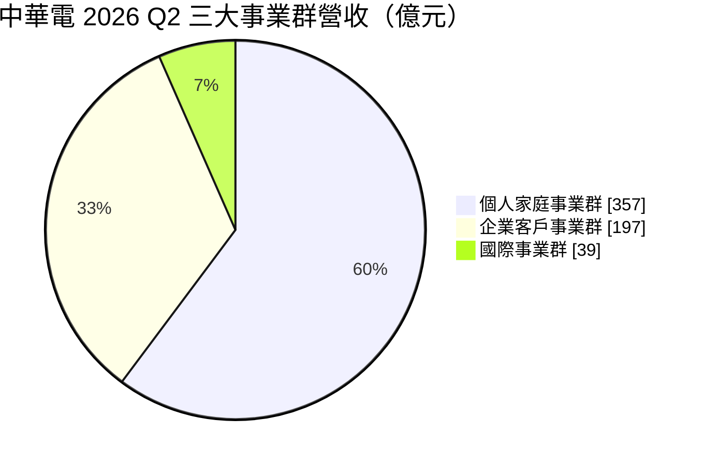
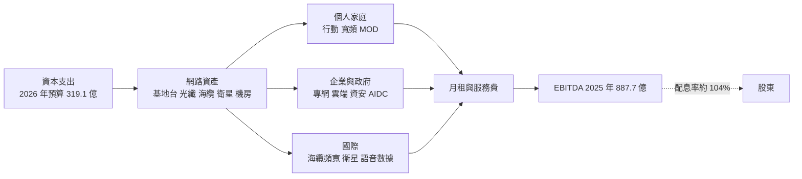
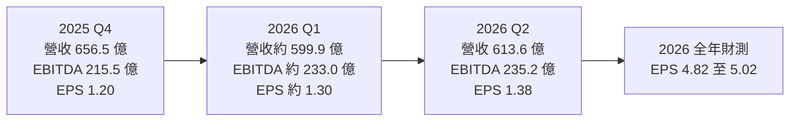
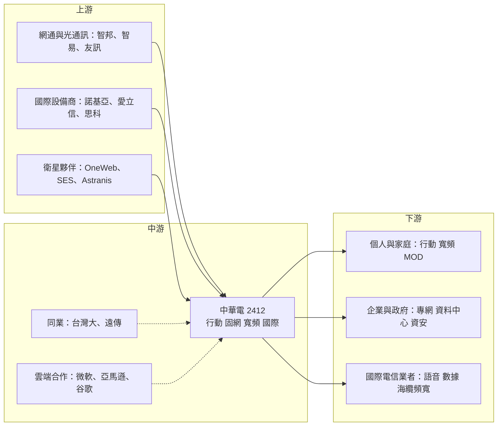

# 2412 中華電

> 上市｜[[產業索引-通信網路業|通信網路業]]｜上市（櫃）日期 2000/10/27

# 第一章：企業模式與商業藍圖

> [!info] 撰寫說明
> 本文由 Claude 依公開資料整理，架構比照 [[2330台積電]] 的四章研究，資料截至 2026-10-07。財務數字來源：中華電信 2025 年第四季、2026 年第一季與第二季法說會內容（優分析、富果研究、民報整理）；產業描述為整理性內容，尚未逐條比對原始文件。#待校對

在評估單一個股的長期投資價值時，首要步驟是拆解企業的底層獲利邏輯。本章針對中華電信（股票代號：2412，以下簡稱中華電）的商業模式進行定性分析，說明一家成長緩慢的電信公司為何能長期被視為台股最典型的防禦型標的，以及它如何用企業資通訊與 AI 資料中心尋找新的成長來源。

## 一、核心定位：台灣最大的綜合電信業者

中華電的前身是交通部電信總局，1996 年電信總局的營運部門公司化，成立中華電信股份有限公司，之後陸續在台灣與美國掛牌並完成民營化，目前交通部仍是最大股東。中華電是台灣唯一同時擁有完整行動、固網、寬頻、國際海纜與衛星通訊網路的業者，也是全台最大的電信公司，2025 年市值站穩兆元。

中華電的商業模式以「網路基礎建設收租」為核心：投入大量資本建置行動基地台、光纖、海纜與機房，再向個人、家庭與企業收取月租與服務費。這個模式有兩個商業意義：

* **以重資產換取穩定現金流：** 網路建好後，每多一個用戶的邊際成本很低，營收與 [[EBITDA]] 波動小，因此能長期維持接近或超過 100% 的配息率。
* **以 ICT 與國際業務尋找成長：** 行動與寬頻滲透率已高，本業年增約 3%；企業資通訊（[[ICT]]）、資料中心、資安與國際業務成為新的成長引擎，2026 年第二季 ICT 營收年增 32%。

## 二、業務板塊：三大事業群

中華電依客戶別分為三大事業群，2026 年第二季營收如下：

* **個人家庭事業群（約 357 億元，年增 4.8%）：** 行動通訊、HiNet 與光世代寬頻、MOD 影音、家用電話等。2026 年第二季行動服務營收 176 億元、固網寬頻營收 119.7 億元，各年增 3% 以上。
* **企業客戶事業群（約 197 億元，年增 3.7%）：** 企業網路、雲端、資料中心、資安、物聯網與智慧城市等 ICT 專案。
* **國際事業群（約 39 億元，年增 78.9%）：** 國際語音與數據、海纜、衛星通訊與海外子公司。

三個事業群合計約 593 億元，與第二季合併營收 613.6 億元的差額推估為其他收入與部門間調整。

用戶與市占方面：

* **行動：** 2026 年第二季行動用戶約 1,343 萬戶，年增 2.3%；行動業務收入市占率 41.2%，創新高。智慧型手機用戶中 [[5G]] 滲透率 48.8%。2025 年第四季行動 [[ARPU]] 為 572 元，年增 3.6%。
* **寬頻：** 寬頻用戶約 447 萬戶，其中 HiNet 用戶 382 萬戶；2025 年第四季寬頻 ARPU 819 元，年增 3.3%。

## 三、資本轉化邏輯：網路資產收租

* **固網與光纖的獨占性：** 中華電承接電信總局時代的最後一哩銅線與管道，之後升級為光纖，這套全台覆蓋的固網是其他業者難以重建的基礎設施。中華電在行動市場與台灣大、遠傳三強鼎立，但在固網寬頻幾乎是主導地位。
* **5G 升級推升 ARPU：** 用戶數成長有限，營收成長主要來自用戶從 4G 升級到較高資費的 5G 方案，5G 滲透率持續提升是 ARPU 年增 3% 以上的主因。

## 四、企業長期藍圖：AI 資料中心、衛星與國際海纜

* **AI 資料中心（[[AIDC]]）：** 中華電把傳統網路資料中心升級為可容納高功耗 GPU 的 AI 資料中心，2026 年第二季桃園崙坪 AIDC 園區正式啟用，並與臺灣證券交易所簽署合作備忘錄。
* **衛星通訊：** 已與[[低軌衛星]] OneWeb、中軌衛星 SES 合作並貢獻營收；與 Astranis 合作的自有主權衛星預計 2026 年下半年開始營運，強化通訊韌性。
* **國際[[海纜]]：** SJC2 與 Apricot 海纜於 2025 年第四季啟用，提升國際頻寬與備援能力。
* **新興應用：** 公司在法說會提到 Pre-6G 智慧應用相關業務，目標 2026 年營收突破百億元。

# 第二章：護城河深度與競爭優勢

在長期價值投資中，「護城河」指企業抵禦競爭、維持超額利潤的保護機制。電信業是少數由法規直接構築門檻的產業，本章分析中華電的護城河構成、國內外主要競爭對手，以及這些優勢在本業成長停滯下能轉化成多少新的獲利。

## 一、中華電護城河的核心組成要素

中華電的護城河屬於「寬護城河」，主要來自法規、網路資產與規模：

* **1. 特許行業與[[頻譜]]：** 電信業需要政府核發執照與頻譜，新進者門檻極高。台灣行動市場長期維持三大業者格局。
* **2. 難以複製的固網與光纖資產：** 全台覆蓋的固網讓中華電在寬頻市場長期領先，也是企業專網與資料中心的基礎。
* **3. 規模與品牌：** 最大用戶基數與最廣的基地台覆蓋，加上「最穩定網路」的品牌形象，讓中華電在行動資費上不必參與最激烈的價格戰。
* **4. 政府與企業客戶關係：** 政府機關、金融業與大型企業對網路可靠度與資安要求高，中華電在企業專網、資料中心與資安服務上具優勢。
* **5. 國際與衛星網路：** 海纜登陸站、國際電路與衛星合作，讓中華電在國際通訊與通訊韌性上地位獨特。

## 二、主要競爭對手格局

| 對手 | 定位 | 對中華電的威脅 |
|---|---|---|
| [[3045台灣大]] | 第二大電信業者，合併台灣之星 | 用戶規模擴大，並結合 momo 等集團資源 |
| [[4904遠傳]] | 第三大電信業者，合併亞太電信 | 積極發展企業 ICT、雲端與資料中心 |
| 有線電視與固網業者 | 地區性寬頻 | 在部分地區以價格搶寬頻用戶 |
| [[AMZN亞馬遜]]、[[MSFT微軟]]、[[GOOGL谷歌]] | 國際雲端業者 | 企業雲端與 AI 運算的競爭者，也是合作夥伴 |

## 三、優勢轉化：哪些市場守得住、哪些守不住

* **守得住：** 固網寬頻、政府與大型企業專網、國際海纜，中華電的領先地位穩固；行動業務收入市占率 2026 年第二季仍創新高。
* **守不住：** 電信本業成長天花板明顯，行動與寬頻營收年增僅約 3%；企業雲端與 AI 運算服務上，國際雲端大廠的規模與技術優勢明顯。
* **觀察重點：** ICT 與國際業務能否持續雙位數成長並維持獲利率、AIDC 的出租率與客戶結構，以及 5G 滲透率提升能否持續拉高 ARPU。

# 第三章：財務體質與盈利規模

資料日期：2026-10-07。數字取自中華電信法說會內容與財經媒體整理，表格是撰寫當時的快照；最新月營收、毛利率、累計 EPS 由自動排程寫在本筆記的屬性欄位（月營收、毛利率、累計EPS 等）。#待校對

財務報表是檢驗護城河是否真實存在的最終標準。電信業的毛利率概念與製造業不同，本章改以營收、EBITDA、營業利益率、ROE、資本支出與配息能力，檢視中華電「網路收租」模式的獲利品質。

## 一、獲利能力的基石：EBITDA 與營業利益率

| 項目 | 2025 全年 | 2025 Q4 | 2026 Q1 | 2026 Q2 |
|---|---|---|---|---|
| 營收（新台幣） | 2,361.1 億 | 656.5 億 | 約 599.9 億 | 613.6 億 |
| [[EBITDA]] | 887.7 億 | 215.5 億 | 約 233.0 億 | 235.2 億 |
| [[營業利益率]] | 約 20.6% | 未查得 | 未查得 | 約 21.6% |
| 稅後淨利 | 386.9 億 | 92.9 億 | 約 101.1 億 | 106.4 億 |
| EPS（元） | 4.99 | 1.20 | 約 1.30 | 1.38 |

* 2026 年第一季數字由上半年累計減去第二季推算；2025 年營業利益率以營業淨利 485.5 億元除以營收推算。

* **營收：** 2025 年營收年增 2.7%、稅後純益年增 4%，EPS 4.99 元為近 8 年新高。2026 年上半年營收 1,213.5 億元、年增 7.8%，EPS 2.68 元；第二季 EPS 1.38 元為近 10 年同期新高，超越財測高標。
* **EBITDA 率：** 2025 年 EBITDA 除以營收約 37.6%，2026 年第二季約 38.3%（皆為推算）。第四季營收較高但 EBITDA 較低，推估與年底 ICT 專案與設備銷售認列較多、利潤率較低有關。
* **[[營業利益率]]：** 第二季約 21.6%，高於 2025 年全年約 20.6%。
* **財測：** 公司 2026 年財測營收 2,419.9 億至 2,436.8 億元，EPS 4.82 至 5.02 元，EBITDA 902.7 億至 917.9 億元。上半年 EPS 已達 2.68 元，超過財測高標的一半。

## 二、[[ROE]]：資本效率

中華電資本密集、負債低、股東權益龐大，ROE 長期約在一成上下（精確數值未查得）。由於本業成長緩慢，ROE 主要靠穩定的獲利與高配息維持：盈餘幾乎全數配出，股東權益不會快速膨脹，ROE 因此能維持在穩定水準，但提升空間有限。

## 三、資本支出與自由現金流

* **[[CapEx]]：** 2026 年預算 319.1 億元，年增 15.2%，用於 5G、光纖、AIDC、海纜與衛星等。
* **營業現金流：** 2026 年第二季法說資料顯示營業現金流 317.4 億元、年增 8.4%（報導未明確區分為單季或上半年累計），現金及約當現金 420.3 億元。
* **[[自由現金流]]：** 精確數值本次未查得。以 2025 年 EBITDA 887.7 億元對照 2026 年資本支出預算 319.1 億元，推估營業現金流足以同時支應資本支出與高配息。

## 四、股利政策與價值創造

* **股利：** 2025 年度配發現金股利 5.2 元，配發率約 104%，高於當年 EPS。中華電長年維持接近或超過 100% 的配息率，是典型的高股息防禦股。配息率超過 100% 的部分來自累積盈餘與折舊產生的現金，可持續性取決於資本支出是否長期上升。
* **[[ROIC]] 與 [[WACC]]：** 精確數值本次未查得。電信業的 WACC 因營收穩定、負債低而偏低，推估中華電的 ROIC 略高於 WACC，屬於「低報酬、低風險」的價值創造；AIDC 與衛星等新投資若報酬率低於本業，長期會稀釋整體 ROIC。

# 第四章：總體風險與地緣政治

任何企業都無法脫離宏觀環境獨立存在。電信是國家關鍵基礎設施，本章分析中華電面對的地緣政治與通訊韌性議題、市場結構、營運與法規風險，以及衛星直連等新技術對傳統行動網路的長期影響。

## 一、地緣政治風險

* **通訊韌性與國安：** 台灣對外通訊高度依賴海纜，近年多次發生海纜受損事件。中華電是海纜與衛星備援的主要業者，一方面是政策支持的對象，另一方面也承擔維運與資安風險。
* **兩岸風險：** 若發生衝突或封鎖，通訊基礎設施會是優先受影響的目標。
* **設備供應鏈：** 依台灣法規，電信核心網路不採用中國品牌設備，主要向歐美與日韓設備商採購。

## 二、產業週期與市場結構風險

* **本業成長有限：** 台灣人口成長停滯，行動與寬頻滲透率已高，營收成長主要靠 5G 升級與 ARPU 提升。
* **價格競爭：** 台灣大、遠傳完成合併後規模擴大，若再次發動資費戰，可能壓縮 ARPU。
* **ICT 專案波動：** 企業 ICT 與政府標案營收認列時點不一，利潤率也低於電信本業。

## 三、營運環境的隱性風險

* **資安風險：** 作為關鍵基礎設施，中華電是網路攻擊的主要目標，資安事件可能造成服務中斷與商譽損失。
* **折舊增加：** 資本支出增加 15% 以上，加上 AIDC 與衛星投資，未來折舊上升可能壓抑營業利益率。
* **AI 資料中心的電力需求：** AIDC 需要大量電力與散熱，台灣電力供應與綠電取得是擴充限制。

## 四、科技與法規演進

* **頻譜與法規：** 頻譜競標價格、資費管制與網路中立性等法規變化，會影響資本支出與獲利。
* **衛星直連手機：** 低軌衛星直連手機等技術可能改變行動通訊的競爭格局，讓國際衛星業者跨入行動服務。
* **雲端服務競爭：** 企業 IT 持續移往國際公有雲，中華電在企業雲端的角色可能從主要供應商轉為整合與轉售夥伴（推估）。

# 專有名詞解析

## 金融

- **[[ARPU]]**：每用戶平均營收，電信業者衡量用戶價值與資費結構的核心指標。
- **[[EBITDA]]**：稅前息前折舊攤銷前利潤，電信業資本密集、折舊龐大，常用此指標衡量本業現金獲利能力。
- **[[營業利益率]]**：營業利益除以營收，衡量本業扣除營業成本與費用後的獲利能力。
- **[[ROE]]**：股東權益報酬率，稅後淨利除以股東權益，衡量公司運用股東資本賺錢的效率。
- **[[ROIC]]**：投入資本報酬率，衡量公司投入營運的全部資本能產生多少稅後營業利潤。
- **[[WACC]]**：加權平均資金成本，股東與債權人要求報酬率的加權平均，是 ROIC 的比較基準。
- **[[CapEx]]**：資本支出，企業購置或升級長期資產的支出，電信業主要用於基地台、光纖與機房。
- **[[自由現金流]]**：營業活動現金流減去資本支出，代表企業可自由用於配息、還債或併購的現金。

## 產業

- **[[ICT]]**：資訊與通訊科技，指企業網路、雲端、資料中心、資安與系統整合等服務，是電信業者的新成長來源。
- **[[5G]]**：第五代行動通訊技術，速度與容量高於 4G，用戶升級 5G 方案是電信業者提高 ARPU 的主要途徑。
- **[[頻譜]]**：政府分配給電信業者使用的無線電頻率資源，需透過競標取得，是行動通訊的特許門檻。
- **[[AIDC]]**：AI 資料中心，能提供高功率供電與液冷散熱、容納大量 GPU 伺服器的資料中心。
- **[[低軌衛星]]**：在距地表約數百至兩千公里軌道運行的通訊衛星，延遲低，可做為海纜中斷時的備援通訊。
- **[[海纜]]**：鋪設於海底的光纖電纜，承載台灣絕大部分的國際網路與通話流量。

# 核心供應鏈

## 1. 上游：網路設備與基礎建設
- 網通與光通訊設備：[[2345智邦]]、[[3596智易]]、[[2332友訊]]
- 國際電信設備商：諾基亞、愛立信、[[CSCO思科]]
- 衛星合作夥伴：OneWeb、SES、Astranis

## 2. 中游：中華電本身與同業
- 電信同業：[[3045台灣大]]、[[4904遠傳]]
- 資料中心與雲端合作：[[MSFT微軟]]、[[AMZN亞馬遜]]、[[GOOGL谷歌]]

## 3. 下游：客戶
- 個人與家庭用戶：行動、寬頻、MOD
- 企業與政府：企業專網、資料中心、資安服務
- 國際電信業者：國際語音、數據與海纜頻寬

## 最新新聞
<!-- news:start -->
<!-- news:end -->

## 相關連結
- [公開資訊觀測站](https://mopsov.twse.com.tw/mops/web/t05st03?step=1&firstin=1&co_id=2412)
- [Goodinfo](https://goodinfo.tw/tw/StockDetail.asp?STOCK_ID=2412)
- [Yahoo 股市](https://tw.stock.yahoo.com/quote/2412)
- [鉅亨網新聞](https://www.cnyes.com/twstock/2412/news)
