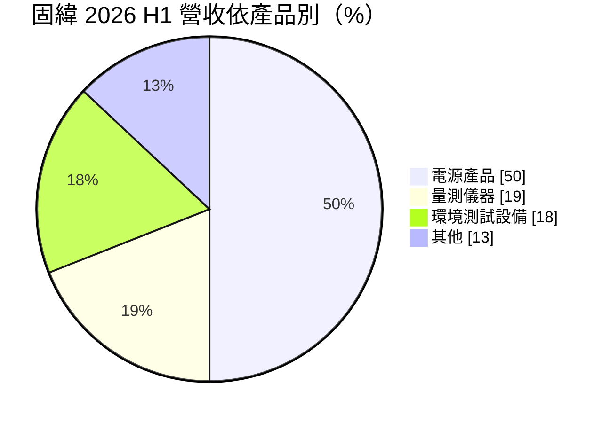
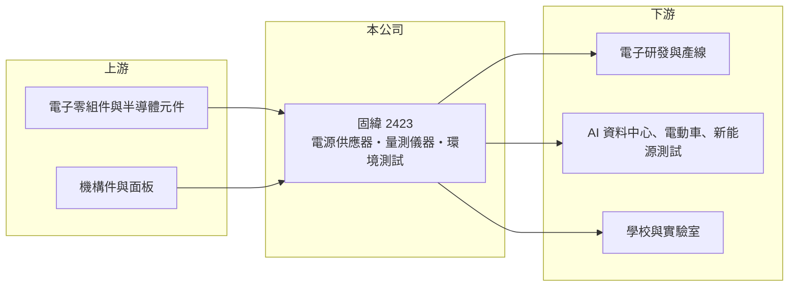

# 2423 固緯

> 上市｜[[產業索引-其他電子業|其他電子業]]｜上市（櫃）日期 2000/09/11

# 第一章：企業模式與商業藍圖

> [!info] 撰寫說明
> 精簡版，由 Claude 依公開資料整理，架構比照 [[2330台積電]]，資料截至 2026-10-07。來源：富果研究固緯 2026 年 7 月法說會筆記、nStock 固緯公司簡介。#待校對

固緯電子成立於 1975 年，是台灣老牌的電子量測儀器與電源供應器自有品牌廠，以 GW Instek 品牌銷售全球。

- **核心業務：** 設計製造[[電源供應器]]、示波器與頻譜分析儀等[[量測儀器]]，以及環境測試設備，產品超過 300 項，2026 年上半年推出自動測試系統 ATS-12000 與新款數位示波器。
- **營收結構：** 依 2026 年 7 月法說會資料，電源產品約占 50%、量測儀器 19%、環境測試設備 18%，其餘為安規量測與其他產品。
- **營運據點：** 台灣土城廠生產高階新產品，中國蘇州廠負責成熟與量大產品；2026 年上半年中國、台灣、日本及歐美營收皆成長。
- **長期方向：** 從單機儀器轉型為整合測試方案，鎖定 AI 資料中心電源、電動車與新能源測試需求，並爭取高功率電源模組與[[固態變壓器]]測試商機。

# 第二章：護城河深度與競爭優勢

固緯的優勢在於自有品牌與完整產品線，但在高階儀器市場仍面對國際大廠。

- **競爭優勢：** 自有品牌加上台灣與蘇州兩地生產，產品線涵蓋電源、量測與環境測試，能提供整合方案；各產品線[[毛利率]]多在 55% 上下，顯示具一定定價能力。
- **主要對手：** 高階量測有 Keysight、Tektronix、Rohde & Schwarz，中低階有中國的普源精電等廠商；電源測試則與 [[2360致茂]] 重疊。
- **觀察重點：** 公司表示若高功率電源模組與固態變壓器測試順利導入，2027 年有機會維持雙位數成長，觀察相關訂單的落地速度。

# 第三章：財務體質與盈利規模

資料日期：2026-10-07，以下數字是撰寫當時的快照；最新月營收、毛利率、累計 EPS 由自動排程寫在本筆記的屬性欄位（月營收、毛利率、累計EPS 等）。#待校對

固緯 2026 年上半年營收與獲利同步成長，毛利率維持高檔。

- **營收規模：** 2025 年全年營收 29.43 億元；2026 年第一季營收 8.2 億元、年增 28%，上半年營收年增 24%，接單年增 10% 至 15%。
- **獲利：** 2025 年 EPS 2.92 元；2026 年第一季 EPS 1.3 元、毛利率約 56%，第二季 EPS 1.2 元、毛利率 55.34%。
- **財務特色：** 2025 年度配發現金股利 2.5 元，近五年平均現金股利 2.04 元；2026 年第一季每股淨值 19.37 元。

# 第四章：總體風險與地緣政治

固緯的營運與全球電子研發、生產投資的景氣連動。

- **產業週期：** 量測儀器需求取決於電子業研發與產線投資，景氣下行時客戶會先延後設備採購。
- **營運風險：** 環境測試設備毛利率約 40% 至 45%，比重上升會稀釋整體毛利率；新應用測試方案若導入延後，成長動能會放緩。
- **其他風險：** 中國營收比重不低且蘇州設廠，面臨中國本土儀器廠的價格競爭與兩岸政策風險；外銷為主，匯率波動影響獲利。

# 專有名詞解析

## 金融

- **[[毛利率]]**：毛利除以營收，反映產品本身的定價能力與成本控制。

## 產業

- **[[量測儀器]]**：示波器、頻譜分析儀、信號產生器等用來量測電子訊號與元件特性的設備，電子研發與產線都需要。
- **[[電源供應器]]**：把市電轉換成穩定直流或交流電的設備，測試用電源可精準調整電壓電流以驗證產品。
- **[[固態變壓器]]**：以功率半導體取代傳統鐵芯線圈的變壓器，體積小、可直接輸出直流，被視為下一代資料中心電力架構的選項。

# 核心供應鏈

- 上游：電子零組件、半導體元件與機構件供應商（推估）
- 下游／客戶：電子業研發與生產線、AI 資料中心與電動車測試、教育與實驗室（具體客戶未查到）
- 同業：[[2360致茂]]、Keysight、Tektronix、Rohde & Schwarz、普源精電

## 最新新聞
<!-- news:start -->
<!-- news:end -->

## 相關連結
- [公開資訊觀測站](https://mopsov.twse.com.tw/mops/web/t05st03?step=1&firstin=1&co_id=2423)
- [Goodinfo](https://goodinfo.tw/tw/StockDetail.asp?STOCK_ID=2423)
- [Yahoo 股市](https://tw.stock.yahoo.com/quote/2423)
- [鉅亨網新聞](https://www.cnyes.com/twstock/2423/news)
