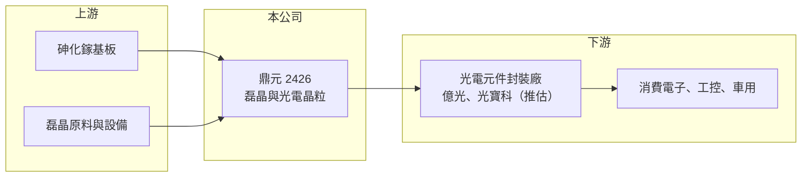

# 2426 鼎元

> 上市｜[[產業索引-光電業|光電業]]｜上市（櫃）日期 2000/09/11

# 第一章：企業模式與商業藍圖

> [!info] 撰寫說明
> 精簡版，由 Claude 依公開資料整理，架構比照 [[2330台積電]]，資料截至 2026-10-07。來源：nstock、winvest 營收快訊。#待校對

鼎元位於光電產業最上游，從[[磊晶]]到晶粒自行生產，再賣給封裝廠做成元件。

- **核心業務：** 鼎元光電專注光電半導體，產品包括[[砷化鎵]]磊晶、紅外線與可見光 [[LED晶粒]]、雷射二極體、光電晶體與光二極體等。
- **營收結構：** 以紅外線 LED 與光感測晶粒等光電晶粒為主，確切比重這次未查到。
- **營運據點：** 總部與廠區在台灣，產品供應封裝廠再銷往全球。
- **長期方向：** 推估持續發展紅外線、雷射與光感測等利基型晶粒，降低一般可見光 LED 的價格競爭壓力。

# 第二章：護城河深度與競爭優勢

鼎元的護城河在於垂直整合的製程經驗，但規模遠小於中國晶粒大廠。

- **競爭優勢：** 從磊晶到晶粒的垂直整合能力，在紅外線與光感測利基市場有一定技術累積。
- **主要對手：** [[化合物半導體]]與光電晶粒同業有 [[3714富采]]、[[3081聯亞]]、[[3234光環]]、[[2455全新]]。
- **觀察重點：** 營收年增能否延續、毛利率能否站穩兩成以上，以及股價大漲後基本面是否跟上。

# 第三章：財務體質與盈利規模

資料日期：2026-10-07，表格是撰寫當時的快照；最新月營收、毛利率、累計 EPS 由自動排程寫在本筆記的屬性欄位（月營收、毛利率、累計EPS 等）。#待校對

鼎元營收連續雙位數年增，獲利由低檔回升，但絕對水準仍不高。

- **營收規模：** 2026 年 1 至 8 月累計營收 17.46 億元；8 月營收 2.53 億元，年增約 39%，6、7 月也有雙位數年增。
- **獲利：** 2026 年第二季 EPS 0.22 元，上半年累計 0.28 元；第二季 [[毛利率]] 22.49%、[[營業利益率]] 7.92%。
- **財務特色：** 市值約 343 億元，股價已大幅高於近一年均價，以目前獲利水準衡量評價偏高。

# 第四章：總體風險與地緣政治

鼎元的風險來自光電晶粒的景氣循環、中國同業的價格競爭與偏高的評價。

- **產業週期：** LED 與光感測晶粒需求受消費電子、工控與車用景氣影響，產業循環明顯。
- **營運風險：** 中國晶粒廠產能大、價格競爭激烈；客戶多為封裝廠，訂單變動會直接影響[[產能利用率]]。
- **其他風險：** 匯率波動影響外銷報價；砷化鎵等原料價格與供應也需留意。

# 專有名詞解析

## 半導體

- **[[砷化鎵]]**：由鎵與砷組成的化合物半導體材料，適合做發光、射頻與高速光電元件。
- **[[磊晶]]**：在基板上長出一層排列整齊的晶體薄膜，是 LED 與化合物半導體元件的關鍵製程。
- **[[LED晶粒]]**：在磊晶片上切割出的發光二極體晶片，是 LED 封裝廠的主要原料。
- **[[化合物半導體]]**：由兩種以上元素組成的半導體，例如砷化鎵、磷化銦、氮化鎵，用於光電、射頻與功率元件。

## 金融

- **[[產能利用率]]**：實際投片量占總產能的比例，晶圓代工廠的毛利率高度取決於此數字。

# 核心供應鏈

- 上游：砷化鎵基板、磊晶原料與設備
- 下游／客戶：光電元件封裝廠（如 [[2393億光]]、[[2301光寶科]]，推估）
- 同業：[[3714富采]]、[[3081聯亞]]、[[3234光環]]、[[2455全新]]

## 最新新聞
<!-- news:start（自動產生，請勿手動編輯此範圍） -->
- 2026-10-06 🏛️ 重訊 15:43｜本公司有價證券於集中交易市場達公布注意交易資訊標準 故公布相關財務業務等重大訊息，以利投資人區別瞭解。｜[觀測站](https://mops.twse.com.tw/mops/#/web/t05st01)

完整紀錄：[[2426鼎元 新聞]]
<!-- news:end -->

## 相關連結
- [公開資訊觀測站](https://mopsov.twse.com.tw/mops/web/t05st03?step=1&firstin=1&co_id=2426)
- [Goodinfo](https://goodinfo.tw/tw/StockDetail.asp?STOCK_ID=2426)
- [Yahoo 股市](https://tw.stock.yahoo.com/quote/2426)
- [鉅亨網新聞](https://www.cnyes.com/twstock/2426/news)
