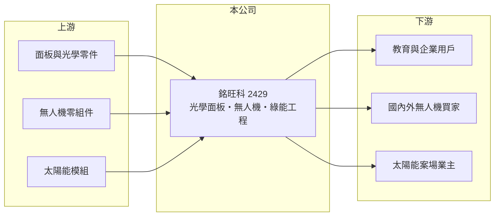

# 2429 銘旺科

> 上市｜[[產業索引-光電業|光電業]]｜上市（櫃）日期 2000/09/11

# 第一章：企業模式與商業藍圖

> [!info] 撰寫說明
> 精簡版，由 Claude 依公開資料整理，架構比照 [[2330台積電]]，資料截至 2026-10-07。來源：nstock、winvest 營收快訊。公開資料有限。#待校對

銘旺科是營收規模很小的多角化公司，傳統光學面板之外，正押注[[無人機]]與綠能工程。

- **核心業務：** 銘旺科主要從事光學面板與[[電子白板]]的產銷，另經營太陽能光電工程建置與營運，以及無人機與零件批發零售。
- **營收結構：** 各業務比重這次未查到；近年無人機業務有取得國際訂單的報導。
- **營運據點：** 上市約 26 年，營運據點細節這次未查到。
- **長期方向：** 推估以無人機與綠能工程作為新成長方向，降低對傳統光學面板業務的依賴。

# 第二章：護城河深度與競爭優勢

銘旺科的優勢主要在題材定位，實際競爭力仍待營收驗證。

- **競爭優勢：** 同時具備顯示與光學產品經驗及無人機業務，可切入國防與[[非紅供應鏈]]題材；實際優勢仍待營收驗證。
- **主要對手：** 無人機領域有 [[8033雷虎]] 等業者，太陽能工程則有眾多中小型系統商。
- **觀察重點：** 無人機訂單能否轉成穩定營收，以及何時能擺脫虧損。

# 第三章：財務體質與盈利規模

資料日期：2026-10-07，表格是撰寫當時的快照；最新月營收、毛利率、累計 EPS 由自動排程寫在本筆記的屬性欄位（月營收、毛利率、累計EPS 等）。#待校對

銘旺科營收規模小且持續虧損，財務體質偏弱。

- **營收規模：** 2026 年 1 至 8 月累計營收 2.63 億元，年減約 7%；8 月營收約 2,830 萬元，年減約 9%。
- **獲利：** 2026 年上半年 EPS -0.76 元；第二季 [[毛利率]] 約 5%，淨利率約 -29.83%。
- **財務特色：** 資本額約 8.55 億元，營收規模小且處於虧損，近五年沒有配息紀錄。

# 第四章：總體風險與地緣政治

銘旺科的風險在於本業虧損侵蝕淨值，以及新業務高度依賴政策與題材。

- **產業週期：** 光學面板與電子白板需求跟隨教育與企業採購循環；無人機需求受國防預算與政策帶動。
- **營運風險：** 營收規模小、毛利率低，持續虧損會侵蝕淨值；新業務成敗不確定性高。
- **其他風險：** 無人機業務受出口管制與國防採購政策影響；股價題材性強，波動可能偏大。

# 專有名詞解析

## 應用

- **[[電子白板]]**：可觸控書寫並連接電腦顯示的大型互動螢幕，主要用於教室與會議室。
- **[[無人機]]**：不需駕駛員搭乘的飛行載具，應用於空拍、巡檢、農業與國防。

## 產業

- **[[非紅供應鏈]]**：排除中國製零組件的供應鏈，常見於國防、無人機與政府採購規範。

# 核心供應鏈

- 上游：面板與光學零件、無人機零組件、太陽能模組
- 下游／客戶：教育與企業用戶、國內外無人機買家、太陽能案場業主
- 同業：[[8033雷虎]]

## 最新新聞
<!-- news:start（自動產生，請勿手動編輯此範圍） -->
- 2026-10-08 🏛️ 重訊 18:02｜投資AI算力中心設備建置案｜[觀測站](https://mops.twse.com.tw/mops/#/web/t05st01)
- 2026-10-08 🏛️ 重訊 18:02｜公告本公司依公開發行公司資金貸與及背書保證處理準則 第二十五條第一項第四款規定公告。｜[觀測站](https://mops.twse.com.tw/mops/#/web/t05st01)

完整紀錄：[[2429銘旺科 新聞]]
<!-- news:end -->

## 相關連結
- [公開資訊觀測站](https://mopsov.twse.com.tw/mops/web/t05st03?step=1&firstin=1&co_id=2429)
- [Goodinfo](https://goodinfo.tw/tw/StockDetail.asp?STOCK_ID=2429)
- [Yahoo 股市](https://tw.stock.yahoo.com/quote/2429)
- [鉅亨網新聞](https://www.cnyes.com/twstock/2429/news)
