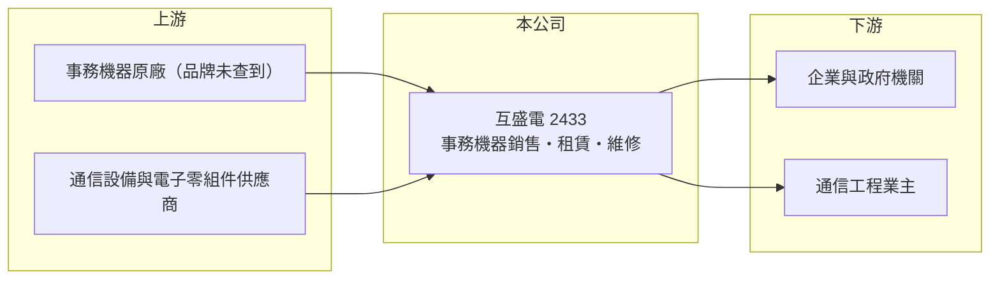

# 2433 互盛電

> 上市｜[[產業索引-其他電子業|其他電子業]]｜上市（櫃）日期 2000/09/11

# 第一章：企業模式與商業藍圖

> [!info] 撰寫說明
> 精簡版，由 Claude 依公開資料整理，架構比照 [[2330台積電]]，資料截至 2026-10-07。來源：nStock 互盛電公司簡介、MoneyLink 互盛電基本資料。公開資料有限，代理品牌與產品比重本次未查到。#待校對

互盛電成立於 1984 年、2000 年上市，屬震旦集團，以事務機器的銷售、租賃與維修為主要業務。

- **核心業務：** 經營影印機、傳真機等[[事務機器]]的買賣、進出口、出租與維修，另有電子零組件買賣與通信傳輸設備的銷售及工程承包。
- **營收結構：** 本次未查到產品別或銷售與租賃的營收比重；從毛利率 36% 上下推估，租賃與維修服務占有一定比重。
- **營運據點：** 總部位於台北市信義區，以台灣市場為主；大股東震旦行與震旦國際合計持股約六成。
- **長期方向：** 在紙本列印需求下滑的環境中，維持企業客戶的事務機租賃與服務基礎，並以穩定現金股利回饋股東。

# 第二章：護城河深度與競爭優勢

互盛電的優勢在於集團通路與服務網，但所處市場本身成長有限。

- **競爭優勢：** 依附震旦集團的辦公設備通路與客戶基礎，事務機[[租賃服務]]合約期長，帶來可預期的經常性收入。
- **主要對手：** 台灣各事務機品牌的直營與代理通路，例如富士軟片商業創新、理光、佳能、京瓷等體系（推估）。
- **觀察重點：** 營收長年持平在每年 27 億元上下，觀察租賃合約數量與毛利率能否維持，以及配息水準的延續性。

# 第三章：財務體質與盈利規模

資料日期：2026-10-07，以下數字是撰寫當時的快照；最新月營收、毛利率、累計 EPS 由自動排程寫在本筆記的屬性欄位（月營收、毛利率、累計EPS 等）。#待校對

互盛電營收與獲利穩定，屬於高配息的成熟型公司。

- **營收規模：** 2025 年全年營收 27.19 億元；2026 年 1 至 8 月累計 18.31 億元、年增 1.64%，8 月營收 2.29 億元。
- **獲利：** 2026 年第二季 EPS 0.56 元，[[毛利率]] 36.52%、營業利益率 14.71%、淨利率 12.35%。
- **財務特色：** 2025 年度配發現金股利 2.7 元，近五年平均現金股利 3.16 元，以 39.5 元股價計算現金[[殖利率]]約 6%。

# 第四章：總體風險與地緣政治

互盛電的風險主要來自辦公列印需求的長期萎縮。

- **產業週期：** 企業數位化與無紙化使影印與列印量逐年下降，事務機換機需求與耗材收入可能長期下滑。
- **營運風險：** 營收高度集中在台灣企業與政府客戶，市場飽和且價格競爭激烈；若原廠調整代理或通路策略，對營運影響大。
- **其他風險：** 進口設備以外幣計價，匯率變動影響進貨成本；集團持股集中，股票流動性較低。

# 專有名詞解析

## 金融

- **[[毛利率]]**：毛利除以營收，反映產品本身的定價能力與成本控制。
- **[[殖利率]]**：每股現金股利除以股價，衡量以現價買進可領到的現金報酬。

## 產業

- **[[事務機器]]**：影印機、多功能事務機、傳真機等辦公設備，企業多以租賃加維修合約方式使用。
- **[[租賃服務]]**：設備商把機器出租給客戶並收取月租與維修費，收入穩定但需先投入設備資金。

# 核心供應鏈

- 上游：事務機器原廠與通信設備供應商（具體品牌本次未查到）
- 下游／客戶：台灣企業、學校與政府機關（推估）
- 同業：台灣各事務機品牌的直營與代理通路（推估）；集團關係企業震旦行

## 最新新聞
<!-- news:start -->
<!-- news:end -->

## 相關連結
- [公開資訊觀測站](https://mopsov.twse.com.tw/mops/web/t05st03?step=1&firstin=1&co_id=2433)
- [Goodinfo](https://goodinfo.tw/tw/StockDetail.asp?STOCK_ID=2433)
- [Yahoo 股市](https://tw.stock.yahoo.com/quote/2433)
- [鉅亨網新聞](https://www.cnyes.com/twstock/2433/news)
