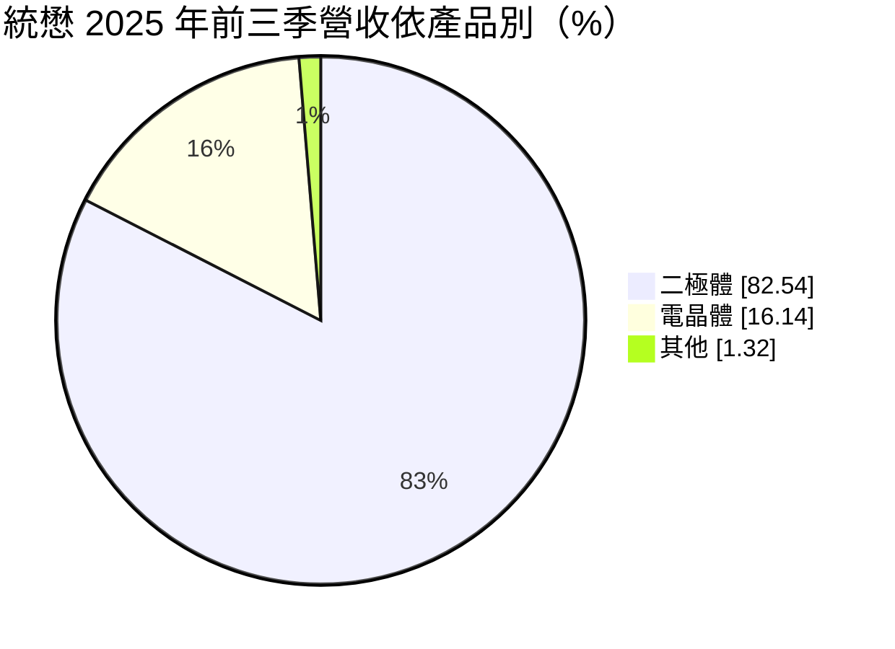
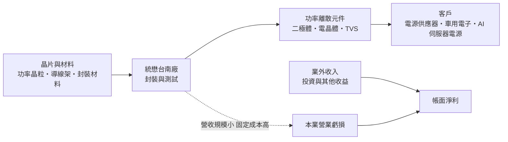
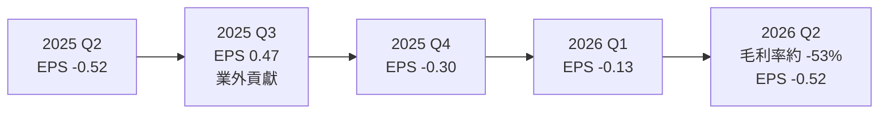
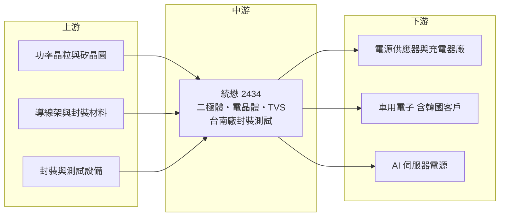

# 2434 統懋

> 上市｜[[產業索引-半導體業|半導體業]]｜上市（櫃）日期 2000/09/11

# 第一章：企業模式與商業藍圖

> [!info] 撰寫說明
> 本文由 Claude 依公開資料整理，架構比照 [[2330台積電]] 的四章研究，資料截至 2026-10-07。財務數字來源：富果研究與 poorstock（2025 年 12 月 23 日法說會整理）、nstock、Yahoo 股市季 EPS、MoneyLink 公司基本資料；產業描述為整理性內容，尚未逐條比對原始文件。#待校對

在評估單一個股的長期投資價值時，首要步驟是拆解企業的底層獲利邏輯。本章針對統懋半導體（股票代號：2434，以下簡稱統懋）的商業模式進行定性分析。統懋是一家營收規模非常小的功率離散元件廠，本業長期虧損，帳面獲利主要來自業外，因此分析重點在於它的轉型計畫能否讓本業重新站穩。

## 一、核心定位：垂直整合的小型功率離散元件廠

統懋成立於 1987 年，總部與工廠位於台南新市，股本約 3.70 億元，屬於台股中規模很小的半導體公司。依法說會，統懋自我定位為垂直整合的專業半導體製造商，產品是[[功率離散元件]]，包括：

* **功率電晶體：** 用於電源轉換與開關的電晶體，例如 [[MOSFET]] 等。
* **[[蕭特基二極體]]與整流二極體：** 把交流電轉成直流電、或防止電流逆向的元件，用於電源供應器與充電器。
* **[[TVS]] 元件：** 保護電路免受突波與靜電損壞。
* **SMT 元件：** 表面黏著型封裝的離散元件。

統懋的營收規模極小：2025 年前三季營收約 3,453 萬元，2025 年全年約 0.46 億元。以這個規模，統懋在功率元件市場的市占率可以忽略，經營重點在於利基產品與產線升級。

## 二、終端應用／產品板塊：二極體占八成

依 2025 年 12 月法說會，2025 年前三季營收結構如下：

* **二極體（82.54%）：** 蕭特基、整流與 TVS 元件，是主要營收來源，應用在電源供應器、充電器與各類電子產品。
* **電晶體（16.14%）：** 功率電晶體，金額約 557 萬元。
* **策略應用：** 法說會表示將聚焦 [[AI伺服器]]電源與車用電子兩大領域。

## 三、資本轉化邏輯（營運模式）：本業虧損、業外支撐

* **本業虧損：** 2025 年前三季營業毛利轉為虧損約 383 萬元，營業虧損約 4,263 萬元。
* **業外撐起獲利：** 同期業外收入約 5,464 萬元，使前三季稅後淨利約 1,202 萬元、EPS 0.32 元。法說會整理指出業外收入是主要獲利來源。
* **資產結構：** 2025 年第三季資產總計約 6.79 億元，其中不動產、廠房及設備約 4.29 億元，股東權益約 4.81 億元。營收不到資產的一成，資產周轉率極低。

## 四、企業長期藍圖：台南新封裝產線與海外市場

* **產線擴建：** 台南廠封裝產線擴建自 2025 年 1 月陸續啟動，配備新設備與自動化系統，預計 2026 年第一季投產，第二季起逐步擴大生產規模。
* **海外布局：** 自 2025 年第二季起在歐美、日本、韓國設立業務據點。
* **韓國車用：** 韓國市場車用產品預計 2026 年第二季小量出貨、第四季正式量產。

# 第二章：護城河深度與競爭優勢

在長期價值投資中，「護城河」指企業抵禦競爭、維持超額利潤的保護機制。本章分析統懋在功率離散元件市場的競爭位置，以及這些優勢能否支撐轉型。

## 一、護城河的核心組成要素

統懋的護城河很窄，目前難以從財報看到超額利潤，可以列舉的潛在優勢如下：

* **1. 垂直整合製造：** 從封裝到測試自行掌握，可以依客戶需求調整產品規格，交期彈性較高（推估）。
* **2. 長期經營的產品線：** 成立近 40 年，在二極體與 TVS 元件累積既有客戶。
* **3. 新產線與車用認證：** 若韓國車用產品順利量產，[[車規驗證]]會形成一定的轉換成本。

## 二、全球主要競爭對手格局

| 對手 | 定位 | 對統懋的威脅 |
|---|---|---|
| [[2481強茂]]、[[5425台半]] | 台灣主要功率離散元件廠，規模大 | 產品線重疊，具規模經濟與通路優勢 |
| 安森美、英飛凌、Vishay | 國際功率半導體大廠 | 掌握車用與工業大客戶，技術領先 |
| 中國功率元件廠 | 政策扶植、報價低 | 在二極體等標準品大幅壓低價格 |

## 三、優勢轉化：守得住／守不住／觀察重點

* **守得住：** 已有長期往來的利基客戶與特定規格產品。
* **守不住：** 標準二極體與整流元件的價格競爭，中國供應商報價低，統懋營收規模小、缺乏成本優勢。2026 年第二季毛利率約負 53%，顯示本業仍無法覆蓋成本。
* **觀察重點：** 台南新產線的稼動率、韓國車用產品能否在 2026 年第四季量產，以及 AI 伺服器電源相關產品能否取得訂單。

# 第三章：財務體質與盈利規模

資料日期：2026-10-07。數字取自法說會整理、nstock、Yahoo 股市與 MoneyLink，表格是撰寫當時的快照；最新月營收、毛利率、累計 EPS 由自動排程寫在本筆記的屬性欄位（月營收、毛利率、累計EPS 等）。#待校對

財務報表是檢驗護城河是否真實存在的最終標準。本章用三率、ROE、現金流與資本報酬，檢視統懋本業與業外各自的貢獻。

## 一、獲利能力的基石：三率

| 項目 | 2025 前三季 | 2025 全年 | 2026 Q1 | 2026 Q2 |
|---|---|---|---|---|
| 營收（新台幣） | 約 3,453 萬 | 約 0.46 億 | 未查得 | 未查得 |
| [[毛利率]] | 約 -11%（推算） | 未查得 | 未查得 | 約 -53% |
| [[營業利益率]] | 約 -123%（推算） | 未查得 | 未查得 | 約 -149% |
| EPS（元） | 0.32 | 0.02 | -0.13 | -0.52 |

註：2025 年前三季毛利率與營業利益率以法說會揭露的營業毛損與營業損失除以營收推算。2026 年第二季比率取自 nstock；MoneyLink 列示的毛利率為 -42.39%、營業利益率 -151.42%，可能為不同計算期間。2026 年 1 至 8 月累計營收約 0.36 億元，年增 19.86%。

* **毛利為負：** 營收規模太小，無法攤提工廠折舊與人力等固定成本，毛利率長期為負。
* **EPS 正負交替：** 2024 年第一季 EPS 1.33 元、2025 年第一季 0.38 元、第三季 0.47 元，與其他虧損季交錯，推估與業外收益認列時點有關。
* **2026 年上半年：** 累計 EPS 負 0.65 元，新產線投產初期的折舊與費用可能加重虧損（推估）。

## 二、[[ROE]]：資本效率

依 nstock，2026 年第二季單季 ROE 約負 4.23%、ROA 約負 2.84%。每股淨值約 12.12 元（MoneyLink）。統懋的股東權益主要由廠房與投資部位構成，本業無法產生正報酬。

## 三、資本支出與自由現金流

* **[[CapEx]]：** 2025 年第三季不動產、廠房及設備較前一年增加約 2,474 萬元，反映台南新封裝產線投資。
* **[[自由現金流]]：** 本業虧損加上擴產，推估自由現金流為負，需要依賴業外收入或既有資金支應。
* **股利：** nstock 顯示近五年沒有配息紀錄。

## 四、[[ROIC]] 與 [[WACC]]：價值創造利差

本業投入資本報酬率為負，遠低於資金成本。統懋要創造價值，需要新產線讓營收規模放大數倍，才能讓毛利轉正。在此之前，公司的價值主要來自資產與業外收益，而非本業獲利能力。

# 第四章：總體風險與地緣政治

任何企業都無法脫離宏觀環境獨立存在。本章分析統懋未來必須面對的地緣政治、產業週期與營運風險。

## 一、地緣政治

* **中國供應鏈競爭：** 功率離散元件是中國重點發展的領域，大量產能開出壓低全球價格，統懋這類小廠首當其衝。
* **非中國需求：** 歐美日韓客戶推動供應鏈分散，統懋設立海外業務據點，正是為了爭取這類轉單（推估）。

## 二、產業週期與市場結構

* **功率元件週期：** 功率離散元件需求跟隨消費性電子、車用與工業景氣，庫存調整時價格與出貨同步下滑。
* **市場結構：** 標準二極體與電晶體高度同質化，價格由大廠與中國供應商決定，小廠缺乏定價權。

## 三、營運環境的隱性風險

* **規模不足：** 營收規模極小，任何單一客戶流失或訂單延後都會造成營收大幅波動。
* **業外依賴：** 帳面獲利依賴業外收入，若業外收益減少，虧損會直接反映在 EPS。
* **新產線執行：** 新產線若稼動率不如預期，新增折舊會讓虧損擴大。

## 四、科技或法規演進

* **寬能隙材料：** 功率元件逐漸從矽轉向 [[SiC]] 與 [[GaN]]，高效率電源與車用市場的高階需求可能被新材料取代，統懋若無對應產品，市場會萎縮。
* **車用法規：** 進入韓國車用市場需要通過 AEC-Q101 等可靠度認證與車廠稽核，時間與成本都不低。

# 專有名詞解析

## 半導體

- **[[功率離散元件]]**：單一功能的功率半導體，例如二極體、MOSFET，用於電源轉換與保護，不像 IC 整合多種功能。
- **[[MOSFET]]**：金屬氧化物半導體場效電晶體，最常見的功率開關元件，用於電源供應器、馬達驅動與電動車。
- **[[蕭特基二極體]]**：以金屬與半導體接面製成的二極體，導通電壓低、切換速度快，常用於電源供應器。
- **[[TVS]]**：暫態電壓抑制二極體，在電壓突波或靜電出現時導通，保護後端電路。
- **[[SiC]]**：碳化矽，耐高壓、高溫的寬能隙半導體材料，用於電動車與太陽能逆變器的功率元件。
- **[[GaN]]**：氮化鎵，切換速度快、效率高的寬能隙半導體材料，用於快充與資料中心電源。

## 應用

- **[[AI伺服器]]**：搭載 GPU 或 AI 加速器、用於 AI 訓練與推論的伺服器，耗電量高，帶動高效率電源需求。
- **[[車規驗證]]**：車用晶片須通過 AEC-Q100 等可靠度測試與車廠認證，流程常需 2 至 3 年，因此轉換成本高。

## 金融

- **[[業外收益]]**：本業以外的收入，例如投資處分利益、股利或匯兌收益，通常不具持續性。
- **[[毛利率]]**：營業毛利占營收的比例，反映產品定價能力與成本結構。
- **[[營業利益率]]**：營業利益占營收的比例，反映扣除營業費用後本業的獲利能力。
- **[[ROE]]**：股東權益報酬率，稅後淨利除以股東權益，衡量公司運用股東資金賺錢的效率。
- **[[自由現金流]]**：營業活動現金流減去資本支出，代表企業可自由用於配息、還債或併購的現金。

# 核心供應鏈

## 1. 上游：晶粒、材料與設備
- 功率晶粒與矽晶圓、導線架、封裝材料（具體供應商未查得）

## 2. 中游：統懋本身
- 台南新市廠：封裝與測試，新封裝產線 2026 年投產

## 3. 下游：主要客戶類型
- 電源供應器、充電器與一般電子產品製造商（名單未揭露）
- 韓國車用電子客戶（2026 年小量出貨）
- AI 伺服器電源相關應用

## 4. 同業
- 台灣：[[2481強茂]]、[[5425台半]]
- 國際：安森美、英飛凌、Vishay

## 最新新聞
<!-- news:start -->
<!-- news:end -->

## 相關連結
- [公開資訊觀測站](https://mopsov.twse.com.tw/mops/web/t05st03?step=1&firstin=1&co_id=2434)
- [Goodinfo](https://goodinfo.tw/tw/StockDetail.asp?STOCK_ID=2434)
- [Yahoo 股市](https://tw.stock.yahoo.com/quote/2434)
- [鉅亨網新聞](https://www.cnyes.com/twstock/2434/news)
