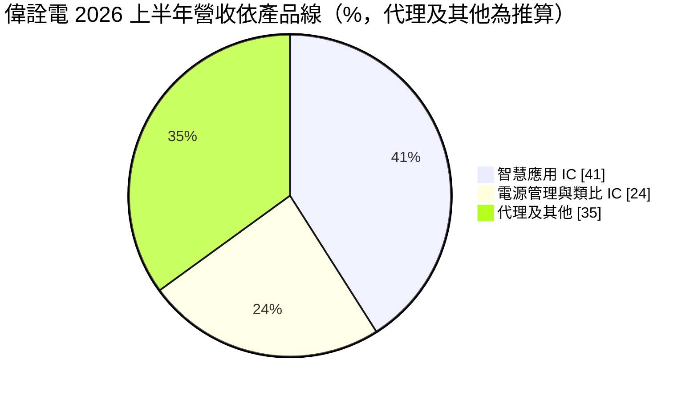
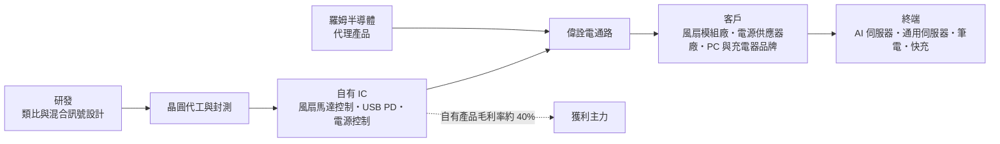
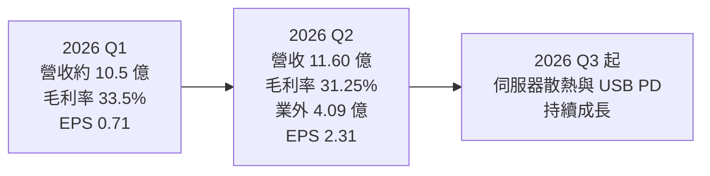
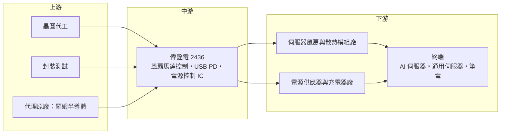

# 2436 偉詮電

> 上市｜[[產業索引-半導體業|半導體業]]｜上市（櫃）日期 2000/09/11

# 第一章：企業模式與商業藍圖

> [!info] 撰寫說明
> 本文由 Claude 依公開資料整理，架構比照 [[2330台積電]] 的四章研究，資料截至 2026-10-07。財務數字來源：poorstock（2026 年 8 月 25 日法說會整理）、聯合報（2026 年 5 月）、LINE TODAY 轉載財經報導（2025 年 12 月）、nstock、MoneyLink 公司基本資料；產業描述為整理性內容，尚未逐條比對原始文件。#待校對

在評估單一個股的長期投資價值時，首要步驟是拆解企業的底層獲利邏輯。本章針對偉詮電子（股票代號：2436，以下簡稱偉詮電）的商業模式進行定性分析，說明這家以電源管理與 USB 快充晶片為主的類比 IC 設計公司，如何靠 AI 伺服器散熱風扇馬達控制 IC 找到新的成長引擎。

## 一、核心定位：數位類比混合訊號 IC 設計加代理

偉詮電成立於 1989 年，總部在新竹科學園區，董事長林錫銘，股本約 20.42 億元。主要業務是研發、生產與銷售數位、類比與[[混合訊號IC]]，屬 [[Fabless]] IC 設計公司。和多數 IC 設計公司不同，偉詮電另有一塊代理業務，代理日本羅姆（ROHM）半導體的產品。

偉詮電的三條產品線如下：

* **電源管理與類比 IC：** 電源供應器與充電器的控制晶片，以及 [[USB PD]] 快充協定晶片。
* **智慧應用 IC：** 以伺服器散熱風扇的馬達控制 IC 為主，另有漏液偵測 IC 等新產品。
* **代理業務：** 代理羅姆半導體產品，營收穩定但毛利率低於自有產品。

## 二、終端應用／產品板塊：智慧應用成為最大引擎

依 2026 年 8 月 25 日法說會，2026 年上半年營收 22.07 億元，其中智慧應用 IC 約 9.07 億元、電源管理與類比 IC 約 5.34 億元，其餘為代理及其他（以總營收扣除推算）：

* **智慧應用 IC（41%）：** 上半年年增 59%，其中散熱風扇馬達控制 IC 年增 64%。應用包括 GPU 型與 ASIC 型 [[AI伺服器]]、通用伺服器。依 2025 年 12 月報導，偉詮電在伺服器散熱風扇馬達驅動 IC 的市占率逾三成，2025 年第三季伺服器風扇馬達占營收 27%。
* **電源管理與類比 IC（24%）：** 上半年年減 8%。USB PD 產品線已從供電端（Source）跨入受電端（Sink），並取得 [[AMD超微]] 平台認證。2025 年 USB PD 約占營收 23%。
* **代理及其他（約 35%，推算）：** 羅姆半導體代理業務，2025 年成長約 20%。

## 三、資本轉化邏輯（營運模式）：自有 IC 拉高毛利、代理穩定營收

* **產品組合決定毛利率：** 2025 年 12 月報導指出自有產品毛利率約 40%，代理業務毛利率較低，因此整體毛利率落在 31% 至 34% 之間，隨產品組合變動。
* **AI 伺服器散熱放量：** AI 伺服器功耗高，每台需要更多、更高轉速的風扇，帶動馬達控制 IC 出貨。漏液偵測 IC 的平均售價比一般風扇 IC 高約 20%。
* **費用上升：** 2026 年上半年營業費用年增 42%，研發成本持續墊高，使營業利益率低於毛利率的變化幅度。

## 四、企業長期藍圖：資料中心散熱、液冷與車用

* **資料中心升級：** 法說會表示，長期成長來自資料中心升級、[[液冷]]需求擴大與車用電子應用。漏液偵測 IC 正是針對液冷伺服器的新產品。
* **USB PD 新規格：** USB PD 跨入受電端並取得 AMD 平台認證，可打入筆電與 AI PC 供應鏈。
* **營收目標：** 2025 年底公司預估 2026 年營收雙位數成長，智慧應用維持逾 50% 年增，電源管理目標高個位數至低雙位數成長。

# 第二章：護城河深度與競爭優勢

在長期價值投資中，「護城河」指企業抵禦競爭、維持超額利潤的保護機制。本章分析偉詮電的競爭優勢、國內外主要對手，以及這些優勢在 AI 伺服器與快充市場能守住多少。

## 一、護城河的核心組成要素

偉詮電的護城河屬「窄但正在加深」，由三項要素構成：

* **1. 伺服器風扇馬達控制的市占與驗證：** 伺服器風扇需要長時間高轉速運轉，馬達控制 IC 的可靠度直接影響散熱系統，一旦通過風扇模組廠與伺服器品牌驗證，客戶轉換意願低。偉詮電市占逾三成。
* **2. USB PD 協定認證：** USB PD 晶片需要通過 USB-IF 與平台廠的相容性認證，取得 AMD 平台認證代表進入門檻。
* **3. 代理加自有的通路綜效：** 代理羅姆產品讓偉詮電接觸更多客戶，可順勢推廣自有 IC（推估）。

## 二、全球主要競爭對手格局

| 對手 | 定位 | 對偉詮電的威脅 |
|---|---|---|
| [[3588通嘉]]、[[6799來頡]] | 電源控制與 USB PD 晶片 | 在快充與電源控制 IC 直接競爭 |
| [[6138茂達]]、[[6719力智]] | 電源管理與馬達驅動 IC | 茂達在風扇馬達驅動 IC 是主要對手 |
| 德州儀器、英飛凌 | 國際類比大廠 | 產品線完整，可整包提供伺服器電源與控制方案 |
| 中國類比 IC 業者 | 報價低 | 搶食充電器與消費性電源控制 IC |

## 三、優勢轉化：守得住／守不住／觀察重點

* **守得住：** AI 伺服器與通用伺服器的風扇馬達控制 IC，這類產品重視可靠度，價格不是唯一考量。
* **守不住：** 一般消費性充電器的電源控制 IC，中國業者報價低，電源管理與類比 IC 營收 2026 年上半年年減 8%。
* **觀察重點：** NVIDIA 新一代機櫃平台出貨帶動的風扇需求、漏液偵測 IC 放量，以及營業費用成長能否被營收成長吸收。

# 第三章：財務體質與盈利規模

資料日期：2026-10-07。數字取自 poorstock 法說會整理、聯合報、nstock 與財經報導，表格是撰寫當時的快照；最新月營收、毛利率、累計 EPS 由自動排程寫在本筆記的屬性欄位（月營收、毛利率、累計EPS 等）。#待校對

財務報表是檢驗護城河是否真實存在的最終標準。本章用三率、ROE、現金流與資本報酬，檢視偉詮電的獲利品質，並區分本業與業外。

## 一、獲利能力的基石：三率

| 項目 | 2025 全年 | 2026 Q1 | 2026 Q2 |
|---|---|---|---|
| 營收（新台幣） | 35.69 億 | 約 10.5 億（推算） | 11.60 億 |
| [[毛利率]] | 未查得 | 33.5% | 31.25% |
| [[營業利益率]] | 未查得 | 約 13%（推算） | 10.04% |
| EPS（元） | 3.02 | 0.71 | 2.31 |

註：第一季營收以上半年 22.07 億元減第二季 11.60 億元推算；第一季營業利益率以營業利益 1.4 億元除以營收推算。

* **[[毛利率]]：** 2026 年第二季 31.25%，低於第一季的 33.5% 與第一季法說時預估的 34.4%，推估與代理產品比重提高有關。
* **[[營業利益率]]：** 第二季 10.04%，營業費用年增 42% 壓縮本業利潤。
* **業外大增：** 第二季營業外收支高達約 4.09 億元，使單季淨利率達 39.69%、EPS 2.31 元，年增 2,751%。上半年淨利約 5.98 億元、EPS 3.02 元，已等於 2025 年全年 EPS。業外收益具一次性性質，評估本業時應以營業利益為準。
* **營收動能：** 2026 年 1 至 8 月累計營收 30.4 億元，年增 30.41%。

## 二、[[ROE]]：資本效率

依 nstock，2026 年第二季單季 ROE 約 10.05%，主要受業外收益推升。每股淨值從一年前的 17.79 元增加到 23.82 元。扣除業外後，本業 ROE 推估約在一成左右（年化），屬 IC 設計業中段水準。

## 三、資本支出與自由現金流

* **[[CapEx]]：** 偉詮電為 IC 設計公司，資本支出規模小，具體金額未查得。
* **現金部位：** 2026 年上半年現金約 30.96 億元，短期借款歸零，財務體質穩健。
* **股利：** 2025 年度配發現金股利 1.96 元，以 EPS 3.02 元計配發率約 65%；近五年平均現金股利 1.77 元。

## 四、[[ROIC]] 與 [[WACC]]：價值創造利差

偉詮電本業營業利益率約一成，輕資產模式下投入資本不大，ROIC 推估高於 WACC，屬於有創造價值的狀態。AI 伺服器散熱若持續成長，自有 IC 比重提高，利差有機會擴大；若費用增速持續高於營收，利差會被侵蝕。

# 第四章：總體風險與地緣政治

任何企業都無法脫離宏觀環境獨立存在。本章分析偉詮電未來必須面對的地緣政治、產業週期與營運風險。

## 一、地緣政治

* **AI 伺服器出口管制：** 偉詮電的成長高度依賴 AI 伺服器，美國對高階 AI 晶片的出口管制可能影響部分伺服器出貨。
* **關稅與供應鏈：** 伺服器組裝廠移往美國、墨西哥與東南亞，對風扇模組與 IC 供應商的交貨地點與認證提出新要求。
* **中國市場：** 充電器與消費性電源多在中國生產，中國本土 IC 替代會壓縮偉詮電在消費性電源的市場。

## 二、產業週期與市場結構

* **AI 資本支出週期：** 雲端業者的 AI 資本支出若放緩，伺服器散熱需求會同步下滑，偉詮電目前最大的成長引擎將受影響。
* **消費性電子：** USB PD 與電源控制 IC 依賴筆電、手機與充電器換機，屬典型消費性週期。
* **[[長鞭效應]]：** 伺服器零組件在缺貨時客戶會超額下單，需求反轉時庫存調整會放大。

## 三、營運環境的隱性風險

* **業外波動：** 2026 年第二季獲利大部分來自業外，未來若無類似收益，EPS 會明顯回落。
* **費用增長：** 營業費用年增 42%，若營收成長放緩，營業利益率會快速下降。
* **代理權風險：** 代理業務依賴與羅姆的合作關係，若代理條件改變會影響營收。

## 四、科技或法規演進

* **液冷取代風扇：** AI 伺服器逐步導入液冷，若液冷大幅取代氣冷，風扇數量可能減少；但液冷系統也需要泵浦與漏液偵測，偉詮電正以漏液偵測 IC 卡位。
* **USB 規格演進：** USB PD 新版規格提高功率與協定複雜度，需要持續投入研發以取得認證。

# 專有名詞解析

## 半導體

- **[[混合訊號IC]]**：同時處理類比訊號與數位訊號的晶片，常見於電源控制、感測與馬達驅動。
- **[[Fabless]]**：無晶圓廠的 IC 設計公司，只負責設計，製造委外給晶圓代工廠。
- **[[USB PD]]**：USB 電力傳輸協定，讓供電端與受電端協商電壓與電流，實現筆電與手機快充。
- **[[電源管理IC]]**：負責電壓轉換、穩壓與電源分配的晶片，幾乎所有電子產品都需要。
- **[[馬達驅動IC]]**：控制馬達轉速與方向的晶片，伺服器風扇需要高可靠度的馬達驅動 IC。

## 應用

- **[[AI伺服器]]**：搭載 GPU 或 AI 加速器、用於 AI 訓練與推論的伺服器，耗電量高，帶動高效率電源需求。

## 金融

- **[[業外收益]]**：本業以外的收入，例如投資處分利益、股利或匯兌收益，通常不具持續性。
- **[[毛利率]]**：營業毛利占營收的比例，反映產品定價能力與成本結構。
- **[[營業利益率]]**：營業利益占營收的比例，反映扣除營業費用後本業的獲利能力。
- **[[每股淨值]]**：股東權益除以流通股數，代表每一股對應的帳面資產價值。
- **[[長鞭效應]]**：終端需求的小幅變動，沿供應鏈往上游傳遞時被逐級放大，造成上游庫存與訂單劇烈波動。

## 產業

- **[[液冷]]**：以液體帶走晶片熱量的散熱方式，散熱效率高於風扇氣冷，用於高功耗 AI 伺服器。
- **[[漏液偵測]]**：在液冷系統中偵測冷卻液外洩的感測與控制機制，避免液體損壞伺服器。

# 核心供應鏈

## 1. 上游：晶圓代工、封測與代理原廠
- 晶圓代工與封測：供應商未查得
- 代理原廠：羅姆半導體（ROHM）

## 2. 中游：偉詮電本身
- 自有 IC：伺服器散熱風扇馬達控制、漏液偵測、USB PD、電源控制
- 代理業務：羅姆半導體產品

## 3. 下游：主要客戶類型
- 伺服器散熱風扇與散熱模組廠：例如 [[3017奇鋐]]、[[2308台達電]]、[[2421建準]]（推估，未查證為實際客戶）
- 平台認證：[[AMD超微]]（USB PD Sink）
- 終端：GPU 與 ASIC 型 AI 伺服器、通用伺服器、筆電與 AI PC

## 4. 同業
- 電源與 USB PD：[[3588通嘉]]、[[6799來頡]]
- 電源管理與馬達驅動：[[6138茂達]]、[[6719力智]]

## 最新新聞
<!-- news:start（自動產生，請勿手動編輯此範圍） -->
- 2026-10-05 📰 媒體 17:50｜營收速報 - 偉詮電(2436)9月營收4.13億元年增率高達32.29％｜[鉅亨網](https://news.cnyes.com/news/id/6621837)

完整紀錄：[[2436偉詮電 新聞]]
<!-- news:end -->

## 相關連結
- [公開資訊觀測站](https://mopsov.twse.com.tw/mops/web/t05st03?step=1&firstin=1&co_id=2436)
- [Goodinfo](https://goodinfo.tw/tw/StockDetail.asp?STOCK_ID=2436)
- [Yahoo 股市](https://tw.stock.yahoo.com/quote/2436)
- [鉅亨網新聞](https://www.cnyes.com/twstock/2436/news)
