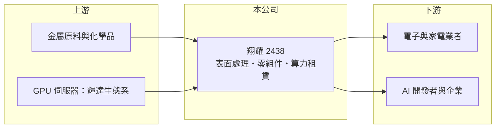

# 2438 翔耀

> 上市｜[[產業索引-光電業|光電業]]｜上市（櫃）日期 2000/09/11

# 第一章：企業模式與商業藍圖

> [!info] 撰寫說明
> 精簡版，由 Claude 依公開資料整理，架構比照 [[2330台積電]]，資料截至 2026-10-07。來源：nstock、MoneyLink 富聯網、winvest 營收快訊。公開資料有限。#待校對

翔耀是傳統製造業務長期虧損的小型公司，近期嘗試以 AI [[算力租賃]]轉型。

- **核心業務：** 翔耀實業成立於 1982 年，營業項目包括[[表面處理]]、照明設備、電子零組件、電腦及周邊、家電、模具與五金製品等製造銷售。
- **營收結構：** 各業務比重這次未查到；近期開始涉足算力租賃服務與 AI 機器設備投資。
- **營運據點：** 上市約 26 年，營運據點細節這次未查到。
- **長期方向：** 推估以 AI 算力租賃作為轉型方向，嘗試擺脫傳統製造業務的長期虧損。

# 第二章：護城河深度與競爭優勢

翔耀目前看不出明確護城河，新業務要和規模大得多的雲端業者競爭。

- **競爭優勢：** 具備表面處理等製造經驗；AI 算力業務仍在起步，優勢尚待驗證。
- **主要對手：** 傳統製造業務面對眾多中小型表面處理與零件廠；AI 算力租賃則需與大型雲端與資料中心業者競爭。
- **觀察重點：** 7、8 月營收大增是否為一次性、AI 算力業務能否帶來正毛利，以及虧損何時收斂。

# 第三章：財務體質與盈利規模

資料日期：2026-10-07，表格是撰寫當時的快照；最新月營收、毛利率、累計 EPS 由自動排程寫在本筆記的屬性欄位（月營收、毛利率、累計EPS 等）。#待校對

翔耀營收大幅成長，但毛利率極低、營業虧損仍大。

- **營收規模：** 2025 年全年營收 4.48 億元；2026 年 1 至 8 月累計 4.97 億元，年增約 67%；7 月營收 1.38 億元、8 月約 6,735 萬元，年增均超過一倍。
- **獲利：** 2025 年 EPS -2.38 元；2026 年第一季 EPS -0.32 元、上半年累計 -0.94 元；第二季 [[毛利率]] 2.71%、[[營業利益率]] -37.95%。
- **財務特色：** 資本額約 7.12 億元，持續虧損且近五年無配息，償債能力指標偏弱。

# 第四章：總體風險與地緣政治

翔耀的風險在於轉型失敗與財務壓力，股價也具高度題材性。

- **產業週期：** 傳統製造業務跟隨電子與家電景氣；AI 算力租賃則受 [[GPU]] 供需與租金價格影響。
- **營運風險：** 毛利率極低、營業虧損大，若轉型不順，可能需要增資或處分資產。
- **其他風險：** 2026 年 5 月曾因股價短期大漲被列為[[注意股]]，題材性強；AI 設備投資金額大，需留意財務槓桿。

# 專有名詞解析

## 半導體

- **[[GPU]]**：圖形處理器，擅長大量平行運算，是訓練與推論 AI 模型的主要晶片。

## 金融

- **[[注意股]]**：股價或成交量短期異常時，由證交所或櫃買中心公告提醒投資人的股票。

## 產業

- **[[表面處理]]**：在金屬或塑膠零件表面電鍍、陽極處理或塗裝，以提升防鏽、耐磨與外觀。
- **[[算力租賃]]**：把 GPU 伺服器的運算能力按時數或期間出租給 AI 開發者與企業。

# 核心供應鏈

- 上游：金屬原料與化學品、GPU 伺服器供應商（如 [[NVDA輝達]] 生態系）
- 下游／客戶：電子與家電業者、需要算力的 AI 開發者與企業
- 同業：中小型表面處理與零件廠、算力租賃業者

## 最新新聞
<!-- news:start -->
<!-- news:end -->

## 相關連結
- [公開資訊觀測站](https://mopsov.twse.com.tw/mops/web/t05st03?step=1&firstin=1&co_id=2438)
- [Goodinfo](https://goodinfo.tw/tw/StockDetail.asp?STOCK_ID=2438)
- [Yahoo 股市](https://tw.stock.yahoo.com/quote/2438)
- [鉅亨網新聞](https://www.cnyes.com/twstock/2438/news)
