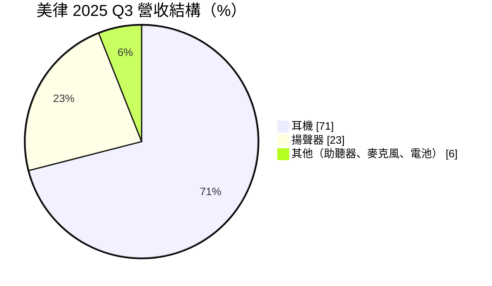
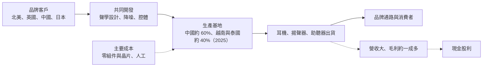
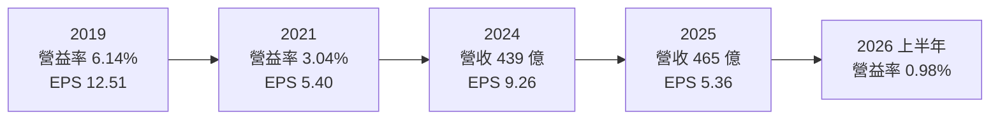
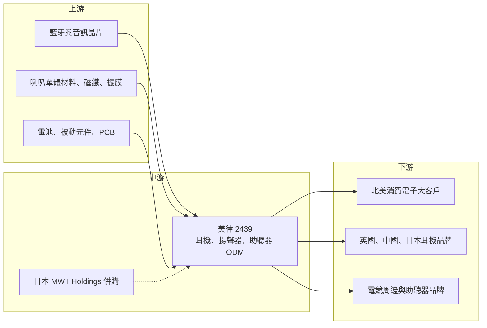

# 2439 美律

> 上市｜[[產業索引-通信網路業|通信網路業]]｜上市（櫃）日期 2000/09/11

# 第一章：企業模式與商業藍圖

> [!info] 撰寫說明
> 本文由 Claude 依公開資料整理，架構比照 [[2330台積電]] 的四章研究，資料截至 2026-10-08。財務數字來源：Goodinfo 年度經營績效、證交所開放資料（基本資料、資產負債、綜合損益、營益分析、股利）、富果研究 2024 年與 2025 年法說會整理、優分析、工商時報；產業描述為整理性內容，尚未逐條比對原始文件。#待校對

耳機、手機揚聲器與助聽器看似是小零件，卻是消費電子中最講究聲學設計與量產經驗的領域。本章針對美律實業（股票代號：2439，以下簡稱美律）的商業模式進行定性分析，說明它如何從電聲元件起家，成為國際品牌的耳機與揚聲器代工夥伴，以及為什麼這門生意營收規模大、利潤卻偏薄。

## 一、核心定位：國際品牌背後的聲學 ODM 廠

美律成立於 1975 年，總部位於台中，2000 年上市，依證交所開放資料實收資本額約 24.9 億元。公司以麥克風、喇叭等電聲元件起家，逐步發展成耳機與揚聲器的設計製造服務商，替國際品牌開發與生產產品，屬於 [[ODM]] 模式，也就是由代工廠負責設計與製造，品牌商負責行銷與通路。

美律的定位有三個特點：

* **聲學技術與量產能力的結合：** 一副好耳機需要喇叭單體、腔體結構、降噪演算法與麥克風的搭配，並且要在數百萬副的量產中維持一致音質。美律累積數十年的聲學實驗室與量產經驗，這是品牌客戶願意長期委託的原因。
* **客戶集中於國際大廠：** 依富果研究整理的 2024 年法說會資料，揚聲器業務約 80% 來自北美大客戶，出口到美國的營收比重超過一半。市場普遍認為北美大客戶為 [[AAPL蘋果]]（推估，公司未具名）。客戶集中帶來穩定的大訂單，也帶來議價能力不對等的問題。
* **從元件走向成品與醫療：** 美律近年積極發展助聽器、頭戴式耳機與喇叭系統，目標是從單純的元件供應商，轉型為具備成品設計與軟體能力的聲學解決方案公司。

## 二、終端應用與產品板塊

依富果研究整理的 2025 年第三季法說會資料，美律的營收結構如下：

* **耳機：** 包含中高階頭戴式耳機（Audio）、電競耳機（Gaming）與[[TWS]]真無線耳機。2025 年第三季耳機整體年增 5%，其中 Audio 年增 9%、Gaming 年增 16%，TWS 則年減 15%。TWS 是競爭最激烈、毛利最低的產品，美律刻意把重心移向頭戴式與電競耳機。
* **揚聲器：** 主要是手機、筆電與平板內建的微型喇叭。2025 年第三季手機揚聲器年減 21%，筆電與 PC 揚聲器年增 15%。公司把部分手機揚聲器產線轉往筆電、平板與耳機，以分散客戶與產品風險。
* **其他：** 以助聽器為主，另有麥克風與電池。助聽器約占 2024 年營收 2.6%，但成長最快，2024 年年增 88%，受惠美國開放非處方（[[OTC助聽器]]）銷售。依公司說明，各產品毛利率由高到低依序為助聽器、麥克風、揚聲器、電競耳機、一般耳機、TWS。

這個排序揭露了美律轉型的核心邏輯：營收最大的耳機與揚聲器毛利最低，毛利最高的助聽器占比還很小。未來能否提高高毛利產品的比重，是獲利改善的關鍵。

## 三、資本轉化邏輯：薄利多銷的代工模式

* **低毛利、高周轉：** 美律長期毛利率約 12% 至 14%，營業利益率約 3% 至 6%。代工廠需要採購大量晶片、電池與零件，這些成本多由品牌客戶議定或轉嫁，代工廠賺的是設計與製造的加工費，因此營收規模大但利潤率薄。
* **開發週期長、專案制：** 依工商時報報導，產品開發通常需要約 1 年至 1.5 年，代表每年的營收大致取決於前一兩年爭取到的專案。這讓美律的營收能見度相對高，但也意味著一旦失去某個大專案，影響會延續一段時間。
* **生產基地分散：** 2025 年中國約占產能 60%、越南與泰國約 40%，公司目標 2026 年調整為中國與東南亞各半。泰國二廠於 2025 年 10 月投產，初期主打大功率音響、娛樂耳機與車用功率放大器。產能移往東南亞是為了因應美國關稅與客戶的供應鏈分散要求，但新廠初期的成本較高，會短期壓抑毛利。

## 四、企業長期藍圖：從元件到成品、從硬體到軟體

* **日本併購：** 美律併購日本 MWT Holdings 股權，預計 2026 年第一季交割，目的是切入日系消費性聲學大廠的供應鏈，並透過垂直整合改善成本結構（工商時報、優分析）。併購金額與持股比例未查得。這是美律近年少數改變營收結構的併購案。
* **助聽器與醫療：** 助聽器是毛利最高、成長最快的產品。美國 OTC 助聽器市場開放後，消費電子廠有機會以較低成本進入過去由專業醫療品牌主導的市場。美律若能擴大這塊業務，將有助於提高整體毛利率。
* **視訊會議與喇叭系統：** 公司把視訊會議（VC）產品與喇叭系統列為新成長動能，並結合聲學與影像技術。這類產品附加價值高於一般耳機。
* **AI 影音感知：** 公司提出「企業再造、創新轉型、永續未來」三大方向，投入 AI 影音感知技術，期望把聲學硬體與軟體演算法結合。公司表示效益將從 2026 年開始顯現，2027 年成長更明顯，但短期研發與產線轉移成本偏高。

# 第二章：護城河深度與競爭優勢

代工產業的護城河通常不深，因為品牌客戶隨時可以把訂單轉給其他供應商。本章分析美律能維持數十年客戶關係的原因、主要競爭對手，以及它在中國同業崛起下能守住多少。

## 一、護城河的核心組成要素

* **聲學設計與驗證能力：** 耳機與揚聲器的音質、降噪與通話品質，需要大量聲學實驗與調校，並在量產中維持一致。美律擁有長期累積的聲學實驗室、測試設備與工程團隊，這是新進者短期難以複製的。
* **與大客戶的長期合作：** 美律與北美大客戶合作多年，參與產品早期開發。品牌客戶更換供應商需要重新驗證音質、良率與交期，轉換成本不低，這讓既有供應商在新產品世代仍有優勢。
* **多元化的生產基地：** 在中國、越南與泰國都有生產據點，可以依客戶需求與關稅政策調配產能。在地緣政治升溫後，「非中國產能」成為接單的重要條件，美律的布局提供了彈性。
* **醫療認證門檻：** 助聽器屬於醫療器材，需要取得法規認證並建立品質系統，門檻高於一般消費電子，也是美律毛利最高的業務。

## 二、全球主要競爭對手格局

| 對手 | 地區 | 主要業務 | 與美律的關係 |
|---|---|---|---|
| 歌爾股份 | 中國 | TWS、VR、聲學元件 | 規模龐大，價格競爭力強 |
| 立訊精密 | 中國 | TWS 組裝、連接器 | 蘋果供應鏈主要對手 |
| 瑞聲科技 | 中國香港上市 | 微型揚聲器、聲學元件 | 手機揚聲器的主要對手 |
| 樓氏電子（Knowles） | 美國 | MEMS 麥克風、助聽器元件 | 在助聽器與麥克風領域競爭 |
| 日系與東南亞代工廠 | 日本、東南亞 | 耳機與音響代工 | 爭取日系與歐美品牌訂單 |

## 三、優勢轉化：守得住與守不住

* **守得住：** 中高階頭戴式耳機、電競耳機、筆電揚聲器與助聽器。這些產品重視聲學品質與客製化設計，價格敏感度較低，美律的技術與客戶關係可以支撐訂單。
* **守不住：** TWS 真無線耳機與手機揚聲器的價格。中國業者規模大、成本低，又有政府支持，在標準化產品上的價格競爭力明顯較強。TWS 在 2025 年第三季年減 15%，正反映這個趨勢。
* **觀察重點：** 第一，助聽器與高附加價值產品的營收占比能否持續提升；第二，日本併購案交割後能否帶來新客戶與毛利改善；第三，東南亞產能比重提高後，成本能否回到原有水準。這三點決定美律能否擺脫「營收創新高、獲利卻下滑」的代工困境。

# 第三章：財務體質與盈利規模

資料日期：2026-10-08。數字取自 Goodinfo 年度經營績效、證交所開放資料與富果研究法說會整理，表格是撰寫當時的快照；最新月營收、毛利率、累計 EPS 由自動排程寫在本筆記的屬性欄位（月營收、毛利率、累計EPS 等）。#待校對

財務報表是檢驗護城河是否真實存在的最終標準。本章用多年度的三率、ROE 與資本報酬，檢視美律在代工模式下的獲利品質。

## 一、獲利能力的基石：三率

| 年度 | 營收（新台幣） | [[毛利率]] | [[營業利益率]] | EPS（元） | [[ROE]] |
|---|---|---|---|---|---|
| 2019 | 364 億 | 13.8% | 6.14% | 12.51 | 21.9% |
| 2020 | 344 億 | 12.5% | 3.31% | 6.39 | 10.4% |
| 2021 | 362 億 | 12.1% | 3.04% | 5.40 | 10.6% |
| 2022 | 354 億 | 12.9% | 3.03% | 6.81 | 12.9% |
| 2023 | 367 億 | 12.9% | 3.10% | 6.16 | 10.7% |
| 2024 | 439 億 | 13.3% | 4.25% | 9.26 | 14.9% |
| 2025 | 465 億 | 12.1% | 3.14% | 5.36 | 9.48% |
| 2026 上半年 | 214 億 | 10.93% | 0.98% | 1.54 | 未查得 |

註：2019 至 2025 年取自 Goodinfo；2026 上半年取自證交所營益分析與綜合損益開放資料。

* **[[毛利率]]：** 美律毛利率長期在 12% 至 14% 之間窄幅波動，是典型的代工廠水準。2025 年降到 12.1%，2026 年上半年再降到 10.93%，主因是產品組合變化與東南亞新產能的成本上升。
* **[[營業利益率]]：** 2019 年營業利益率 6.14% 是近年高點，2020 年以後多數年份只有 3% 左右，2026 年上半年更降到 0.98%。研發與新廠轉移費用增加，是營業利益率下滑的主因，公司已設定費用節省目標。
* **業外與非控制權益：** 美律的稅後淨利常高於營業利益。2026 年上半年營業利益約 2.1 億元，業外收入約 3.8 億元，稅後淨利約 6.4 億元，其中約 2.6 億元屬於[[非控制權益]]（證交所綜合損益開放資料）。這代表美律有部分子公司並非全資持有，評估本業時應以營業利益與歸屬母公司淨利為準。
* **營收趨勢：** 2020 年 344 億元成長到 2025 年 465 億元，5 年年複合成長率約 6.2%（推算），但同期營業利益並未同步成長，顯示營收擴張主要來自低毛利產品。

## 二、[[ROE]]：資本效率

2021 至 2025 年平均 ROE 約 11.7%（推算），低於 2019 年的 21.9%。ROE 中有一部分來自業外收益，若只看本業，資本效率更低。2026 年第二季底每股淨值約 67.51 元，股價淨值比約 1.11 倍（證交所開放資料，2026 年 10 月初），反映市場對代工毛利持續下滑的保守看法。

## 三、資本支出、自由現金流與股利

美律的[[CapEx]]近年集中在泰國二廠與越南廠，2024 年第四季單季資本支出約 5.68 億元（富果研究整理），全年與 2025 年金額未查得。代工廠的資本支出以廠房與自動化設備為主，相較於營收規模並不沉重，正常年份[[自由現金流]]可望為正（推估）。

美律是高配息的公司。2024 年度現金股利 7.3 元，配息率約 79.83%（富果研究整理）；2025 年度現金股利 4.0 元（證交所股利資料），以 EPS 5.36 元計算[[配息率]]約 75%（推算）。公司章程規定分派額度不低於當期新增可分配盈餘的 30%，且以現金股利為優先。股利金額會隨獲利波動，但配息率長期維持在七成以上，對收益型投資人有一定吸引力。

## 四、[[ROIC]] 與 [[WACC]]：價值創造利差

**ROIC 推算：** 2025 年營業利益約 14.6 億元（營收 465 億元乘以營業利益率 3.14%，推算），扣除 20% 稅率後約 11.7 億元。2026 年第二季底權益總計約 186.0 億元，總負債約 222.3 億元，其中多數為應付帳款等營運負債，假設有息負債約 60 億元（推估），投入資本約 246 億元，ROIC 約 4.8%（推算）。以同樣方法估算 2024 年（營業利益約 18.7 億元），ROIC 約 6%（推算）。

**WACC 推算：** 假設台灣 10 年期公債殖利率 1.75%、市場風險溢酬 6%、β 取電子代工業常見值 0.9（推估），股東權益成本約 7.15%。負債成本假設 2.5%，稅後約 2.0%；以帳面價值計，權益約占 76%、負債約占 24%，WACC 約 5.9%（推算）。

**結論：** 以本業營業利益計算，美律近年的 ROIC 約 5% 至 6%，大致與 WACC 打平甚至略低，代表本業在 2020 年以後並沒有明顯創造價值，ROE 的支撐有相當部分來自業外收益。2019 年以前營業利益率約 6% 時，ROIC 明顯高於資金成本（推估）。美律要恢復價值創造，必須靠助聽器等高毛利產品與併購整合提高營業利益率，而不是單純擴大營收。

# 第四章：總體風險與地緣政治

任何企業都無法脫離宏觀環境獨立存在。代工廠夾在品牌客戶與零組件供應商之間，對地緣政治與客戶策略特別敏感。本章分析美律必須長期面對的風險。

## 一、地緣政治風險

* **美國關稅：** 美律出口到美國的營收比重超過一半，而 2025 年約六成產能仍在中國。美國對中國製產品加徵關稅，迫使美律加速把產能移往東南亞，新廠初期的成本較高，會壓縮毛利。
* **供應鏈分散要求：** 品牌客戶要求供應商分散產地，代工廠必須同時維持多地產能，固定成本因此上升。
* **東南亞政策變化：** 越南、泰國的勞動法規、電力供應與稅務優惠若改變，會影響新產能的成本優勢。

## 二、產業週期與市場結構風險

* **消費電子週期：** 耳機與手機揚聲器需求隨消費電子景氣波動，經濟下行時品牌客戶會削減訂單並調整庫存，[[長鞭效應]]使代工廠的訂單波動大於終端需求。
* **TWS 市場成熟：** 真無線耳機市場已趨成熟，價格競爭激烈，中國業者持續壓低報價。
* **產品週期與專案得失：** 代工廠的營收高度依賴少數大型專案，單一機種的得失可能造成營收大幅變動。

## 三、營運環境的隱性風險

* **客戶集中度：** 揚聲器約八成來自北美大客戶，若客戶改變供應商比例或自行設計零件，美律將受到直接衝擊。
* **匯率：** 營收以美元計價為主，新台幣升值會壓縮以台幣計算的毛利與營業利益。
* **新廠與併購執行：** 泰國二廠的產能爬坡與日本 MWT 的整合，若進度不如預期，可能拖累獲利。
* **人力成本：** 東南亞工資上升與熟練工人不足，會影響新廠的良率與成本。

## 四、科技或法規演進

聲學產品正與 AI 結合，例如即時翻譯、環境音辨識與健康監測，耳機可能從單純的聆聽工具變成穿戴式感測裝置。這對美律是機會也是挑戰：若能掌握演算法與軟體整合能力，就能提高附加價值；若停留在純硬體代工，價值可能被晶片與軟體供應商拿走。法規方面，各國助聽器法規的放寬帶來新市場，但醫療器材的品質與資安要求也會持續提高。此外，歐盟的電池、維修權與環保法規，可能提高耳機與電子產品的設計與合規成本。

# 專有名詞解析

## 金融

- **[[非控制權益]]**：子公司中不屬於母公司持有的股權，對應的淨利不歸屬母公司股東。
- **[[業外收益]]**：本業以外的收入，例如投資收益、利息與匯兌利益，波動較大且不一定能持續。
- **[[配息率]]**：現金股利占每股盈餘的比例，用來觀察公司把多少獲利分配給股東。
- **[[自由現金流]]**：營業活動現金流減去資本支出，代表企業可自由用於配息、還債或併購的現金。
- **[[長鞭效應]]**：終端需求的小幅變動，沿供應鏈往上游傳遞時被逐級放大，造成上游庫存與訂單劇烈波動。
- **[[毛利率]]**：營業毛利占營收的比例，反映產品或服務扣除直接成本後的獲利空間。
- **[[營業利益率]]**：營業利益占營收的比例，反映本業扣除營業費用後的獲利能力。
- **[[ROE]]**：股東權益報酬率，稅後淨利除以股東權益，衡量公司用股東資金賺錢的效率。
- **[[ROIC]]**：投入資本報酬率，稅後營業利益除以股東權益與有息負債之和，衡量所有投入資本的報酬。
- **[[WACC]]**：加權平均資金成本，依權益與負債比重加權的資金成本，是 ROIC 需要超越的門檻。

## 產業

- **[[ODM]]**：原廠委託設計製造，代工廠負責產品設計與生產，品牌商負責行銷與銷售。
- **[[TWS]]**：真無線立體聲耳機，左右耳機之間沒有線材連接，以藍牙與手機配對，代表產品如 AirPods。
- **[[OTC助聽器]]**：美國 2022 年起開放、消費者不需聽力師處方即可直接購買的助聽器，讓消費電子廠得以進入市場。
- **[[降噪]]**：以麥克風收錄外界噪音並產生反相聲波抵銷，或以結構隔絕噪音的技術，常見於中高階耳機。
- **[[垂直整合]]**：企業把上下游的生產或服務環節納入集團內部，以掌握成本、品質與交期。

# 核心供應鏈

## 1. 上游：晶片與零組件
- 藍牙音訊晶片：[[QCOM高通]]、[[2379瑞昱]]、[[2454聯發科]] 等（產業常見供應商，個別採購關係未查得）
- 喇叭單體材料、磁鐵、振膜、電池、被動元件與 PCB 供應商

## 2. 中游：美律與同業
- 美律本身：中國、越南、泰國生產基地
- 日本 MWT Holdings（2026 年第一季交割的併購案）
- 國際同業：歌爾股份、立訊精密、瑞聲科技、樓氏電子

## 3. 下游：品牌客戶
- 北美消費電子大客戶（市場普遍認為是 [[AAPL蘋果]]，推估）
- 英國、中國的 TWS 與頭戴式耳機品牌
- 電競耳機品牌、美系助聽器大客戶
- 日系消費性聲學品牌（經由 MWT 併購切入）

## 最新新聞
<!-- news:start（自動產生，請勿手動編輯此範圍） -->
- 2026-10-06 🏛️ 重訊 15:47｜公告本公司自行結算115年09月集團合併營收｜[觀測站](https://mops.twse.com.tw/mops/#/web/t05st01)

完整紀錄：[[2439美律 新聞]]
<!-- news:end -->

## 相關連結
- [公開資訊觀測站](https://mopsov.twse.com.tw/mops/web/t05st03?step=1&firstin=1&co_id=2439)
- [Goodinfo](https://goodinfo.tw/tw/StockDetail.asp?STOCK_ID=2439)
- [Yahoo 股市](https://tw.stock.yahoo.com/quote/2439)
- [鉅亨網新聞](https://www.cnyes.com/twstock/2439/news)
