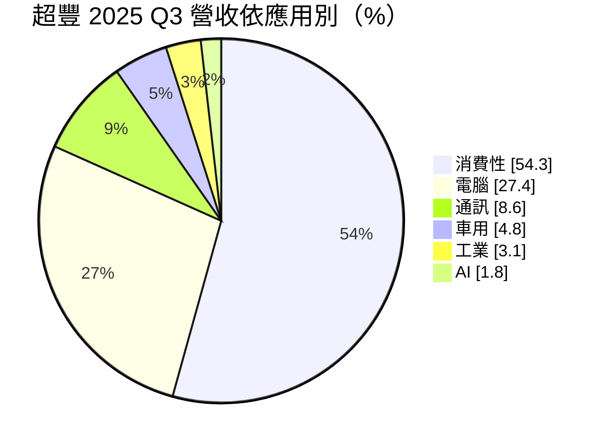
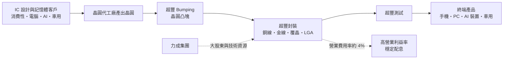
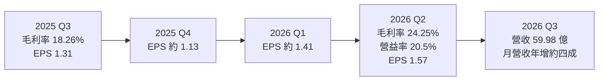
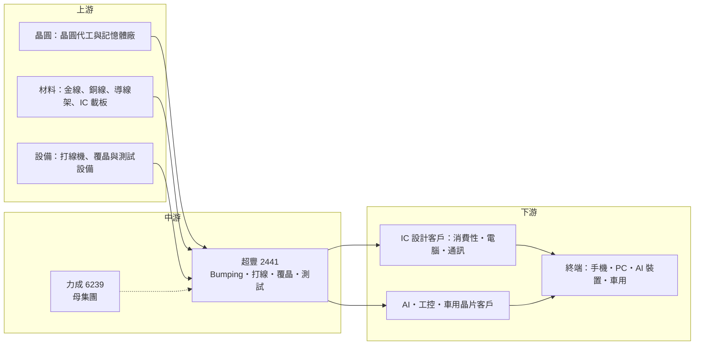

# 2441 超豐

> 上市｜[[產業索引-半導體業|半導體業]]｜上市（櫃）日期 2000/10/26

# 第一章：企業模式與商業藍圖

> [!info] 撰寫說明
> 本文由 Claude 依公開資料整理，架構比照 [[2330台積電]] 的四章研究，資料截至 2026-10-07。財務數字來源：富果研究（2025 年 10 月 30 日法說會整理）、聯合報（2026 年 7 月 28 至 29 日法說會報導）、nstock、winvest 營收快訊、MoneyLink 公司基本資料；產業描述為整理性內容，尚未逐條比對原始文件。#待校對

在評估單一個股的長期投資價值時，首要步驟是拆解企業的底層獲利邏輯。本章針對超豐電子（股票代號：2441，以下簡稱超豐）的商業模式進行定性分析，說明這家以打線封裝為主的中型封測廠，為何能長期維持兩成以上的營業利益率與穩定配息，以及它如何借 AI 與「去中化」轉單往覆晶與 Bumping 升級。

## 一、核心定位：高效率的成熟封測廠

超豐成立於 1983 年，總部在苗栗竹南，股本約 56.88 億元，董事長謝永達。超豐是 [[6239力成]] 集團旗下的封測公司（力成為最大股東），屬於專業封測代工（[[OSAT]]）。

超豐的定位可以用三點概括：

* **以打線封裝為主：** 2025 年第三季封裝型態中銅線占 76.2%、金線 19.5%、覆晶 4.2%，產品以消費性與電腦用的中低腳數 IC 為主。
* **極低的營業費用率：** 營業費用率約 4%，毛利率與營業利益率差距很小，這是超豐能在打線封裝這種競爭激烈的市場維持獲利的關鍵。
* **財務保守：** 2025 年第三季存貨周轉 28 天、流動比率 300%，沒有銀行借款。

## 二、終端應用／產品板塊：消費性過半、AI 快速成長

依 2025 年 10 月 30 日法說會，2025 年第三季營收依應用別結構如下：

* **依服務別：** 封裝 77%、測試 15.6%、[[Bumping]] 與 DPS 7.2%。
* **消費性與電腦（合計逾八成）：** 包括電源管理、驅動、MCU 與記憶體等 IC 的封裝，量大但單價低。
* **AI 與工業：** 2025 年第三季 AI 只占 1.8%，但 2026 年上半年 AI 相關營收年增約 180%、工控成長約 50%，是成長最快的板塊。
* **車用：** 占 4.8%，公司表示維持穩定成長。

## 三、資本轉化邏輯（營運模式）：低費用率加高稼動率

* **[[稼動率]]決定毛利率：** 封測廠的機台折舊與人力屬固定成本，2026 年上半年稼動率提升、產品組合優化與平均售價調整，使毛利率年增 2.7 個百分點至 24%。
* **費用精簡：** 營業費用率約 4%，2026 年第二季毛利率 24.25%、營業利益率 20.5%，兩者差距不到 4 個百分點。
* **金價轉嫁：** 記憶體客戶拉貨回升，金線封裝因金價上漲而調整報價。

## 四、企業長期藍圖：覆晶、SiC 與 GaN

* **覆晶產能：** 2026 年 7 月法說會表示，AI 與 [[HPC]] 需求帶動 Bumping 與[[覆晶封裝]]出貨，計畫 2027 年初投資覆晶產能。
* **LGA 量產：** 2026 年 LGA 產品開始量產，產品組合往較高單價移動。
* **[[SiC]] 與 [[GaN]]：** 2025 年法說會表示 SiC 設備投資進行中，機台預計 2026 年 4 月底進駐；另有多家國內外廠商進行 GaN 工程驗證。
* **去中化轉單：** 公司預期國際客戶分散中國供應鏈的需求，會帶來轉單。

# 第二章：護城河深度與競爭優勢

在長期價值投資中，「護城河」指企業抵禦競爭、維持超額利潤的保護機制。本章分析超豐的競爭優勢、國內外主要對手，以及這些優勢在打線封裝的價格競爭中能守住多少。

## 一、護城河的核心組成要素

超豐的護城河屬「窄但穩」，主要來自成本與營運效率：

* **1. 成本與費用效率：** 營業費用率約 4%，在同業中屬低水準。即使毛利率只有二成左右，營業利益率仍可維持在 15% 至 20%，這讓超豐在價格戰中有較大的緩衝。
* **2. 力成集團綜效：** 力成是記憶體與先進封裝大廠，超豐可承接集團內的打線與中階封裝訂單，並共享客戶與技術資源（推估）。
* **3. 財務穩健：** 無銀行借款、流動比率高，景氣低迷時仍能維持配息與適度投資，不必被迫降價搶單。

## 二、全球主要競爭對手格局

| 對手 | 定位 | 對超豐的威脅 |
|---|---|---|
| [[3711日月光投控]] | 全球最大封測廠 | 規模與產品線完整，可整包承接大客戶 |
| [[2369菱生]]、[[8150南茂]] | 台灣中型封測廠 | 在打線封裝與記憶體封裝直接競爭 |
| [[6257矽格]]、[[2449京元電子]] | 測試專業廠 | 在測試業務競爭 |
| 中國封測廠（長電科技、華天、通富微電） | 政策扶植、成本低 | 以低價搶中低階打線封裝訂單 |

## 三、優勢轉化：守得住／守不住／觀察重點

* **守得住：** 需要非中國產能的國際客戶、已長期合作的台灣 IC 設計客戶，以及受惠 AI 的 Bumping 與覆晶訂單。
* **守不住：** 純消費性的低階打線封裝報價，中國同業擴產會持續壓抑價格。
* **觀察重點：** AI 營收占比能否從個位數提升、2027 年覆晶產能投資的規模，以及 SiC 與 GaN 封裝能否進入量產。

# 第三章：財務體質與盈利規模

資料日期：2026-10-07。數字取自法說會整理、聯合報與 nstock，表格是撰寫當時的快照；最新月營收、毛利率、累計 EPS 由自動排程寫在本筆記的屬性欄位（月營收、毛利率、累計EPS 等）。#待校對

財務報表是檢驗護城河是否真實存在的最終標準。本章用三率、ROE、現金流與資本報酬，檢視超豐在 2026 年封測景氣回升中的獲利品質。

## 一、獲利能力的基石：三率

| 項目 | 2025 全年 | 2025 Q3 | 2026 上半年 | 2026 Q2 |
|---|---|---|---|---|
| 營收（新台幣） | 167.64 億 | 未查得 | 100.06 億 | 未查得 |
| [[毛利率]] | 前三季 20.1% | 18.26% | 24% | 24.25% |
| [[營業利益率]] | 未查得 | 未查得 | 未查得 | 20.5% |
| EPS（元） | 4.31 | 1.31 | 2.98 | 1.57 |

註：2026 年第一季 EPS 約 1.41 元（上半年減第二季推算）；2025 年第四季 EPS 約 1.13 元（全年減前三季推算）。

* **[[毛利率]]：** 從 2025 年第三季的 18.26% 升到 2026 年第二季 24.25%，約 6 個百分點，主因是稼動率提升、產品組合優化與平均售價調整。
* **[[營業利益率]]：** 2026 年第二季 20.5%，低費用結構讓毛利率改善幾乎全數反映到營業利益。
* **營收動能：** 2026 年第三季 7、8、9 月營收分別為 19.98 億、20.43 億與 19.57 億元，合計約 59.98 億元；1 至 9 月累計 160.04 億元，年增 28.36%，已接近 2025 年全年。
* **淨利：** 2026 年上半年稅後純益 16.92 億元，年增 22.4%。

## 二、[[ROE]]：資本效率

依 nstock，2026 年第二季單季 ROE 約 3.39%、ROA 約 2.84%，年化後約 13% 至 14%（推估）。ROE 與 ROA 差距小，反映超豐幾乎沒有負債，財務槓桿低。

## 三、資本支出與自由現金流

* **[[CapEx]]：** 具體金額未查得。2026 年進行 SiC 設備投資，並計畫 2027 年初投資覆晶產能，資本支出可望增加。
* **[[自由現金流]]：** 具體數字未查得。無銀行借款且長期穩定配息，推估自由現金流長期為正。
* **股利：** 2025 年度配發現金股利 3.01 元，以 EPS 4.31 元計配發率約七成；2024 年度 3 元；近五年平均現金股利 3.44 元、平均現金殖利率 5.07%。

## 四、[[ROIC]] 與 [[WACC]]：價值創造利差

超豐營業利益率約二成、資本結構幾乎沒有負債，ROIC 推估高於 WACC，屬於穩定創造價值的成熟型公司。未來利差的關鍵在於新增覆晶與 SiC 產能能否維持高稼動率，若新產能投產後需求放緩，折舊增加會壓縮報酬率。

# 第四章：總體風險與地緣政治

任何企業都無法脫離宏觀環境獨立存在。本章分析超豐未來必須面對的地緣政治、產業週期與營運風險。

## 一、地緣政治

* **去中化轉單：** 國際客戶分散中國供應鏈，是超豐 2026 年的成長動能之一；但若地緣政治緩和，轉單動能可能減弱。
* **台灣集中風險：** 主要產能在台灣，面臨與其他台灣半導體廠相同的兩岸風險。
* **美國關稅：** 封測位於供應鏈後段，美國對半導體或終端產品的關稅政策會間接影響客戶下單（推估）。

## 二、產業週期與市場結構

* **消費性電子週期：** 消費性與電腦合計占營收逾八成，手機、PC 與家電需求變化會直接反映在稼動率。
* **[[長鞭效應]]：** 庫存回補帶動 2026 年拉貨，若終端需求不如預期，庫存調整會沿供應鏈放大。
* **市場結構：** 打線封裝技術門檻相對低，中國產能擴充會長期壓抑價格。

## 三、營運環境的隱性風險

* **金價：** 金線封裝約占兩成，金價上漲需要轉嫁給客戶，若轉嫁不及會壓縮毛利。
* **集團內關係：** 與力成的業務分工與關係人交易需要持續觀察。
* **產能投資時點：** 2027 年覆晶擴產若遇到景氣反轉，可能面臨稼動率不足。

## 四、科技或法規演進

* **封裝技術升級：** 高階晶片轉向覆晶、晶圓級與[[先進封裝]]，打線封裝的市場占比長期下降；超豐需要持續擴充 Bumping 與覆晶能力。
* **寬能隙材料：** SiC 與 GaN 功率元件的封裝需要耐高溫、高壓的材料與製程，是新機會也是新的技術門檻。

# 專有名詞解析

## 半導體

- **[[OSAT]]**：專業封裝測試代工，替 IC 設計公司與晶圓廠完成晶片封裝與測試的廠商。
- **[[打線封裝]]**：以金線或銅線把晶片上的接點連接到導線架或基板的傳統封裝方式，成本低，適合腳數不多的晶片。
- **[[覆晶封裝]]**：把晶片翻面，以凸塊直接接合到基板的封裝方式，訊號路徑短，適合高速與高腳數晶片。
- **[[Bumping]]**：晶圓凸塊製程，在晶圓上製作錫球或銅柱凸塊，是覆晶封裝的前段步驟。
- **[[LGA]]**：平面柵格陣列封裝，底部以平面接點取代錫球，封裝較薄，常用於感測器與模組。
- **[[先進封裝]]**：把多顆晶片以中介層、混合鍵合等方式高密度整合的封裝技術，例如 CoWoS、SoIC。
- **[[SiC]]**：碳化矽，耐高壓、高溫的寬能隙半導體材料，用於電動車與太陽能逆變器的功率元件。
- **[[GaN]]**：氮化鎵，切換速度快、效率高的寬能隙半導體材料，用於快充與資料中心電源。

## 應用

- **[[HPC]]**：高效能運算，用於 AI 訓練、科學運算與資料中心的大量平行運算。

## 金融

- **[[稼動率]]**：產線實際運轉產量占可運轉產能的比例，封測廠的毛利率高度取決於此。
- **[[毛利率]]**：營業毛利占營收的比例，反映產品定價能力與成本結構。
- **[[營業利益率]]**：營業利益占營收的比例，反映扣除營業費用後本業的獲利能力。
- **[[ROE]]**：股東權益報酬率，稅後淨利除以股東權益，衡量公司運用股東資金賺錢的效率。
- **[[長鞭效應]]**：終端需求的小幅變動，沿供應鏈往上游傳遞時被逐級放大，造成上游庫存與訂單劇烈波動。

# 核心供應鏈

## 1. 上游：晶圓、材料與設備
- 晶圓來源：晶圓代工廠如 [[2330台積電]]、[[2303聯電]]（推估）
- 封裝材料：金線、銅線、導線架與 IC 載板（具體供應商未查得）

## 2. 中游：超豐本身與集團
- 母集團：[[6239力成]]
- 超豐服務：Bumping、打線封裝、覆晶封裝、LGA、測試；SiC 與 GaN 封裝驗證中

## 3. 下游：主要客戶類型
- 消費性、電腦與通訊 IC 設計公司（名單未揭露）
- AI、HPC、工控與車用晶片客戶

## 4. 同業
- [[3711日月光投控]]、[[2369菱生]]、[[8150南茂]]、[[6257矽格]]、[[2449京元電子]]

## 最新新聞
<!-- news:start（自動產生，請勿手動編輯此範圍） -->
- 2026-10-07 📰 媒體 17:50｜營收速報 - 超豐(2441)9月營收19.57億元年增率高達39.65％｜[鉅亨網](https://news.cnyes.com/news/id/6623793)

完整紀錄：[[2441超豐 新聞]]
<!-- news:end -->

## 相關連結
- [公開資訊觀測站](https://mopsov.twse.com.tw/mops/web/t05st03?step=1&firstin=1&co_id=2441)
- [Goodinfo](https://goodinfo.tw/tw/StockDetail.asp?STOCK_ID=2441)
- [Yahoo 股市](https://tw.stock.yahoo.com/quote/2441)
- [鉅亨網新聞](https://www.cnyes.com/twstock/2441/news)
