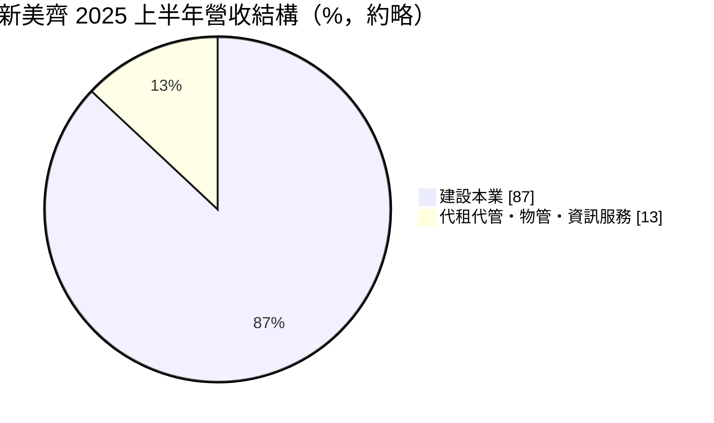
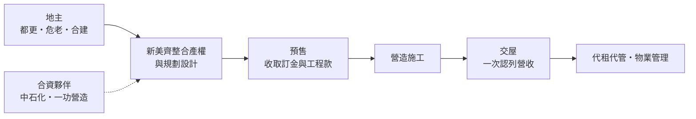
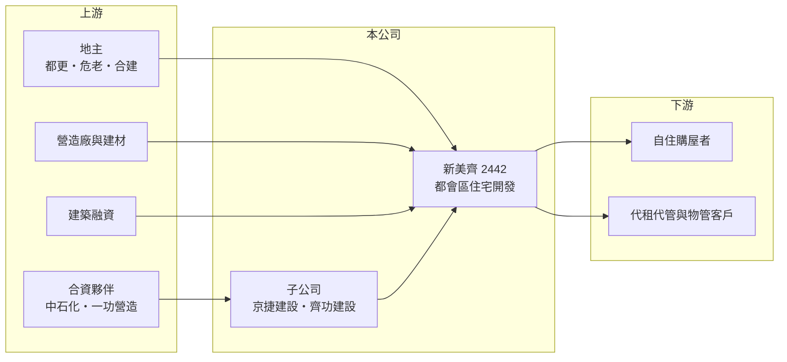

# 2442 新美齊

> 上市｜[[產業索引-建材營造業|建材營造業]]｜上市（櫃）日期 2000/11/22

# 第一章：企業模式與商業藍圖

> [!info] 撰寫說明
> 本文由 Claude 依公開資料整理，架構比照 [[2330台積電]] 的四章研究，資料截至 2026-10-08。財務數字來源：Goodinfo 年度經營績效頁、富果研究 2025 年 10 月法說會整理、優分析報導標題；公司沿革與產業描述為整理性內容，尚未逐條比對原始文件。#待校對

在評估單一個股的長期投資價值時，首要步驟是拆解企業的底層獲利邏輯。本章說明新美齊（股票代號：2442）這家以[[都更]]與[[危老重建]]為主的建設公司，如何透過合建與合資在雙北、台中、高雄取得開發案源。

## 一、核心定位：以都更、危老與合建為主的都會型建商

新美齊的股票代號屬於電子類的編號區間，現在的主要業務則是建設開發（早期業務與轉型時點未查得）。公司深耕台北、新北、台中、高雄等主要都會區，開發模式以都更、危老與[[合建]]為主，自己買地興建的比重較低。

這種模式的商業意義在於降低土地資金壓力。都會區精華地段的土地很少整塊出售，建商要和多位地主協商，以分配新建房屋的方式取得開發權。新美齊不必一次支付高額地價，但需要長時間整合產權與通過審議，案件從啟動到交屋往往超過五年。

## 二、營收結構：建設本業為主，代租代管與資訊服務為輔

依 2025 年上半年資料，建設本業約占總營收 87%，其餘來自代租代管與資訊服務：公司經營酒店式公寓代租代管、物業管理與保全管理，並自行開發客戶關係管理、驗屋與銷控系統。

周邊服務的金額不大，但它們讓新美齊能把服務延伸到交屋之後，並在建案空窗期提供基本收入。

## 三、資本轉化邏輯：合資放大規模，交屋集中認列

新美齊透過合資公司承接大型案件，例如持股 60% 的京捷建設與中石化合資開發「画世代」，持股 60% 的齊功建設與一功營造合資開發高雄案。合資讓公司能參與單獨難以負擔的大案，但利潤也要與夥伴分享。

建商營收在[[建案交屋]]時一次認列，新美齊的營收因此高度集中。2025 年「画世代」（總銷 146 億元、住宅 621 戶已完銷）與「The Top」（總銷 39.4 億元、182 戶已完銷）陸續交屋，使當年營收達 107 億元，約為前一年的十倍。

## 四、企業長期藍圖：都更案源與商用不動產

依法說會資料，新美齊儲備 7 個個案，預計 2025 年第三季至 2027 年第二季陸續取得建照，地點包括台中機捷特區、三重頂崁、高雄苓雅、新店裕隆城、台中七期與北投士科；另有台中 14 期仁平段自建案預計 2027 年完工。2026 年報導也提到公司將跨入商用不動產開發。長期而言，新美齊的成長取決於能否持續取得都更與危老案源，並把一次性的大案高峰轉為穩定的推案節奏。

# 第二章：護城河深度與競爭優勢

「護城河」指企業抵禦競爭、維持超額利潤的保護機制。本章分析新美齊在都更與危老市場的競爭位置。

## 一、新美齊護城河的核心組成要素

第一是土地整合能力。都更與危老案需要和眾多地主協商分配比例、處理產權與審議程序，這需要長期累積的經驗與信任。能成功整合的建商，往往能以低於市價的成本取得精華地段，這是都更型建商主要的超額利潤來源。

第二是合資結構。與中石化、一功營造等夥伴合作，讓新美齊能取得大型土地與營造資源，擴大可承接的案件規模。

第三是一條龍服務。從開發、營造合作、物業管理到自建的資訊系統，讓公司能掌握銷售與售後流程，提高客戶滿意度與品牌信任。

## 二、主要競爭對手格局

| 對手 | 定位 | 對新美齊的威脅 |
|---|---|---|
| [[2509全坤建]] | 大台北都更、危老合建 | 在雙北都更案源直接競爭 |
| [[2520冠德]]、[[2501國建]] | 大型品牌建商，也做都更 | 資金與品牌較強，爭取大型都更案 |
| 地方型都更建商 | 深耕單一行政區 | 在地人脈與地主關係較緊密 |

## 三、優勢轉化：守得住／守不住／觀察重點

守得住的是已整合完成的都更案權益，這些案件一旦取得建照，競爭對手難以介入。守不住的是房市景氣與政策，信用管制收緊時，即使地段優良也可能去化變慢。長期觀察重點是 7 個儲備案取得建照與推案的節奏，以及 2025 年大案交屋後，下一波營收高峰何時出現。

# 第三章：財務體質與盈利規模

資料日期：2026-10-08。數字取自 Goodinfo 年度經營績效與富果研究法說會整理，表格是撰寫當時的快照；最新月營收、毛利率、累計 EPS 由自動排程寫在本筆記的屬性欄位（月營收、毛利率、累計EPS 等）。#待校對

財務報表是檢驗護城河是否真實存在的最終標準。本章用五年的三率、ROE、營建業指標與資本報酬，檢視新美齊的獲利品質。

## 一、獲利能力的基石：三率

| 年度 | 營收（新台幣） | [[毛利率]] | [[營業利益率]] | EPS（元） | [[ROE]] |
|---|---|---|---|---|---|
| 2021 | 15.3 億 | 36.5% | 21.9% | 1.99 | 11.5% |
| 2022 | 5.47 億 | 28.4% | -1.71% | 0.56 | 3.11% |
| 2023 | 25.0 億 | 27.0% | 13.8% | 1.67 | 8.92% |
| 2024 | 10.9 億 | 35.9% | 20.8% | 1.20 | 6.00% |
| 2025 | 107 億 | 33.7% | 26.5% | 5.24 | 34.5% |

新美齊的營收在 5 億元到 107 億元之間大幅跳動，這是交屋集中認列的典型結果，因此營收年複合成長率沒有參考意義。比較值得看的是毛利率：多數年度維持在 27% 至 37%，代表都更與合建取得的土地成本相對有利。2021 至 2025 年平均 ROE 約 12.8%（推算），但主要由 2025 年單一大案拉高，其餘年份多在 3% 至 12%。

## 二、營建業指標：已售未入帳、存貨與負債

依 2025 年第二季資料，新美齊待交屋戶數合計 803 戶，預估入帳金額約 216.8 億元，大部分在 2025 年下半年認列。同一時點總資產約 275 億元，其中存貨約 215.5 億元（占 79%），總負債約 219.6 億元，其中金融借款約 172.5 億元，股東權益約 55.5 億元。這種「存貨占資產近八成、借款約為股本的三倍」的結構，是建商在大案交屋前的典型狀態；交屋後借款會隨房款償還而下降，依 Goodinfo 推算 2025 年底總資產降至約 159 億元（推算）。

## 三、股利

公司表示歷年股利分派率約在 20% 至 50% 之間。Goodinfo 統計的歷年平均現金股利約 0.21 元，並常搭配股票股利，股本因此從 2021 年的 24.5 億元增加到 2025 年的 27.5 億元。

## 四、[[ROIC]] 與 [[WACC]]：價值創造利差

**ROIC 推算：** 2025 年營業利益約 28.4 億元（107 億 × 26.5%），稅後約 22.7 億元。股東權益約 62 億元（每股淨值 22.48 元 × 約 2.75 億股），依 ROA 8.95% 推算年底總資產約 159 億元、總負債約 97 億元，假設六成為有息負債約 58 億元（推估），投入資本約 120 億元，ROIC 約 19%（推算）。若以 2021 至 2025 年平均營業利益約 7.5 億元計算，ROIC 約 5%（推算）。

**WACC 推算：** 台灣 10 年期公債殖利率假設 1.75%、市場風險溢酬 6%、β 取營建同業常見值 0.9，股東權益成本約 7.2%。負債成本假設 3%，稅後 2.4%；權益占投入資本約 52%（推估），WACC 約 4.9%（推算）。建商槓桿高，實際 β 可能更高，WACC 可能偏低估。

**結論：** 大案交屋年度的 ROIC 遠高於 WACC，但以五年平均看只與資金成本相當。新美齊能否長期創造價值，取決於能否讓都更案源接續不斷，而不是只靠單一大案。

# 第四章：總體風險與地緣政治

任何企業都無法脫離宏觀環境獨立存在。本章分析新美齊長期必須面對的產業、政策與營運風險。

## 一、產業週期與營收集中

建商營收依交屋時點認列，新美齊的規模較小、案件數少，單一案件就可能決定一整年的獲利。2025 年的高峰之後，若下一批儲備案延遲取得建照或推案，營收可能回到較低水準，投資人不宜把單一年度的 EPS 視為常態。

## 二、政策與金融風險

央行[[信用管制]]會影響買方貸款與建商融資，房地合一稅與預售屋法規也會影響投資需求。都更與危老案依賴容積獎勵與審議制度，相關法規調整會直接改變案件的經濟效益。

## 三、營運環境的隱性風險

都更整合常因少數地主不同意而延宕，時程拉長會增加資金成本。營建成本上升與缺工也會壓縮合建案的利潤，因為合建的分配比例通常在開工前就已談定。合資案的利潤需與夥伴分享，若夥伴策略改變，也可能影響案件進度。

## 四、財務槓桿風險

大案興建期間存貨與借款占比很高，若銷售不如預期或利率上升，財務壓力會迅速放大。這是所有中小型建商共同的結構性風險。

# 專有名詞解析

## 金融

- **[[ROIC]]**：投入資本報酬率，稅後營業利益除以股東權益加有息負債，衡量本業運用資本的效率。
- **[[WACC]]**：加權平均資金成本，股東與債權人要求報酬率的加權平均，是 ROIC 要超越的門檻。

## 產業

- **[[都更]]**：都市更新，由地主與建商合作把老舊建物改建，地主依權利價值分回房地或收益。
- **[[危老重建]]**：依都市危險及老舊建築物加速重建條例，以容積獎勵與簡化程序推動老舊建物重建。
- **[[合建]]**：地主提供土地、建商負責出資興建，完工後雙方依約定比例分配房屋或銷售收入的開發模式。
- **[[建案交屋]]**：建商在房屋完工並交付買方時才認列營收，因此營建公司的營收常集中在交屋年度。

# 核心供應鏈

## 1. 上游：土地、夥伴與資金
- 地主（都更、危老、合建）
- 合資夥伴：[[1314中石化]]、一功營造
- 建築融資：銀行

## 2. 中游：新美齊
- 子公司：京捷建設（60%）、齊功建設（60%）
- 同業：[[2509全坤建]]、[[2501國建]]、[[2520冠德]]

## 3. 下游：客戶
- 雙北、台中、高雄的自住購屋者，代租代管委託屋主

## 最新新聞
<!-- news:start -->
<!-- news:end -->

## 相關連結
- [公開資訊觀測站](https://mopsov.twse.com.tw/mops/web/t05st03?step=1&firstin=1&co_id=2442)
- [Goodinfo](https://goodinfo.tw/tw/StockDetail.asp?STOCK_ID=2442)
- [Yahoo 股市](https://tw.stock.yahoo.com/quote/2442)
- [鉅亨網新聞](https://www.cnyes.com/twstock/2442/news)
