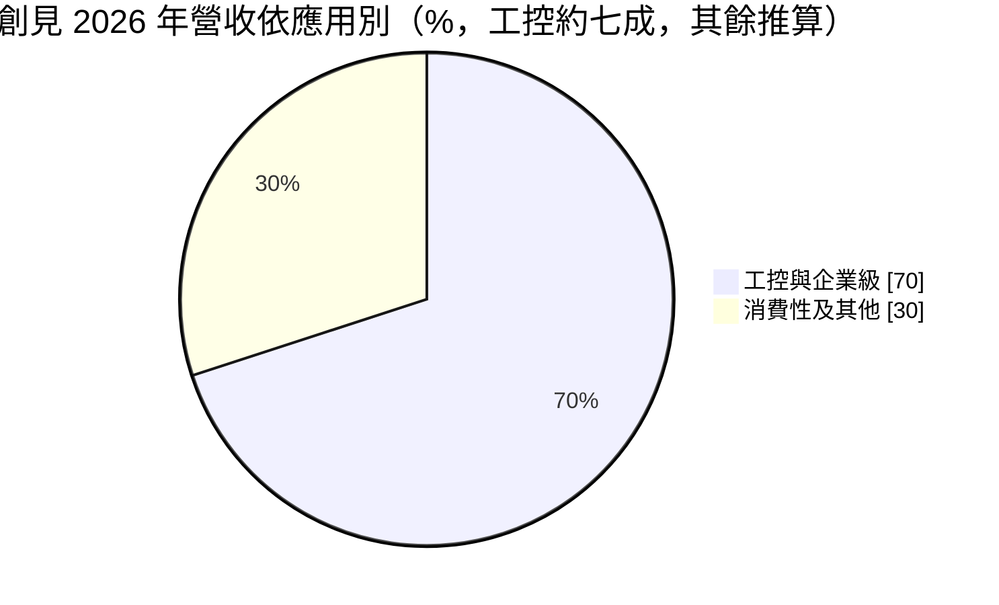
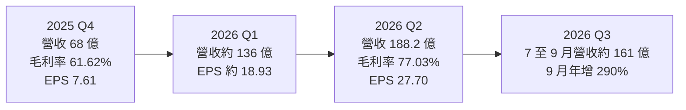
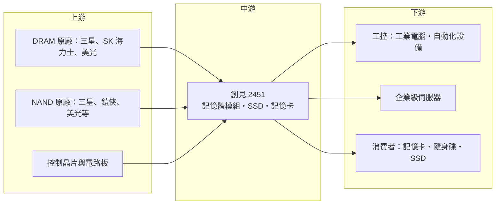

# 2451 創見

> 上市｜[[產業索引-半導體業|半導體業]]｜上市（櫃）日期 2001/05/03

# 第一章：企業模式與商業藍圖

> [!info] 撰寫說明
> 本文由 Claude 依公開資料整理，架構比照 [[2330台積電]] 的四章研究，資料截至 2026-10-07。財務數字來源：聯合報（2026 年 7 月 23 日第二季財報報導）、優分析（2026 年 3 月 5 日 2025 年財報、2026 年 9 月 3 日營收報導）、nstock、MoneyLink 公司基本資料；產業描述為整理性內容，尚未逐條比對原始文件。#待校對

在評估單一個股的長期投資價值時，首要步驟是拆解企業的底層獲利邏輯。本章針對創見資訊（股票代號：2451，以下簡稱創見）的商業模式進行定性分析，說明這家記憶體模組廠如何在 2025 至 2026 年的記憶體缺貨潮中，把低價庫存轉成創紀錄的獲利，以及這種獲利能持續多久。

## 一、核心定位：以工控為主的記憶體模組品牌

創見成立於 1989 年，總部在台北內湖，董事長束崇萬，股本約 43.13 億元。創見向上游記憶體原廠採購 [[DRAM]] 與 [[NAND Flash]] 顆粒，再搭配控制晶片與電路板，做成記憶體模組、[[SSD]]、記憶卡與隨身碟等產品，以自有品牌銷售。

創見的定位有三個重點：

* **工控為主：** 依優分析 2026 年 9 月報導，工控相關營收占比接近七成，企業級伺服器與工業應用是主要產品方向。工控客戶重視長期供貨與穩定規格，價格敏感度低於消費性市場。
* **庫存操作能力：** 記憶體模組廠的獲利高度取決於顆粒採購成本與售價之間的價差。創見以長期供貨協議與提前採購維持出貨能力，在價格上漲時用低成本庫存賺取[[庫存利益]]。
* **財務保守、高配息：** 創見長期以穩健財務與高配息聞名，2025 年度每股配發現金股利 11.8 元。

## 二、終端應用／產品板塊：工控接近七成

公司未公開詳細的產品比重，依優分析報導，工控相關營收接近七成，下圖以此繪製（其餘為推算）：



* **工控與企業級（約七成）：** 工業電腦、自動化設備、伺服器使用的記憶體模組與 SSD。創見推出 [[DDR5]]-7200 高速記憶體模組與 DDR5-6400 64GB 大容量產品。
* **消費性及其他（約三成，推算）：** 記憶卡、隨身碟、行車記錄器與消費性 SSD。2026 年下半年將推出採用 218 層 3D NAND 的固態硬碟與記憶卡。

## 三、資本轉化邏輯（營運模式）：低價庫存乘上價格上漲

```mermaid
flowchart LR
    A["記憶體原廠<br/>DRAM・NAND 顆粒"] --> B["創見採購<br/>長約與提前備貨"]
    C[控制晶片與電路板] --> D
    B --> D["創見模組製造<br/>記憶體模組・SSD・記憶卡"]
    D --> E["客戶<br/>工控・企業伺服器・消費者"]
    B -. 低成本庫存 .-> F["記憶體漲價時<br/>毛利率大幅擴張"]
    F -. 2026 Q2 毛利率 77.03% .-> G[高配息]
```

* **價差決定獲利：** 模組廠的成本主要是顆粒，加工附加價值有限。記憶體價格上漲時，以舊價格買進的庫存按新價格出售，毛利率會急速擴張；價格下跌時則面臨[[存貨跌價損失]]。
* **2025 至 2026 年的缺貨潮：** 依聯合報，記憶體市場受 AI 產能排擠與上游供應緊縮影響，價格持續走揚，客戶提前拉貨鎖定庫存。創見 2025 年第四季毛利率 61.62%，2026 年第二季更升至 77.03%。
* **出貨受限：** 優分析指出部分合約滿足率僅約三至五成，新增產能最快 2027 年底陸續開出，代表創見的營收受限於能拿到多少顆粒。

## 四、企業長期藍圖：邊緣運算與高階工控產品

* **邊緣運算應用：** 依聯合報，公司預期機器人、電動車與 AI PC 等[[邊緣運算]]應用需求持續強勁。
* **產品升級：** 推出 DDR5 高速大容量模組與 218 層 3D NAND 產品，往高階工控與企業級市場移動。
* **供貨能力：** 透過長期供貨協議與提前採購，確保缺貨期間的出貨能力。

# 第二章：護城河深度與競爭優勢

在長期價值投資中，「護城河」指企業抵禦競爭、維持超額利潤的保護機制。本章分析創見作為記憶體模組廠的競爭優勢、國內外主要對手，以及這些優勢在記憶體循環中能守住多少。

## 一、護城河的核心組成要素

記憶體模組產業的護城河普遍較窄，因為核心零件來自少數原廠，模組廠的差異化有限。創見的優勢主要在以下三點：

* **1. 工控客戶的長期供貨承諾：** 工控設備的生命週期長達數年，客戶需要同一規格長期供貨並通過認證，換供應商的驗證成本高。這讓創見在工控市場的訂單較穩定。
* **2. 品牌與通路：** 創見經營自有品牌數十年，在全球消費性與工控通路都有據點（推估）。
* **3. 財務實力與採購能力：** 帳上資金充裕，可以在價格低點大量備貨，並與原廠簽訂長約，這在缺貨時就是拿得到貨的能力。

## 二、全球主要競爭對手格局

| 對手 | 定位 | 對創見的威脅 |
|---|---|---|
| [[3260威剛]] | 台灣最大記憶體模組廠之一 | 規模大、庫存操作積極，2026 年上半年 EPS 62.46 元 |
| [[5289宜鼎]] | 工控記憶體與儲存模組 | 在工控市場直接競爭，產品線更偏高階 |
| [[8271宇瞻]]、[[4967十銓]] | 台灣記憶體模組廠 | 在消費性與工控市場競爭 |
| 金士頓（Kingston） | 全球最大記憶體模組品牌 | 規模與原廠關係遠勝台灣同業 |

## 三、優勢轉化：守得住／守不住／觀察重點

* **守得住：** 工控與企業級客戶的長期訂單，以及缺貨期間的庫存利益。
* **守不住：** 記憶體價格反轉時的毛利率。模組廠無法控制顆粒價格，過往記憶體跌價期毛利率會大幅下滑（推估，依產業循環特性，具體數字未查得）。
* **觀察重點：** 記憶體合約價走勢、上游新產能何時開出、創見的庫存水位與合約滿足率，以及高毛利能否在 2027 年延續。

# 第三章：財務體質與盈利規模

資料日期：2026-10-07。數字取自聯合報、優分析與 nstock，表格是撰寫當時的快照；最新月營收、毛利率、累計 EPS 由自動排程寫在本筆記的屬性欄位（月營收、毛利率、累計EPS 等）。#待校對

財務報表是檢驗護城河是否真實存在的最終標準。本章用三率、ROE、現金流與資本報酬，檢視創見在記憶體缺貨潮中的獲利品質與可持續性。

## 一、獲利能力的基石：三率

| 項目 | 2025 全年 | 2025 Q4 | 2026 Q1 | 2026 Q2 |
|---|---|---|---|---|
| 營收（新台幣） | 171.25 億 | 68 億 | 約 136.2 億（推算） | 188.2 億 |
| [[毛利率]] | 46.82% | 61.62% | 未查得 | 77.03% |
| [[營業利益率]] | 38.27% | 55.59% | 約 72%（推算） | 75.08% |
| EPS（元） | 12.98 | 7.61 | 約 18.93（推算） | 27.70 |

註：第一季營收以上半年 324.4 億元減第二季推算；第一季 EPS 以上半年 46.63 元減第二季推算；第一季營業利益率以第二季營業利益 141.3 億元與季增 44.4% 回推第一季營業利益後計算。



* **[[毛利率]]：** 從 2025 年全年的 46.82% 升到 2026 年第二季的 77.03%，這是模組廠極少見的水準，反映低成本庫存加上售價大漲。
* **[[營業利益率]]：** 2026 年第二季 75.08%，營業費用相對營收幾乎可以忽略，營收增加幾乎全數轉為營業利益。
* **單季獲利超越過往全年：** 第二季稅後純益 119 億元，單季獲利已超過過往任何一個年度全年；上半年 EPS 46.63 元，創歷史新高。
* **營收動能：** 2026 年 1 至 9 月累計營收 485.11 億元，年增 369.99%；9 月營收 60.35 億元，年增 290.42%。第三季營收約 160.7 億元（以 1 至 9 月累計減上半年推算），低於第二季，推估受顆粒取得量限制。

## 二、[[ROE]]：資本效率

依 nstock，2026 年第二季單季 ROE 約 36.79%，年化後遠超一般製造業。這是記憶體循環高峰的數字，不代表長期水準。2025 年全年稅後淨利 55.7 億元，獲利年增 141%，也屬於循環上行期。投資人評估創見時，應以完整循環（含跌價期）的平均 ROE 判斷，而非高峰值。

## 三、資本支出與自由現金流

* **[[CapEx]]：** 模組廠的產線以表面黏著與測試設備為主，資本支出規模小，具體金額未查得。
* **營運資金：** 創見的主要資金需求是採購顆粒的[[營運資金]]。缺貨期間提前備貨會占用大量現金，價格反轉時庫存則面臨跌價風險。
* **股利：** 2025 年度配發現金股利 11.8 元，以 EPS 12.98 元計配發率約九成；以 2026 年 3 月 4 日收盤價 199 元計算，現金殖利率約 5.93%。近五年平均現金股利 6.89 元。

## 四、[[ROIC]] 與 [[WACC]]：價值創造利差

創見輕資產、低負債，ROIC 在記憶體上行期遠高於 WACC，下行期則可能接近甚至低於資金成本。2026 年是極端的高峰，利差非常大；真正的考驗在於價格反轉時，創見能否控制庫存、避免大額跌價損失，讓整個循環的平均 ROIC 仍高於 WACC。

# 第四章：總體風險與地緣政治

任何企業都無法脫離宏觀環境獨立存在。本章分析創見未來必須面對的地緣政治、產業週期與營運風險。

## 一、地緣政治

* **原廠集中：** DRAM 與 NAND 顆粒集中在韓國、美國、日本與中國的少數原廠，任何出口管制或地緣衝突都可能影響供貨。
* **中國記憶體廠崛起：** 中國原廠擴產可能改變供需結構，也可能受美國管制影響，帶來價格與供貨的不確定性。
* **關稅：** 美國對電子產品或半導體的關稅，會影響創見產品在美國市場的售價與競爭力（推估）。

## 二、產業週期與市場結構

* **記憶體循環：** 記憶體是全球最具週期性的半導體產品之一，價格可在一年內大漲或大跌。目前的高毛利建立在 AI 排擠產能造成的缺貨上，當原廠新產能在 2027 年底後陸續開出，價格可能回落。
* **[[長鞭效應]]：** 客戶在缺貨時提前拉貨、超額下單，價格反轉時會同時去化庫存，需求下滑幅度會被放大。
* **市場結構：** 模組廠在供應鏈中缺乏議價權，原廠決定顆粒價格與分配量。

## 三、營運環境的隱性風險

* **庫存跌價：** 高價買進的庫存在價格反轉時會產生跌價損失，抵銷過去的庫存利益。
* **合約滿足率：** 部分合約滿足率僅三至五成，若無法取得足夠顆粒，營收成長會受限，客戶也可能轉向其他供應商。
* **獲利回落：** 2026 年的高 EPS 不代表常態，若市場以高峰獲利評價股價，循環反轉時股價波動會很大。

## 四、科技或法規演進

* **記憶體規格轉換：** DDR4 轉 DDR5、NAND 層數提高，模組廠需要持續推出新規格產品；DDR4 停產反而讓舊規格缺貨，對工控客戶是供貨挑戰。
* **[[HBM]] 排擠：** 原廠把產能轉向 HBM 與高階伺服器 DRAM，一般 DRAM 與 NAND 供應減少，短期推升價格，長期則讓模組廠更難取得穩定貨源。

# 專有名詞解析

## 半導體

- **[[DRAM]]**：動態隨機存取記憶體，電腦與伺服器的主記憶體，斷電後資料消失。
- **[[NAND Flash]]**：高容量的快閃記憶體，用於 SSD、記憶卡與手機儲存。
- **[[SSD]]**：固態硬碟，以 NAND Flash 儲存資料，速度遠快於傳統硬碟。
- **[[DDR5]]**：第五代 DDR 記憶體規格，頻寬與容量高於 DDR4，是新一代 PC 與伺服器的主流。
- **[[HBM]]**：高頻寬記憶體，把多層 DRAM 堆疊並與 GPU 封裝在一起，是 AI 加速器的關鍵元件。
- **[[3D NAND]]**：把 NAND 記憶單元垂直堆疊多層以提高容量的技術，層數越高、單位容量成本越低。

## 應用

- **[[邊緣運算]]**：在靠近資料來源的設備上處理資料，不必全部傳回雲端，用於工廠、車輛與機器人。

## 金融

- **[[庫存利益]]**：原物料或零件價格上漲時，以較低成本買進的庫存按較高價格出售所得到的額外利潤。
- **[[存貨跌價損失]]**：庫存的市價低於帳面成本時，依會計規定認列的損失。
- **[[營運資金]]**：流動資產減流動負債，代表企業日常營運需要投入的資金，模組廠主要是庫存。
- **[[毛利率]]**：營業毛利占營收的比例，反映產品定價能力與成本結構。
- **[[ROE]]**：股東權益報酬率，稅後淨利除以股東權益，衡量公司運用股東資金賺錢的效率。
- **[[長鞭效應]]**：終端需求的小幅變動，沿供應鏈往上游傳遞時被逐級放大，造成上游庫存與訂單劇烈波動。

## 產業

- **[[DRAM模組]]**：把 DRAM 顆粒焊在電路板上做成的記憶體條，插在主機板上使用。
- **[[工業電腦]]**：用於工廠自動化、交通、醫療等場域的電腦，強調耐用、長期供貨與規格穩定。

# 核心供應鏈



## 1. 上游：記憶體顆粒與零組件
- DRAM 與 NAND 原廠：[[005930三星電子]]、SK 海力士、美光、鎧俠（推估，創見未公開供應商名單）
- 台灣記憶體廠：[[2408南亞科]]、[[2344華邦電]]（推估）
- SSD 控制晶片：[[8299群聯]]、[[2379瑞昱]] 等（推估）

## 2. 中游：創見本身
- 記憶體模組（DDR4、DDR5）、工業級 SSD、記憶卡、隨身碟

## 3. 下游：主要客戶類型
- 工業電腦與自動化設備廠：例如 [[2395研華]]（推估，未查證為實際客戶）
- 企業級伺服器、機器人、電動車與 AI PC 等邊緣運算應用
- 消費性通路

## 4. 同業
- [[3260威剛]]、[[5289宜鼎]]、[[8271宇瞻]]、[[4967十銓]]

## 最新新聞
<!-- news:start（自動產生，請勿手動編輯此範圍） -->
- 2026-10-06 📰 媒體 18:50｜營收速報 - 創見(2451)9月營收60.35億元年增率高達290.42％｜[鉅亨網](https://news.cnyes.com/news/id/6622877)
- 2026-10-06 📰 媒體 17:58｜創見Q3營收160.7億元創次高 深化AI及工控應用｜[鉅亨網](https://news.cnyes.com/news/id/6622827)

完整紀錄：[[2451創見 新聞]]
<!-- news:end -->

## 相關連結
- [公開資訊觀測站](https://mopsov.twse.com.tw/mops/web/t05st03?step=1&firstin=1&co_id=2451)
- [Goodinfo](https://goodinfo.tw/tw/StockDetail.asp?STOCK_ID=2451)
- [Yahoo 股市](https://tw.stock.yahoo.com/quote/2451)
- [鉅亨網新聞](https://www.cnyes.com/twstock/2451/news)
