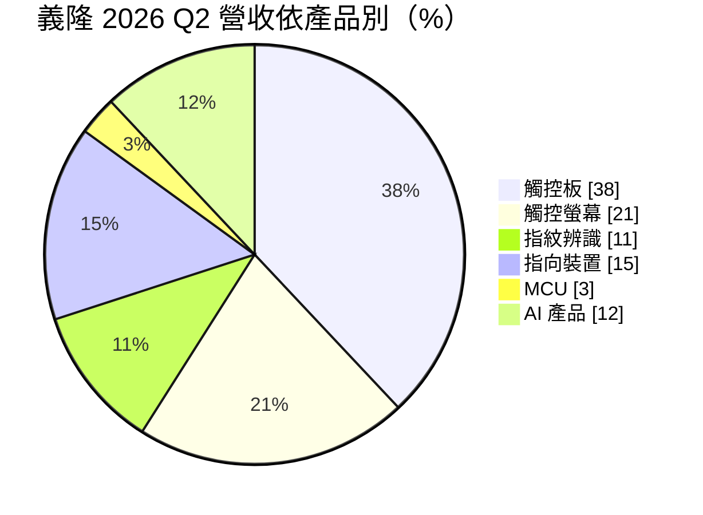
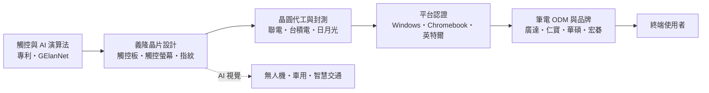
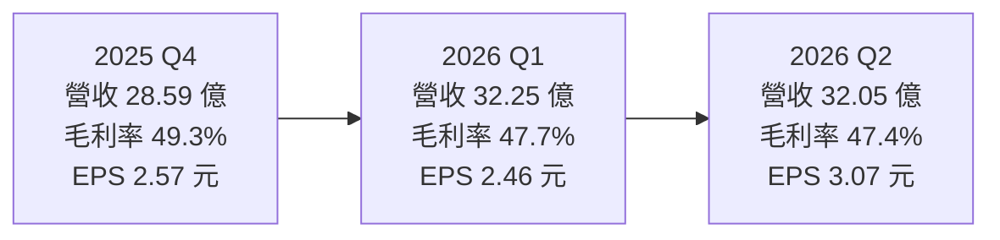
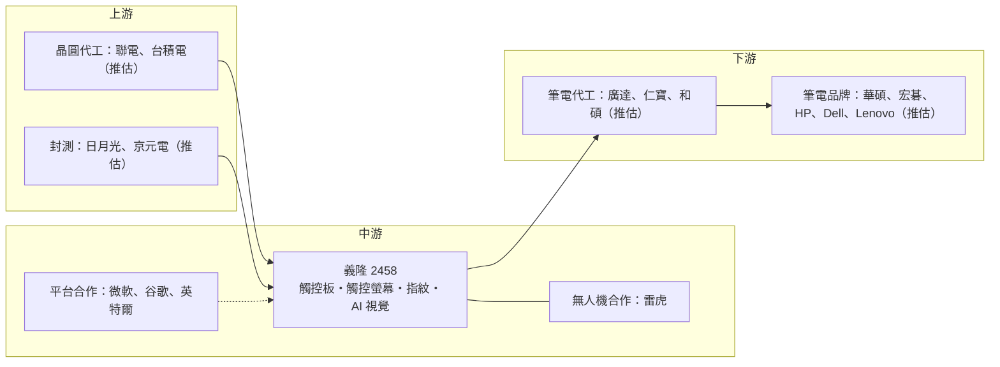

# 2458 義隆

> 上市｜[[產業索引-半導體業|半導體業]]｜上市（櫃）日期 2001/09/17

# 第一章：企業模式與商業藍圖

> [!info] 撰寫說明
> 本文由 Claude 依公開資料整理，架構比照 [[2330台積電]] 的四章研究，資料截至 2026-10-07。財務數字來源：富果研究義隆法說會筆記（2026 年 3 月、6 月、8 月）、工商時報 2026 年 6 月報導、大聯大產品線介紹；產業描述為整理性內容，尚未逐條比對原始文件。#待校對

在評估單一個股的長期投資價值時，首要步驟是拆解企業的底層獲利邏輯。本章針對義隆電子（股票代號：2458，以下簡稱義隆）的商業模式進行定性分析，說明一家以筆電觸控板起家的 IC 設計公司，如何靠平台認證與演算法維持高毛利，以及它正在培養的邊緣 AI 第二曲線。

## 一、核心定位：筆電人機介面的關鍵晶片供應商

義隆成立於 1994 年 5 月，總部位於新竹科學園區，是台灣的 [[Fabless]] IC 設計公司。義隆早期以消費性 [[MCU]] 起家，之後切入[[電容式觸控]]技術，逐步成為筆記型電腦觸控板（TouchPad）、觸控螢幕晶片與指紋辨識晶片的主要供應商。義隆自己不擁有晶圓廠，晶片委託[[晶圓代工]]廠生產、封測廠封裝，再銷售給筆電品牌、ODM 與模組廠。

義隆的產品幾乎都和「人與電腦互動的方式」有關：

* 手指在觸控板上滑動、多指手勢操作。
* 在觸控螢幕上點選、用觸控筆書寫。
* 用指紋登入作業系統。
* 商用筆電鍵盤中央的指點桿。

這類晶片單價不高，但每台筆電都需要，而且必須和作業系統、晶片平台、整機機構高度配合，因此義隆和微軟、谷歌、英特爾以及各大 PC 品牌維持長期合作。

## 二、終端應用／產品板塊：觸控七成、AI 快速竄升

依 2026 年第二季法說會資料，義隆的產品結構如下：

* **觸控類產品（70%）：** 觸控板晶片約 38%、觸控螢幕晶片約 21%、指紋辨識約 11%。觸控板是義隆最核心的業務，產品包括支援雙向觸覺回饋的高階[[觸覺觸控板]]（Haptic Touchpad），以及搭配 Copilot 鍵的指紋模組。
* **非觸控類產品（18%）：** 指向裝置約 15%、MCU 約 3%。
* **AI 產品（12%）：** 包括車用、智慧交通與無人機視覺等[[邊緣 AI]] 方案，2025 年第四季占比約 6%、2026 年第一季約 7%、第二季升至 12%，是成長最快的產品線。

義隆的邊緣 AI 視覺方案以自有演算法「GElanNet」為核心，公司表示這是與中央研究院合作約 8 年的成果，所需運算量約只有開源模型的三分之一，主打無人機與自駕車應用，並與 [[8033雷虎]] 合作拓展無人機市場。

## 三、資本轉化邏輯：輕資產加上平台認證

* **認證先行：** 觸控板晶片必須先通過作業系統與晶片平台的規範，才能進入品牌的機種設計；一旦導入，整個產品週期內通常不換供應商。
* **輕資產：** 義隆不需晶圓廠，主要資產是現金、存貨與研發人力，資本支出以研發大樓為主。
* **營運據點：** 義隆以新竹科學園區為營運總部，研發與營運集中在台灣。公司投資 17.09 億元興建竹北 AI 大樓，作為 AI 與新事業的研發基地。在新技術方面，義隆投資美國合作夥伴 PETA 發展[[矽光子]]，目標在 2027 年推出樣品。

## 四、企業長期藍圖：守住 PC、培養邊緣 AI

* **鞏固 PC 人機介面：** [[AI PC]] 帶動觸控板升級（大尺寸、觸覺回饋）、指紋與 Copilot 鍵整合，以及觸控筆應用，義隆希望藉此提高每台筆電的晶片價值。公司與微軟 Surface 產品線有策略合作。
* **非中國供應鏈：** 公司在法說會中將自身定位為「非中國供應鏈」的人機介面方案，地緣政治下品牌客戶分散供應來源，對義隆有利。
* **邊緣 AI 第二曲線：** 以 AI 視覺切入車用、智慧交通與無人機，降低對 PC 單一市場的依賴。
* **成本轉嫁：** 面對晶圓代工、封測、DRAM 與被動元件成本上升，公司在 2026 年第二季向客戶提出漲價計畫，預計 7 月 1 日起生效。

# 第二章：護城河深度與競爭優勢

在長期價值投資中，「護城河」指企業抵禦競爭、維持超額利潤的保護機制。本章分析義隆的護城河構成、全球主要競爭對手，以及這些優勢在整合趨勢與國產替代下能守住多少。

## 一、義隆護城河的核心組成要素

義隆的護城河屬於「窄到中等」，由四個要素組成：

* **1. 平台認證與系統整合：** 觸控板與指紋晶片必須通過微軟 Windows 的精準式觸控板（[[Precision Touchpad]]）規範、谷歌 Chromebook 平台與英特爾平台的驗證，並與筆電機構、韌體深度整合。品牌一旦在某個機種導入，整個產品週期內通常不換供應商。
* **2. 長期客戶關係：** 與微軟、谷歌、英特爾及主要 PC 品牌的長期合作，使義隆能提早參與新平台定義，例如 AI PC 的 Copilot 鍵與觸覺觸控板。
* **3. 專利與演算法累積：** 義隆在電容式觸控與多指手勢上累積大量專利，過去也曾與國際大廠進行專利訴訟，演算法與韌體經驗是新進者難以快速追上的部分。
* **4. 高毛利結構：** 2025 年[[毛利率]] 48.6%，在台灣 IC 設計公司中屬於高水準，代表產品具一定定價能力。

## 二、全球主要競爭對手格局

| 對手 | 重疊產品 | 對義隆的威脅 |
|---|---|---|
| Synaptics（新思國際） | 觸控板、指紋辨識 | 國際老牌對手，長期分食筆電觸控板市場 |
| [[3034聯詠]]、[[6962奕力-KY]]、[[3545敦泰]] | 觸控與驅動整合 TDDI | 整合方案壓縮獨立觸控螢幕晶片空間 |
| [[6462神盾]]、Goodix（匯頂科技） | 指紋辨識 | 匯頂在手機與部分筆電指紋市場具規模優勢 |
| [[2401凌陽]]、[[6202盛群]] | 消費性 MCU | MCU 價格競爭 |
| [[2454聯發科]]、[[NVDA輝達]]與 AI 新創 | 邊緣 AI 運算平台 | 邊緣 AI 視覺領域競爭者眾多 |

## 三、優勢轉化：哪些市場守得住、哪些守不住

* **守得住：** 筆電觸控板與指點桿是長期累積的利基市場，認證門檻與客戶關係穩固，2025 年營收雖年減 2.9%，毛利率仍維持在近 49%。
* **守不住：** 觸控螢幕晶片面臨 [[TDDI]] 整合趨勢，若驅動與觸控整合成單一晶片，獨立觸控晶片空間會縮小；指紋辨識在中國品牌機種可能被本土供應商取代。
* **觀察重點：** 一是 AI 產品占比能否從 12% 持續提升並具備獲利；二是 7 月漲價後毛利率是否守住 47% 以上；三是 AI PC 換機潮對觸覺觸控板與指紋模組的滲透率帶動。

# 第三章：財務體質與盈利規模

資料日期：2026-10-07。數字取自富果研究法說會筆記與工商時報報導，表格是撰寫當時的快照；最新月營收、毛利率、累計 EPS 由自動排程寫在本筆記的屬性欄位（月營收、毛利率、累計EPS 等）。#待校對

財務報表是檢驗護城河是否真實存在的最終標準。本章用三率、ROE、資本支出與資本報酬，檢視義隆在成本上漲與 PC 週期中的獲利品質。

## 一、獲利能力的基石：三率

| 項目 | 2025 全年 | 2025 Q4 | 2026 Q1 | 2026 Q2 |
|---|---|---|---|---|
| 營收（新台幣） | 123.26 億 | 28.59 億 | 32.25 億 | 32.05 億 |
| [[毛利率]] | 48.6% | 49.3% | 47.7% | 47.4% |
| [[營業利益率]] | 24.2% | 23.1% | 約 24.1% | 約 21.7% |
| EPS（元） | 8.53 | 2.57 | 2.46 | 3.07 |

* **[[毛利率]]：** 連續兩季小幅下滑，主因晶圓與封測成本上升；7 月起的漲價計畫是否能讓毛利率止穩，是下半年的重點。
* **[[營業利益率]]：** 第二季營業利益率下滑，公司說明主要來自光罩支出與研發費用增加，以及晶圓與封測成本上升。
* **業外的影響：** 2025 年稅後淨利 24.42 億元、年減 10.7%，主因業外損失約 1.32 億元；營業利益 29.82 億元。2026 年第二季營收持平，但 EPS 升至 3.07 元，業外收益貢獻較大。由於過去四季業外收益占稅前淨利 17.3%，依規定公司未提供 2026 年第三季財測。
* **淡季不淡：** 2026 年第一季營收季增 12.8%、年增 3.4%。

## 二、[[ROE]]：資本效率

義隆屬於輕資產的 IC 設計公司，主要資產是現金、存貨與研發人力，沒有晶圓廠的折舊負擔，在 2025 年 EPS 8.53 元、毛利率近 49% 的條件下，股東權益報酬率長期維持在 20% 以上的水準（推估，精確數字未查得）。

## 三、資本支出與自由現金流

* **[[CapEx]]：** 主要是辦公與研發大樓，最大一筆是 17.09 億元的竹北 AI 大樓，屬於階段性支出，完成後資本支出會回到低水準。
* **[[自由現金流]]：** 營業現金流以本業獲利為主，足以支應研發、竹北大樓與股利。另有矽光子等策略投資，金額未查得。
* **股利：** 富果研究整理，董事會決議配發每股現金股利 4.35 元，預計於 2026 年第二季發放。義隆過去以高配發率著稱，但 4.35 元是否為全年度總額或僅為部分期間配發，本文未逐一查證。

## 四、[[ROIC]] 與 [[WACC]]：價值創造利差

IC 設計公司的投入資本小，義隆在營業利益率二成以上的情況下，ROIC 推估明顯高於 WACC（具體數值未查得）。需要觀察的是新事業：竹北 AI 大樓、AI 視覺與矽光子投資屬於前期投入，若 AI 產品營收規模無法持續放大，這部分資本的報酬率會拉低整體 ROIC。

# 第四章：總體風險與地緣政治

任何企業都無法脫離宏觀環境獨立存在。本章分析義隆未來必須面對的地緣政治、產業週期、營運與技術風險。

## 一、地緣政治風險

* **非中國供應鏈的機會：** 美中科技對抗下，美系品牌與平台商傾向選擇非中國的人機介面晶片供應商，義隆把這點當成接單優勢。
* **中國市場的競爭：** 反過來，中國品牌筆電與手機傾向採用本土觸控與指紋晶片，義隆在中國品牌的市占可能受壓。
* **美國關稅：** 義隆晶片多數在亞洲組裝進筆電，再銷往美國；美國對筆電或半導體加徵關稅時，會透過品牌出貨量間接影響義隆。

## 二、產業週期與市場結構風險

* **PC 週期：** 觸控與指向裝置合計約占營收八成以上，高度依賴筆電出貨。PC 市場在換機潮後若進入衰退，營收會明顯下滑。
* **[[長鞭效應]]：** 筆電品牌在漲價預期下提前備貨，若終端需求轉弱，庫存調整會沿供應鏈放大到晶片端。
* **匯率：** 營收多以美元計價，新台幣升值會壓縮營收與毛利，並產生匯兌損失。

## 三、營運環境的隱性風險

* **成本上升：** 2026 年晶圓代工、封測、DRAM、CPU 與被動元件價格上漲，一方面墊高義隆的生產成本，另一方面可能壓抑筆電終端售價與需求。
* **客戶集中：** 前幾大 PC 品牌與平台合作夥伴占營收比重高，任一大客戶轉單影響明顯。
* **漲價轉嫁風險：** 7 月起的漲價若客戶不接受或轉向競爭對手，可能造成市占流失。
* **新事業不確定性：** AI 視覺、無人機與矽光子都屬於早期投資，回收時間與規模不確定。

## 四、科技演進風險

人機介面可能出現新的互動方式，例如語音、手勢辨識或更大面積的觸控螢幕取代傳統觸控板；若筆電設計改採整合式觸控鍵盤或由 SoC 直接整合觸控運算，獨立觸控晶片的價值可能被稀釋。義隆需要持續把演算法優勢延伸到新的介面形式，邊緣 AI 視覺則是它分散技術風險的主要布局。

# 專有名詞解析

## 半導體

- **[[Fabless]]**：無晶圓廠的 IC 設計公司，只負責設計晶片，生產交給晶圓代工廠，代表廠商為聯發科、瑞昱。
- **[[晶圓代工]]**：替其他公司製造晶片、本身不賣自有品牌晶片的商業模式，代表廠商為台積電、聯電。
- **[[MCU]]**：微控制器，把處理器、記憶體與輸入輸出介面整合在一顆晶片，用於家電、工業與車用控制。
- **[[電容式觸控]]**：偵測手指接觸造成的微小電容變化來判斷位置的觸控技術，是筆電觸控板與手機螢幕的主流。
- **[[TDDI]]**：觸控與顯示驅動整合晶片，把觸控感測與面板驅動做在同一顆晶片，可降低成本與厚度。
- **[[矽光子]]**：在矽晶片上製作光學元件，以光取代電傳輸資料，可降低 AI 資料中心的傳輸耗電。

## 應用

- **[[AI PC]]**：內建 NPU 等 AI 運算單元、可在本機執行 AI 功能的個人電腦，通常配有 Copilot 鍵。
- **[[邊緣 AI]]**：在終端裝置本身執行 AI 運算，而不是把資料傳回雲端處理，可降低延遲與保護隱私。

## 金融

- **[[長鞭效應]]**：終端需求的小幅變動，沿供應鏈往上游傳遞時被逐級放大，造成上游庫存與訂單劇烈波動。
- **[[自由現金流]]**：營業活動現金流減去資本支出，代表企業可自由用於配息、還債或併購的現金。

## 產業

- **[[觸覺觸控板]]**：以壓力感測與震動馬達模擬按壓手感的觸控板，不需實體按鍵，整片面積都能點按。
- **[[Precision Touchpad]]**：微軟制定的 Windows 精準式觸控板規範，觸控板須通過認證才能使用系統內建的手勢功能。

# 核心供應鏈

## 1. 上游：晶圓代工與封測
- 晶圓代工：[[2303聯電]]、[[2330台積電]]（推估）
- 封裝測試：[[3711日月光投控]]、[[2449京元電子]]（推估）

## 2. 中游：義隆本身與合作夥伴
- 作業系統與平台合作：[[MSFT微軟]]、[[GOOGL谷歌]]、[[INTC英特爾]]
- 無人機合作：[[8033雷虎]]
- 矽光子投資：美國 PETA

## 3. 下游：筆電品牌與 ODM
- 筆電品牌：[[2357華碩]]、[[2353宏碁]]，以及 HP、Dell、Lenovo（推估）
- 筆電代工：[[2382廣達]]、[[2324仁寶]]、[[4938和碩]]（推估）

## 4. 同業與競爭者
- 觸控板與指紋：Synaptics、Goodix、[[6462神盾]]
- 觸控螢幕晶片：[[3034聯詠]]、[[3545敦泰]]
- MCU：[[6202盛群]]、[[2401凌陽]]

## 最新新聞
<!-- news:start -->
<!-- news:end -->

## 相關連結
- [公開資訊觀測站](https://mopsov.twse.com.tw/mops/web/t05st03?step=1&firstin=1&co_id=2458)
- [Goodinfo](https://goodinfo.tw/tw/StockDetail.asp?STOCK_ID=2458)
- [Yahoo 股市](https://tw.stock.yahoo.com/quote/2458)
- [鉅亨網新聞](https://www.cnyes.com/twstock/2458/news)
