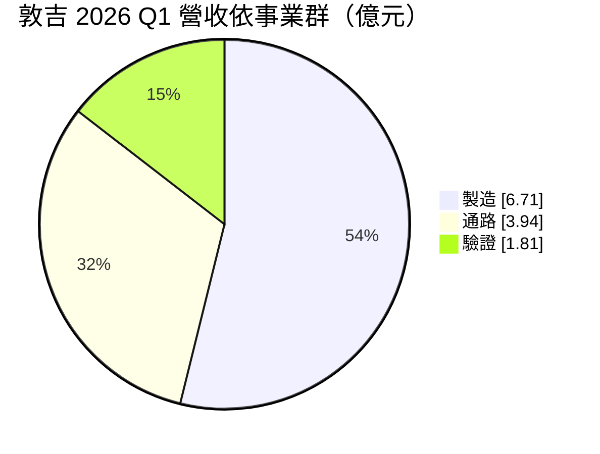
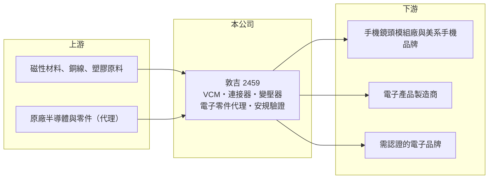

# 2459 敦吉

> 上市｜[[產業索引-其他電子業|其他電子業]]｜上市（櫃）日期 2001/09/17

# 第一章：企業模式與商業藍圖

> [!info] 撰寫說明
> 精簡版，由 Claude 依公開資料整理，架構比照 [[2330台積電]]，資料截至 2026-10-07。來源：富果研究敦吉 2026 年 5 月法說會筆記、nStock 敦吉公司簡介。#待校對

敦吉科技成立於 1980 年，同時經營零組件製造、電子零件代理與安規驗證三種業務，其中製造事業貢獻大部分獲利。

- **核心業務：** 製造[[VCM]]（音圈馬達）、連接器、變壓器與成型繞線產品，並代理半導體、[[LCM]] 與電子零件，另提供產品[[安規驗證]]服務。
- **營收結構：** 2026 年第一季營收 12.46 億元，其中製造事業群 6.71 億元、通路事業群 3.94 億元、驗證事業群 1.81 億元；產品面 VCM 約占 30.53%、連接器 7.45%、變壓器 6.13%。
- **營運據點：** 以台灣為總部，VCM 業務的美系客戶占比超過六到七成，中國市場則聚焦高階產品。
- **長期方向：** 提高高毛利產品比重，擴充驗證服務（已取得歐盟 RED 認證），並導入 AI 於內部管理與智慧製造。

# 第二章：護城河深度與競爭優勢

敦吉以製造、通路、驗證三種業務互補，製造事業是獲利核心。

- **競爭優勢：** 製造事業群貢獻約 77% 獲利，VCM 打入美系客戶供應鏈；驗證服務與代理通路則提供較穩定的收入，降低單一產品波動。
- **主要對手：** VCM 有日系 TDK、Alps 與中國廠商；電子零件代理有 [[3702大聯大]]、[[3036文曄]] 等大型通路商。
- **觀察重點：** VCM 在美系手機新機的出貨量，以及高毛利產品比重能否讓[[毛利率]]維持在 30% 上下。

# 第三章：財務體質與盈利規模

資料日期：2026-10-07，以下數字是撰寫當時的快照；最新月營收、毛利率、累計 EPS 由自動排程寫在本筆記的屬性欄位（月營收、毛利率、累計EPS 等）。#待校對

敦吉 2026 年獲利率明顯改善，上半年 EPS 已超過 3 元。

- **營收規模：** 2025 年全年營收 49.08 億元；2026 年 1 至 8 月累計 35.46 億元、年增 11.74%，8 月營收 4.52 億元。
- **獲利：** 2026 年第一季 EPS 1.41 元、毛利率 30.51%、營業利益率 14.95%；第二季 EPS 1.77 元、毛利率 29.6%、營業利益率 16.49%。2025 年第四季 EPS 為 0.78 元。
- **財務特色：** 2025 年度配發現金股利 4.2 元，近五年平均現金股利 3.9 元，屬高配息公司。

# 第四章：總體風險與地緣政治

敦吉的風險集中在手機鏡頭零件的客戶集中度與消費電子景氣。

- **產業週期：** VCM 需求隨智慧型手機出貨與新機規格變動，旺季集中在下半年，季度營收波動明顯。
- **營運風險：** VCM 美系客戶占比高，單一客戶訂單或規格改變影響大；代理業務毛利低，營收比重變動會影響整體毛利率。
- **其他風險：** 生產與銷售涉及中國市場，面臨美中貿易與關稅風險；外銷以美元計價，新台幣升值壓縮獲利。

# 專有名詞解析

## 應用

- **[[LCM]]**：液晶顯示模組，把面板、驅動 IC 與背光組成可直接裝進產品的顯示元件。

## 金融

- **[[毛利率]]**：毛利除以營收，反映產品本身的定價能力與成本控制。

## 產業

- **[[VCM]]**：音圈馬達，推動鏡頭前後移動以完成自動對焦的小型馬達。
- **[[安規驗證]]**：依各國電氣安全、電磁相容與無線電法規測試產品，取得認證後才能上市銷售。

# 核心供應鏈

- 上游：磁性材料、銅線、塑膠原料供應商，以及代理的半導體與零件原廠（推估）
- 下游／客戶：手機鏡頭模組廠與美系手機品牌、電子製造商、需要產品認證的品牌商
- 同業：VCM 有 TDK、Alps；電子零件代理有 [[3702大聯大]]、[[3036文曄]]

## 最新新聞
<!-- news:start -->
<!-- news:end -->

## 相關連結
- [公開資訊觀測站](https://mopsov.twse.com.tw/mops/web/t05st03?step=1&firstin=1&co_id=2459)
- [Goodinfo](https://goodinfo.tw/tw/StockDetail.asp?STOCK_ID=2459)
- [Yahoo 股市](https://tw.stock.yahoo.com/quote/2459)
- [鉅亨網新聞](https://www.cnyes.com/twstock/2459/news)
