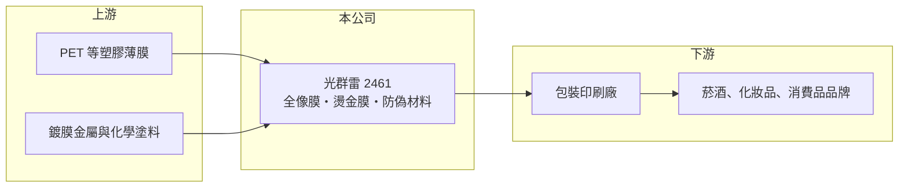

# 2461 光群雷

> 上市｜[[產業索引-其他電子業|其他電子業]]｜上市（櫃）日期 2001/09/17

# 第一章：企業模式與商業藍圖

> [!info] 撰寫說明
> 精簡版，由 Claude 依公開資料整理，架構比照 [[2330台積電]]，資料截至 2026-10-07。來源：nStock 光群雷公司簡介、MoneyLink 光群雷基本資料、winvest 營收快訊。公開資料有限，產品營收比重公司未申報。#待校對

光群雷射科技成立於 1988 年、總部位於新竹科學園區，以 K Laser 品牌經營全像術相關的包裝材料與光電產品。

- **核心業務：** 研發、生產與銷售[[全像膜]]等全像包裝材料，應用於防偽標籤、[[燙金膜]]與菸酒、化妝品等精美包裝，另經營光學儀器進出口貿易。
- **營收結構：** 公司自 2013 年起改為自願申報業務比重，本次未查到最新的產品別比重。
- **營運據點：** 總部與研發在新竹科學園區，海外生產據點本次未查到（推估在中國等亞洲地區設有工廠）。
- **長期方向：** 以全像與光學鍍膜技術延伸到高附加價值的防偽與裝飾材料，提升獲利率。

# 第二章：護城河深度與競爭優勢

全像材料的門檻在於光學母版與鍍膜技術，但下游包裝市場價格競爭激烈。

- **競爭優勢：** 長年累積的全像母版製作、壓印與鍍膜技術，能提供防偽圖樣客製化，適合品牌商的[[防偽包裝]]需求。
- **主要對手：** 國內外全像膜與包材廠，包含中國大量中小型燙金與鐳射膜廠商（推估，具體名單未查到）。
- **觀察重點：** 營收規模穩定在每年 50 億元上下，但營業利益率僅個位數，觀察毛利率能否在 27% 以上持續改善。

# 第三章：財務體質與盈利規模

資料日期：2026-10-07，以下數字是撰寫當時的快照；最新月營收、毛利率、累計 EPS 由自動排程寫在本筆記的屬性欄位（月營收、毛利率、累計EPS 等）。#待校對

光群雷營收規模不小，但獲利率偏低，股東權益報酬率低。

- **營收規模：** 2025 年全年營收 52.63 億元；2026 年 1 至 8 月累計 35.78 億元、年增 2.03%，6 月營收 4.49 億元、8 月 4.27 億元。
- **獲利：** 2026 年第二季 EPS 0.34 元（季增 13.33%），[[毛利率]] 27.51%、營業利益率 7.53%、淨利率 3.82%，單季 [[ROE]] 1.18%。
- **財務特色：** 近五年平均現金股利 1.04 元，平均殖利率約 4.95%，但配息隨獲利起伏，並非每年穩定。

# 第四章：總體風險與地緣政治

光群雷的風險在於包裝材料的價格競爭與原物料成本。

- **產業週期：** 全像包裝需求與菸酒、化妝品、消費品的景氣相關，終端消費轉弱時品牌商會縮減包裝預算。
- **營運風險：** 營業利益率低，原料或價格小幅變動就會明顯影響獲利；產品同質化時容易陷入價格戰。
- **其他風險：** 主要原料為塑膠薄膜與化學品，受石油價格影響；若有海外生產與外銷，也面臨匯率與當地政策風險。

# 專有名詞解析

## 金融

- **[[毛利率]]**：毛利除以營收，反映產品本身的定價能力與成本控制。
- **[[ROE]]**：股東權益報酬率，稅後淨利除以股東權益，衡量公司運用股東資金的效率。

## 產業

- **[[全像膜]]**：以雷射干涉在薄膜上壓印出立體或彩虹光學圖樣的材料，用於防偽標籤與裝飾包裝。
- **[[燙金膜]]**：以加熱加壓把金屬或全像圖層轉印到紙張、塑膠表面的薄膜材料。
- **[[防偽包裝]]**：在包裝上加入不易複製的全像、油墨或編碼圖樣，用來辨識真品、打擊仿冒。

# 核心供應鏈

- 上游：PET 等塑膠薄膜、鍍膜金屬與塗料供應商（推估）
- 下游／客戶：包裝印刷廠，以及菸酒、化妝品與消費品品牌（推估）
- 同業：國內外全像膜、燙金膜與防偽材料廠（本次未查到具體名單）

## 最新新聞
<!-- news:start -->
<!-- news:end -->

## 相關連結
- [公開資訊觀測站](https://mopsov.twse.com.tw/mops/web/t05st03?step=1&firstin=1&co_id=2461)
- [Goodinfo](https://goodinfo.tw/tw/StockDetail.asp?STOCK_ID=2461)
- [Yahoo 股市](https://tw.stock.yahoo.com/quote/2461)
- [鉅亨網新聞](https://www.cnyes.com/twstock/2461/news)
