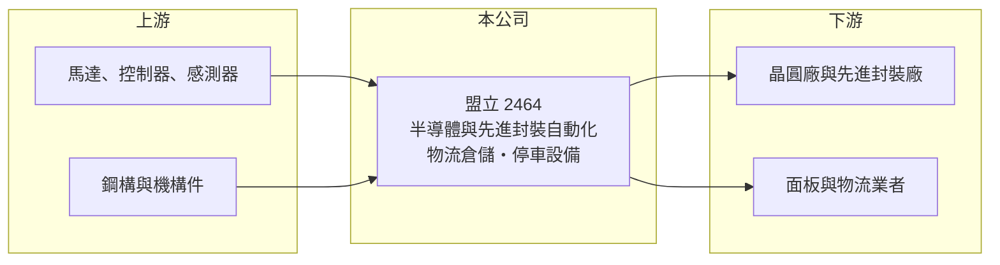

# 2464 盟立

> 上市｜[[產業索引-其他電子業|其他電子業]]｜上市（櫃）日期 2001/09/17

# 第一章：企業模式與商業藍圖

> [!info] 撰寫說明
> 精簡版，由 Claude 依公開資料整理，架構比照 [[2330台積電]]，資料截至 2026-10-07。來源：nStock 盟立公司簡介、自由時報財經焦點股報導、鉅亨號產業研究文章。產品營收比重本次未查到。#待校對

盟立自動化 1989 年成立於新竹科學園區，原以面板與物流自動化為主，近三年轉型為半導體先進封裝自動化的系統供應商。

- **核心業務：** 設計與生產[[工廠自動化]]設備與系統，包含晶圓搬運、載具管理、產線銜接與物流倉儲系統，另有停車場設備與醫療器材自動化。
- **營收結構：** 本次未查到具體比重；公司表示半導體[[先進封裝]]（例如 [[CoWoS]] 相關產線）已成「重中之重」，半導體相關營收占比持續拉升，傳統面板與物流比重下降。
- **營運據點：** 總部與工廠位於新竹科學園區，公司表示四座廠積極擴產以因應主要客戶需求。
- **長期方向：** 以先進封裝自動化為主軸，並轉投資人形機器人與鈣鈦礦太陽能等新技術，公司預期未來三到五年營運成長。

# 第二章：護城河深度與競爭優勢

盟立的護城河來自系統整合與客戶驗證，一旦進入供應鏈不易被替換。

- **競爭優勢：** 提供依客戶製程設計的整體自動化方案而非單一設備，能隨封裝形式演進調整，打入先進封裝產線後具轉換成本。
- **主要對手：** 半導體自動搬運系統有日本大福、村田機械等國際大廠；國內自動化設備同業包含 [[6438迅得]] 等（推估）。
- **觀察重點：** 在手訂單約百億元的認列速度，以及年產能由數百台擴增到數千台後的交機與毛利表現。

# 第三章：財務體質與盈利規模

資料日期：2026-10-07，以下數字是撰寫當時的快照；最新月營收、毛利率、累計 EPS 由自動排程寫在本筆記的屬性欄位（月營收、毛利率、累計EPS 等）。#待校對

盟立 2025 年虧損，2026 年隨先進封裝訂單認列轉為獲利。

- **營收規模：** 2025 年全年營收 66.81 億元；2026 年 1 至 8 月累計 58.25 億元、年增 31.44%，8 月營收 9.28 億元、年增 73.71%。
- **獲利：** 2025 年全年 EPS -0.84 元，部分專案因美國關稅政策延後認列；2026 年第一季 EPS 0.24 元，第二季 EPS 0.42 元、[[毛利率]] 22.17%、營業利益率 6.08%。
- **財務特色：** 設備業以專案驗收認列營收，季度獲利波動大；近五年平均現金股利 1.06 元，2024 年度配發 0.35 元。

# 第四章：總體風險與地緣政治

盟立的風險集中在半導體資本支出循環與專案執行。

- **產業週期：** 營收成長高度依賴晶圓廠與封測廠的先進封裝擴產，若 AI 晶片需求降溫、客戶放緩資本支出，訂單會明顯減少。
- **營運風險：** 主要客戶集中，專案驗收時間影響認列；擴產期間人力與交機進度若跟不上，可能壓縮毛利。
- **其他風險：** 2025 年已出現美國關稅造成專案延後的情況；人形機器人與鈣鈦礦等轉投資仍在早期，回收時間不確定。

# 專有名詞解析

## 半導體

- **[[先進封裝]]**：把多顆晶片以中介層、混合鍵合等方式高密度整合的封裝技術，例如 CoWoS、SoIC。
- **[[CoWoS]]**：台積電的 2.5D 先進封裝技術，把 GPU 與 HBM 並排放在矽中介層上，是 AI 晶片的主流封裝。

## 金融

- **[[毛利率]]**：毛利除以營收，反映產品本身的定價能力與成本控制。

## 產業

- **[[工廠自動化]]**：以自動搬運、倉儲、機械手臂與控制系統取代人工，讓產線物料自動流動與管理。

# 核心供應鏈

- 上游：馬達、控制器、感測器與機構件供應商（推估）
- 下游／客戶：晶圓廠與先進封裝廠，市場普遍推估包含 [[2330台積電]] 的 CoWoS 相關產線；面板與物流業者
- 同業：大福、村田機械、[[6438迅得]]（推估）

## 最新新聞
<!-- news:start -->
<!-- news:end -->

## 相關連結
- [公開資訊觀測站](https://mopsov.twse.com.tw/mops/web/t05st03?step=1&firstin=1&co_id=2464)
- [Goodinfo](https://goodinfo.tw/tw/StockDetail.asp?STOCK_ID=2464)
- [Yahoo 股市](https://tw.stock.yahoo.com/quote/2464)
- [鉅亨網新聞](https://www.cnyes.com/twstock/2464/news)
