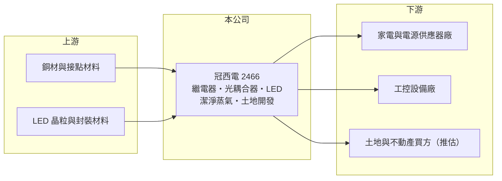

# 2466 冠西電

> 上市｜[[產業索引-光電業|光電業]]｜上市（櫃）日期 2001/09/17

# 第一章：企業模式與商業藍圖

> [!info] 撰寫說明
> 精簡版，由 Claude 依公開資料整理，架構比照 [[2330台積電]]，資料截至 2026-10-07。來源：nstock.tw 冠西電公司概況、winvest.tw 營收快訊。公開資料有限，營收比重未查到。#待校對

冠西電是老牌電子元件廠，本業做[[繼電器]]與[[光耦合器]]，另有潔淨蒸氣與土地開發兩條非電子業務。

- **核心業務：** 冠西電成立於 1981 年，2001 年上市，登記業務為繼電器、光耦合器及 LED 的製造與銷售，另經營潔淨蒸氣與土地開發事業。
- **營收結構：** 本次未查到各業務營收比重；2026 年月營收在 4,600 萬元到 2.25 億元之間大幅跳動，推估與土地開發案認列時點有關，待以財報確認。
- **營運據點：** 生產與營運據點本次未查到，本文不推測。
- **長期方向：** 電子元件本業屬成熟產業，土地開發等[[資產活化]]項目可能成為獲利波動的主要來源，需追蹤公司公告。

# 第二章：護城河深度與競爭優勢

冠西電在元件市場規模不大，護城河有限，觀察重點在非本業項目。

- **競爭優勢：** 繼電器與光耦合器屬工控、電源與家電常用的基礎元件，長年經營累積客戶基礎；但公開資料看不出明確的規模或技術優勢。
- **主要對手：** 光耦合器可對照 [[2393億光]]、[[2301光寶科]]，繼電器則有日本與中國的大型元件廠（推估）。
- **觀察重點：** 月營收大幅跳動的原因、土地開發與潔淨蒸氣的貢獻，以及股價相對近一年均價明顯偏高背後的市場題材是否有實際營收支撐。

# 第三章：財務體質與盈利規模

資料日期：2026-10-07，以下數字是撰寫當時的快照；最新月營收、毛利率、累計 EPS 由自動排程寫在本筆記的屬性欄位（月營收、毛利率、累計EPS 等）。#待校對

冠西電營收規模約 10 億元，本業獲利微薄。

- **營收規模：** 2025 年全年營收 9.47 億元；2026 年 1 至 8 月累計 8.14 億元，其中 8 月營收 2.25 億元、年增 59.92%，5 月僅 4,598.2 萬元、年減 33.25%。
- **獲利：** 2026 年第二季 EPS 0.02 元，[[毛利率]] 29.77%，[[營業利益率]] 1.25%，淨利率 1.44%。
- **財務特色：** 資本額約 17.35 億元；近五年平均現金股利僅 0.04 元，2025 年第四季未配息。

# 第四章：總體風險與地緣政治

冠西電的風險在於本業獲利薄、營收受非經常項目左右。

- **產業週期：** 繼電器與光耦合器需求跟著工控、家電與電源產品景氣起伏。
- **營運風險：** 營收與獲利若主要來自土地開發，各期認列時點不固定，單季數字難以代表長期實力。
- **其他風險：** 股價大幅高於近一年均價，評價波動風險高；另有銅等原物料價格與匯率影響。

# 專有名詞解析

## 應用

- **[[繼電器]]**：以小電流控制線圈、帶動接點開關大電流迴路的元件，常用於家電、工控與汽車。
- **[[光耦合器]]**：以光傳遞訊號、讓兩端電路電氣隔離的元件，常用於電源供應器、工控與電動車。

## 產業

- **[[資產活化]]**：把閒置土地或廠房拿來開發、出租或出售，以取得本業以外的收益。

# 核心供應鏈

- 上游：銅材與接點材料、LED 晶粒與封裝材料供應商
- 下游／客戶：家電、電源供應器與工控設備廠（推估）
- 同業：[[2393億光]]、[[2301光寶科]]

## 最新新聞
<!-- news:start -->
<!-- news:end -->

## 相關連結
- [公開資訊觀測站](https://mopsov.twse.com.tw/mops/web/t05st03?step=1&firstin=1&co_id=2466)
- [Goodinfo](https://goodinfo.tw/tw/StockDetail.asp?STOCK_ID=2466)
- [Yahoo 股市](https://tw.stock.yahoo.com/quote/2466)
- [鉅亨網新聞](https://www.cnyes.com/twstock/2466/news)
