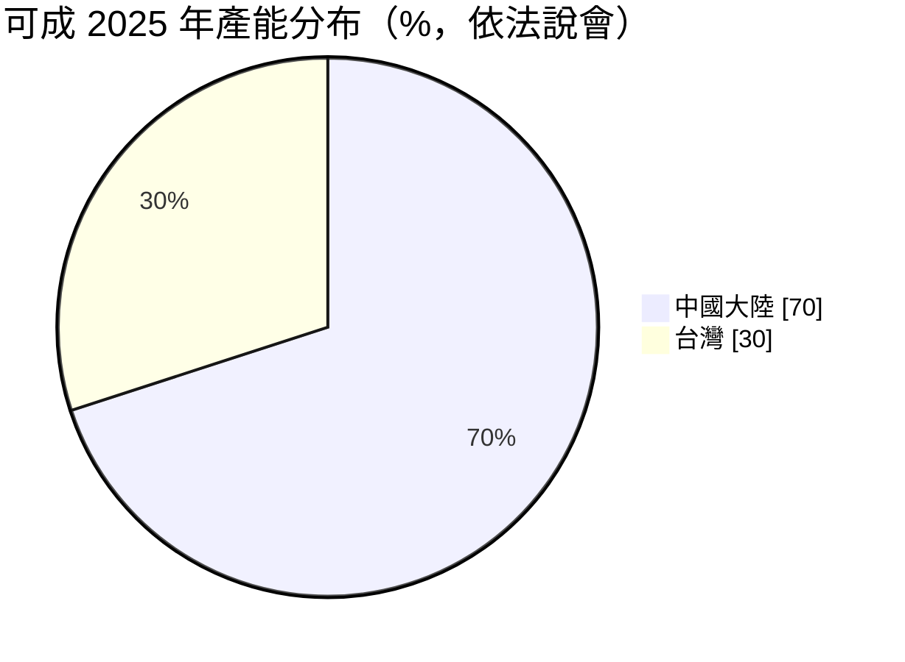
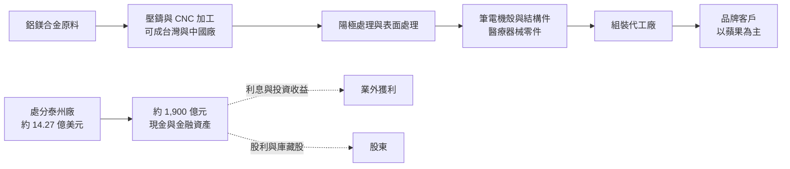
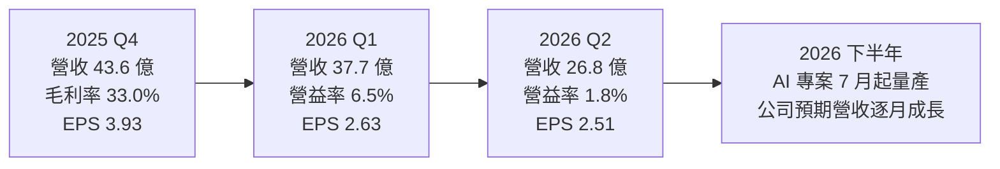
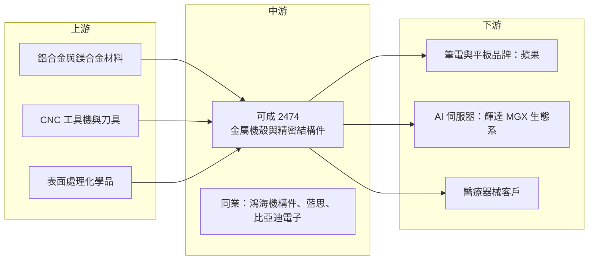

# 2474 可成

> 上市｜[[產業索引-其他電子業|其他電子業]]｜上市（櫃）日期 2001/09/17

# 第一章：企業模式與商業藍圖

> [!info] 撰寫說明
> 本文由 Claude 依公開資料整理，架構比照 [[2330台積電]] 的四章研究，資料截至 2026-10-07。財務數字來源：優分析（2025 年報與 2026 上半年財報報導）、永豐金證券豐雲學堂法說會整理、工商時報旺得富 2026 年 5 月報導、理財周刊 2026 年 9 月報導、富果研究 2025 年 8 月法說會整理、科技新報 2020 年資產處分報導、Yahoo 股市公司基本資料；產業描述為整理性內容，尚未逐條比對原始文件。#待校對

在評估單一個股的長期投資價值時，首要步驟是拆解企業的底層獲利邏輯。本章針對可成科技（股票代號：2474，以下簡稱可成）的商業模式進行定性分析，說明這家曾經的蘋果金屬機殼龍頭，在出售中國手機機殼廠之後，如何用龐大現金與精密加工能力重新尋找成長方向。

## 一、核心定位：金屬機殼大廠轉型中的「現金型公司」

可成成立於 1984 年 11 月 23 日，2001 年上市，董事長為洪水樹。公司以鋁、鎂合金的[[壓鑄]]、[[CNC]] 精密加工與[[陽極處理]]起家，長年是筆電、平板與手機金屬機殼的主要供應商，主要客戶為 [[AAPL蘋果]]。

2020 年 8 月，可成宣布把江蘇泰州的兩家子公司以約 14.27 億美元（約新台幣 419 億元）全數出售給中國玻璃蓋板廠藍思科技，等於退出 iPhone 機殼業務。這個決策讓可成的樣貌徹底改變：

* **本業縮小、現金暴增：** 依理財周刊 2026 年 9 月整理，可成股東權益約 1,416 億元，每股淨值約 256.83 元，現金與金融資產合計約 1,900 億元，遠大於年營收的規模。
* **獲利來源雙軌：** 本業以筆電與醫療等結構件為主，業外則有大量利息與投資收益。2026 年上半年利息收入就達 34.24 億元，超過同期稅後淨利的一半。

因此，評估可成必須同時看兩件事：本業能否轉型成功，以及資本如何配置（股利、[[庫藏股]]與投資）。

## 二、終端應用板塊：筆電為主、醫療與 AI 為新引擎

可成未揭露完整的產品別營收比重。依富果研究整理 2025 年 8 月法說會，醫療事業在 2025 年上半年約占營收 10% 至 12%，其餘主要為筆電與消費性電子機殼。公司揭露的產能分布如下（為產能而非營收）：

* **筆電與平板機殼：** 營收主體，客戶以蘋果為主。2026 年因記憶體等電子零件短缺，客戶拉貨減少，公司預期筆電業務衰退雙位數。
* **醫療：** 骨科與微創手術器械的精密零件，已取得 [[ISO 13485]]、台灣 TFDA 與美國 [[FDA]] 認證。
* **AI 伺服器：** 2026 年 5 月加入 [[NVDA輝達]] [[MGX]] 生態系，部分 AI 專案自 7 月起量產。
* **其他：** 半導體設備精密結構件、航太零件與 AI PC 機構件，屬長期選項，AI PC 產品預計 2027 年第二季量產。

## 三、資本轉化邏輯：精密加工產能加上金融資產

* **台灣研發、中國量產：** 台灣產能約三成，負責新領域研發與初期生產；中國產能約七成，負責成熟產品量產，並推進泰國、越南的海外布局。
* **本業槓桿反轉：** CNC 與壓鑄設備屬高固定成本，營收下滑時營業利益率跌幅會被放大。2026 年第二季營收年減 47.3%，營益率從前一年約 17% 降到 1.8%。
* **資本回饋：** 公司目標現金股利配發率至少 60%，且自 2020 年起已執行多次庫藏股，累計買回金額逾 270 億元。

## 四、企業長期藍圖：多元化的第二曲線

* **醫療器械：** 骨科與微創手術器械認證陸續到位，是轉型最早出現營收貢獻的領域。
* **AI 伺服器：** 加入 MGX 生態系，承接伺服器機構件，2027 年第一季起還有新專案陸續量產。
* **半導體與航太：** 利用高精度加工能力承接半導體設備結構件，屬長期選項。
* **資本配置：** 2026 年再啟動大規模庫藏股並註銷，約占已發行股數 6.12%，代表公司把「縮小股本」也當成提升每股價值的手段。

# 第二章：護城河深度與競爭優勢

在長期價值投資中，「護城河」指企業抵禦競爭、維持超額利潤的保護機制。本章分析可成的護城河構成、全球主要競爭對手，以及轉型期間這些優勢能守住多少。

## 一、可成護城河的核心組成要素

可成目前的護城河偏窄，主要由下列要素組成：

* **1. 金屬精密加工的製程經驗：** 一體成型機殼需要壓鑄、大量 CNC 與高品質陽極處理，可成長期服務對外觀要求最嚴格的客戶，累積的良率與品質管理能力是進入醫療、半導體設備等高門檻領域的基礎。
* **2. 資產負債表：** 約 1,900 億元的現金與金融資產讓可成能承受轉型期的虧損與試錯，也能用股利與庫藏股支撐股價，這是同業少見的財務護城河。
* **3. 認證門檻：** 醫療器械需要 ISO 13485 與 FDA 等認證，取得後轉換成本高。

## 二、全球主要競爭對手格局

| 對手 | 定位 | 對可成的威脅 |
|---|---|---|
| 鴻海集團（[[2317鴻海]]）機殼事業 | 全球最大電子代工，自有機構件能力 | 垂直整合，可直接承接品牌機殼 |
| 藍思科技 | 中國玻璃蓋板與金屬機殼廠，買下可成泰州廠 | 掌握原 iPhone 機殼產能 |
| 比亞迪電子 | 中國大型結構件與組裝廠 | 規模大，積極爭取蘋果與安卓訂單 |
| 長盈精密等中國結構件廠 | 中國中高階金屬件 | 以價格與在地供應鏈競爭 |
| [[2059川湖]]、[[3013晟銘電]] 等伺服器機構件廠 | 伺服器滑軌與機殼 | 在 AI 伺服器機構件新領域已先卡位 |

## 三、優勢轉化：哪些市場守得住、哪些守不住

* **守得住：** 高外觀要求的筆電機殼、需要認證的醫療器械零件。這些領域重視品質與良率，價格不是唯一考量。
* **守不住：** 一般消費性機殼的價格競爭，以及蘋果要求供應鏈在中國之外分散生產時的訂單分配。
* **觀察重點：** AI 伺服器專案能否放量、醫療營收占比能否持續上升，以及本業營益率能否回到雙位數。若轉型進度慢，可成會越來越像一家以利息收入為主的控股公司。

# 第三章：財務體質與盈利規模

資料日期：2026-10-07。數字取自優分析、豐雲學堂與工商時報旺得富的財報報導，表格是撰寫當時的快照；最新月營收、毛利率、累計 EPS 由自動排程寫在本筆記的屬性欄位（月營收、毛利率、累計EPS 等）。#待校對

財務報表是檢驗護城河是否真實存在的最終標準。本章用三率、ROE、現金流與資本報酬，檢視可成在轉型期的獲利品質。

## 一、獲利能力的基石：三率

| 項目 | 2025 全年 | 2025 Q4 | 2026 Q1 | 2026 Q2 |
|---|---|---|---|---|
| 營收（新台幣） | 186.59 億 | 43.63 億 | 37.74 億 | 26.81 億 |
| [[毛利率]] | 31.6% | 33.0% | 28.8% | 28.9% |
| [[營業利益率]] | 16.6% | 未查得 | 6.5% | 1.8% |
| 稅後淨利 | 71.47 億 | 23.78 億 | 14.84 億 | 13.55 億 |
| EPS（元） | 11.33 | 3.93 | 2.63 | 2.51 |

* **[[毛利率]]：** 維持在 28% 至 33%，代表加工能力與報價仍在，問題主要出在營收規模。
* **[[營業利益率]]：** 營收大減時固定成本無法攤提，2026 年第二季營業利益僅約 0.48 億元。
* **業外收益：** 第二季業外淨收益 16.19 億元，遠大於營業利益；稅後淨利與 EPS 主要由利息與投資收益支撐。評估本業時應以營業利益為準。2025 年 EPS 較 2024 年的 19.40 元下滑，主要原因也是匯兌由正轉負與利息收益縮減。

## 二、[[ROE]]：資本效率

以 2025 年稅後淨利 71.47 億元、股東權益約 1,416 億元粗估，ROE 約 5%（推估）。低 ROE 的主因是權益中大部分是現金與金融資產，報酬率接近利率水準。庫藏股註銷與高配息是公司提升 ROE 的主要方式。

## 三、資本支出與自由現金流

* **[[CapEx]]：** 公司未揭露明確預算（未查得），新事業以既有廠房轉換與台灣研發線為主。
* **[[自由現金流]]：** 利息收入穩定，加上資本支出有限，現金流足以支應股利。2025 年上下半年現金股利合計約 10.27 元。

## 四、[[ROIC]] 與 [[WACC]]：價值創造利差

若只看營業資產，可成本業在 2026 年營益率掉到個位數，ROIC 推估已低於資金成本；大量現金的報酬又僅接近市場利率。因此可成目前的價值主要來自淨資產與資本回饋，而非本業創造的超額報酬。新事業能否把 ROIC 拉回 WACC 之上，是轉型成敗的財務指標。

# 第四章：總體風險與地緣政治

任何企業都無法脫離宏觀環境獨立存在。本章分析可成未來必須面對的地緣政治、產業週期與營運風險。

## 一、地緣政治風險

* **中國產能比重高：** 約七成產能在中國，美國對中國製品的關稅與蘋果分散供應鏈的要求，可能讓可成需要加速東南亞布局。
* **兩岸資金與資產：** 大量金融資產的配置地點與幣別，也受匯率與資本管制影響。

## 二、產業週期與市場結構風險

* **客戶集中：** 營收高度依賴蘋果筆電與平板，產品週期與換機需求直接決定營收。
* **零組件短缺：** 2026 年記憶體等電子零件短缺，導致客戶減少拉貨，可成並非缺料的一方卻被連帶影響，屬於典型的[[長鞭效應]]。
* **PC 市場：** AI PC 與商用換機若不如預期，筆電機殼需求難以回升。

## 三、營運環境的隱性風險

* **轉型執行：** 醫療、AI 伺服器與半導體設備都需要新客戶認證與新製程，量產時程可能延後。
* **利率下行：** 業外利息收入占獲利比重高，若全球利率下降，EPS 會明顯縮水。
* **MSCI 調整：** 2026 年 5 月可成從 MSCI 全球標準指數移到小型股指數，反映市值與流動性下降，可能影響外資持股。

## 四、科技或法規演進風險

* **材料與設計改變：** 筆電若改採不同材料或結構，金屬一體成型機殼的需求可能下降。
* **醫療法規：** 醫療器械受各國法規嚴格規範，認證、品質系統稽核與產品責任都是新的營運風險。

# 專有名詞解析

## 應用

- **[[MGX]]**：輝達推出的模組化伺服器參考架構，讓伺服器廠能用標準化機構件快速組合 AI 伺服器。
- **[[ISO 13485]]**：醫療器材品質管理系統的國際標準，是供應醫療零件的基本門檻。
- **[[FDA]]**：美國食品藥物管理局，負責醫療器材的上市審查與製造廠登錄。

## 金融

- **[[庫藏股]]**：公司買回自家股票，可註銷以減少股本、提高每股盈餘與每股淨值。
- **[[CapEx]]**：資本支出，企業購買土地、廠房與設備的支出。
- **[[自由現金流]]**：營業活動現金流減去資本支出，代表企業可自由用於配息、還債或併購的現金。
- **[[長鞭效應]]**：終端需求的小幅變動，沿供應鏈往上游傳遞時被逐級放大，造成上游庫存與訂單劇烈波動。

## 產業

- **[[CNC]]**：電腦數值控制加工，以程式控制刀具切削金屬，是金屬一體成型機殼的核心製程。
- **[[壓鑄]]**：把熔融金屬高壓注入模具成型的製程，常用於鋁鎂合金機殼的粗胚。
- **[[陽極處理]]**：在鋁表面以電解形成氧化膜，可上色並提升耐磨與抗腐蝕，是金屬機殼外觀的關鍵。

# 核心供應鏈

## 1. 上游：材料與設備
- 鋁鎂合金材料與 CNC 設備：供應商未揭露

## 2. 中游：機構件同業
- [[2317鴻海]]、藍思科技、比亞迪電子
- 伺服器機構件：[[2059川湖]]、[[3013晟銘電]]

## 3. 下游：客戶
- 筆電與平板：[[AAPL蘋果]]
- AI 伺服器生態系：[[NVDA輝達]]
- 醫療器械：國際醫療客戶，名稱未揭露

## 最新新聞
<!-- news:start（自動產生，請勿手動編輯此範圍） -->
- 2026-10-06 📰 媒體 17:38｜可成Q3營收季增逾1成 AI產品擴大出貨營收逐步增｜[鉅亨網](https://news.cnyes.com/news/id/6622759)
- 2026-10-06 🏛️ 重訊 16:57｜公告本公司買回庫藏股期間屆滿執行情形｜[觀測站](https://mops.twse.com.tw/mops/#/web/t05st01)
- 2026-10-06 🏛️ 重訊 16:55｜公告本公司買回股份金額達新台幣三億元以上｜[觀測站](https://mops.twse.com.tw/mops/#/web/t05st01)

完整紀錄：[[2474可成 新聞]]
<!-- news:end -->

## 相關連結
- [公開資訊觀測站](https://mopsov.twse.com.tw/mops/web/t05st03?step=1&firstin=1&co_id=2474)
- [Goodinfo](https://goodinfo.tw/tw/StockDetail.asp?STOCK_ID=2474)
- [Yahoo 股市](https://tw.stock.yahoo.com/quote/2474)
- [鉅亨網新聞](https://www.cnyes.com/twstock/2474/news)
