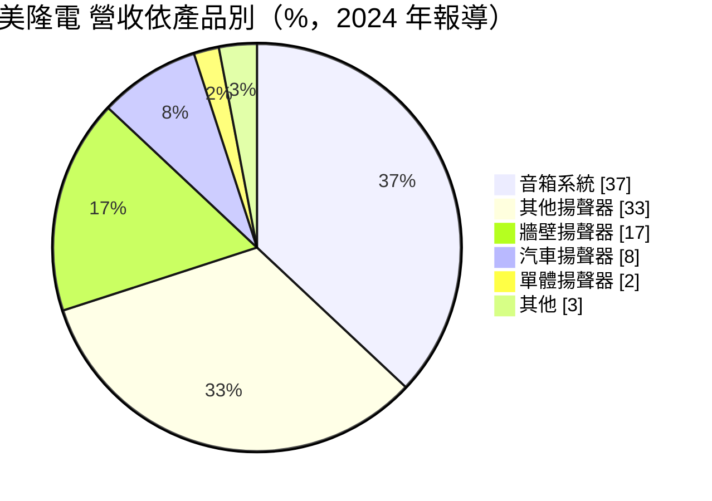
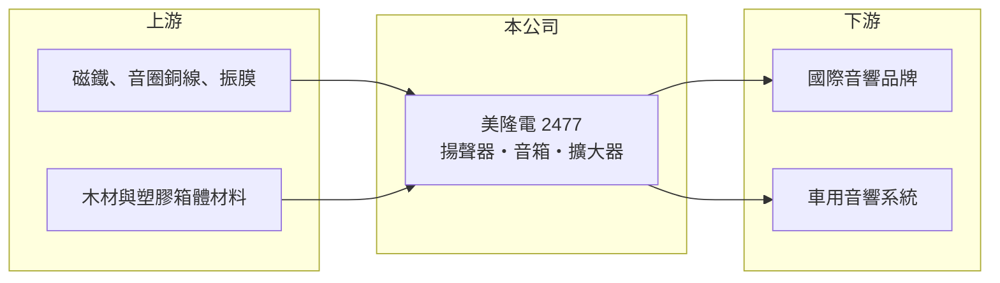

# 2477 美隆電

> 上市｜[[產業索引-其他電子業|其他電子業]]｜上市（櫃）日期 2001/09/17

# 第一章：企業模式與商業藍圖

> [!info] 撰寫說明
> 精簡版，由 Claude 依公開資料整理，架構比照 [[2330台積電]]，資料截至 2026-10-07。來源：nStock 美隆電公司簡介、理財周刊 2024 年 10 月報導。產品比重取自 2024 年報導，可能已變動。#待校對

美隆電器 1973 年設立，是台灣主要的音箱與[[揚聲器]]製造商之一，產品涵蓋家用、車用、多媒體與專業影音。

- **核心業務：** 設計研發與製造揚聲器、音箱、擴大器與分音器等影音產品，以代工與設計製造方式供應國際音響品牌（推估）。
- **營收結構：** 依 2024 年報導，音箱系統約 37%、其他揚聲器 33%、牆壁揚聲器 17%、汽車揚聲器 8%、單體揚聲器 2%。
- **營運據點：** 在印尼設廠，第一階段已完成建設並取得認證，屬分散生產的布局；其他生產據點本次未查到。
- **長期方向：** 發展智慧與 AI 相關影音產品，包括網路影音設備、車用音響、便攜式與智慧互動音響。

# 第二章：護城河深度與競爭優勢

美隆電的競爭力在於聲學設計經驗與多元產品線，但代工議價能力有限。

- **競爭優勢：** 五十年聲學設計與製造經驗，產品線涵蓋家用、牆壁嵌入式、車用與專業音響，可滿足品牌客戶多種需求。
- **主要對手：** 國內聲學同業 [[2439美律]]、[[2415錩新]]、[[2488漢平]]、[[5225東科-KY]]，以及中國揚聲器大廠。
- **觀察重點：** 2026 年第二季營業利益率僅 0.36%，觀察下半年營收回升後獲利能否改善，以及印尼廠的量產貢獻。

# 第三章：財務體質與盈利規模

資料日期：2026-10-07，以下數字是撰寫當時的快照；最新月營收、毛利率、累計 EPS 由自動排程寫在本筆記的屬性欄位（月營收、毛利率、累計EPS 等）。#待校對

美隆電 2025 年獲利不錯，但 2026 年第二季獲利明顯轉弱。

- **營收規模：** 2025 年全年營收 24.99 億元；2026 年 8 月營收 3.52 億元，月增 16.27%、年增 27.95%。
- **獲利：** 2025 年全年 EPS 1.68 元；2026 年第二季 EPS 0.06 元，[[毛利率]] 21.21%、營業利益率 0.36%。
- **財務特色：** 2025 年度配發現金股利 1.4 元，近五年平均現金股利 1.1 元，平均殖利率約 4.89%。

# 第四章：總體風險與地緣政治

美隆電的風險來自消費性音響需求與代工的低毛利結構。

- **產業週期：** 家用與多媒體音響屬消費性產品，終端需求與品牌庫存調整會透過[[長鞭效應]]放大到代工廠。
- **營運風險：** 毛利率約兩成，營業費用比重稍增就可能侵蝕本業獲利；新廠初期稼動率不足也會壓抑利潤。
- **其他風險：** 外銷為主，面臨美國關稅與新台幣匯率風險；銅、磁鐵、紙盆等原物料價格波動影響成本。

# 專有名詞解析

## 金融

- **[[毛利率]]**：毛利除以營收，反映產品本身的定價能力與成本控制。
- **[[長鞭效應]]**：終端需求的小幅變動，沿供應鏈往上游傳遞時被逐級放大，造成上游庫存與訂單劇烈波動。

## 產業

- **[[揚聲器]]**：把電訊號轉成聲音的元件，俗稱喇叭，由磁鐵、音圈與振膜組成。
- **[[ODM]]**：原廠委託設計製造，代工廠負責產品設計與生產，再以客戶品牌出貨。

# 核心供應鏈

- 上游：磁鐵、銅線、振膜與箱體材料供應商（推估）
- 下游／客戶：國際家用與專業音響品牌，以 [[ODM]] 或 OEM 方式出貨，另有車用音響客戶（具體客戶未查到）
- 同業：[[2439美律]]、[[2415錩新]]、[[2488漢平]]、[[5225東科-KY]]

## 最新新聞
<!-- news:start（自動產生，請勿手動編輯此範圍） -->
- 2026-10-07 📰 媒體 17:50｜營收速報 - 美隆電(2477)9月營收3.24億元年增率高達52.93％｜[鉅亨網](https://news.cnyes.com/news/id/6623795)

完整紀錄：[[2477美隆電 新聞]]
<!-- news:end -->

## 相關連結
- [公開資訊觀測站](https://mopsov.twse.com.tw/mops/web/t05st03?step=1&firstin=1&co_id=2477)
- [Goodinfo](https://goodinfo.tw/tw/StockDetail.asp?STOCK_ID=2477)
- [Yahoo 股市](https://tw.stock.yahoo.com/quote/2477)
- [鉅亨網新聞](https://www.cnyes.com/twstock/2477/news)
