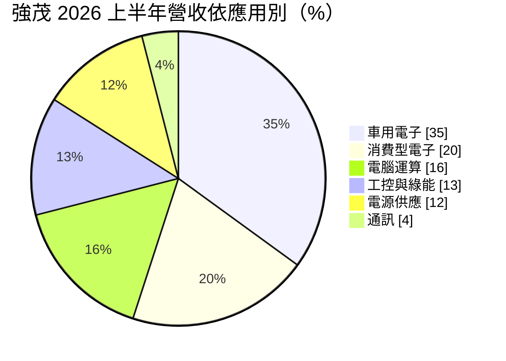
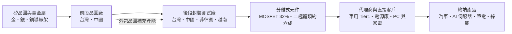
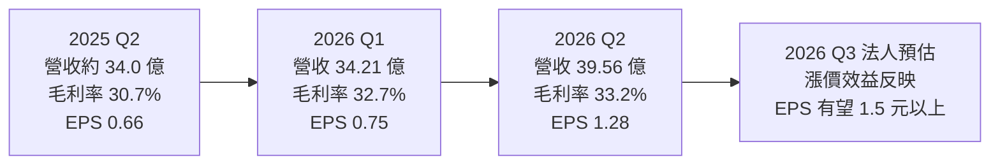
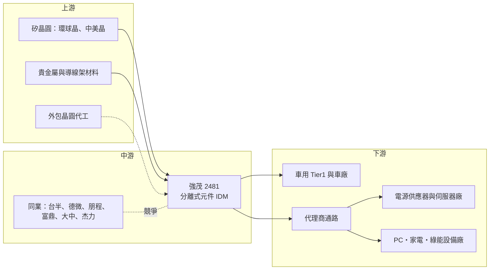

# 2481 強茂

> 上市｜[[產業索引-半導體業|半導體業]]｜上市（櫃）日期 2001/09/17

# 第一章：企業模式與商業藍圖

> [!info] 撰寫說明
> 本文由 Claude 依公開資料整理，架構比照 [[2330台積電]] 的四章研究，資料截至 2026-10-07。財務數字來源：強茂 2026 年 8 月法說會簡報（公司官網）、富果研究 2026 年 5 月法說整理、旺得富（中時）2025 年財報報導、經濟日報、工商時報、永豐金證券豐雲學堂、優分析、強茂 40 週年專訪（公司官網）；產業描述為整理性內容，尚未逐條比對原始文件。#待校對

在評估單一個股的長期投資價值時，首要步驟是拆解企業的底層獲利邏輯。本章針對強茂股份有限公司（股票代號：2481，以下簡稱強茂）的商業模式進行定性分析，說明一家以二極體起家的小訊號與功率元件廠，如何透過 [[IDM]] 模式、車用認證與 AI 伺服器電源產品，從「標準品供應商」逐步走向高附加價值的功率半導體廠。

## 一、核心定位：全球分離式元件 IDM

強茂由方家兄弟於 1986 年在高雄創立。依公司 40 週年專訪，創辦人原本經營磚窯業，後來看準「所有電子產品最終都需要高效率的電源元件」而轉進半導體。強茂自我定位為「全球領先的 IDM [[分離式元件]]半導體製造商」，從晶片設計、晶圓製造、封裝、測試到銷售都在集團內完成。

[[分離式元件]]指的是單一功能的電晶體或二極體，而不是把上億個電晶體整合在一起的系統晶片。這類產品單價低、品項多，一家客戶的一塊電路板上可能用到數十顆不同規格的二極體與 [[MOSFET]]，因此競爭關鍵不在於最先進的製程，而在於：

* **品項廣度與交期：** 能否一次提供客戶需要的各種電壓、電流、封裝規格，並穩定交貨。
* **成本與品質：** 同一規格的元件在不同供應商之間替代性高，誰的良率高、成本低、品質穩定，誰就能拿到量。
* **認證門檻：** 車用與工控客戶需要長時間的可靠度驗證，一旦導入就不輕易更換供應商。

依 40 週年專訪，2024 年車用供應鏈吃緊時，強茂在多家客戶端由「第二供應商」升格為「主要供應商」，這是公司近年營運體質改變的關鍵轉折。

## 二、終端應用與產品板塊：車用三成五、MOSFET 三成二

依 2026 年 8 月法說會簡報，2026 年上半年的營收結構如下：

* **車用電子（35%）：** 上半年車用營收年增 40%，是成長最快的板塊。產品用於車燈、車身控制、引擎室電源與電動車的充電系統，需要通過 AEC-Q101 等[[車規驗證]]。
* **消費型電子與電腦運算（合計 36%）：** 筆電、PC、家電與周邊裝置的電源保護與整流元件，屬於量大、價格競爭激烈的市場。
* **工控與綠能、電源供應（合計 25%）：** 工業設備、太陽能逆變器與伺服器電源。依富果研究整理的 2026 年第一季法說，AI 相關應用約占營收 11%，2025 年約 7%。

依產品別，2026 年上半年 [[MOSFET]] 占 32%、[[蕭特基二極體]]（Schottky）占 23%、其他整流器占 12%、[[TVS]] 占 9%、ESD 保護二極體占 7%、齊納二極體與開關二極體各占 6%、雙載子電晶體（BJT）占 4%、[[SiC]] 占 1%。MOSFET 已經是單一最大產品線，代表強茂正從傳統二極體往附加價值較高的功率電晶體移動。

依地區別，台灣占 37%、中國大陸 35%、歐洲與韓國各 8%、美國 5%、東南亞 4%、日本 3%。

## 三、資本轉化邏輯：前段晶圓加後段封裝的一條龍

* **IDM 一條龍與彈性外包：** 依優分析整理，強茂採「設計、晶圓、封裝到模組皆由自有與外包產能靈活搭配」的模式。法說會簡報揭露集團有 4 座晶圓廠與 5 座封裝廠；據點涵蓋新竹、高雄，中國的徐州、蘇州、無錫、深圳，以及南韓、美國、日本、越南、菲律賓與印度等地的營運或銷售據點。
* **海外產能分散：** 菲律賓封裝線於 2023 年啟動並已量產；2025 年取得越南 TOREX 半導體 95% 股權，增加東南亞產能。這讓強茂可以對歐美客戶提供「非中國生產」的選項。
* **獲利來源：** 分離式元件的毛利率主要取決於產品組合與[[產能利用率]]。強茂近年減少低毛利標準品，提高車用與 MOSFET 比重，2025 年[[毛利率]]因此較前一年提升 2.57 個百分點。

## 四、企業長期藍圖：AI 伺服器電源、車用與第三代半導體

* **AI 伺服器電源：** 依經濟日報報導，AI 伺服器電源架構由 12V 升級到 [[48V電源架構]]，帶動 MOSFET 規格由 30V 往 100V 提升，單價隨之上升。強茂也把 100V MOSFET 與馬達驅動 IC 推向伺服器散熱風扇與水冷泵浦。外資券商預估 2026 年 AI 伺服器相關營收約 15 億元，占營收 9% 至 10%。
* **車用持續升級：** 車用是強茂營收占比最高的板塊，電動車的車載充電器與 DC-DC 轉換器需要更多高壓功率元件。
* **[[SiC]] 產品線：** 依 40 週年專訪，強茂在 2024 年已推出第三代 SiC 產品組合，目前營收占比僅約 1%，屬長期布局。
* **漲價與轉單：** 依永豐金證券整理，強茂受惠國際 IDM 調漲價格、貴金屬成本上升，以及荷蘭安世半導體（Nexperia）出口受限後的轉單，2026 年上半年與客戶調整售價，效益自第三季起逐步反映。

# 第二章：護城河深度與競爭優勢

在長期價值投資中，「護城河」指企業抵禦競爭、維持超額利潤的保護機制。本章分析強茂在分離式元件這個高度分散、價格敏感市場中的競爭優勢，以及它面對國際大廠與中國同業時能守住多少。

## 一、強茂護城河的核心組成要素

分離式元件的技術門檻不高，強茂的護城河屬於「窄護城河」，主要由以下三個要素組成：

* **1. 車規認證的轉換成本：** 車用元件需要通過 AEC-Q101 可靠度測試與車廠的生產件核准程序，驗證時間往往一到兩年以上。2024 年強茂在多家車用客戶由第二供應商升為主要供應商，代表已累積足夠的品質紀錄，這是新進者短期內難以複製的。
* **2. IDM 產能與成本控制：** 自有晶圓與封裝產能讓強茂能掌握交期與品質，在缺貨時優先保障客戶；同時可以把低階產品外包，保留自有產能給高毛利的車用與 MOSFET。
* **3. 品項廣度與全球據點：** 二極體、MOSFET、TVS、ESD、BJT 與 SiC 一次到位，加上台灣、中國、東南亞多地生產，可以滿足客戶「一站購足」與「中國以外生產」的雙重需求。

## 二、全球主要競爭對手格局

| 對手 | 定位 | 對強茂的威脅 |
|---|---|---|
| Vishay、onsemi、Infineon、Rohm | 國際功率半導體 IDM，產品線完整 | 掌握高階車用與工控大客戶，技術領先 |
| Nexperia（安世半導體） | 中資持有的歐洲分離式元件大廠 | 規模大、價格具競爭力；2025 年出口受限後反而釋出轉單 |
| Diodes | 美國分離式元件與類比 IC 廠 | 在消費與電腦市場與強茂高度重疊 |
| 中國本土廠（如揚杰科技等） | 政策扶植、低價擴產 | 壓低標準型二極體報價，搶中國客戶 |
| [[5425台半]]、[[3675德微]]、[[8255朋程]] | 台灣分離式元件與車用整流元件廠 | 在二極體與車用市場直接競爭 |
| [[8261富鼎]]、[[6435大中]]、[[5299杰力]] | 台灣 MOSFET 設計公司 | 在 PC 與伺服器電源 MOSFET 搶單 |

## 三、優勢轉化：哪些市場守得住、哪些守不住

* **守得住：** 已通過驗證的車用料號、AI 伺服器電源的中高壓 MOSFET，以及需要非中國產能的歐美客戶。這些訂單看重品質紀錄與供貨穩定，價格敏感度較低。
* **守不住：** 消費性電子與 PC 的標準型整流二極體。這類產品規格公開、替代性高，中國同業擴產後報價容易被壓低；中國大陸營收仍占 35%，也面臨「國產替代」的壓力。
* **觀察重點：** 一是 MOSFET 與 AI 相關營收占比能否持續提高；二是 2026 年上半年的調漲價格能否在下半年完整反映到毛利率；三是安世半導體事件後轉單是否轉為長期合約，而不是短期的缺貨訂單。

# 第三章：財務體質與盈利規模

資料日期：2026-10-07。數字取自強茂 2026 年 8 月法說會簡報與財經媒體整理，表格是撰寫當時的快照；最新月營收、毛利率、累計 EPS 由自動排程寫在本筆記的屬性欄位（月營收、毛利率、累計EPS 等）。#待校對

財務報表是檢驗護城河是否真實存在的最終標準。本章用三率、ROE、現金流與資本報酬，檢視強茂在產品升級與漲價循環中的獲利品質。

## 一、獲利能力的基石：三率

| 項目 | 2025 全年 | 2025 Q2 | 2026 Q1 | 2026 Q2 |
|---|---|---|---|---|
| 營收（新台幣） | 130.94 億 | 約 34.0 億（推算） | 34.21 億 | 39.56 億 |
| [[毛利率]] | 31.26% | 30.7% | 32.7% | 33.2% |
| [[營業利益率]] | 約 8.5%（推算） | 10.1% | 6.5% | 11.7% |
| [[淨利率]] | 約 9.1%（推算） | 9.0% | 9.0% | 13.3% |
| EPS（元） | 3.12 | 0.66 | 0.75 | 1.28 |

註：2025 年營業利益 11.11 億元、歸屬母公司淨利 11.92 億元，營業利益率與淨利率依此推算。2026 年上半年營收 73.77 億元、年增 14.0%，稅後淨利 8.36 億元、年增 35.5%，EPS 2.03 元。

* **[[毛利率]]：** 2025 年毛利 40.93 億元、年增 13.79%，增幅遠高於營收的 4.45%，說明產品組合調整確實有效。2026 年第二季毛利率 33.2%，是近幾季高點。
* **[[營業利益率]]：** 2026 年第一季只有 6.5%，第二季回升到 11.7%。分離式元件廠的費用相對固定，營收一旦放大，營業利益率擴張速度會明顯快於毛利率，這就是[[營運槓桿]]。
* **業外與匯率：** 依工商時報報導，第二季原本法人預估 EPS 可達 1.4 元以上，因匯兌損失而下修。強茂海外營收比重高，新台幣匯率波動會直接影響業外損益。

## 二、[[ROE]]：資本效率

2025 年歸屬母公司淨利 11.92 億元、EPS 3.12 元。2026 年上半年 EPS 已達 2.03 元，經濟日報引述法人預估全年 EPS 約 4.79 元，若實現，ROE 將較 2025 年明顯提升（推估，具體 ROE 數值未查得）。法說會簡報顯示 2026 年第二季負債占資產比為 47.8%，財務槓桿屬中等，ROE 的提升主要來自獲利率改善，而不是加大槓桿。

## 三、資本支出與自由現金流

* **[[CapEx]]：** 法說會簡報未揭露具體資本支出金額。近年的擴產重點在菲律賓封裝線、越南 TOREX 併購，以及晶圓產能與高功率產品研發。
* **營運現金流：** 2026 年第二季營業活動現金流 6.24 億元。平均收現日數 104 天、平均銷貨日數 99 天，營運資金週轉期偏長，這是分離式元件廠品項多、需經代理商銷售的特性。
* **[[自由現金流]]與股利：** 2025 年度配發現金股利 1.8 元，以 EPS 3.12 元計，盈餘配發率約 58%（推算）。在擴產與併購期間，強茂維持約六成的配發水準。

## 四、[[ROIC]] 與 [[WACC]]：價值創造利差

分離式元件廠的投入資本包含晶圓廠、封裝廠與大量存貨與應收帳款。強茂在 2023 至 2024 年消費性電子庫存調整期間獲利偏弱，ROIC 與 WACC 的利差較小；2025 年起獲利年增近三成，2026 年又受惠漲價與 AI 產品，利差可望擴大（推估，具體數值未查得）。觀察重點在於新併購的越南廠與菲律賓廠能否盡快提高利用率，否則新增資本會稀釋整體報酬率。

# 第四章：總體風險與地緣政治

任何企業都無法脫離宏觀環境獨立存在。本章分析強茂未來必須面對的地緣政治、產業週期與營運風險。

## 一、地緣政治風險

* **中國市場的雙面刃：** 中國大陸營收占 35%，徐州等地也是主要生產基地。中國推動功率元件國產替代，當地客戶可能優先採用本土供應商；另一方面，美國對中國製元件課徵關稅，也讓強茂必須持續把對美出貨轉到台灣與東南亞生產。
* **轉單機會的不確定性：** 安世半導體事件帶來的轉單屬於地緣政治引發的短期供需錯置，若事件緩解，部分訂單可能回流原供應商。
* **台灣與東南亞布局：** 菲律賓與越南產能提供分散效果，但新廠的管理、良率與當地政策都需要時間磨合。

## 二、產業週期與市場結構風險

* **[[庫存調整]]週期：** 分離式元件多經代理商銷售，終端需求轉弱時，代理商與客戶同時去化庫存，[[長鞭效應]]會放大對強茂的衝擊。2023 至 2024 年的消費性電子庫存調整就是例子。
* **價格競爭：** 標準型二極體同質性高，中國同業擴產會壓低報價。2026 年的漲價主要來自供給偏緊與貴金屬成本上升，若供需轉為寬鬆，漲價效益可能回吐。
* **車市與 AI 資本支出：** 車用占 35%，全球車市放緩或電動車推進速度不如預期，會影響成長；AI 伺服器相關占比約一成，若雲端業者削減資本支出，這塊成長也會受影響。

## 三、營運環境的隱性風險

* **原物料成本：** 金、銀等貴金屬是封裝的重要材料，價格上漲若無法即時轉嫁，會侵蝕毛利率。
* **匯率：** 外銷比重高，新台幣升值會造成匯兌損失，2026 年第二季已出現此情況。
* **營運資金壓力：** 收現與銷貨天數合計約 200 天，景氣反轉時存貨跌價與呆帳風險需要留意。

## 四、科技演進風險

功率半導體正往高壓、高頻與高效率方向發展。電動車與 AI 資料中心的高壓應用逐漸採用 [[SiC]] 與 [[GaN]] 等寬能隙材料，這些市場由 Infineon、onsemi、Wolfspeed 等國際大廠主導。強茂目前 SiC 營收僅約 1%，若第三代半導體滲透速度快於預期，而強茂的產品與驗證進度跟不上，可能錯失下一代功率元件的主要成長來源。另一方面，AI 伺服器電源由 48V 往更高壓的直流架構發展，也會改變 MOSFET 的規格需求，需要持續投入研發。

# 專有名詞解析

## 半導體

- **[[分離式元件]]**：只具單一功能的半導體元件，例如二極體、電晶體，與把大量電晶體整合在一起的 IC 相對。
- **[[MOSFET]]**：金屬氧化物半導體場效電晶體，用電壓控制電流開關，是電源轉換電路中最常用的功率元件。
- **[[蕭特基二極體]]**：以金屬與半導體接面製成的二極體，導通壓降低、切換速度快，常用於電源整流。
- **[[TVS]]**：暫態電壓抑制二極體，在電路遇到突波或靜電時迅速導通，保護後方的晶片。
- **[[SiC]]**：碳化矽，屬於寬能隙半導體材料，耐高壓、耐高溫，用於電動車與充電樁的功率元件。
- **[[GaN]]**：氮化鎵，寬能隙半導體材料，切換速度快，常用於快充與資料中心電源。
- **[[IDM]]**：整合元件製造商，從設計、晶圓製造到封裝測試都自己完成的半導體公司。

## 應用

- **[[車規驗證]]**：車用元件須通過 AEC-Q100 或 AEC-Q101 等可靠度測試與車廠認證，流程常需一到兩年以上，因此轉換成本高。
- **[[48V電源架構]]**：AI 伺服器把機櫃內供電電壓由 12V 提高到 48V，以降低大電流造成的損耗，帶動高壓 MOSFET 需求。
- **[[AI伺服器]]**：搭載 GPU 或 AI 加速晶片的伺服器，耗電量遠高於一般伺服器，對電源與散熱元件的需求大增。

## 金融

- **[[營運槓桿]]**：固定成本比重高的企業，營收小幅成長就能帶動營業利益大幅成長；反之營收下滑時獲利也衰退更快。
- **[[產能利用率]]**：實際生產量占總產能的比例，製造業的毛利率高度取決於此數字。
- **[[長鞭效應]]**：終端需求的小幅變動，沿供應鏈往上游傳遞時被逐級放大，造成上游庫存與訂單劇烈波動。

## 產業

- **[[庫存調整]]**：下游客戶與代理商減少備貨、消化既有庫存的期間，上游供應商的訂單會明顯減少。

# 核心供應鏈

## 1. 上游：矽晶圓、材料與外包產能
- 矽晶圓：[[6488環球晶]]、[[5483中美晶]]（推估為可能供應來源，公司未揭露供應商名單）
- 封裝材料：金、銀、銅等貴金屬與導線架，價格波動直接影響封裝成本
- 外包晶圓與封裝：強茂採自有與外包產能搭配，外包對象未揭露

## 2. 中游：強茂本身與同業
- 強茂：台灣、中國共 4 座晶圓廠與 5 座封裝廠，菲律賓與越南為新增海外產能
- 台灣分離式元件同業：[[5425台半]]、[[3675德微]]、[[8255朋程]]
- 台灣 MOSFET 同業：[[8261富鼎]]、[[6435大中]]、[[5299杰力]]
- 國際同業：Vishay、onsemi、Infineon、Rohm、Diodes、Nexperia（安世半導體）

## 3. 下游：應用市場
- 車用電子：車用 Tier1 與車廠，占 2026 上半年營收 35%
- 電源供應與 AI 伺服器：電源廠與伺服器代工廠，例如 [[2308台達電]]、[[2301光寶科]] 屬此類應用端代表廠商（推估，非公司揭露客戶）
- 電腦、消費與綠能：筆電、家電、太陽能逆變器等設備廠

## 4. 通路
- 分離式元件品項多、客戶分散，相當比例透過電子零組件代理商銷售

## 最新新聞
<!-- news:start -->
<!-- news:end -->

## 相關連結
- [公開資訊觀測站](https://mopsov.twse.com.tw/mops/web/t05st03?step=1&firstin=1&co_id=2481)
- [Goodinfo](https://goodinfo.tw/tw/StockDetail.asp?STOCK_ID=2481)
- [Yahoo 股市](https://tw.stock.yahoo.com/quote/2481)
- [鉅亨網新聞](https://www.cnyes.com/twstock/2481/news)
