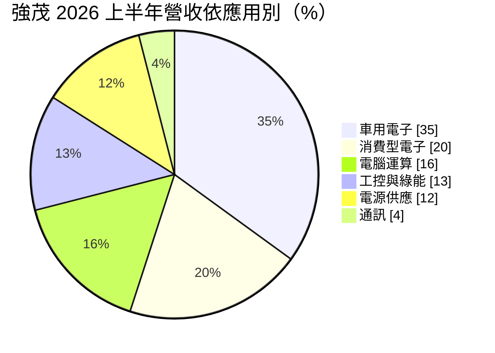
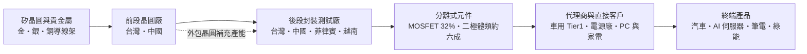
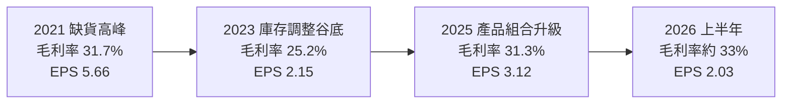
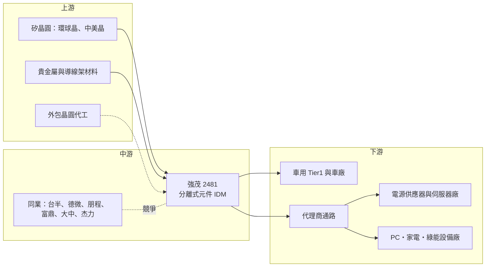

# 2481 強茂

> 上市｜[[產業索引-半導體業|半導體業]]｜上市（櫃）日期 2001/09/17

# 第一章：企業模式與商業藍圖

> [!info] 撰寫說明
> 本文由 Claude 依公開資料整理，架構比照 [[2330台積電]] 的四章研究，資料截至 2026-10-08。財務數字來源：Goodinfo 台灣股市資訊網年度經營績效（2020 至 2025 年）、強茂 2026 年 8 月法說會簡報（公司官網）、富果研究 2026 年 5 月法說整理、旺得富（中時）2025 年財報報導、經濟日報、工商時報、永豐金證券豐雲學堂、優分析、強茂 40 週年專訪（公司官網）；產業描述為整理性內容，尚未逐條比對原始文件。#待校對

在評估單一個股的長期投資價值時，首要步驟是拆解企業的底層獲利邏輯。本章針對強茂股份有限公司（股票代號：2481，以下簡稱強茂）的商業模式進行定性分析，說明一家以二極體起家的小訊號與功率元件廠，如何透過 [[IDM]] 模式、車用認證與 AI 伺服器電源產品，從「標準品供應商」逐步走向高附加價值的功率半導體廠。

## 一、核心定位：全球分離式元件 IDM

強茂由方家兄弟於 1986 年在高雄創立。依公司 40 週年專訪，創辦人原本經營磚窯業，後來看準「所有電子產品最終都需要高效率的電源元件」而轉進半導體。強茂自我定位為「全球領先的 IDM [[分離式元件]]半導體製造商」，從晶片設計、晶圓製造、封裝、測試到銷售都在集團內完成。

[[分離式元件]]指的是單一功能的電晶體或二極體，而不是把上億個電晶體整合在一起的系統晶片。這類產品單價低、品項多，一家客戶的一塊電路板上可能用到數十顆不同規格的二極體與 [[MOSFET]]，因此競爭關鍵不在於最先進的製程，而在於：

* **品項廣度與交期：** 能否一次提供客戶需要的各種電壓、電流、封裝規格，並穩定交貨。客戶採購的是一整組電源與保護元件，供應商品項越完整，客戶的採購與驗證成本就越低。
* **成本與品質：** 同一規格的元件在不同供應商之間替代性高，誰的良率高、成本低、品質穩定，誰就能拿到量。這使得分離式元件廠的競爭最終回到製造效率，規模與生產紀律比設計創新更重要。
* **認證門檻：** 車用與工控客戶需要長時間的可靠度驗證，一旦導入就不輕易更換供應商。這種認證門檻讓車用訂單比消費性訂單穩定得多，也是強茂近年拉高車用比重的原因。

依 40 週年專訪，2024 年車用供應鏈吃緊時，強茂在多家客戶端由「第二供應商」升格為「主要供應商」，這是公司近年營運體質改變的關鍵轉折。

## 二、終端應用與產品板塊：車用三成五、MOSFET 三成二

依 2026 年 8 月法說會簡報，2026 年上半年的營收結構如下：

* **車用電子（35%）：** 上半年車用營收年增 40%，是成長最快的板塊。產品用於車燈、車身控制、引擎室電源與電動車的充電系統，需要通過 AEC-Q101 等[[車規驗證]]。
* **消費型電子與電腦運算（合計 36%）：** 筆電、PC、家電與周邊裝置的電源保護與整流元件，屬於量大、價格競爭激烈的市場。這兩塊市場的需求隨 PC 與消費電子的換機週期起伏，是強茂營收波動的主要來源。
* **工控與綠能、電源供應（合計 25%）：** 工業設備、太陽能逆變器與伺服器電源。依富果研究整理的 2026 年第一季法說，AI 相關應用約占營收 11%，2025 年約 7%。

依產品別，2026 年上半年 [[MOSFET]] 占 32%、[[蕭特基二極體]]（Schottky）占 23%、其他整流器占 12%、[[TVS]] 占 9%、ESD 保護二極體占 7%、齊納二極體與開關二極體各占 6%、雙載子電晶體（BJT）占 4%、[[SiC]] 占 1%。MOSFET 已經是單一最大產品線，代表強茂正從傳統二極體往附加價值較高的功率電晶體移動。

依地區別，台灣占 37%、中國大陸 35%、歐洲與韓國各 8%、美國 5%、東南亞 4%、日本 3%。

## 三、資本轉化邏輯：前段晶圓加後段封裝的一條龍

* **IDM 一條龍與彈性外包：** 依優分析整理，強茂採「設計、晶圓、封裝到模組皆由自有與外包產能靈活搭配」的模式。法說會簡報揭露集團有 4 座晶圓廠與 5 座封裝廠；據點涵蓋新竹、高雄，中國的徐州、蘇州、無錫、深圳，以及南韓、美國、日本、越南、菲律賓與印度等地的營運或銷售據點。
* **海外產能分散：** 菲律賓封裝線於 2023 年啟動並已量產；2025 年取得越南 TOREX 半導體 95% 股權，增加東南亞產能。這讓強茂可以對歐美客戶提供「非中國生產」的選項。
* **獲利來源：** 分離式元件的毛利率主要取決於產品組合與[[產能利用率]]。強茂近年減少低毛利標準品，提高車用與 MOSFET 比重，2025 年[[毛利率]]因此較前一年提升 2.57 個百分點。

## 四、企業長期藍圖：AI 伺服器電源、車用與第三代半導體

* **AI 伺服器電源：** 依經濟日報報導，AI 伺服器電源架構由 12V 升級到 [[48V電源架構]]，帶動 MOSFET 規格由 30V 往 100V 提升，單價隨之上升。強茂也把 100V MOSFET 與馬達驅動 IC 推向伺服器散熱風扇與水冷泵浦。依富果研究整理的法說內容，AI 相關應用占營收比重由 2025 年約 7% 提升到 2026 年第一季約 11%，是強茂近年產品升級最明確的方向。
* **車用持續升級：** 車用是強茂營收占比最高的板塊，電動車的車載充電器與 DC-DC 轉換器需要更多高壓功率元件。電動車的電力系統電壓高、元件用量多，每輛車使用的功率元件價值遠高於傳統燃油車，因此車用是強茂長期成長最確定的方向。
* **[[SiC]] 產品線：** 依 40 週年專訪，強茂在 2024 年已推出第三代 SiC 產品組合，目前營收占比僅約 1%，屬長期布局。SiC 元件主要由國際大廠主導，強茂的策略是先建立產品線與客戶驗證，等待市場擴大與成本下降後再放量。
* **國際供應變動帶來的升級機會：** 分離式元件的全球供需常受國際 IDM 產能策略與地緣政治影響。依永豐金證券整理，2025 年荷蘭安世半導體（Nexperia）出口受限後，部分客戶把訂單轉向強茂，2026 年強茂也因國際 IDM 調漲價格與貴金屬成本上升而與客戶調整售價。這類事件說明，當國際大廠供貨不穩時，具備車規認證與多地產能的供應商有機會由第二供應商升級為主要供應商，這正是強茂 2024 年以來在車用市場的發展軌跡。

# 第二章：護城河深度與競爭優勢

在長期價值投資中，「護城河」指企業抵禦競爭、維持超額利潤的保護機制。本章分析強茂在分離式元件這個高度分散、價格敏感市場中的競爭優勢，以及它面對國際大廠與中國同業時能守住多少。

## 一、強茂護城河的核心組成要素

分離式元件的技術門檻不高，強茂的護城河屬於「窄護城河」，主要由以下三個要素組成：

* **1. 車規認證的轉換成本：** 車用元件需要通過 AEC-Q101 可靠度測試與車廠的生產件核准程序，驗證時間往往一到兩年以上。2024 年強茂在多家車用客戶由第二供應商升為主要供應商，代表已累積足夠的品質紀錄，這是新進者短期內難以複製的。
* **2. IDM 產能與成本控制：** 自有晶圓與封裝產能讓強茂能掌握交期與品質，在缺貨時優先保障客戶；同時可以把低階產品外包，保留自有產能給高毛利的車用與 MOSFET。這種產能彈性在缺貨期間尤其重要，能讓強茂把有限產能分配給長期合作的重點客戶，鞏固主要供應商的地位。
* **3. 品項廣度與全球據點：** 二極體、MOSFET、TVS、ESD、BJT 與 SiC 一次到位，加上台灣、中國、東南亞多地生產，可以滿足客戶「一站購足」與「中國以外生產」的雙重需求。對客戶來說，向同一家供應商採購多種元件可以簡化供應鏈管理，這是強茂與只做單一產品的小廠最大的差異。

## 二、全球主要競爭對手格局

| 對手 | 定位 | 對強茂的威脅 |
|---|---|---|
| Vishay、onsemi、Infineon、Rohm | 國際功率半導體 IDM，產品線完整 | 掌握高階車用與工控大客戶，技術領先 |
| Nexperia（安世半導體） | 中資持有的歐洲分離式元件大廠 | 規模大、價格具競爭力；2025 年出口受限後反而釋出轉單 |
| Diodes | 美國分離式元件與類比 IC 廠 | 在消費與電腦市場與強茂高度重疊 |
| 中國本土廠（如揚杰科技等） | 政策扶植、低價擴產 | 壓低標準型二極體報價，搶中國客戶 |
| [[5425台半]]、[[3675德微]]、[[8255朋程]] | 台灣分離式元件與車用整流元件廠 | 在二極體與車用市場直接競爭 |
| [[8261富鼎]]、[[6435大中]]、[[5299杰力]] | 台灣 MOSFET 設計公司 | 在 PC 與伺服器電源 MOSFET 搶單 |

## 三、優勢轉化：哪些市場守得住、哪些守不住

* **守得住：** 已通過驗證的車用料號、AI 伺服器電源的中高壓 MOSFET，以及需要非中國產能的歐美客戶。這些訂單看重品質紀錄與供貨穩定，價格敏感度較低。
* **守不住：** 消費性電子與 PC 的標準型整流二極體。這類產品規格公開、替代性高，中國同業擴產後報價容易被壓低；中國大陸營收仍占 35%，也面臨「國產替代」的壓力。
* **觀察重點：** 一是 MOSFET 與 AI 相關營收占比能否持續提高；二是毛利率能否在景氣中段也維持在 30% 以上，證明產品組合升級是結構性的，而不只是漲價帶來的短期效果；三是因國際供應變動而取得的新客戶，能否轉為長期的主要供應商關係。這三點決定強茂能否從循環型的元件廠，轉變為獲利更穩定的功率半導體供應商。

# 第三章：財務體質與盈利規模

資料日期：2026-10-08。年度數字取自 Goodinfo 台灣股市資訊網的年度經營績效（合併報表），2025 年明細與 2026 年上半年取自強茂法說會簡報與旺得富報導，表格是撰寫當時的快照；最新月營收、毛利率、累計 EPS 由自動排程寫在本筆記的屬性欄位（月營收、毛利率、累計EPS 等）。#待校對

財務報表是檢驗護城河是否真實存在的最終標準。本章用多年度的三率、ROE、現金流與資本報酬，檢視強茂在一個完整的分離式元件景氣循環中的獲利品質。

## 一、獲利能力的基石：三率

| 年度 | 營收（億元） | [[毛利率]] | [[營業利益率]] | EPS（元） | [[ROE]] |
|---|---|---|---|---|---|
| 2021 | 139 | 31.7% | 16.5% | 5.66 | 19.4% |
| 2022 | 132 | 30.2% | 12.3% | 4.60 | 12.5% |
| 2023 | 127 | 25.2% | 6.56% | 2.15 | 6.86% |
| 2024 | 125 | 28.7% | 6.48% | 2.40 | 7.15% |
| 2025 | 131 | 31.3% | 8.49% | 3.12 | 8.79% |
| 2026 上半年 | 73.77 | 33.0%（推算） | 9.3%（推算） | 2.03 | 未查得 |

註：2026 年上半年毛利率與營業利益率依法說會揭露的第一、二季營收與比率加權推算。2020 年營收 105 億元、毛利率 23.3%、EPS 2.70 元，作為循環起點參考。

從這五年的數字可以看出強茂獲利的三個特性。

第一，**毛利率隨景氣循環擺動，但谷底逐步墊高。** 2021 年全球缺料，分離式元件價格上漲，毛利率達 31.7%；2023 年消費性電子庫存調整，毛利率掉到 25.2%。值得注意的是，2025 年營收只比 2023 年多約 3%，毛利率卻回到 31.3%，和 2021 年缺貨高峰相當。這代表車用與 MOSFET 比重提高確實改善了產品組合，毛利率不再只靠漲價撐起來。

第二，**營業利益率的波動比毛利率大得多。** 2021 年營業利益率 16.5%，2023 至 2024 年只剩 6.5% 左右，2025 年回升到 8.49%。分離式元件廠的研發、業務與管理費用相對固定，營收或毛利一下滑，營業利益就以倍數縮水，這就是[[營運槓桿]]。投資人看強茂時，營業利益率比毛利率更能反映景氣位置。

第三，**營收規模長期停在 125 億至 140 億元之間。** 以 2020 年的 105 億元為起點，2020 至 2025 年營收年複合成長率約 4.5%（推算）；若從 2021 年高點算起，則是小幅負成長。強茂的價值成長主要來自「賺得更好」，而不是「賣得更多」，未來能否突破營收區間，要看 AI 伺服器電源與車用新料號的放量速度。

## 二、[[ROE]]：資本效率

2021 至 2025 年強茂的 ROE 分別為 19.4%、12.5%、6.86%、7.15%、8.79%，五年平均約 10.9%（推算）。ROE 的走勢與營業利益率幾乎同步，代表強茂的資本效率主要由景氣與產品組合決定，而不是靠財務槓桿。依 Goodinfo 資料，強茂 2025 年負債占總資產約 45%，2021 年約 51%，負債比逐年小幅下降，屬於穩健但非零負債的財務結構。

對一家 IDM 製造業者來說，ROE 長期維持在 10% 上下屬於中等水準。要回到 2021 年接近兩成的水準，需要毛利率維持在 30% 以上，同時讓營收突破過去的區間，以攤薄固定費用。

## 三、資本支出與自由現金流

強茂屬於 IDM，需要持續投資晶圓廠與封裝廠，資本支出比 IC 設計公司高得多。近年的主要投資包括 2023 年啟動的菲律賓封裝線、2025 年取得越南 TOREX 半導體 95% 股權，以及台灣與中國晶圓廠的高功率產品產能。法說會未揭露歷年資本支出金額，因此無法精確計算[[自由現金流]]。

從營運資金來看，2026 年第二季平均收現日數 104 天、平均銷貨日數 99 天，合計約 200 天的營運週期偏長，這是分離式元件品項多、經代理商銷售的產業特性。這代表營收成長時，強茂需要先墊付較多的存貨與應收帳款，現金流的改善往往落後於獲利。

股利方面，2025 年度配發現金股利 1.8 元，以 EPS 3.12 元計算，配發率約 58%（推算）。強茂在擴產與併購期間仍維持約六成的配發水準，顯示經營層在成長投資與股東回饋之間採取平衡的資本配置。

## 四、[[ROIC]] 與 [[WACC]]：價值創造利差

**ROIC 推算：** 本文未查得來源直接揭露的 ROIC，因此用「稅後營業利益 ÷ 投入資本」推算。2025 年營業利益約 11.1 億元（營收 131 億元 × 營業利益率 8.49%），以稅率 20% 計算，稅後營業利益約 8.9 億元。股東權益以每股淨值 38.4 元 × 股本 38.2 億元（約 3.82 億股）推算約 147 億元；依 Goodinfo，負債約占總資產 45.4%，推算總負債約 122 億元。由於未查得有息負債明細，以「只算股東權益」與「股東權益加全部負債」作為上下限，2025 年 ROIC 約在 3.3% 至 6.1% 之間（推算）。以同樣方法計算 2021 年，稅後營業利益約 18.3 億元，ROIC 約在 7.0% 至 14.2% 之間（推算）。

**WACC 推算：** 以資本資產定價模型（CAPM）估算股東要求報酬率，假設台灣 10 年期公債殖利率約 1.75%、市場風險溢酬約 6%、β 值取功率半導體同業常見的 1.1（本文未查得強茂的 β 值，此為假設），股東要求報酬率約 1.75% + 1.1 × 6% = 8.35%。負債成本假設稅前 2.5%、稅率 20%，稅後約 2.0%；資本結構假設有息負債占投入資本約 30%。WACC 約為 70% × 8.35% + 30% × 2.0% ≈ 6.4%（推算）。

**解讀：** 2021 年景氣高峰時，強茂的 ROIC 明顯高於 WACC，屬於價值創造；2023 至 2025 年 ROIC 落在 3% 至 6% 左右，與 WACC 相當或略低，代表這段期間公司大致只賺回資金成本。換句話說，強茂並非長期穩定創造超額報酬的公司，它的價值創造集中在景氣上行期。未來的關鍵是，車用與 AI 伺服器 MOSFET 的高毛利產品能否讓 ROIC 在景氣中段也維持在 8% 以上，真正拉開與 WACC 的差距。

# 第四章：總體風險與地緣政治

任何企業都無法脫離宏觀環境獨立存在。本章分析強茂長期必須面對的地緣政治、產業週期與營運風險，以及功率半導體技術演進帶來的挑戰。

## 一、地緣政治風險

強茂的地緣政治風險集中在中國。中國大陸占營收約 35%，徐州等地也是重要的生產基地。中國政府長期推動功率元件國產替代，當地車廠與電子廠在政策引導下會優先採用本土供應商，這會逐步壓縮強茂在中國的市占。另一方面，美國對中國製電子元件課徵關稅，促使歐美客戶要求「中國以外」的生產來源，強茂因此必須持續把對美出貨轉到台灣與東南亞的產能。

地緣政治也可能帶來機會，但這類機會的持續性需要謹慎評估。2025 年荷蘭安世半導體出口受限，部分客戶把訂單轉向強茂，這屬於地緣政治引發的供需錯置。如果事件緩解，部分訂單可能回流原供應商；只有那些已完成認證、轉為長期合約的料號，才會成為強茂真正的長期營收。

菲律賓封裝線與越南 TOREX 併購是強茂分散地緣風險的主要布局。這些產能讓強茂能對歐美客戶提供非中國生產的選項，但新廠的管理、良率爬升與當地政策都需要時間磨合，在產能利用率提高之前，也會增加折舊與管理成本。

## 二、產業週期與市場結構風險

分離式元件是週期性明顯的產業。這類產品大量經由代理商銷售，終端需求轉弱時，代理商與客戶會同時去化庫存，[[長鞭效應]]讓上游供應商的訂單跌幅遠大於終端需求。2023 年消費性電子[[庫存調整]]期間，強茂毛利率從 2021 年的 31.7% 降到 25.2%、營業利益率從 16.5% 降到 6.56%，就是典型的例子。

市場結構方面，標準型二極體的規格公開、替代性高，中國同業持續擴產會長期壓低報價。每一輪漲價多半來自供給偏緊或原料成本上升，供需轉為寬鬆時，漲價效益往往回吐。強茂能否擺脫這種循環，取決於車用、AI 伺服器電源等需要認證的產品比重能否持續提高。

終端市場方面，車用占營收約 35%，全球車市放緩或電動車推進速度不如預期，都會影響強茂最重要的成長引擎；AI 伺服器相關應用占比約一成，若雲端業者削減資本支出，這塊成長也會受影響。

## 三、營運環境的隱性風險

原物料成本是分離式元件廠容易被忽略的風險。金、銀、銅等金屬是封裝的重要材料，價格上漲時若無法即時轉嫁給客戶，會直接侵蝕毛利率。強茂產品單價低、品項多，調價需要逐一與客戶協商，轉嫁速度通常落後於成本上升。

匯率是另一項長期風險。強茂外銷比重高，新台幣升值會造成匯兌損失並壓縮以台幣計算的毛利率，2026 年第二季就曾因匯損使獲利低於市場預期。

營運資金壓力則來自產業特性。2026 年第二季平均收現日數 104 天、平均銷貨日數 99 天，營運週期合計約 200 天。這代表強茂需要用大量資金支撐存貨與應收帳款，景氣反轉時，存貨跌價與呆帳的風險會同時升高。

## 四、科技演進風險

功率半導體正朝高壓、高頻與高效率方向發展。電動車與 AI 資料中心的高壓應用逐漸採用 [[SiC]] 與 [[GaN]] 等寬能隙材料，這些市場目前由 Infineon、onsemi、Wolfspeed 等國際大廠主導。強茂 SiC 營收僅約 1%，若第三代半導體滲透速度快於預期，而強茂的產品與驗證進度跟不上，可能錯失下一代功率元件最主要的成長來源。

AI 伺服器的電源架構也在快速演進。從 12V 升級到 [[48V電源架構]]，帶動了 100V MOSFET 的需求；如果資料中心進一步採用更高壓的直流供電，MOSFET 的規格需求又會改變。強茂必須持續投入研發，才能在每一次架構轉換時維持在客戶的供應商名單中。

# 專有名詞解析

## 半導體

- **[[分離式元件]]**：只具單一功能的半導體元件，例如二極體、電晶體，與把大量電晶體整合在一起的 IC 相對。
- **[[MOSFET]]**：金屬氧化物半導體場效電晶體，用電壓控制電流開關，是電源轉換電路中最常用的功率元件。
- **[[蕭特基二極體]]**：以金屬與半導體接面製成的二極體，導通壓降低、切換速度快，常用於電源整流。
- **[[TVS]]**：暫態電壓抑制二極體，在電路遇到突波或靜電時迅速導通，保護後方的晶片。
- **[[SiC]]**：碳化矽，屬於寬能隙半導體材料，耐高壓、耐高溫，用於電動車與充電樁的功率元件。
- **[[GaN]]**：氮化鎵，寬能隙半導體材料，切換速度快，常用於快充與資料中心電源。
- **[[IDM]]**：整合元件製造商，從設計、晶圓製造到封裝測試都自己完成的半導體公司。

## 應用

- **[[車規驗證]]**：車用元件須通過 AEC-Q100 或 AEC-Q101 等可靠度測試與車廠認證，流程常需一到兩年以上，因此轉換成本高。
- **[[48V電源架構]]**：AI 伺服器把機櫃內供電電壓由 12V 提高到 48V，以降低大電流造成的損耗，帶動高壓 MOSFET 需求。
- **[[AI伺服器]]**：搭載 GPU 或 AI 加速晶片的伺服器，耗電量遠高於一般伺服器，對電源與散熱元件的需求大增。

## 金融

- **[[營運槓桿]]**：固定成本比重高的企業，營收小幅成長就能帶動營業利益大幅成長；反之營收下滑時獲利也衰退更快。
- **[[產能利用率]]**：實際生產量占總產能的比例，製造業的毛利率高度取決於此數字。
- **[[長鞭效應]]**：終端需求的小幅變動，沿供應鏈往上游傳遞時被逐級放大，造成上游庫存與訂單劇烈波動。

## 產業

- **[[庫存調整]]**：下游客戶與代理商減少備貨、消化既有庫存的期間，上游供應商的訂單會明顯減少。

# 核心供應鏈

## 1. 上游：矽晶圓、材料與外包產能
- 矽晶圓：[[6488環球晶]]、[[5483中美晶]]（推估為可能供應來源，公司未揭露供應商名單）
- 封裝材料：金、銀、銅等貴金屬與導線架，價格波動直接影響封裝成本
- 外包晶圓與封裝：強茂採自有與外包產能搭配，外包對象未揭露

## 2. 中游：強茂本身與同業
- 強茂：台灣、中國共 4 座晶圓廠與 5 座封裝廠，菲律賓與越南為新增海外產能
- 台灣分離式元件同業：[[5425台半]]、[[3675德微]]、[[8255朋程]]
- 台灣 MOSFET 同業：[[8261富鼎]]、[[6435大中]]、[[5299杰力]]
- 國際同業：Vishay、onsemi、Infineon、Rohm、Diodes、Nexperia（安世半導體）

## 3. 下游：應用市場
- 車用電子：車用 Tier1 與車廠，占 2026 上半年營收 35%
- 電源供應與 AI 伺服器：電源廠與伺服器代工廠，例如 [[2308台達電]]、[[2301光寶科]] 屬此類應用端代表廠商（推估，非公司揭露客戶）
- 電腦、消費與綠能：筆電、家電、太陽能逆變器等設備廠

## 4. 通路
- 分離式元件品項多、客戶分散，相當比例透過電子零組件代理商銷售

## 最新新聞
<!-- news:start -->
<!-- news:end -->

## 相關連結
- [公開資訊觀測站](https://mopsov.twse.com.tw/mops/web/t05st03?step=1&firstin=1&co_id=2481)
- [Goodinfo](https://goodinfo.tw/tw/StockDetail.asp?STOCK_ID=2481)
- [Yahoo 股市](https://tw.stock.yahoo.com/quote/2481)
- [鉅亨網新聞](https://www.cnyes.com/twstock/2481/news)
