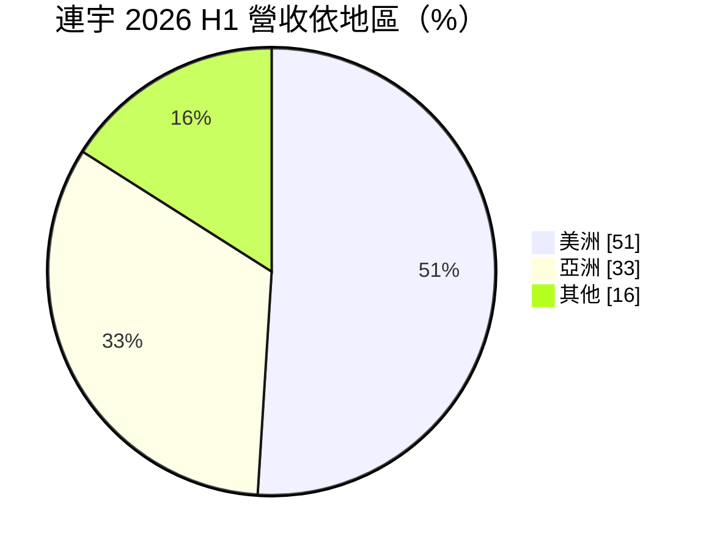
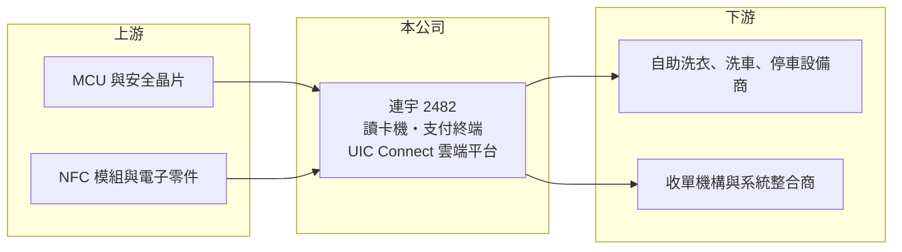

# 2482 連宇

> 上市｜[[產業索引-其他電子業|其他電子業]]｜上市（櫃）日期 2001/09/17

# 第一章：企業模式與商業藍圖

> [!info] 撰寫說明
> 精簡版，由 Claude 依公開資料整理，架構比照 [[2330台積電]]，資料截至 2026-10-07。來源：富果研究連宇 2026 年 9 月法說會筆記、nStock 連宇公司簡介。#待校對

連宇成立於 1983 年，擁有四十多年支付產業經驗，專注非現金支付的讀卡與付款終端設備。

- **核心業務：** 產銷讀卡機、讀寫卡機、支票讀取機、[[POS]] 銷售點終端與密碼輸入器，支援感應、插卡與刷卡等[[非接觸支付]]方式，並提供 UIC Connect 雲端設備管理平台。
- **營收結構：** 2026 年上半年美洲占營收 51%、亞洲 33%；應用以自助洗衣、洗車、停車場等無人自助場域為主。
- **營運據點：** 以台灣為研發與製造基地，從硬體設計、製造到全球支付認證垂直整合；銷售以美洲為最大市場。
- **長期方向：** 強化既有業務效益、拓展新市場與客戶、縮短產品上市時間，並提高 UIC Connect 軟體服務的使用率。

# 第二章：護城河深度與競爭優勢

連宇的門檻在於支付安全認證，但規模小於國際支付終端大廠。

- **競爭優勢：** 支付終端須取得 [[EMV]] 與各國支付安全認證，連宇具備自行設計並完成全球認證的能力，在自助設備的嵌入式讀卡模組市場耕耘多年。
- **主要對手：** 國際支付終端廠 Ingenico、Verifone、百富（PAX）等，規模與通路都大於連宇。
- **觀察重點：** 美洲營收比重由 2025 年上半年的 68% 降到 51%，觀察美洲需求何時回穩，以及軟體服務能否帶來經常性收入。

# 第三章：財務體質與盈利規模

資料日期：2026-10-07，以下數字是撰寫當時的快照；最新月營收、毛利率、累計 EPS 由自動排程寫在本筆記的屬性欄位（月營收、毛利率、累計EPS 等）。#待校對

連宇營收規模小且連續虧損，但 2026 年上半年虧損已收斂。

- **營收規模：** 2025 年全年營收 4.96 億元；2026 年上半年營收 2.34 億元、年減 8%，9 月營收約 0.39 億元。
- **獲利：** 2025 年全年 EPS -1.09 元；2026 年上半年淨損 3,586 萬元、EPS -0.46 元（2025 年同期 -0.87 元），上半年[[毛利率]]約 41%，第二季營業利益率 -22.13%。
- **財務特色：** 毛利率維持四成以上，但營收規模不足以支撐研發與營業費用；2025 年度配發現金股利 0.1 元。

# 第四章：總體風險與地緣政治

連宇的風險集中在營收規模與國際競爭。

- **產業週期：** 自助設備業者的設備更新需求受美國消費與投資景氣影響，加上支付規格換代時集中採購，營收波動大。
- **營運風險：** 營收規模約 5 億元，固定費用高，持續虧損會侵蝕股東權益；國際大廠價格與通路壓力大。
- **其他風險：** 美洲為最大市場，面臨美國關稅與匯率風險；支付安全標準更新時需投入認證費用與研發。

# 專有名詞解析

## 應用

- **[[POS]]**：銷售點終端，商店結帳時用來刷卡、感應付款與列印收據的設備。
- **[[非接觸支付]]**：以信用卡、手機感應晶片在讀卡機前輕觸即完成付款的方式，常用 NFC 技術。

## 金融

- **[[EMV]]**：由國際卡組織制定的晶片卡支付安全標準，支付終端須通過 EMV 認證才能受理信用卡。
- **[[毛利率]]**：毛利除以營收，反映產品本身的定價能力與成本控制。

# 核心供應鏈

- 上游：MCU、安全晶片、NFC 模組與電子零件供應商（推估）
- 下游／客戶：自助洗衣、洗車、停車場等無人設備商，以及支付收單與系統整合商
- 同業：Ingenico、Verifone、百富（PAX）

## 最新新聞
<!-- news:start -->
<!-- news:end -->

## 相關連結
- [公開資訊觀測站](https://mopsov.twse.com.tw/mops/web/t05st03?step=1&firstin=1&co_id=2482)
- [Goodinfo](https://goodinfo.tw/tw/StockDetail.asp?STOCK_ID=2482)
- [Yahoo 股市](https://tw.stock.yahoo.com/quote/2482)
- [鉅亨網新聞](https://www.cnyes.com/twstock/2482/news)
