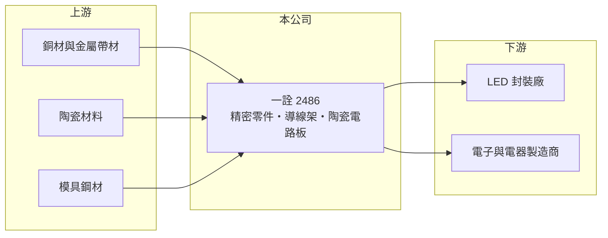

# 2486 一詮

> 上市｜[[產業索引-光電業|光電業]]｜上市（櫃）日期 2001/09/19

# 第一章：企業模式與商業藍圖

> [!info] 撰寫說明
> 精簡版，由 Claude 依公開資料整理，架構比照 [[2330台積電]]，資料截至 2026-10-07。來源：nstock.tw 一詮公司概況、winvest.tw 營收快訊。營收比重未查到。#待校對

一詮是精密零件加工廠，從 LED [[導線架]]起家，2026 年營收連月創新高。

- **核心業務：** 一詮精密成立於 1977 年，主要製造機械及零件、電子與電器零件、半導體 LED 導線架、[[精密模具]]與[[陶瓷基板]]電路板，並經營進出口貿易與不動產租賃。
- **營收結構：** 本次未查到各產品營收比重；推估以精密沖壓零件與導線架為主。
- **營運據點：** 生產與營運據點本次未查到，本文不推測。
- **長期方向：** 2026 年 8 月營收創歷史新高、年增 46%，成長動能來自哪一類產品與客戶，需以法說或年報確認。

# 第二章：護城河深度與競爭優勢

一詮的優勢在精密模具與沖壓經驗，但產品多屬客製代工，議價力有限。

- **競爭優勢：** 自有精密模具開發能力，可以從模具到量產一條龍承接客製零件，縮短客戶開發時間。
- **主要對手：** 導線架可對照 [[2351順德]]、[[5285界霖]]；精密沖壓零件則有眾多兩岸中小型廠商。
- **觀察重點：** 營收高成長能否延續，以及毛利率能否隨營收放大而提升，展現[[營運槓桿]]。

# 第三章：財務體質與盈利規模

資料日期：2026-10-07，以下數字是撰寫當時的快照；最新月營收、毛利率、累計 EPS 由自動排程寫在本筆記的屬性欄位（月營收、毛利率、累計EPS 等）。#待校對

一詮 2026 年營收明顯放大，獲利同步改善。

- **營收規模：** 2025 年全年營收 60.46 億元；2026 年 1 至 8 月累計 52 億元、年增 30%，8 月營收 7.77 億元、年增 46.07%，5 至 8 月逐月走高。
- **獲利：** 2026 年第二季 EPS 0.62 元，上半年累計 0.91 元；第二季[[毛利率]] 20.97%，[[營業利益率]] 8.87%，淨利率 7.04%。
- **財務特色：** 資本額約 24.06 億元；2025 年第四季配發現金股利 0.5 元，近五年平均現金股利 0.51 元。

# 第四章：總體風險與地緣政治

一詮的風險在於代工屬性與原物料成本。

- **產業週期：** 零件需求跟著下游電子產品出貨起伏，高成長期過後可能回落。
- **營運風險：** 客製零件依賴少數客戶專案，專案結束或轉單時營收波動大（推估）。
- **其他風險：** 銅、鐵等金屬原料價格與匯率波動；市值相對營收規模偏高，評價波動風險不小。

# 專有名詞解析

## 半導體

- **[[導線架]]**：IC 或 LED 封裝用的金屬框架，負責固定晶片並把訊號引出到外部接腳。
- **[[陶瓷基板]]**：以氧化鋁、氮化鋁等陶瓷製成的電路板，導熱與耐高溫能力遠優於一般有機板，用於 LED 與功率元件。

## 金融

- **[[營運槓桿]]**：固定費用占比高時，營收小幅成長即可帶動營業利益大幅成長的現象。

## 產業

- **[[精密模具]]**：用來沖壓或射出成型零件的高精度模具，品質決定量產零件的尺寸精度與良率。

# 核心供應鏈

- 上游：銅材與金屬帶材、陶瓷材料、模具鋼材供應商
- 下游／客戶：LED 封裝廠（如 [[2393億光]]，推估）、電子與電器製造商
- 同業：[[2351順德]]、[[5285界霖]]

## 最新新聞
<!-- news:start（自動產生，請勿手動編輯此範圍） -->
- 2026-10-06 📰 媒體 18:00｜一詮(2486)9月營收衝新高！散熱元件暴增117%佔比逼近五成，獲利跟得上嗎？｜[鉅亨網](https://news.cnyes.com/news/id/6622832)
- 2026-10-06 📰 媒體 17:31｜一詮(2486)9月營收創高！逾7成增量都靠散熱、相關營收暴增117%，獲利跟得上嗎？｜[鉅亨網](https://news.cnyes.com/news/id/6622783)
- 2026-10-05 📰 媒體 17:50｜營收速報 - 一詮(2486)9月營收7.85億元年增率高達56.83％｜[鉅亨網](https://news.cnyes.com/news/id/6621838)

完整紀錄：[[2486一詮 新聞]]
<!-- news:end -->

## 相關連結
- [公開資訊觀測站](https://mopsov.twse.com.tw/mops/web/t05st03?step=1&firstin=1&co_id=2486)
- [Goodinfo](https://goodinfo.tw/tw/StockDetail.asp?STOCK_ID=2486)
- [Yahoo 股市](https://tw.stock.yahoo.com/quote/2486)
- [鉅亨網新聞](https://www.cnyes.com/twstock/2486/news)
