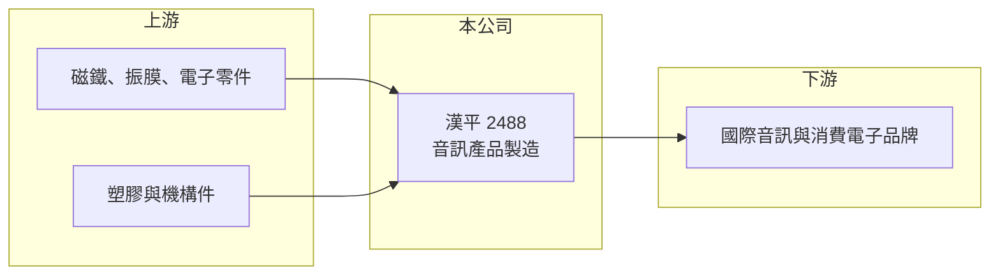

# 2488 漢平

> 上市｜[[產業索引-其他電子業|其他電子業]]｜上市（櫃）日期 2001/09/17

# 第一章：企業模式與商業藍圖

> [!info] 撰寫說明
> 精簡版，由 Claude 依公開資料整理，架構比照 [[2330台積電]]，資料截至 2026-10-07。來源：nStock 漢平公司簡介、StockFeel 股感漢平財務頁。公開資料有限，主要客戶與生產據點本次未查到。#待校對

漢平電子 1969 年成立、2001 年上市，營收幾乎全部來自音訊產品，屬聲學產品製造商。

- **核心業務：** 設計與製造音訊產品，例如[[揚聲器]]等聲學產品（推估），營業項目另登記電器、照明、無線通信器材，以及廠房與不動產開發租售。
- **營收結構：** 音訊產品約占營收 98.3%，其他營運事業約 1.7%。
- **營運據點：** 本次未查到生產據點，推估以代工方式為國際品牌生產。
- **長期方向：** 2026 年 8 月營收創單月歷史新高，觀察新客戶或新產品帶來的成長能否延續。

# 第二章：護城河深度與競爭優勢

漢平是規模中等的聲學代工廠，優勢在於專注與穩定獲利。

- **競爭優勢：** 業務高度專注音訊產品，2025 年 EPS 達 4.56 元，在聲學代工同業中獲利表現穩定。
- **主要對手：** 聲學同業 [[2439美律]]、[[2415錩新]]、[[5225東科-KY]]、[[2477美隆電]] 等。
- **觀察重點：** 2026 年 8 月營收 3.94 億元、年增 50.05%，觀察成長是來自新客戶、新品出貨或一次性訂單。

# 第三章：財務體質與盈利規模

資料日期：2026-10-07，以下數字是撰寫當時的快照；最新月營收、毛利率、累計 EPS 由自動排程寫在本筆記的屬性欄位（月營收、毛利率、累計EPS 等）。#待校對

漢平獲利穩定且配息率高，2026 年營收明顯成長。

- **營收規模：** 2025 年全年營收 28.82 億元；2026 年 1 月營收 2.30 億元、年增 31.9%，8 月營收 3.94 億元創單月新高。
- **獲利：** 2025 年全年 EPS 4.56 元；2026 年第二季 EPS 1.28 元（季增 39.13%、年增 20.75%），[[毛利率]] 20.58%、營業利益率 11.31%。
- **財務特色：** 資本額僅 8 億元，股本小使 EPS 較高；最近一年度現金股利約 3 至 3.2 元（兩個來源數字不同），近五年平均殖利率約 5.6%。

# 第四章：總體風險與地緣政治

漢平的風險來自單一產品與客戶集中。

- **產業週期：** 音訊產品屬消費電子，終端需求與品牌庫存調整會透過[[長鞭效應]]影響代工訂單，2025 年 11、12 月營收曾年減兩到三成多。
- **營運風險：** 營收幾乎全部來自音訊產品，客戶集中度推估偏高，主要客戶轉單或新品失利影響大。
- **其他風險：** 外銷代工面臨美國關稅與新台幣匯率風險；毛利率約兩成，原物料與人工成本上升會壓縮利潤。

# 專有名詞解析

## 金融

- **[[毛利率]]**：毛利除以營收，反映產品本身的定價能力與成本控制。
- **[[長鞭效應]]**：終端需求的小幅變動，沿供應鏈往上游傳遞時被逐級放大，造成上游庫存與訂單劇烈波動。

## 產業

- **[[揚聲器]]**：把電訊號轉成聲音的元件，俗稱喇叭，由磁鐵、音圈與振膜組成。
- **[[OEM]]**：原廠委託製造，代工廠依品牌客戶的設計與規格生產，產品掛品牌商的商標。

# 核心供應鏈

- 上游：磁鐵、振膜、電子零件與機構件供應商（推估）
- 下游／客戶：國際音訊與消費電子品牌，以 [[OEM]] 或 ODM 方式出貨（推估，具體客戶未查到）
- 同業：[[2439美律]]、[[2415錩新]]、[[5225東科-KY]]、[[2477美隆電]]

## 最新新聞
<!-- news:start -->
<!-- news:end -->

## 相關連結
- [公開資訊觀測站](https://mopsov.twse.com.tw/mops/web/t05st03?step=1&firstin=1&co_id=2488)
- [Goodinfo](https://goodinfo.tw/tw/StockDetail.asp?STOCK_ID=2488)
- [Yahoo 股市](https://tw.stock.yahoo.com/quote/2488)
- [鉅亨網新聞](https://www.cnyes.com/twstock/2488/news)
