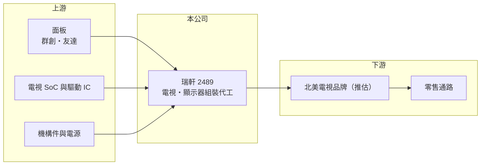

# 2489 瑞軒

> 上市｜[[產業索引-光電業|光電業]]｜上市（櫃）日期 2001/09/17

# 第一章：企業模式與商業藍圖

> [!info] 撰寫說明
> 精簡版，由 Claude 依公開資料整理，架構比照 [[2330台積電]]，資料截至 2026-10-07。來源：nstock.tw 瑞軒公司概況、winvest.tw 與 Yahoo 股市營收資料（搜尋結果）。營收比重未查到。#待校對

瑞軒是電視與顯示器的組裝代工廠，營收規模大但毛利率低。

- **核心業務：** 瑞軒科技成立於 1994 年，主要從事顯示器、數位電視機、電腦及周邊設備主要配件的裝配加工與銷售，屬典型的 [[ODM]] 代工模式。
- **營收結構：** 本次未查到產品與客戶比重；推估仍以液晶電視為主、顯示器為輔。
- **營運據點：** 2026 年 6 月員工 6,129 人，生產據點本次未查到，本文不推測。
- **長期方向：** 2026 年 8 月營收創九年新高，代表出貨回溫；能否從電視代工延伸到毛利較高的顯示器或其他產品，是轉型的關鍵。

# 第二章：護城河深度與競爭優勢

瑞軒的優勢在大量組裝與供應鏈管理，但電視代工競爭激烈，難以建立高門檻。

- **競爭優勢：** 長期替北美品牌代工電視，熟悉面板採購、組裝與物流的成本控制。
- **主要對手：** 電視代工有 [[2317鴻海]] 與中國的冠捷、TCL 等大型代工廠。
- **觀察重點：** 營收成長能否轉成獲利，第二季營業利益率僅 0.54%，毛利率是否能回升是首要指標。

# 第三章：財務體質與盈利規模

資料日期：2026-10-07，以下數字是撰寫當時的快照；最新月營收、毛利率、累計 EPS 由自動排程寫在本筆記的屬性欄位（月營收、毛利率、累計EPS 等）。#待校對

瑞軒年營收約 250 億元，但本業幾乎只維持損益兩平。

- **營收規模：** 2025 年全年營收 246.25 億元；2026 年 1 至 8 月累計 185.96 億元、年增 16.63%，8 月營收 27.25 億元、年增 23.59%。
- **獲利：** 2026 年第二季 EPS 0.29 元、季增 93.33%；[[毛利率]] 7.58%，[[營業利益率]] 0.54%，淨利率 2.46%，淨利率高於營益率，推估含[[業外收益]]。
- **財務特色：** 資本額約 61 億元；2025 年配發現金股利 1.2 元，近五年平均現金[[殖利率]]約 2.86%。

# 第四章：總體風險與地緣政治

瑞軒的風險集中在低毛利代工與面板價格。

- **產業週期：** 電視需求受北美消費景氣與年底促銷檔期影響，存在明顯季節性。
- **營運風險：** 客戶集中於少數品牌（推估），訂單變化會直接影響營收；面板占成本比重高，面板漲價時毛利容易被壓縮。
- **其他風險：** 美國關稅政策、匯率與運費變動，對低毛利代工影響特別大。

# 專有名詞解析

## 金融

- **[[業外收益]]**：本業以外的收益，例如投資、處分資產或匯兌利益，通常不具持續性。
- **[[殖利率]]**：每年現金股利除以股價，用來衡量以現價買進可領回的現金報酬。

## 產業

- **[[ODM]]**：原廠委託設計製造，代工廠除了生產也負責產品設計，品牌商只提出規格，廣達、緯穎屬此類。

# 核心供應鏈

- 上游：面板 [[3481群創]]、[[2409友達]]；電視 SoC 如 [[2454聯發科]]（推估）；機構件與電源供應商
- 下游／客戶：北美電視品牌與零售通路（推估）
- 同業：[[2317鴻海]]、冠捷、TCL

## 最新新聞
<!-- news:start（自動產生，請勿手動編輯此範圍） -->
- 2026-10-07 📰 媒體 17:50｜營收速報 - 瑞軒(2489)9月營收34.45億元年增率高達32.48％｜[鉅亨網](https://news.cnyes.com/news/id/6623796)

完整紀錄：[[2489瑞軒 新聞]]
<!-- news:end -->

## 相關連結
- [公開資訊觀測站](https://mopsov.twse.com.tw/mops/web/t05st03?step=1&firstin=1&co_id=2489)
- [Goodinfo](https://goodinfo.tw/tw/StockDetail.asp?STOCK_ID=2489)
- [Yahoo 股市](https://tw.stock.yahoo.com/quote/2489)
- [鉅亨網新聞](https://www.cnyes.com/twstock/2489/news)
