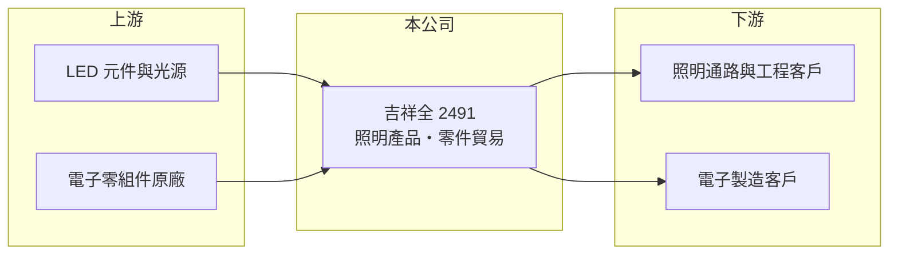

# 2491 吉祥全

> 上市｜[[產業索引-光電業|光電業]]｜上市（櫃）日期 2001/09/17

# 第一章：企業模式與商業藍圖

> [!info] 撰寫說明
> 精簡版，由 Claude 依公開資料整理，架構比照 [[2330台積電]]，資料截至 2026-10-07。來源：nstock.tw 吉祥全公司概況、winvest.tw 營收快訊。公開資料有限。#待校對

吉祥全是營收規模很小的照明與零件貿易公司，2026 年第二季因非本業收益出現極高 EPS。

- **核心業務：** 吉祥全成立於 1995 年，2001 年上市，業務為照明相關應用產品的製造與銷售，以及電子零組件買賣與進出口貿易。
- **營收結構：** 本次未查到各業務營收比重，推估以照明產品與零件貿易為主。
- **營運據點：** 生產與營運據點本次未查到，本文不推測。
- **長期方向：** 本業月營收約 1,500 萬元，規模很小；未來方向需追蹤公司如何運用第二季取得的大額收益。

# 第二章：護城河深度與競爭優勢

吉祥全看不出明確的本業護城河，投資重點在資產面而非營運面。

- **競爭優勢：** 公開資料有限，看不出明確的技術或規模優勢。
- **主要對手：** 照明產品市場競爭者眾多，可對照國內 [[LED封裝]]與照明業者如 [[2393億光]]。
- **觀察重點：** 第二季大額獲利的來源（推估為處分資產或投資的[[一次性收益]]），以及資金是否用於配息、減資或新業務。

# 第三章：財務體質與盈利規模

資料日期：2026-10-07，以下數字是撰寫當時的快照；最新月營收、毛利率、累計 EPS 由自動排程寫在本筆記的屬性欄位（月營收、毛利率、累計EPS 等）。#待校對

吉祥全本業虧損，但第二季認列大額非本業收益，EPS 與營收規模完全不成比例。

- **營收規模：** 2025 年全年營收 1.8 億元；2026 年 1 至 8 月累計 1.13 億元，8 月營收 1,514.9 萬元、年增 10.9%。
- **獲利：** 2026 年第二季 EPS 29.12 元，[[毛利率]] 26.39%，[[營業利益率]] -204.35%，淨利率 6,680.12%，獲利幾乎全部來自[[業外收益]]，不具持續性。
- **財務特色：** 資本額約 8.20 億元，市值約 32.76 億元；近五年平均現金股利僅 0.02 元。

# 第四章：總體風險與地緣政治

吉祥全的風險在於本業持續虧損，一次性獲利無法代表長期實力。

- **產業週期：** 照明產品屬成熟產業，價格競爭激烈。
- **營運風險：** 本業營業虧損，若沒有新的收益來源，後續各季可能回到虧損。
- **其他風險：** 資訊揭露有限，大額收益的性質與用途需以財報原文確認；匯率與零件價格波動。

# 專有名詞解析

## 半導體

- **[[LED封裝]]**：把 LED 晶粒固定在支架或基板上，接線並以膠體保護，做成可焊接使用的元件。

## 金融

- **[[一次性收益]]**：處分資產、土地或投資等不會每年重複的收益，會讓單期 EPS 偏離本業實力。
- **[[業外收益]]**：本業以外的收益，例如投資、處分資產或匯兌利益，通常不具持續性。

# 核心供應鏈

- 上游：LED 元件與光源、電子零組件原廠
- 下游／客戶：照明通路與工程客戶、電子製造客戶（推估）
- 同業：[[2393億光]]

## 最新新聞
<!-- news:start -->
<!-- news:end -->

## 相關連結
- [公開資訊觀測站](https://mopsov.twse.com.tw/mops/web/t05st03?step=1&firstin=1&co_id=2491)
- [Goodinfo](https://goodinfo.tw/tw/StockDetail.asp?STOCK_ID=2491)
- [Yahoo 股市](https://tw.stock.yahoo.com/quote/2491)
- [鉅亨網新聞](https://www.cnyes.com/twstock/2491/news)
