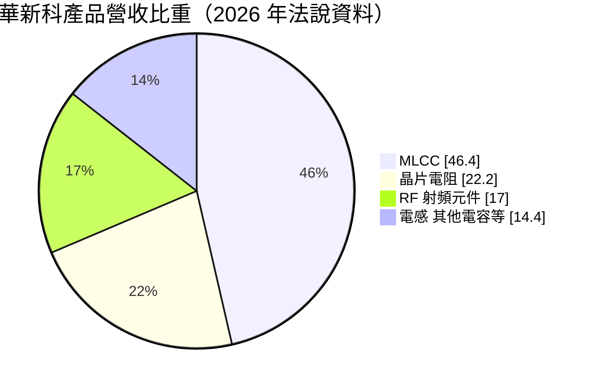
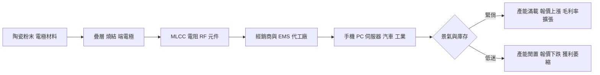
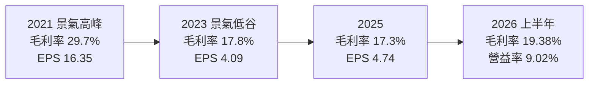
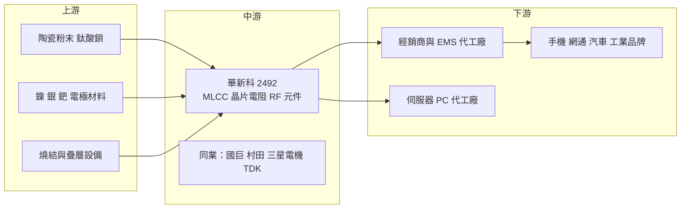

# 2492 華新科

> 上市｜[[產業索引-電子零組件業|電子零組件業]]｜上市（櫃）日期 2001/09/17

# 第一章：企業模式與商業藍圖

> [!info] 撰寫說明
> 本文由 Claude 依公開資料整理，架構比照 [[2330台積電]] 的四章研究，資料截至 2026-10-08。財務數字來源：Goodinfo 經營績效頁（2020 至 2025 年度）、證交所開放資料快照（2026 年上半年損益、資產負債、股利）、旺得富 2026 年 6 月華新科與國巨比較報導、經濟日報；產業描述為整理性內容，尚未逐條比對原始文件。#待校對

在評估單一個股的長期投資價值時，首要步驟是拆解企業的底層獲利邏輯。本章針對華新科技（股票代號：2492，以下簡稱華新科）的商業模式進行定性分析，說明台灣第二大[[被動元件]]廠如何在日系大廠與國巨之間找到位置，以及為什麼它的獲利會隨景氣大起大落。

## 一、核心定位

華新科是華新集團旗下的被動元件公司，董事長焦佑衡，集團成員還包括[[1605華新]]、[[2344華邦電]]等公司（集團持股關係待校對）。依證交所基本資料，公司登記成立日期為 1970 年。它的主力產品是[[MLCC]]（積層陶瓷電容）、晶片電阻與射頻（RF）元件，這些零件體積小、單價低，但幾乎每一個電子產品都要用上數百到數千顆。

被動元件產業的特性是「量大、單價低、標準化程度高」。一支手機裡有上千顆 MLCC，一台 AI 伺服器更多達數萬顆。對電子產品來說，被動元件占總成本比例很小，但缺貨時整條產線都會停擺，因此客戶重視供貨穩定，景氣緊俏時也願意接受漲價。

旺得富的分析把華新科形容為「專精型」被動元件廠，相對於靠併購建立多產品平台的[[2327國巨]]，華新科的產品集中在 MLCC 與 RF，主要銷售標準規格品，正逐步轉向毛利較高、競爭較少的高規格產品。產品集中的結果是，景氣循環對華新科的衝擊比國巨更大。

## 二、終端應用／產品板塊

依旺得富整理的 2026 年法說資料，華新科的營收結構如下：

* **MLCC：** 占營收 46.4%，是最大產品線。MLCC 負責穩壓、濾波與去耦合，用在手機、電腦、伺服器、汽車與工業設備。高容值、小尺寸、高耐壓的車用與伺服器規格，是毛利較高的部分。
* **晶片電阻：** 占 22.2%，技術成熟、標準化程度高，價格主要由供需決定。
* **RF 射頻元件：** 占 17%，是華新科的第二大支柱，包括陶瓷天線、濾波器等，用於無線通訊與網通設備。2026 年公司新增低軌衛星通訊應用，已備妥陶瓷天線、高頻 RF MLCC、低損耗帶通濾波器與 LEO 雙工濾波器。
* **其他：** 電感、其他電容等。2024 年收購日本 SOSHIN，新增壓電元件與 EMI 濾波器，強化車用與工業產品線。

營收地區方面，2025 年底法說時中國占 51%、亞太（含日本、馬來西亞）26%、台灣 14%、歐美不到 10%；最新一次法說中國降到 46.1%、亞太升到 28.7%。中國比重高，是華新科長期的結構性風險。

## 三、資本轉化邏輯（營運模式）

被動元件的獲利模式取決於兩件事：產能利用率與報價。生產 MLCC 需要陶瓷粉末、電極材料、疊層與燒結設備，固定成本高；景氣好時產能滿載、報價上漲，毛利率可以快速拉升，景氣差時產能閒置、報價下跌，獲利就大幅萎縮。華新科 2021 年景氣高峰時毛利率約三成，2022 年下半到 2023 年的低谷期毛利率只剩 12% 至 14%，營業利益率接近零（旺得富），正是這種[[營運槓桿]]的結果。

華新科的另一個特色是資產負債表上有大量長期投資。2026 年第二季底權益總計約 786 億元、每股淨值約 137 元（證交所資料），但 2025 年本業營業利益只有約 21 億元，股東權益中有相當比例來自集團相關公司的持股與保留盈餘（具體持股明細未查得）。這讓華新科的[[業外收益]]比重偏高，也讓 ROE 偏低。

## 四、企業長期藍圖

華新科的長期策略有三條主線。第一，提升高規格產品比重：AI 伺服器、車用與工業用 MLCC 的規格要求高、競爭者少，公司表示 AI 伺服器方向已有資本支出承諾支撐。第二，產品線延伸：透過收購日本 SOSHIN 補足壓電元件與 EMI 濾波器，並把 RF 技術延伸到低軌衛星。第三，產能分散：在日本與馬來西亞擴充產能，降低對中國市場與產能的依賴。

這些策略的方向與國巨類似，但華新科的規模約只有國巨的四分之一（2026 年前四月營收比較），併購與擴產的速度也較保守。華新科能否把產品組合往高階移動，決定它下一次景氣低谷時的獲利底線能否高於 2023 年。

# 第二章：護城河深度與競爭優勢

本章分析華新科的護城河構成、全球主要競爭對手，以及這些優勢在被動元件景氣循環中能守住多少。

## 一、華新科護城河的核心組成要素

華新科的護城河屬於「窄護城河」，主要來自以下三個要素：

* **1. 規模與製程經驗：** MLCC 的陶瓷材料配方、疊層技術與燒結控制需要長期累積，新進者很難在短期內做出穩定的高容值產品。華新科是台灣第二大被動元件廠，具備一定規模經濟。
* **2. 認證門檻：** 車用與工業用被動元件需要通過客戶的可靠度認證，週期長，一旦導入不輕易更換。旺得富的分析也指出，認證門檻與規模是保護台灣與韓國中型被動元件廠的主要因素。
* **3. RF 元件的差異化：** 陶瓷天線、濾波器等 RF 產品技術門檻高於一般電阻與電容，是華新科相對國巨較有特色的產品線，低軌衛星等新應用也從這裡延伸。

不過，華新科主要銷售標準品，在景氣低迷時缺乏定價能力。2022 年下半年國巨毛利率仍維持約 36%，華新科只有 12% 至 14%，差距反映的正是產品組合與通路掌控力的不同。

## 二、全球主要競爭對手格局

| 對手 | 定位 | 對華新科的威脅 |
|---|---|---|
| 村田製作所（Murata） | 全球 MLCC 龍頭，高階產品領先 | 掌握高容值、車用與伺服器高階規格 |
| 三星電機（SEMCO） | 韓國 MLCC 大廠 | 在高階與車用 MLCC 擴產 |
| TDK、太陽誘電 | 日系被動元件大廠 | 在車用、工業與高可靠度產品競爭 |
| [[2327國巨]] | 台灣最大被動元件廠，16 大類、82 條產品線 | 規模約華新科四倍，產品廣、毛利率高 |
| 風華高科等中國廠 | 中低階 MLCC 與電阻 | 以低價搶中國市場，壓低標準品報價 |

## 三、優勢轉化：哪些市場守得住、哪些守不住

* **守得住：** 需要認證的車用、工業與 RF 產品，以及 AI 伺服器帶來的高規格 MLCC 需求。這些產品規格要求高、客戶轉換成本高，報價也較穩定。
* **守不住：** 一般消費電子用的標準 MLCC 與晶片電阻。這些產品與中國同業高度同質，景氣低迷時只能跟著降價，這也是華新科獲利波動大的根本原因。
* **觀察重點：** 其一，AI 伺服器與車用產品占營收比重能否持續提高（公司未揭露 AI 營收占比）。其二，中國營收比重能否繼續下降、日本與馬來西亞新產能的進度。其三，景氣低谷時的毛利率能否守在 15% 以上，作為產品組合升級是否成功的檢驗。

# 第三章：財務體質與盈利規模

資料日期：2026-10-08。數字取自 Goodinfo 經營績效頁與證交所開放資料快照，表格是撰寫當時的快照；最新月營收、毛利率、累計 EPS 由自動排程寫在本筆記的屬性欄位（月營收、毛利率、累計EPS 等）。#待校對

財務報表是檢驗護城河是否真實存在的最終標準。本章用多年度的三率、ROE、現金流與資本報酬，檢視華新科在被動元件景氣循環中的獲利表現。

## 一、獲利能力的基石：三率

| 年度 | 營收（新台幣） | [[毛利率]] | [[營業利益率]] | EPS（元） | [[ROE]] |
|---|---|---|---|---|---|
| 2020 | 356 億 | 31.6% | 22.2% | 13.66 | 17.6% |
| 2021 | 421 億 | 29.7% | 19.9% | 16.35 | 18.1% |
| 2022 | 353 億 | 17.8% | 5.84% | 3.40 | 4.29% |
| 2023 | 328 億 | 17.8% | 5.47% | 4.09 | 4.82% |
| 2024 | 348 億 | 18.6% | 6.28% | 6.15 | 6.66% |
| 2025 | 365 億 | 17.3% | 5.78% | 4.74 | 4.96% |
| 2026 上半年 | 208.5 億 | 19.38% | 9.02% | 4.93 | 未查得 |

* **景氣循環非常明顯：** 2020 至 2021 年的缺貨潮讓毛利率衝上三成、EPS 達 16.35 元；2022 年需求反轉後，毛利率掉到 17.8%、EPS 只剩 3.40 元，獲利縮水約八成。2020 至 2025 年營收的年複合成長率只有約 0.5%（推算），營收規模多年沒有成長。
* **2026 年的回升：** 上半年營業利益率回到 9.02%，是 2021 年以後的新高，旺得富報導 2026 年前四月營收年增 11.2%，被動元件產業進入上升循環。
* **業外比重高：** 2026 年上半年稅前純益率 17.80%，遠高於營業利益率 9.02%（證交所資料），代表近一半的稅前獲利來自業外，推估與集團相關公司的投資收益有關（業外來源未查得）。評估本業時應以營業利益為準。

## 二、[[ROE]]：資本效率

2021 至 2025 年平均 ROE 約 7.8%（推算），但若排除 2021 年景氣高峰，2022 至 2025 年 ROE 只有 4% 至 7%。ROE 偏低有兩個原因：一是景氣低谷期本業利潤率偏低；二是股東權益規模龐大，2026 年第二季底歸屬母公司權益約 664 億元，其中有相當部分是長期投資而非營運資產，稀釋了報酬率。

## 三、資本支出與[[自由現金流]]

MLCC 是資本密集產業，擴產需要大量燒結與疊層設備。華新科 2024 年收購 SOSHIN，並在日本與馬來西亞擴產，年度資本支出金額未查得。股利方面，2025 年度配發現金股利 2.5 元（證交所股利資料），以當年 EPS 4.74 元計算，配息率約 53%（推算）；未分配盈餘約 305 億元，保留盈餘充足。華新科的配息隨景氣調整，不像群光等公司維持高配息率，反映它需要保留資金應付擴產與景氣循環。

## 四、[[ROIC]] 與 [[WACC]]：價值創造利差

* **ROIC（推算）：** 2025 年營業利益約 21.1 億元（365 億 × 5.78%），稅後約 16.9 億元。投入資本以 2026 年第二季底權益總計約 786 億元，加上有息負債估計約 250 億元（有息負債未查得，假設約占總負債 413 億元的六成），合計約 1,036 億元，ROIC 約 1.6%（推算）。由於權益中有大量長期投資，若只計算營運資產，本業 ROIC 會高一些，但仍偏低。2021 年營業利益約 83.8 億元，當時的 ROIC 推估在 8% 至 10%。
* **WACC（推算）：** 以 CAPM 推估，無風險利率 1.75%，市場風險溢酬 6%，β 未查得來源，採被動元件同業常見值 1.1（景氣循環產業 β 偏高），股東權益成本約 8.35%。負債成本假設 2%，稅後約 1.6%；資本結構以權益 76%、負債 24% 計算，WACC 約 6.7%（推算）。
* **結論：** 華新科只有在 2020 至 2021 年的景氣高峰，ROIC 才明顯高於 WACC；2022 至 2025 年 ROIC 都低於資金成本（推算），代表在景氣循環的大部分時間裡，本業沒有創造足夠的價值。2026 年營業利益率回升到 9%，若能維持，ROIC 才有機會重新接近 WACC。這也說明投資華新科的關鍵在於景氣循環的位置，而不是長期持有。

# 第四章：總體風險與地緣政治

任何企業都無法脫離宏觀環境獨立存在。本章分析華新科未來必須面對的地緣政治、產業週期與營運風險。

## 一、地緣政治風險

* **中國市場依賴：** 華新科約一半營收來自中國（2025 年底法說為 51%，最新為 46.1%），中國的電子製造需求、本土化政策與中國同業擴產，都直接影響華新科的訂單與報價。
* **美中供應鏈重組：** 美國客戶要求中國以外的供應來源，對華新科的日本、馬來西亞產能有利，但中國客戶可能轉向中國本土被動元件廠，兩股力量方向相反。

## 二、產業週期與市場結構風險

* **被動元件景氣循環：** 被動元件是電子業中週期最明顯的產業之一。景氣好時客戶重複下單、經銷商囤貨，景氣反轉時庫存一次釋出，報價急跌。這是典型的[[長鞭效應]]，華新科 2021 年到 2022 年的 EPS 從 16.35 元掉到 3.40 元就是例子。
* **中國產能擴張：** 中國廠商持續擴充中低階 MLCC 與電阻產能，可能長期壓抑標準品報價。
* **車用需求放緩：** 旺得富報導指出車用市場放緩，是公司需要留意的風險。

## 三、營運環境的隱性風險

* **原物料價格：** MLCC 使用鎳、銀、鈀等金屬作為電極材料，晶片電阻使用貴金屬，金屬價格上漲會壓縮毛利。
* **匯率：** 營收以美元與人民幣為主，新台幣與日圓匯率波動會影響獲利與日本子公司的換算。
* **業外收益的不確定性：** 業外收益占獲利比重高，投資標的的股價與股利變化會讓華新科的 EPS 出現與本業無關的波動。

## 四、科技或法規演進風險

AI 伺服器與電動車帶動高容值、高耐壓、小尺寸 MLCC 的需求，這些高階規格由村田、三星電機等日韓廠商主導。如果華新科在高階製程上跟不上，可能只能分到中低階的需求，無法享受 AI 帶來的產品升級紅利。低軌衛星是新應用，但市場規模與時程仍不確定。另外，歐盟 RoHS 等有害物質規範與碳排放法規，會提高材料與製程的合規成本。

# 專有名詞解析

## 應用

- **[[低軌衛星]]**：運行在約 500 至 2,000 公里高度的通訊衛星，延遲低，需要大量地面終端與射頻元件。

## 金融

- **[[營運槓桿]]**：固定成本高的企業，營收小幅變動就會造成利潤大幅變動的現象。
- **[[業外收益]]**：非本業營運產生的收益，例如利息、投資收益與匯兌利益，波動較大、不一定能持續。
- **[[配息率]]**：現金股利占每股盈餘的比例，反映公司把多少獲利發還給股東。
- **[[長鞭效應]]**：終端需求的小幅變動，沿供應鏈往上游傳遞時被逐級放大，造成上游庫存與訂單劇烈波動。
- **[[ROIC]]**：投入資本報酬率，衡量公司每投入一元營運資本能賺多少稅後營業利益。
- **[[WACC]]**：加權平均資金成本，股東與債權人要求報酬率的加權平均，是企業投資的最低報酬門檻。

## 產業

- **[[被動元件]]**：不需外部電源即可運作的電子元件，主要包括電容、電阻、電感，用於穩壓、濾波與限流。
- **[[MLCC]]**：積層陶瓷電容，把陶瓷與金屬電極層層疊起再燒結而成，是用量最大的被動元件。
- **[[晶片電阻]]**：表面黏著用的小型電阻，用於限制電流與分壓，技術成熟、標準化程度高。
- **[[RF 元件]]**：射頻元件，包括天線、濾波器、雙工器等，負責無線訊號的收發與篩選。
- **[[EMI 濾波器]]**：電磁干擾濾波器，用來抑制電子設備產生或接收的雜訊，常見於車用與工業設備。

# 核心供應鏈

## 1. 上游：材料與設備
- 陶瓷粉末與電極材料：日系材料廠為主（未查得具體名單）
- 集團相關：[[1605華新]]（集團關係待校對）

## 2. 中游：華新科本身與同業
- 台灣同業：[[2327國巨]]、2456奇力新、[[3026禾伸堂]]
- 國際同業：村田製作所、三星電機、TDK、太陽誘電

## 3. 下游：代工廠與終端品牌
- 伺服器與 PC 代工：[[2382廣達]]、[[3231緯創]]、[[2317鴻海]]（客戶名單依產業常識整理，待校對）
- 終端應用：[[AAPL蘋果]]、[[005930三星電子]] 等手機與電子品牌（待校對）

## 最新新聞
<!-- news:start（自動產生，請勿手動編輯此範圍） -->
- 2026-10-08 📰 媒體 17:59｜華新科9月營收創近8年單月高 8月自結純益年增6成EPS 1.55元｜[鉅亨網](https://news.cnyes.com/news/id/6625079)
- 2026-10-08 📰 媒體 17:23｜營收速報 - 華新科(2492)9月營收48.89億元年增率高達53.93％｜[鉅亨網](https://news.cnyes.com/news/id/6624997)
- 2026-10-08 🏛️ 重訊 15:58｜係因本公司有價證券於集中交易市場達公布注意交易資訊標準， 故公布相關財務業務等重大訊息，以利投資人區別瞭解。｜[觀測站](https://mops.twse.com.tw/mops/#/web/t05st01)
- 2026-10-07 🏛️ 重訊 15:02｜公告本公司國內第二次無擔保轉換公司債代收價款 及存儲專戶行庫｜[觀測站](https://mops.twse.com.tw/mops/#/web/t05st01)
- 2026-10-07 📰 媒體 09:36｜【AI補漲股大點名】華新科、南電、環球晶領軍！3大族群爆發 下一波低基期飆股提前看｜[鉅亨網](https://news.cnyes.com/news/id/6623438)

完整紀錄：[[2492華新科 新聞]]
<!-- news:end -->

## 相關連結
- [公開資訊觀測站](https://mopsov.twse.com.tw/mops/web/t05st03?step=1&firstin=1&co_id=2492)
- [Goodinfo](https://goodinfo.tw/tw/StockDetail.asp?STOCK_ID=2492)
- [Yahoo 股市](https://tw.stock.yahoo.com/quote/2492)
- [鉅亨網新聞](https://www.cnyes.com/twstock/2492/news)
