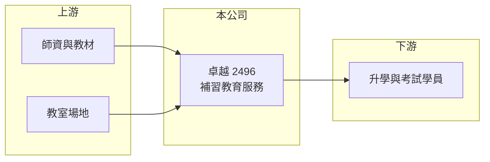

# 2496 卓越

> 上市｜[[產業索引-其他業|其他業]]｜上市（櫃）日期 2002/03/08

# 第一章：企業模式與商業藍圖

> [!info] 撰寫說明
> 精簡版，由 Claude 依公開資料整理，架構比照 [[2330台積電]]，資料截至 2026-10-07。來源：winvest 卓越營收快訊。#待校對

卓越成功是補習教育服務公司，營收穩定、獲利率佳，屬於內需服務型股票。

- **核心業務：** 公司全名卓越成功，主要業務為[[短期補習班]]與教育諮詢服務。
- **營收結構：** 本次未查到各類課程的營收比重。
- **營運據點：** 公司 1991 年成立、2002 年上市，班別與分校明細本次未查到。
- **長期方向：** 補教業逐步結合[[線上課程]]，擴大授課範圍並降低場地成本（推估）。

# 第二章：護城河深度與競爭優勢

卓越的優勢在於品牌與師資累積的招生能力。

- **競爭優勢：** 補教業依賴師資與口碑，品牌建立後招生成本較低（推估）。
- **主要對手：** 國內其他補習班與線上教育平台，本次未查到具體名單。
- **觀察重點：** 8 月營收 8,037.3 萬元，年減 1.11%，觀察招生旺季後的營收變化。

# 第三章：財務體質與盈利規模

資料日期：2026-10-07，以下數字是撰寫當時的快照；最新月營收、毛利率、累計 EPS 由自動排程寫在本筆記的屬性欄位（月營收、毛利率、累計EPS 等）。#待校對

卓越股本小、獲利能力高，EPS 相對資本額表現突出。

- **營收規模：** 2026 年 1 至 8 月累計營收 5.68 億元，年增 1.46%；月營收約在 6,100 萬至 8,000 萬元之間。
- **獲利：** 2026 年第二季 EPS 0.83 元，上半年累計 EPS 2.48 元，年增 9%；2025 年全年 EPS 6.12 元。
- **財務特色：** 資本額僅 1.91 億元、市值約 10.47 億元；補教業[[預收學費]]使營運現金流入較早（推估），本次未查到毛利率與股利資料。

# 第四章：總體風險與地緣政治

卓越的風險來自人口結構與考試制度變化。

- **產業週期：** 補教需求與升學、就業考試制度相關，景氣差時部分考試類課程需求可能增加（推估）。
- **營運風險：** 名師流動會影響招生，線上平台競爭也可能壓低課程價格。
- **其他風險：** [[少子化]]與教育法規變動，長期影響目標學生人數。

# 專有名詞解析

## 應用

- **[[線上課程]]**：透過網路直播或錄影授課，可跨區招生並降低場地成本。

## 金融

- **[[預收學費]]**：學生先繳學費、課程後續提供，會計上列為合約負債。

## 產業

- **[[短期補習班]]**：依補習及進修教育法立案、提供升學或考試輔導的教學機構。
- **[[少子化]]**：出生人數持續下降，使教育相關產業的潛在客群減少。

# 核心供應鏈

- 上游：講師、教材編製與教室場地（推估）
- 下游／客戶：準備升學或各類考試的學員（推估）
- 同業：國內補習班與線上教育業者（本次未查到具體名單）

## 最新新聞
<!-- news:start -->
<!-- news:end -->

## 相關連結
- [公開資訊觀測站](https://mopsov.twse.com.tw/mops/web/t05st03?step=1&firstin=1&co_id=2496)
- [Goodinfo](https://goodinfo.tw/tw/StockDetail.asp?STOCK_ID=2496)
- [Yahoo 股市](https://tw.stock.yahoo.com/quote/2496)
- [鉅亨網新聞](https://www.cnyes.com/twstock/2496/news)
