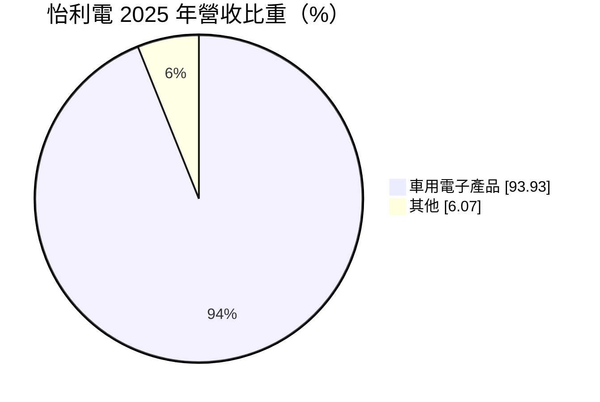
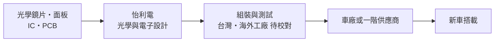
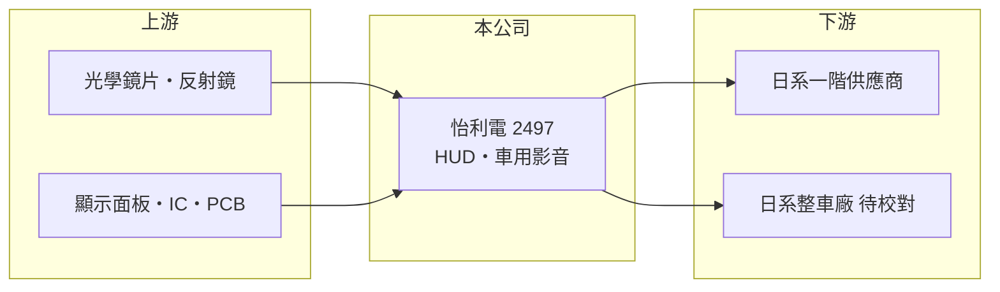

# 2497 怡利電

> 上市｜[[產業索引-汽車工業|汽車工業]]｜上市（櫃）日期 2002/02/04

# 第一章：企業模式與商業藍圖

> [!info] 撰寫說明
> 本文由 Claude 依公開資料整理，架構比照 [[2330台積電]] 的四章研究，資料截至 2026-10-08。財務數字來源：Goodinfo 台灣股市資訊網年度經營績效、MoneyDJ 理財網個股基本資料（營收比重）、證交所開放資料（本筆記 _data 快照）。產品線細項與客戶憑既有知識整理並標「待校對」。#待校對

在評估單一個股的長期投資價值時，首要步驟是拆解企業的底層獲利邏輯。本章說明怡利電子（股票代號：2497，以下簡稱怡利電）如何從車用影音轉型為[[抬頭顯示器]]供應商，並在 2021 年後讓營收翻倍。

## 一、核心定位：日系車廠的車用電子供應商

怡利電成立於 1983 年，2002 年上市，董事長兼總經理為陳錫勳。依 MoneyDJ，2025 年營收中車用電子產品占 93.93%、其他占 6.07%。據既有資料，主要產品包括抬頭顯示器（HUD）、車用音響擴大機與影音系統，客戶以日系車廠及其一階供應商為主（產品與客戶細項待校對）。

抬頭顯示器把車速、導航等資訊投射到擋風玻璃前方，駕駛不必低頭看儀表。這類產品結合光學、顯示面板與電子設計，而且必須通過車廠的長期驗證，進入門檻高於一般車用電子。

## 二、資本轉化邏輯

怡利電是「設計加製造」的模式：它替車廠開發特定車型的 HUD 或音響模組，量產後隨車型出貨四到六年。新車型的搭載數決定營收，因此只要搶到熱銷車型，營收就能連續數年成長。2021 年營收 24.8 億元，2024 年成長到 46.2 億元（Goodinfo），反映 HUD 在新車上的普及。

## 三、企業長期方向

HUD 正從豪華車往中價位車擴散，下一步是[[擴增實境]] HUD（AR-HUD），可以把導航箭頭直接疊在實際道路上，單價更高。怡利電的長期方向是升級產品規格、擴大既有客戶的搭載車型，並爭取日系以外的客戶（推估）。資本配置上配息穩定，2025 年度現金股利 2 元（證交所開放資料）。

# 第二章：護城河深度與競爭優勢

在長期價值投資中，「護城河」指企業抵禦競爭、維持超額利潤的保護機制。本章分析怡利電的優勢與對手。

## 一、護城河的核心組成要素

* **1. 車規驗證與車型綁定：** HUD 與車內結構、儀表設計高度整合，一旦被選入車型，整個車型生命週期都由同一供應商出貨，轉換成本高。
* **2. 光學設計經驗：** HUD 的成像要避免重影、在強光下清晰，需要光學與熱管理的長期累積，這是一般電子代工廠難以跨入的門檻。
* **3. 日系客戶關係：** 數十年供應日系車廠的紀錄是重要資產，但也意味著營收高度集中在日系品牌（推估）。

## 二、主要對手

| 對手 | 定位 | 對怡利電的威脅 |
|---|---|---|
| 日本精機（Nippon Seiki） | 全球 HUD 龍頭，日系車廠主要供應商 | 在日系客戶直接競爭 |
| 大陸電子（Continental）、電裝（Denso） | 國際一階供應商 | 以系統整合能力取得大車廠專案 |
| 中國 HUD 廠 | 成本低，服務中國電動車品牌 | 壓低中價位 HUD 報價 |

## 三、守得住／守不住／觀察重點

* **守得住：** 已量產車型的持續出貨，以及需要客製光學設計的專案。
* **守不住：** 一般型 HUD 的價格，中國業者擴產後單價下降。
* **觀察重點：** AR-HUD 是否取得量產專案，以及營業利益率能否維持在 8% 以上。

# 第三章：財務體質與盈利規模

資料日期：2026-10-08。數字取自 Goodinfo 年度經營績效與證交所開放資料快照，表格是撰寫當時的快照；最新月營收、毛利率、累計 EPS 由自動排程寫在本筆記的屬性欄位（月營收、毛利率、累計EPS 等）。#待校對

財務報表是檢驗護城河是否真實存在的最終標準。本章用多年度數字檢視怡利電轉型後的獲利能力。

## 一、多年度三率與 ROE

| 年度 | 營收（新台幣） | [[毛利率]] | [[營業利益率]] | EPS（元） | [[ROE]] |
|---|---|---|---|---|---|
| 2021 | 24.8 億 | 26.6% | 6.92% | 0.81 | 7.06% |
| 2022 | 35.7 億 | 26.7% | 8.65% | 2.88 | 20.1% |
| 2023 | 37.7 億 | 23.9% | 6.61% | 1.89 | 11.0% |
| 2024 | 46.2 億 | 25.9% | 9.71% | 3.09 | 16.1% |
| 2025 | 44.7 億 | 25.6% | 10.0% | 2.37 | 11.8% |
| 2026 上半年 | 25.8 億 | 26.02% | 8.69% | 1.59 | 未查得 |

* **[[毛利率]]：** 長期穩定在 24% 至 27%，代表 HUD 的定價能力不錯。
* **[[營業利益率]]：** 從 2020 年的 -5.4% 提升到 2025 年的 10.0%，營收放大帶動費用攤薄。
* **長期指標：** 2021 至 2025 年營收年複合成長率約 16%（推算，24.8 億到 44.7 億）；2021 至 2025 年平均 ROE 約 13.2%（推算）。2025 年度現金股利 2 元，以 EPS 2.37 元計算配息率約 84%（推算）。2026 年 1 至 8 月營收 35.9 億元，較前一年同期 30.0 億元成長約 20%（證交所開放資料）。

## 二、財務結構

2026 年第二季底資產 65.9 億元、負債 36.6 億元，負債比約 56%，每股淨值 22.37 元（證交所開放資料）。負債以流動負債 28.7 億元為主，推估包含應付帳款與短期借款。

## 三、[[ROIC]] 與 [[WACC]]

2025 年營業利益約 4.47 億元（44.7 億元 × 10.0%），稅後約 3.58 億元。投入資本以權益 29.3 億元加非流動負債 7.9 億元近似（約 37.2 億元，有息負債細項未查得），ROIC 約 9.6%（推算）；只用權益約 12.2%。WACC 以 CAPM 推估：無風險利率 1.5% 至 2%、市場風險溢酬 6%、β 未查得，取 1.0（假設），權益成本約 7.5% 至 8%；負債成本假設 3%，負債約占資本三成，WACC 約 6% 至 6.5%（推算）。ROIC 高於 WACC 約 3 至 6 個百分點，HUD 轉型後的怡利電已進入創造價值的階段。

# 第四章：總體風險與地緣政治

任何企業都無法脫離宏觀環境獨立存在。本章整理怡利電長期必須面對的風險。

## 一、地緣政治與政策

* **關稅與產地：** 若主要客戶的車輛銷往美國，美國對進口汽車與零件的關稅政策可能影響訂單與售價（推估）。

## 二、產業週期與市場結構

* **車市循環：** 營收與新車產量直接相關，車市衰退時搭載量同步下降。
* **客戶集中：** 客戶以日系車廠為主（待校對），日系車廠在中國與東南亞的市占變化會直接影響怡利電。

## 三、營運風險

* **零件供應：** 顯示面板、晶片短缺時無法出貨，2021 至 2022 年車用晶片短缺期間全球車用電子廠都受影響。
* **匯率：** 以日圓或美元計價的交易，匯率波動影響毛利（推估）。

## 四、技術演進

* **座艙整合：** 車廠把儀表、中控與 HUD 整合成單一[[智慧座艙]]平台，可能改由大型一階供應商整包，小型專業廠需要找到在整合方案中的位置。

# 專有名詞解析

## 應用

- **[[抬頭顯示器]]**：把車速、導航等資訊投射到駕駛前方視線的顯示裝置，簡稱 HUD。
- **[[擴增實境]]**：把虛擬影像疊加在真實景物上的技術，用於 AR-HUD 可直接在道路上標示導航方向。
- **[[智慧座艙]]**：整合儀表、中控螢幕、HUD 與語音互動的車內電子系統。

## 金融

- **[[ROIC]]**：投入資本報酬率，衡量公司用股東與債權人資金創造本業稅後利潤的效率。
- **[[WACC]]**：加權平均資金成本，依股權與負債比重加權的資金成本，是 ROIC 要超過的門檻。

# 核心供應鏈

## 1. 上游：元件
- 光學元件、TFT 顯示面板、車用 IC 與印刷電路板（供應商名稱未查得）

## 2. 中游：怡利電本身
- 抬頭顯示器、車用音響擴大機與影音系統的設計與製造

## 3. 下游：客戶
- 日系整車廠及一階供應商（客戶名單待校對）

## 4. 同業
- 國際：日本精機、大陸電子、電裝
- 台股車用電子：[[3346麗清]]、[[3717聯嘉投控]]

## 最新新聞
<!-- news:start（自動產生，請勿手動編輯此範圍） -->
- 2026-10-06 📰 媒體 17:50｜營收速報 - 怡利電(2497)9月營收4.83億元年增率高達41.36％｜[鉅亨網](https://news.cnyes.com/news/id/6622822)

完整紀錄：[[2497怡利電 新聞]]
<!-- news:end -->

## 相關連結
- [公開資訊觀測站](https://mopsov.twse.com.tw/mops/web/t05st03?step=1&firstin=1&co_id=2497)
- [Goodinfo](https://goodinfo.tw/tw/StockDetail.asp?STOCK_ID=2497)
- [Yahoo 股市](https://tw.stock.yahoo.com/quote/2497)
- [鉅亨網新聞](https://www.cnyes.com/twstock/2497/news)
