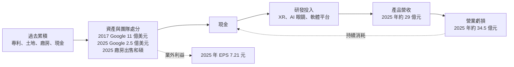
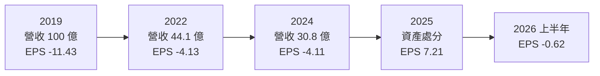
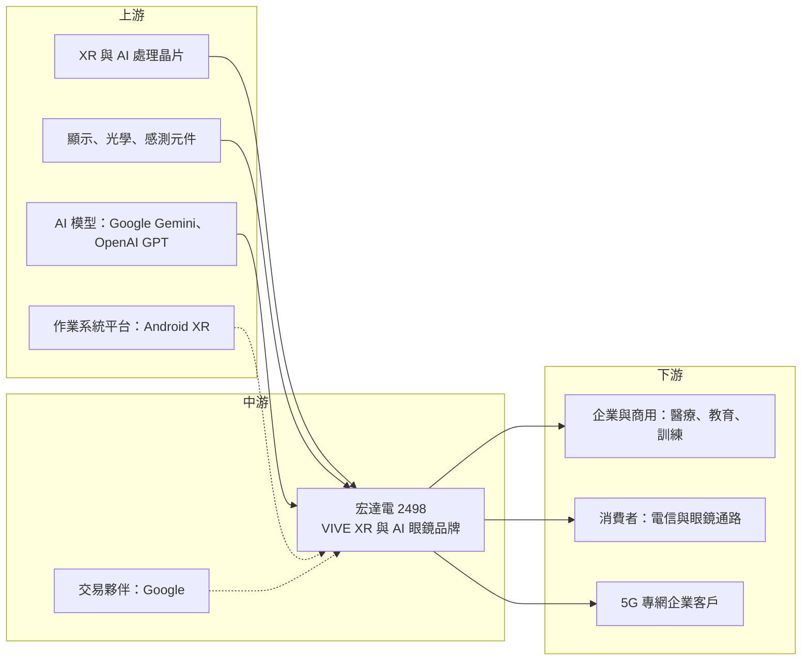

# 2498 宏達電

> 上市｜[[產業索引-通信網路業|通信網路業]]｜上市（櫃）日期 2002/03/26

# 第一章：企業模式與商業藍圖

> [!info] 撰寫說明
> 本文由 Claude 依公開資料整理，架構比照 [[2330台積電]] 的四章研究，資料截至 2026-10-08。財務數字來源：Goodinfo 年度經營績效、證交所開放資料（基本資料、資產負債、綜合損益、營益分析、股利）、科技新報、中央社、優分析；產業描述為整理性內容，尚未逐條比對原始文件。#待校對

宏達電是台灣科技業最具代表性的轉型案例：它曾是全球前三大智慧型手機品牌，之後在激烈競爭中失去市場，轉而押注虛擬實境與延展實境。本章針對宏達國際電子（股票代號：2498，以下簡稱宏達電）的商業模式進行定性分析，說明它現在靠什麼營運、為什麼本業長期虧損，以及資產處分在財報中扮演的角色。

## 一、核心定位：從手機品牌轉型為 XR 與 AI 眼鏡公司

宏達電成立於 1997 年，早期替國際品牌代工 PDA 與智慧型手機，之後推出自有品牌 HTC 手機。依科技新報整理，2011 年宏達電股價達 1,300 元成為台股股王，市值約 338 億美元，是全球第三大手機品牌。2013 年上市以來首度虧損，2015 年每股虧損 18.79 元，手機事業從此一蹶不振。

這段歷史對理解今天的宏達電很重要，因為它解釋了公司目前的三個特性：

* **以 XR 為核心事業：** 宏達電在 2015 年 3 月推出虛擬實境裝置 HTC Vive，之後以 VIVE 品牌發展 [[VR]] 與 [[XR]] 頭戴裝置、企業解決方案與軟體平台。這是它在手機之後選擇的新主軸，但市場規模至今仍遠小於手機。
* **反覆以資產與團隊換取資金：** 2017 年，Google 以 11 億美元取得宏達電參與 Pixel 手機開發的團隊與專利授權；2025 年，Google 再以 2.5 億美元取得部分 XR 研發團隊與 XR 智財的非專屬授權（科技新報、中央社）。這兩次交易都為公司帶來大量現金，但也意味著核心研發人力的外移。
* **經營權高度集中：** 依證交所開放資料，董事長與總經理均由王雪紅擔任。公司的長期方向幾乎取決於經營者對新技術的判斷與投入意願。

## 二、終端應用與產品板塊

宏達電未公開揭露各產品線的營收比重，以下依公開報導整理其主要業務。2025 年全年營收約 29 億元，規模只有 2019 年約 100 億元的三成左右。

* **VIVE XR 頭戴裝置：** 包括 VIVE Focus Vision 等產品，鎖定企業訓練、醫療、教育與高階消費者。依中央社報導，Google 交易後 VIVE 品牌與產品線維持不變。宏達電在中國 VR 市場的銷售市占曾排名第一（科技新報），但近年消費市場主要被大型平台業者主導。
* **企業與商用 XR：** 公司法說會表示 XR 業務的商用成長顯著。企業客戶看重的是軟硬體整合與客製化服務，價格敏感度較低，是宏達電與大型消費品牌區隔的方向。
* **VIVE Eagle AI 眼鏡：** 2025 年 9 月開始出貨，台灣為全球首發市場，內建支援繁體中文語音的 AI 助理，可串接 Google Gemini 與 OpenAI GPT，提供翻譯、朗讀與拍照功能。依優分析報導，台灣銷售據點超過 336 個，並已在香港上市，公司評估進入中國市場。[[AI眼鏡]]是宏達電近年最主要的新產品。
* **5G 專網：** 子公司發展 5G 專網應用，包括與日本企業合作的遠洋漁業數位轉型專案（優分析）。

## 三、資本轉化邏輯：以資產處分支撐研發投入

* **營收規模不足以支撐費用：** 2025 年營收約 29 億元，毛利率 35.9%，但營業虧損約 34.5 億元，營業利益率約 -119%。也就是說，每賣 1 元的產品，就要另外花超過 1 元的研發與營運費用。這種結構只能靠外部資金或資產處分維持。
* **2025 年獲利來自一次性收益：** 2025 年歸屬母公司淨利約 60.3 億元、EPS 7.21 元，結束連續 6 年虧損。獲利主要來自兩筆業外收益：第一季 Google 支付 2.5 億美元的 XR 團隊與智財交易，以及第三季把桃園與新北的廠房土地以約 56.38 億元出售給 [[4938和碩]]，處分利益約 39 億元（優分析）。這些都是[[一次性收益]]，不代表本業轉好。
* **2026 年回到虧損：** 2026 年上半年營收約 12.7 億元，營業虧損約 11.4 億元，業外收入約 6.5 億元，稅後淨損約 5.2 億元，EPS -0.62 元（證交所綜合損益開放資料）。這說明在沒有大型資產處分的年份，本業虧損仍會直接反映在 EPS。

## 四、企業長期藍圖：XR 生態系與 AI 眼鏡

* **AI 眼鏡普及化：** 王雪紅表示看好 AI 眼鏡成為主流消費電子產品。宏達電透過電信業者與眼鏡連鎖通路擴大實體體驗據點，並評估進入中國市場。AI 眼鏡若成為像手機一樣普及的產品，市場規模將遠大於 VR 頭戴裝置；但這個市場同樣會吸引全球最大的科技公司投入。
* **強化 XR 生態系：** Google 交易的目的之一，是協助 Google 實現 Android XR 平台，並讓宏達電更專注於產品與營運效率。宏達電的角色可能從自建平台，轉為在大型平台生態系中提供硬體與企業解決方案。
* **精簡產品組合：** 公司表示將實現更精簡的產品組合，把資源集中在商用 XR 與 AI 眼鏡。對長期虧損的公司而言，縮小戰線是延長資金壽命的必要做法。
* **5G 與企業數位轉型：** 5G 專網與企業應用是較小但與硬體互補的業務，能把 XR 技術延伸到工業與遠端協作場景。

# 第二章：護城河深度與競爭優勢

宏達電的競爭環境非常艱難：它面對的是全球市值最大的科技公司。本章分析它還保有哪些競爭優勢，以及這些優勢在大型平台業者主導的市場中能守住多少。

## 一、護城河的核心組成要素

* **XR 技術累積與專利：** 宏達電從 2015 年推出 Vive 起累積近十年的 XR 研發經驗，Google 願意兩度付費取得團隊與智財授權，說明這些技術具有市場價值。不過 2025 年交易是非專屬授權，宏達電仍保有使用權，但最核心的部分研發人力已移轉。
* **企業與商用市場的客製化能力：** 企業客戶需要硬體、軟體、內容與售後服務的整合，大型消費品牌較少提供深度客製化。宏達電在醫療、教育與訓練等場景的經驗，是它在商用市場的主要差異化。
* **台灣本地通路與繁體中文：** VIVE Eagle 以台灣為首發市場，結合電信與眼鏡連鎖通路，並強調繁體中文語音。在國際大廠尚未全面進入的市場，本地化是短期的優勢。
* **品牌知名度：** HTC 與 VIVE 在全球科技市場仍有一定知名度，對進入新市場與爭取合作夥伴有幫助。

整體而言，宏達電的護城河相當淺。技術可以被大型業者以更多資源追上，品牌價值也隨手機事業衰退而削弱。

## 二、全球主要競爭對手格局

| 對手 | 主要產品 | 競爭優勢 | 與宏達電的關係 |
|---|---|---|---|
| [[META臉書]] | Quest 系列頭戴裝置、與眼鏡品牌合作的 AI 眼鏡 | 龐大的用戶與內容生態、願意長期補貼硬體 | 消費 VR 與 AI 眼鏡的最大對手 |
| [[AAPL蘋果]] | Vision Pro | 高階品牌、iOS 生態系 | 高階空間運算裝置的標竿 |
| [[GOOGL谷歌]] | Android XR 平台 | 作業系統與 AI 模型 | 既是交易夥伴，也是生態系主導者 |
| [[005930三星電子]] | Android XR 頭戴裝置 | 硬體製造規模與通路 | 在 Android XR 陣營的直接對手 |
| [[SONY索尼]] | PlayStation VR | 遊戲內容生態 | 遊戲 VR 市場的競爭者 |
| 中國 XR 與 AI 眼鏡業者 | 頭戴裝置與 AI 眼鏡 | 成本與供應鏈優勢 | 宏達電評估進入中國市場時的主要對手 |

## 三、優勢轉化：守得住與守不住

* **守得住：** 企業與商用 XR 的利基市場，以及台灣本地的 AI 眼鏡通路。這些市場規模不大，但客戶重視服務與整合，宏達電有機會建立穩定的客戶基礎。
* **守不住：** 消費級 VR 與 AI 眼鏡的大眾市場。大型平台業者擁有作業系統、AI 模型、內容生態與補貼硬體的財力，宏達電很難在價格與生態系上競爭。
* **觀察重點：** 第一，營收能否回到足以縮小營業虧損的規模；第二，VIVE Eagle 能否在台灣以外的市場取得規模；第三，在沒有大型資產處分的情況下，公司現金能支撐多少年的研發投入。這三點決定宏達電能否從「靠處分資產維生」轉為本業自給自足。

# 第三章：財務體質與盈利規模

資料日期：2026-10-08。數字取自 Goodinfo 年度經營績效、證交所開放資料與優分析報導，表格是撰寫當時的快照；最新月營收、毛利率、累計 EPS 由自動排程寫在本筆記的屬性欄位（月營收、毛利率、累計EPS 等）。#待校對

財務報表是檢驗護城河是否真實存在的最終標準。對宏達電而言，財報最重要的觀察點是本業虧損的規模，以及業外收益能支撐多久。

## 一、獲利能力的基石：三率

| 年度 | 營收（新台幣） | [[毛利率]] | [[營業利益率]] | EPS（元） | [[ROE]] |
|---|---|---|---|---|---|
| 2019 | 100 億 | 20.3% | -98.4% | -11.43 | -23.5% |
| 2020 | 58.1 億 | 27.0% | -110% | -7.27 | -18.5% |
| 2021 | 52.5 億 | 31.1% | -78.4% | -3.75 | -10.8% |
| 2022 | 44.1 億 | 39.2% | -99.9% | -4.13 | -12.9% |
| 2023 | 44.2 億 | 41.3% | -97.2% | -4.09 | -14.0% |
| 2024 | 30.8 億 | 40.7% | -151% | -4.11 | -15.5% |
| 2025 | 29.0 億 | 35.9% | -119% | 7.21 | 25.1% |
| 2026 上半年 | 12.7 億 | 42.15% | -89.63% | -0.62 | 未查得 |

註：2019 至 2025 年取自 Goodinfo；2026 上半年取自證交所營益分析與綜合損益開放資料。2025 年 EPS 為正主要來自 Google 交易與廠房出售的業外收益。

* **[[毛利率]]：** 2019 年毛利率只有 20.3%，2022 年以後提升到 35% 至 41%。這反映產品組合從低毛利的手機轉向 XR 與軟體服務，但毛利率提升的同時營收持續萎縮，毛利金額反而變小。
* **[[營業利益率]]：** 2019 年至 2025 年，營業利益率每年都在 -78% 到 -151% 之間，代表營業費用長期是營收的兩倍左右。2024 年營收降到 30.8 億元時，營業利益率惡化到 -151%。
* **營收趨勢：** 2020 年 58.1 億元降到 2025 年 29 億元，5 年年複合成長率約 -13%（推算）。營收持續萎縮是宏達電最根本的問題，XR 與 AI 眼鏡的成長尚未能抵銷其他產品的下滑。
* **業外收益的角色：** 2025 年 EPS 7.21 元與 ROE 25.1% 都是一次性收益的結果。若扣除 Google 交易與廠房處分，2025 年仍是大幅虧損（推估）。

## 二、[[ROE]]：資本效率

2021 至 2025 年平均 ROE 約 -5.6%（推算）；若扣除 2025 年的一次性收益，2021 至 2024 年每年 ROE 都在 -10% 到 -16% 之間。長期虧損使保留盈餘轉為累積虧損，依證交所股利資料，2025 年度期初待彌補虧損約 40 億元，2025 年的獲利主要用於彌補虧損。2026 年第二季底每股淨值約 31.35 元，股價淨值比約 1.33 倍（證交所開放資料，2026 年 10 月初），市場價格反映的主要是對 AI 眼鏡與 XR 的期待，而不是目前的獲利能力。

## 三、資本支出、自由現金流與股利

宏達電目前是輕資產公司，主要支出是研發與營運費用，而不是資本支出。由於營業虧損，營業現金流長期為負，[[自由現金流]]主要依靠資產處分與一次性交易補足（推估，具體金額未查得）。2025 年出售廠房給和碩後，公司的不動產進一步減少，未來可處分的資產也相對有限。

股利方面，2025 年度配發現金股利 0.5 元（證交所股利資料），是多年虧損後的配息，以 EPS 7.21 元計算[[配息率]]約 7%（推算）。低配息率是因為大部分盈餘需用於彌補過去的累積虧損。公司章程規定現金股利不低於股利總額 50%，但在本業持續虧損的情況下，股利的持續性很低。

## 四、[[ROIC]] 與 [[WACC]]：價值創造利差

**ROIC 推算：** 2025 年營業虧損約 34.5 億元。2026 年第二季底權益總計約 262.1 億元，總負債約 126.6 億元，多數為應付款項與租賃等營運負債，有息負債推估很低。以權益加上少量有息負債計算投入資本約 262 億元，本業 ROIC 約 -13%（推算，虧損不計稅盾）。2019 至 2024 年本業 ROIC 每年都是負數（推估）。

**WACC 推算：** 假設台灣 10 年期公債殖利率 1.75%、市場風險溢酬 6%、β 取消費電子與新創科技常見值 1.2（推估），股東權益成本約 8.95%。由於有息負債很低，資本結構幾乎全為權益，WACC 約 8.9%（推算）。

**結論：** 宏達電的本業 ROIC 長期為負，與約 9% 的資金成本差距超過 20 個百分點，代表本業每年都在消耗股東價值。2025 年的帳面獲利來自過去累積的團隊、專利與不動產的變現，屬於「把過去的價值轉成現金」，而不是創造新價值。宏達電的長期投資價值，取決於 AI 眼鏡與商用 XR 能否在現金耗盡前把營收規模做大，讓營業虧損收斂。

# 第四章：總體風險與地緣政治

任何企業都無法脫離宏觀環境獨立存在。對宏達電而言，最大的風險不是景氣循環，而是能否在大型科技公司主導的市場中找到可以獲利的位置。本章分析它必須長期面對的風險。

## 一、地緣政治風險

* **中國市場進入：** 宏達電評估把 VIVE Eagle 帶進中國市場，但中國有大量本土 XR 與 AI 眼鏡業者，加上兩岸政治因素與資料法規，進入門檻很高。
* **AI 模型與資料跨境：** AI 眼鏡需要串接雲端 AI 模型，各國對資料傳輸、隱私與 AI 服務的規範不同，可能限制產品在特定市場的功能或上市時程。
* **供應鏈與關稅：** 硬體零組件與組裝若涉及中國，可能受美國關稅與出口管制影響。

## 二、產業週期與市場結構風險

* **XR 市場成長不如預期：** VR 與 XR 頭戴裝置推出近十年，仍未成為主流消費產品。若市場長期停留在利基規模，宏達電的營收很難回到過去水準。
* **平台業者主導：** Meta、Apple、Google 等公司掌握作業系統、內容與 AI 模型，並可補貼硬體價格。硬體品牌若沒有自己的生態系，容易被邊緣化。
* **技術世代快速更替：** AI 眼鏡與 XR 裝置的技術變化很快，產品生命週期短，存貨與研發投資的風險高。

## 三、營運環境的隱性風險

* **持續虧損與資金消耗：** 本業每年虧損數十億元，若缺乏新的資產處分或外部資金，現金將逐年下降。這是宏達電最核心的財務風險。
* **人才流失：** 兩次 Google 交易都帶走研發團隊，剩餘團隊能否維持創新能力，是長期觀察重點。
* **經營權集中：** 經營決策高度依賴單一經營者，公司治理與策略方向的透明度，是投資人需要留意的面向。
* **通路與庫存：** AI 眼鏡仰賴實體體驗據點銷售，若銷售不如預期，通路庫存與行銷費用可能造成額外損失。

## 四、科技或法規演進

生成式 AI 讓眼鏡型裝置有了新的使用情境，例如即時翻譯、視覺辨識與語音助理，這是宏達電重新進入大眾市場的機會。但 AI 能力主要掌握在雲端模型供應商手中，硬體品牌的附加價值可能被壓縮。隱私法規也是重要變數：具備相機的眼鏡在公共場所使用可能引發隱私爭議，各國若對穿戴式攝影裝置設下限制，將影響市場規模。長期而言，宏達電能否在硬體、軟體與服務之間找到可持續收費的商業模式，比單一產品的銷量更重要。

# 專有名詞解析

## 應用

- **[[VR]]**：虛擬實境，透過頭戴裝置讓使用者完全進入電腦產生的虛擬環境。
- **[[XR]]**：延展實境，涵蓋虛擬實境、擴增實境與混合實境的統稱，代表把數位內容與真實世界結合的各種技術。
- **[[AI眼鏡]]**：內建麥克風、喇叭、相機並串接 AI 助理的眼鏡型裝置，可提供翻譯、語音問答與拍照等功能。
- **[[Android XR]]**：Google 推出的延展實境作業系統平台，供頭戴裝置與眼鏡廠商使用。

## 金融

- **[[一次性收益]]**：來自資產處分、交易或特殊事件、不會每年重複發生的收益，評估獲利能力時應排除。
- **[[業外收益]]**：本業以外的收入，例如投資收益、利息與資產處分利益，波動較大且不一定能持續。
- **[[配息率]]**：現金股利占每股盈餘的比例，用來觀察公司把多少獲利分配給股東。
- **[[自由現金流]]**：營業活動現金流減去資本支出，代表企業可自由用於配息、還債或併購的現金。
- **[[毛利率]]**：營業毛利占營收的比例，反映產品或服務扣除直接成本後的獲利空間。
- **[[營業利益率]]**：營業利益占營收的比例，反映本業扣除營業費用後的獲利能力。
- **[[ROE]]**：股東權益報酬率，稅後淨利除以股東權益，衡量公司用股東資金賺錢的效率。
- **[[ROIC]]**：投入資本報酬率，稅後營業利益除以股東權益與有息負債之和，衡量所有投入資本的報酬。
- **[[WACC]]**：加權平均資金成本，依權益與負債比重加權的資金成本，是 ROIC 需要超越的門檻。

## 產業

- **[[5G專網]]**：企業在特定場域建置的專屬 5G 網路，用於工廠、港口、漁業等需要低延遲與高安全性的應用。
- **[[非專屬授權]]**：授權人把技術或專利授權給被授權人使用，但仍可自行使用或再授權給其他人。

# 核心供應鏈

## 1. 上游：晶片、元件與軟體平台
- XR 與行動處理晶片：[[QCOM高通]]（XR 裝置常見晶片供應商，個別採購關係未查得）
- 顯示、光學與感測元件供應商
- AI 模型：Google Gemini、OpenAI GPT（VIVE Eagle 串接）
- 平台：[[GOOGL谷歌]] Android XR

## 2. 中游：宏達電與交易夥伴
- VIVE XR 頭戴裝置、VIVE Eagle AI 眼鏡、5G 專網子公司
- 2017 年手機團隊與 2025 年 XR 團隊的交易對象：[[GOOGL谷歌]]
- 2025 年廠房土地買方：[[4938和碩]]

## 3. 下游：客戶與通路
- 企業與商用 XR 客戶：醫療、教育、訓練
- 消費通路：電信業者門市、眼鏡連鎖通路（台灣、香港）
- 5G 專網：日本企業的遠洋漁業數位轉型專案

## 4. 競爭同業
- [[META臉書]]、[[AAPL蘋果]]、[[005930三星電子]]、[[SONY索尼]]、中國 XR 與 AI 眼鏡業者

## 最新新聞
<!-- news:start -->
<!-- news:end -->

## 相關連結
- [公開資訊觀測站](https://mopsov.twse.com.tw/mops/web/t05st03?step=1&firstin=1&co_id=2498)
- [Goodinfo](https://goodinfo.tw/tw/StockDetail.asp?STOCK_ID=2498)
- [Yahoo 股市](https://tw.stock.yahoo.com/quote/2498)
- [鉅亨網新聞](https://www.cnyes.com/twstock/2498/news)
