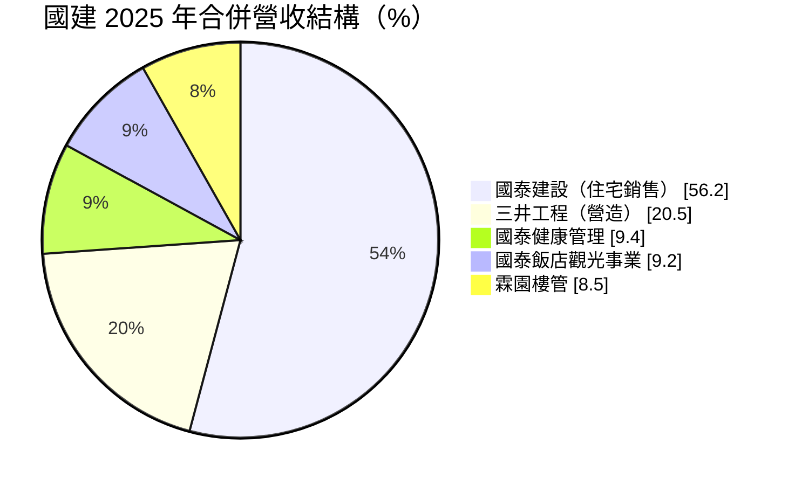
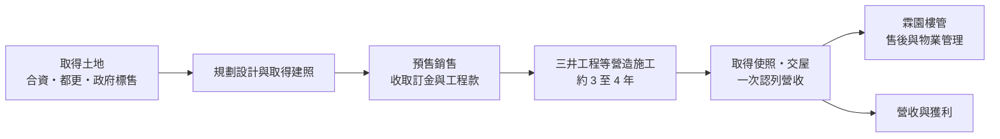
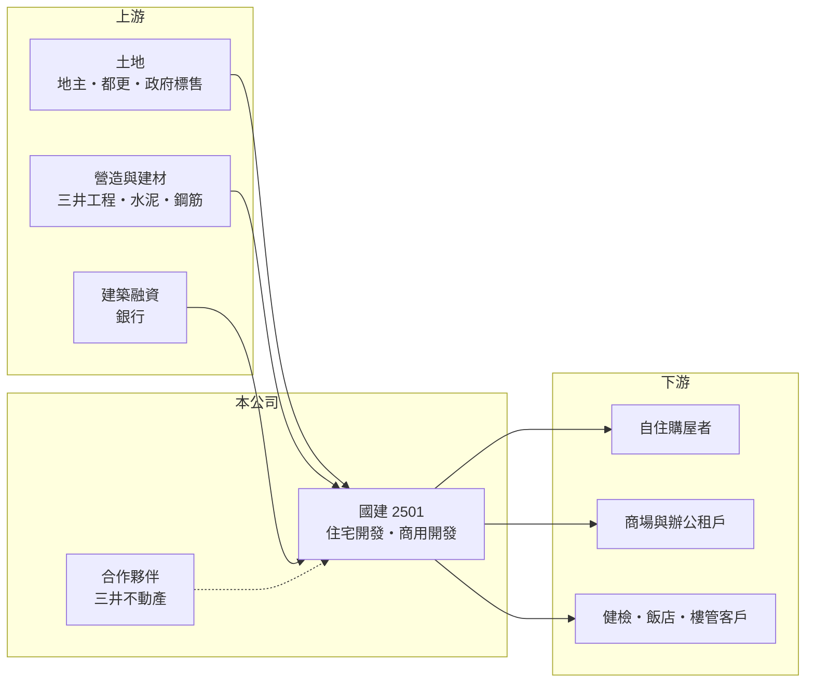

# 2501 國建

> 上市｜[[產業索引-建材營造業|建材營造業]]｜上市（櫃）日期 1967/10/28

# 第一章：企業模式與商業藍圖

> [!info] 撰寫說明
> 本文由 Claude 依公開資料整理，架構比照 [[2330台積電]] 的四章研究，資料截至 2026-10-08。財務數字來源：Goodinfo 年度經營績效頁、富果研究 2026 年 4 月法說會整理、經濟日報與工商時報報導標題；集團與產業描述為整理性內容，尚未逐條比對原始文件。#待校對

在評估單一個股的長期投資價值時，首要步驟是拆解企業的底層獲利邏輯。本章說明國泰建設（股票代號：2501，以下簡稱國建）如何以全台住宅開發為本業，再搭配營造、飯店、健檢與樓管等事業，形成一家「建設加生活服務」的綜合型開發商。

## 一、核心定位：全台布局的品牌型住宅開發商

國建是台灣歷史最悠久的上市建商之一，屬於國泰霖園體系的建設公司（集團關係為整理性內容）。它的核心業務是購買或合作取得土地，規劃興建住宅後銷售，營收在[[建案交屋]]時才一次認列。和多數只深耕單一城市的中小型建商不同，國建同時在台北、桃園、台中、台南、高雄推案，2026 年線上銷售案就分布在這五個都會區。

全台布局的意義在於分散單一區域的景氣風險。當某個城市因為供給過多或政策打壓而去化變慢時，其他區域的建案仍能支撐整體營收，使國建的年度營收雖然仍有起伏，但波動幅度明顯小於只做單一城市的建商。

## 二、營收結構：本業過半，周邊服務提供穩定基礎

依 2025 年合併營收占比，國泰建設本體占 56.2%、三井工程占 20.5%、國泰健康管理占 9.4%、國泰飯店觀光事業占 9.2%、霖園樓管占 8.5%。

這個結構說明國建不是單純的推案公司。三井工程負責營造，讓集團能掌握施工品質與成本；健檢、飯店與樓管則是每年都有收入的服務事業，不必等到交屋才認列，可以在建案空窗期提供基本營收。對長期投資人而言，這些周邊事業的價值在於降低營收的大起大落，而不是取代住宅本業。

## 三、資本轉化邏輯：從土地到交屋的長週期

建商的資本週期很長：買地之後要經過設計、取得建照、預售、施工，最後交屋才認列營收，整個流程常需 4 至 6 年。國建 2025 年底合併總資產約 908.9 億元，其中營建用地、在建工程與完工存貨合計約占 56%，代表一半以上的資本都壓在尚未入帳的土地與房屋上。

依 2026 年 4 月法說會，國建已推案但未入帳的總銷約 1,077 億元，若全數完銷，歸屬國建的業績約 800 億元；另有約 400 億元的住宅推案儲備，以及約 100 億元已達送件門檻的[[都更]]案。這些數字是建商未來數年營收能見度的主要依據，也就是營建業常說的[[已售未入帳]]與推案量。

## 四、企業長期藍圖：與三井不動產合作、商用開發與生活服務

國建的長期方向有三條。第一是與日本三井不動產深度合作，例如共同開發高雄鳳山 Lalaport 與台北南港向陽段住宅案（國建持股 49%、三井 51%），藉此學習日本在產品規劃與空間利用上的做法。第二是多元取得土地，結合合資、都更與政府標售，降低單純向市場高價買地的成本壓力。第三是發展健康管理與飯店餐飲等服務事業，例如國泰健康管理運用 15 年健檢資料推出 AI 預約平台，從一次性健檢轉向長期健康管理。

# 第二章：護城河深度與競爭優勢

「護城河」指企業抵禦競爭、維持超額利潤的保護機制。本章分析國建在高度分散、進入門檻不高的建設業中，靠什麼守住市場地位。

## 一、國建護城河的核心組成要素

建設業的進入門檻不高，只要有資金就能買地推案，因此多數建商沒有明顯的護城河。國建的優勢主要來自品牌與長期累積的信任。房屋是一般家庭一生中最大筆的消費，預售屋又是在房子還沒蓋好之前就付款，買方會優先選擇歷史悠久、交屋紀錄穩定的品牌，這讓國建在同一區域往往能以較快速度去化。

第二個優勢是營造、樓管與建經等上下游整合。集團內有營造與物業管理公司，可以從施工品質一路延伸到交屋後的售後服務，強化品牌的一致性。第三個優勢是土地取得管道多元，與三井不動產的合作也讓國建能參與單一建商難以獨力承擔的大型開發案。

## 二、全國主要競爭對手格局

| 對手 | 定位 | 對國建的威脅 |
|---|---|---|
| [[2520冠德]] | 雙北為主，兼營商場與捷運聯開 | 在台北都會區住宅與大型開發案直接競爭 |
| [[2542興富發]] | 全台推案量最大的建商之一 | 以大量推案與價格策略搶奪首購與換屋客 |
| [[5534長虹]] | 雙北與桃園中高價住宅 | 在中高價自住市場競爭 |
| 各地區域型建商 | 深耕單一城市 | 在地人脈與土地資訊更靈活 |

## 三、優勢轉化：守得住／守不住／觀察重點

守得住的是品牌帶來的去化速度與自住客群的信任，尤其在房市「量縮價盤整」時期，經營層也指出具品牌力、優質地段與符合自住需求的產品較具去化優勢。

守不住的是整體房市景氣與政策。2024 年下半年起央行加強[[信用管制]]，投資性買盤退場，成交量明顯萎縮，再強的品牌也無法完全抵銷總量下滑。長期觀察重點是已推案未入帳的去化率、都更案的推進速度，以及與三井合作的大型案能否如期完工。

# 第三章：財務體質與盈利規模

資料日期：2026-10-08。數字取自 Goodinfo 年度經營績效與富果研究法說會整理，表格是撰寫當時的快照；最新月營收、毛利率、累計 EPS 由自動排程寫在本筆記的屬性欄位（月營收、毛利率、累計EPS 等）。#待校對

財務報表是檢驗護城河是否真實存在的最終標準。本章用五年的三率、ROE、營建業專屬指標與資本報酬，檢視國建的獲利品質。

## 一、獲利能力的基石：三率

| 年度 | 營收（新台幣） | [[毛利率]] | [[營業利益率]] | EPS（元） | [[ROE]] |
|---|---|---|---|---|---|
| 2021 | 125 億 | 21.8% | 7.02% | 0.73 | 3.26% |
| 2022 | 168 億 | 22.5% | 8.79% | 1.04 | 4.90% |
| 2023 | 155 億 | 28.2% | 16.6% | 1.87 | 8.03% |
| 2024 | 239 億 | 21.5% | 10.2% | 1.36 | 5.19% |
| 2025 | 243 億 | 27.8% | 17.1% | 2.83 | 10.4% |

國建的毛利率長期落在 21% 至 28%，高低主要取決於當年交屋建案的土地取得成本與地段；2025 年毛利率較佳，部分來自都更案的貢獻。2021 至 2025 年營收年複合成長率約 18%（推算），但建商營收依交屋時點認列，單一年度的成長率參考價值有限，較適合用多年平均觀察。拉長到 2016 至 2025 年，ROE 多數年度落在 3% 至 11%，只有 2018 年因一次性因素達 17.5%。

## 二、營建業指標：推案量、已售未入帳與存貨

建商的未來營收主要看三個數字。第一是已推案未入帳總銷約 1,077 億元，歸屬國建約 800 億元，約為 2025 年營收的三倍以上，代表未來三至五年的營收能見度高。第二是 2026 年規劃推案約 4 案、總銷 220 至 230 億元，維持穩定推案節奏。第三是存貨：2025 年底完工待售存貨約 71 億元，大部分已於 2026 年第一季交屋，剩餘待售成本約 6 億元，餘屋壓力低。

依 Goodinfo 的 ROE 與 ROA 推算，2025 年總資產約為股東權益的 2.9 倍（推算），負債多為建築融資與預收房款，屬建商常見的財務槓桿。

## 三、[[ROE]] 與股利

2021 至 2025 年平均 ROE 約 6.4%（推算），近十年的 ROE 多在個位數，反映建設業資本密集、回收期長的特性。Goodinfo 統計國建歷年平均現金股利約 0.87 元，平均現金殖利率約 3.5%，股利隨交屋獲利起伏但多數年度有配發，屬於中等穩定度。

## 四、[[ROIC]] 與 [[WACC]]：價值創造利差

**ROIC 推算：** 2025 年營業利益約 41.6 億元（243 億 × 17.1%），稅後約 33.2 億元。股東權益約 307 億元（每股淨值 26.47 元 × 約 11.6 億股），依 ROA 3.66% 推算總資產約 896 億元、總負債約 589 億元，假設其中六成為有息負債約 353 億元（推估），投入資本約 660 億元，ROIC 約 5.0%（推算）。以 2021 至 2025 年平均營業利益計算，ROIC 約 2.8%（推算）。

**WACC 推算：** 假設台灣 10 年期公債殖利率 1.75%、市場風險溢酬 6%、β 取營建同業常見值 0.9，股東權益成本約 7.2%。負債成本假設 3%（建築融資），稅後 2.4%；權益占投入資本約 46%（推估），WACC 約 4.6%（推算）。建商槓桿高，實際 β 可能高於假設，WACC 可能偏低估。

**結論：** 國建在 2025 年的 ROIC 大致與 WACC 相當，五年平均則低於資金成本，代表過去幾年整體上只勉強賺回資金成本。若 1,077 億元已推案未入帳的建案能以目前毛利水準陸續交屋，ROIC 有機會穩定高於 WACC；反之若房市長期量縮，資本長期壓在土地上，價值創造會持續偏弱。

# 第四章：總體風險與地緣政治

任何企業都無法脫離宏觀環境獨立存在。本章分析國建長期必須面對的房市週期、政策與營運風險。

## 一、產業週期與市場結構

房地產是典型的長週期產業，景氣循環往往長達 7 至 10 年，受利率、所得、人口與政策共同影響。建商從買地到交屋需要數年，買地時的市場判斷若與交屋時的景氣錯開，就可能面臨高價土地、低價銷售的困境。台灣人口老化與少子化也會在長期壓抑住宅總需求，未來的成長更依賴換屋、都更與區域產業聚落（例如 AI 與半導體帶動的就業）所創造的剛性需求。

## 二、政策與金融風險

央行的[[信用管制]]、房地合一稅、預售屋實價登錄與禁止轉售等政策，都直接影響買方的資金與投資意願。經營層在 2026 年法說會將信用管制與地緣政治列為主要風險。對建商本身，建築融資的成數與利率也會影響推案節奏與財務成本。

## 三、營運環境的隱性風險

營建成本上升是長期壓力，包括缺工、鋼筋混凝土價格，以及「土方之亂」帶來的土方處理費用增加。都更案需要整合眾多地主，時程常比預期更長。大型合作案若進度延遲，資本會被長期占用、降低資本報酬率。

## 四、轉投資與多角化風險

飯店與健檢事業受觀光與消費景氣影響，規模也相對有限，短期內難以成為主要獲利來源。多角化可以平滑營收，但若投入過多資源在低報酬事業，也可能拉低整體 ROIC。

# 專有名詞解析

## 金融

- **[[信用管制]]**：央行限制購屋與建商貸款成數的政策，會影響房市成交與建商資金。
- **[[ROIC]]**：投入資本報酬率，稅後營業利益除以股東權益加有息負債，衡量本業運用資本的效率。
- **[[WACC]]**：加權平均資金成本，股東與債權人要求報酬率的加權平均，是 ROIC 要超越的門檻。

## 產業

- **[[建案交屋]]**：建商在房屋完工並交付買方時才認列營收，因此營建公司的營收常集中在交屋年度。
- **[[已售未入帳]]**：已經賣出、但尚未完工交屋而未認列營收的建案金額，是建商未來營收的主要能見度指標。
- **[[都更]]**：都市更新，由地主與建商合作把老舊建物改建，地主依權利價值分回房地或收益。

# 核心供應鏈

## 1. 上游：土地、營造與資金
- 土地來源：地主合建、都更、政府標售
- 營造：集團內三井工程；建材如 [[1101台泥]]、[[2504國產]]
- 資金：銀行建築融資

## 2. 中游：國建與合作夥伴
- 合作開發：三井不動產（南港向陽段、鳳山 Lalaport）
- 同業：[[2520冠德]]、[[2542興富發]]、[[5534長虹]]

## 3. 下游：客戶
- 自住與換屋購屋者、商用租戶、健檢與飯店消費者

## 最新新聞
<!-- news:start -->
<!-- news:end -->

## 相關連結
- [公開資訊觀測站](https://mopsov.twse.com.tw/mops/web/t05st03?step=1&firstin=1&co_id=2501)
- [Goodinfo](https://goodinfo.tw/tw/StockDetail.asp?STOCK_ID=2501)
- [Yahoo 股市](https://tw.stock.yahoo.com/quote/2501)
- [鉅亨網新聞](https://www.cnyes.com/twstock/2501/news)
