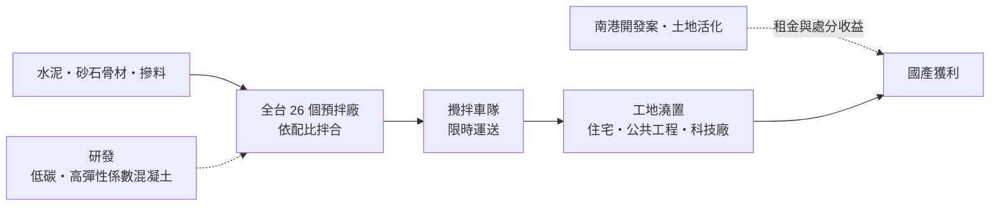
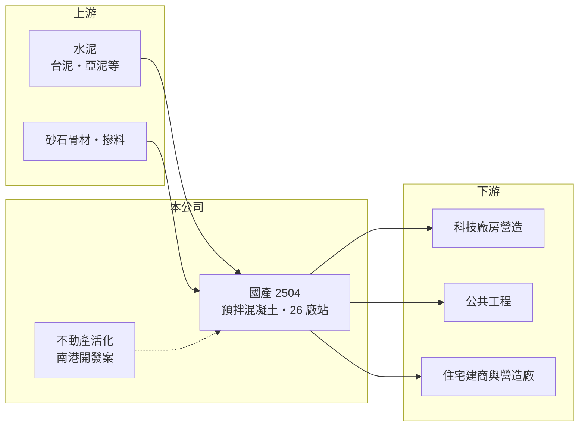

# 2504 國產

> 上市｜[[產業索引-建材營造業|建材營造業]]｜上市（櫃）日期 1978/03/14

# 第一章：企業模式與商業藍圖

> [!info] 撰寫說明
> 本文由 Claude 依公開資料整理，架構比照 [[2330台積電]] 的四章研究，資料截至 2026-10-08。財務數字來源：Goodinfo 年度經營績效頁、富果研究 2025 年 8 月法說會整理、經濟日報與 Yahoo 股市報導標題；產業描述為整理性內容，尚未逐條比對原始文件。公開資料未揭露產品別營收比重。#待校對

在評估單一個股的長期投資價值時，首要步驟是拆解企業的底層獲利邏輯。本章說明國產建材實業（股票代號：2504，以下簡稱國產）這家台灣[[預拌混凝土]]龍頭的商業模式，以及它為什麼能在建材業中維持超過兩成的營業利益率。

## 一、核心定位：全台據點最多的預拌混凝土廠

國產的核心產品是預拌混凝土，也就是在工廠依配比把水泥、砂石、水與摻料拌好，再用攪拌車運到工地澆置的混凝土。依 2025 年法說會資料，國產在全台共有 26 個預拌廠，客戶涵蓋科技廠辦、一般住宅與重大公共建設，2024 年出貨量約 580 餘萬立方米，2025 年目標約 600 萬立方米，[[在手訂單]]約 800 萬立方米。

預拌混凝土有一個關鍵特性：拌好之後必須在一兩個小時內澆置，運送半徑有限，因此是高度在地化的生意。誰的廠站離工地近、車隊調度好，誰就能接單。這讓全台據點最多的國產擁有其他對手難以複製的地理網絡。

## 二、客戶與市場結構

公司未揭露產品別營收比重，但法說會提供了客戶結構的方向：國產提出「333」目標，希望科技廠房、公共工程、一般住宅各占營收約三成；目前住宅占比較高，科技廠房訂單約占 10%。

這個目標的意義在於分散景氣風險。住宅需求受房市與[[信用管制]]影響大，公共工程跟著政府預算走，科技廠房則跟著半導體與 AI 資本支出走。三者的循環不完全同步，比重越平均，國產的出貨量就越不容易因為單一市場轉弱而大幅下滑。

## 三、資本轉化邏輯：在地廠站網絡加上規模採購

預拌混凝土的成本以水泥與砂石為主，售價則隨營建景氣與原料成本調整。國產的獲利來源一方面是規模：採購量大、廠站密集，車隊與產能的利用率較高；另一方面是產品差異化，例如已有 49 款產品取得低碳認證，並推出主打耐震的高彈性係數混凝土，鎖定科技廠房的高規格需求。

國產還有不動產活化的收益。2024 年曾出售台南商城土地認列業外收益；南港開發案若以約 4.6 萬坪出租，管理層初估每年可貢獻 EPS 0.7 至 0.8 元（初步估算）。這類資產收益讓國產的獲利不完全依賴混凝土本業。

## 四、企業長期藍圖：全建材供應鏈、低碳與智慧化

國產的長期方向有三條：一是從預拌混凝土延伸為「全建材供應鏈」，提高每個工地的供貨品項；二是發展低碳混凝土，因應建築業的減碳要求；三是建置台中 AI 工廠，以自動化與資料分析提升生產與調度效率，預計 2026 年完成驗收。這些方向都在強化國產作為營建業上游的規模與技術門檻。

# 第二章：護城河深度與競爭優勢

「護城河」指企業抵禦競爭、維持超額利潤的保護機制。本章分析國產在同質性高的建材業中，靠什麼維持高於同業的利潤率。

## 一、國產護城河的核心組成要素

第一是地理網絡。預拌混凝土的運送半徑有限，新進業者要在都會區取得廠站用地、通過環保審查並建立車隊，時間與成本都很高。國產在全台擁有 26 個廠站，這張網絡本身就是最主要的進入門檻。

第二是大型工程的供應能力。科技廠房與重大公共工程要求連續、大量且穩定的供料，例如大型基礎一次澆置就需要數千立方米。只有產能與車隊夠大的業者能承接，國產因此在高規格工程中具有優勢。

第三是產品技術與認證。低碳認證與高彈性係數混凝土需要配比研發與實績，客戶一旦採用某家的規格，後續工程通常會延續。

## 二、主要競爭對手格局

| 對手 | 定位 | 對國產的威脅 |
|---|---|---|
| [[1101台泥]] 旗下預拌事業 | 水泥垂直整合，自有水泥原料 | 原料成本與供貨穩定性具優勢 |
| [[1102亞泥]] 旗下預拌事業 | 水泥與預拌整合 | 在北部與東部市場競爭 |
| 各地區域型預拌廠 | 小型廠站、價格彈性大 | 在一般住宅小工程以低價搶單 |

## 三、優勢轉化：守得住／守不住／觀察重點

守得住的是大型科技廠、公共工程與高規格產品的訂單，這些客戶重視供料穩定與品質，價格敏感度較低。守不住的是一般住宅小型工程的報價，區域型業者以低價競爭時，國產很難完全避開。長期觀察重點是科技廠與公共工程比重能否接近「333」目標、低碳產品的普及速度，以及南港開發案的出租進度。

# 第三章：財務體質與盈利規模

資料日期：2026-10-08。數字取自 Goodinfo 年度經營績效與富果研究法說會整理，表格是撰寫當時的快照；最新月營收、毛利率、累計 EPS 由自動排程寫在本筆記的屬性欄位（月營收、毛利率、累計EPS 等）。#待校對

財務報表是檢驗護城河是否真實存在的最終標準。本章用五年的三率、ROE 與資本報酬，檢視國產的獲利品質。

## 一、獲利能力的基石：三率

| 年度 | 營收（新台幣） | [[毛利率]] | [[營業利益率]] | EPS（元） | [[ROE]] |
|---|---|---|---|---|---|
| 2021 | 218 億 | 18.8% | 14.9% | 2.42 | 13.4% |
| 2022 | 213 億 | 20.2% | 15.7% | 3.51 | 18.1% |
| 2023 | 210 億 | 23.7% | 19.2% | 3.00 | 14.5% |
| 2024 | 217 億 | 25.7% | 20.9% | 3.90 | 17.2% |
| 2025 | 225 億 | 27.4% | 22.5% | 3.30 | 14.3% |

國產的營收在 2021 至 2025 年大致穩定在 210 至 225 億元，年複合成長率約 0.8%（推算），但毛利率從 18.8% 一路提高到 27.4%，代表成長主要來自售價與產品組合改善，而不是出貨量。拉長到十年看，2016 年曾大幅虧損（EPS -3.27 元，原因未查得），2017 至 2019 年毛利率只有 6% 至 8%，2020 年起才進入高毛利期。這說明預拌混凝土的利潤率對營建景氣與原料價格非常敏感，現在的高利潤率並非理所當然。

## 二、[[ROE]]、股利與財務結構

2021 至 2025 年平均 ROE 約 15.5%（推算），在建材業中屬於高水準。依 Goodinfo 的 ROE 與 ROA 推算，2025 年總資產約為股東權益的 1.6 倍（推算），財務槓桿不高。部分年度的 EPS 包含土地處分等[[一次性收益]]，例如 2024 年的台南商城土地出售，評估本業時應以營業利益為準。股本在 2020 年由 139 億元降至 118 億元（推估為減資）。Goodinfo 統計國產歷年平均現金股利約 0.40 元（加權平均約 0.65 元），近年隨獲利提升而增加。

## 三、[[ROIC]] 與 [[WACC]]：價值創造利差

**ROIC 推算：** 2025 年營業利益約 50.6 億元（225 億 × 22.5%），稅後約 40.5 億元。股東權益約 272 億元（每股淨值 23.01 元 × 約 11.8 億股），依 ROA 8.94% 推算總資產約 434 億元、總負債約 162 億元，假設六成為有息負債約 97 億元（推估），投入資本約 369 億元，ROIC 約 11%（推算）。以 2021 至 2025 年平均營業利益計算，ROIC 約 8.8%（推算）。

**WACC 推算：** 台灣 10 年期公債殖利率假設 1.75%、市場風險溢酬 6%、β 取建材同業常見值 0.9，股東權益成本約 7.2%。負債成本假設 2.5%，稅後 2.0%；權益占投入資本約 74%（推估），WACC 約 5.8%（推算）。

**結論：** 國產近五年 ROIC 約 9% 至 11%，穩定高於約 5.8% 的 WACC，代表本業正在創造經濟價值。不過 2017 至 2019 年的低毛利期 ROIC 推估明顯低於資金成本，利差能否維持，取決於營建景氣與國產能否守住高規格工程的比重。

# 第四章：總體風險與地緣政治

任何企業都無法脫離宏觀環境獨立存在。本章分析國產長期必須面對的景氣、原料與法規風險。

## 一、產業週期與市場結構

預拌混凝土需求直接跟著營建量走，住宅開工、公共工程預算與科技廠建廠節奏都會影響出貨量。住宅市場若因[[信用管制]]或人口結構長期萎縮，國產占比較高的住宅需求就會下滑；科技廠建廠則有明顯的集中與空窗期，訂單常在幾年內集中釋出後又沉寂。

## 二、原料與成本風險

水泥與砂石是主要成本。台灣砂石供應受河川採砂管制與進口來源影響，水泥價格也隨國際能源與碳成本變動。原料價格急漲時，預拌混凝土的報價調整常有時間落差，毛利率會先被壓縮。

## 三、法規與減碳

碳費與建築減碳要求會提高水泥與混凝土的成本，但也會帶動低碳混凝土的需求。國產已有 49 款低碳認證產品，若能把減碳轉成產品溢價，就能從法規壓力中取得優勢；若低碳產品變成產業標配，則只是基本門檻。

## 四、營運環境的隱性風險

廠站多位於都會區周邊，可能面臨都市擴張後的用地與環保壓力。攪拌車司機與工地人力短缺、天候影響施工，也會影響出貨量；2025 年出貨目標就曾因天氣與市場因素由 620 萬立方米下修為約 600 萬立方米。

# 專有名詞解析

## 金融

- **[[信用管制]]**：央行限制購屋與建商貸款成數的政策，會影響房市成交與建商資金。
- **[[一次性收益]]**：處分資產、土地或投資等不會每年重複的收益，會讓單期 EPS 偏離本業實力。
- **[[ROIC]]**：投入資本報酬率，稅後營業利益除以股東權益加有息負債，衡量本業運用資本的效率。
- **[[WACC]]**：加權平均資金成本，股東與債權人要求報酬率的加權平均，是 ROIC 要超越的門檻。

## 產業

- **[[預拌混凝土]]**：在工廠依比例拌好水泥、砂石與水，再以攪拌車運到工地的混凝土，是水泥最主要的下游產品。
- **[[在手訂單]]**：已簽約但尚未完工認列營收的工程金額，可用來預估未來營收。

# 核心供應鏈

## 1. 上游：原料
- 水泥：[[1101台泥]]、[[1102亞泥]] 等
- 砂石骨材與化學摻料

## 2. 中游：國產
- 同業：台泥、亞泥旗下預拌事業與區域型預拌廠

## 3. 下游：營建客戶
- 建商：[[2501國建]]、[[2520冠德]] 等（產業參考）
- 營造：[[2515中工]]、[[2516新建]] 等公共工程承攬商（產業參考）

## 最新新聞
<!-- news:start（自動產生，請勿手動編輯此範圍） -->
- 2026-10-05 📰 媒體 10:56｜北士科廠辦、淡水八里房建需求旺 國產八里廠業績升溫｜[鉅亨網](https://news.cnyes.com/news/id/6621555)

完整紀錄：[[2504國產 新聞]]
<!-- news:end -->

## 相關連結
- [公開資訊觀測站](https://mopsov.twse.com.tw/mops/web/t05st03?step=1&firstin=1&co_id=2504)
- [Goodinfo](https://goodinfo.tw/tw/StockDetail.asp?STOCK_ID=2504)
- [Yahoo 股市](https://tw.stock.yahoo.com/quote/2504)
- [鉅亨網新聞](https://www.cnyes.com/twstock/2504/news)
