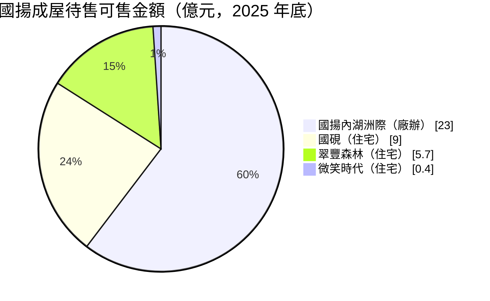
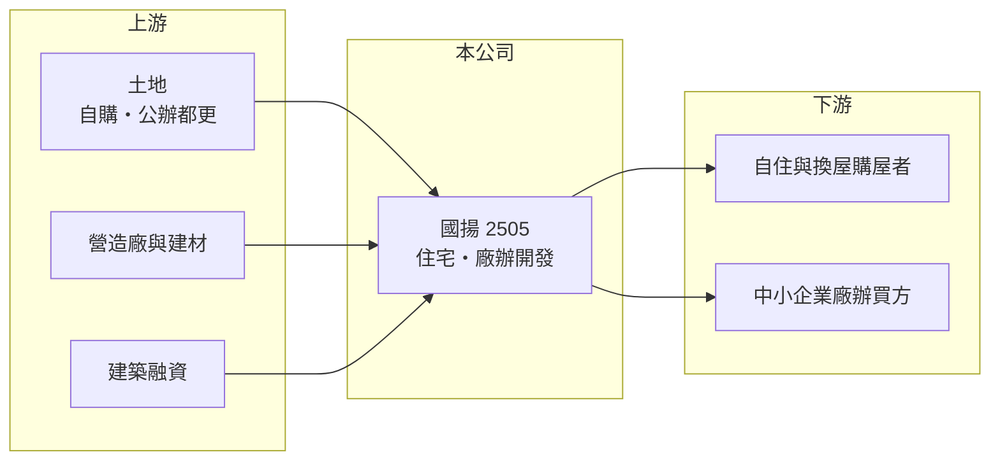

# 2505 國揚

> 上市｜[[產業索引-建材營造業|建材營造業]]｜上市（櫃）日期 1979/11/14

# 第一章：企業模式與商業藍圖

> [!info] 撰寫說明
> 本文由 Claude 依公開資料整理，架構比照 [[2330台積電]] 的四章研究，資料截至 2026-10-08。財務數字來源：Goodinfo 年度經營績效頁、富果研究 2025 年 12 月法說會整理；產業描述為整理性內容，尚未逐條比對原始文件。公開資料有限，未查得已售未入帳與負債明細。#待校對

在評估單一個股的長期投資價值時，首要步驟是拆解企業的底層獲利邏輯。本章說明國揚實業（股票代號：2505，以下簡稱國揚）這家同時開發住宅與廠辦、並積極參與公辦[[都更]]的建商。

## 一、核心定位：住宅與廠辦並進的老牌建商

國揚專注不動產投資興建，產品涵蓋住宅與商用廠辦，公司自述擁有超過 50 年的建築開發經驗。案件分布在新北中和、三重、新店與高雄等地，同時布局雙北與南部市場。

國揚的特色是「住宅加廠辦」的雙產品線。住宅賣給自住與換屋客，廠辦則賣給中小企業作為辦公與輕型生產空間。兩種產品的需求來源不同：住宅跟著家庭所得與房貸條件走，廠辦則跟著企業景氣與產業聚落走。兩條線並行，可以在其中一個市場轉弱時，由另一個市場支撐銷售。

## 二、案件結構

公司未揭露產品別營收比重。依 2025 年 12 月法說會，國揚的案件分成三類：成屋待售（住宅翠豐森林、國硯、微笑時代與廠辦國揚內湖洲際，可售金額合計約 38 億元，其中內湖洲際約 23 億元）；預售 10 案（住宅 6 案、廠辦 4 案）；開發中 3 案（高雄都更、左營之心特貿三，以及新店廠辦案）。

成屋待售中廠辦占六成，代表廠辦產品的去化速度比住宅慢，是國揚目前主要的存貨壓力來源。

## 三、資本轉化邏輯：全部完工法下的集中認列

國揚採[[全部完工法]]認列營收，也就是[[建案交屋]]時才一次認列，因此年度營收波動很大。2020 年營收高達 143 億元、EPS 7.58 元，之後幾年交屋量少，2023、2024 年營收只有 6 至 7 億元，2025 年才因新建案完工回升到 43.7 億元。

## 四、企業長期藍圖：公辦都更與廠辦開發

國揚的中長期成長動能主要來自高雄左營之心（特貿三，預計 2026 年取得建照）與新店廠辦案（2025 年投入，預計 2027 年取得建照）。公司以參與大型公辦都更作為取得指標性開發機會的策略，並強調建築規劃、營建施工與物業管理的一站式整合，以及從施工報告到終身房屋健檢的售後服務。

# 第二章：護城河深度與競爭優勢

「護城河」指企業抵禦競爭、維持超額利潤的保護機制。本章分析國揚在住宅與廠辦市場的競爭位置。

## 一、國揚護城河的核心組成要素

建設業的進入門檻不高，國揚的優勢主要有三點。第一是公辦都更的參與能力：政府主導的都更案需要投標、提出規劃並長期配合審議，有實績的建商較容易得標，取得的土地也多位於指標地段。

第二是廠辦產品經驗。廠辦要兼顧樓板載重、電力、貨梯與停車等企業需求，規劃方式與住宅不同，累積經驗的建商在設計與銷售上較有把握。

第三是售後服務與品牌。國揚以終身房屋健檢等服務建立品牌，有助於在自住市場累積口碑。

## 二、主要競爭對手格局

| 對手 | 定位 | 對國揚的威脅 |
|---|---|---|
| [[2520冠德]] | 雙北住宅、商辦與公辦都更 | 在公辦都更招標與雙北住宅競爭 |
| [[2501國建]] | 全台住宅開發 | 品牌建商搶自住客 |
| 雙北廠辦開發商 | 專做工業區廠辦 | 新北廠辦供給多，價格競爭激烈 |

## 三、優勢轉化：守得住／守不住／觀察重點

守得住的是已得標的公辦都更與預售案件權益。守不住的是廠辦市場的供需：新北與內湖廠辦供給持續增加，成屋待售中廠辦占比高，顯示去化需要時間。長期觀察重點是左營之心與新店廠辦案的取得建照進度，以及內湖洲際等成屋廠辦的去化。

# 第三章：財務體質與盈利規模

資料日期：2026-10-08。數字取自 Goodinfo 年度經營績效與富果研究法說會整理，表格是撰寫當時的快照；最新月營收、毛利率、累計 EPS 由自動排程寫在本筆記的屬性欄位（月營收、毛利率、累計EPS 等）。#待校對

財務報表是檢驗護城河是否真實存在的最終標準。本章用五年的三率、ROE 與資本報酬，檢視國揚的獲利品質。

## 一、獲利能力的基石：三率

| 年度 | 營收（新台幣） | [[毛利率]] | [[營業利益率]] | EPS（元） | [[ROE]] |
|---|---|---|---|---|---|
| 2021 | 51.2 億 | 26.6% | 18.3% | 2.58 | 10.6% |
| 2022 | 39.5 億 | 19.8% | 7.06% | 1.28 | 5.15% |
| 2023 | 7.35 億 | 39.6% | 1.46% | 0.80 | 3.08% |
| 2024 | 6.08 億 | 39.1% | -8.05% | 0.52 | 2.00% |
| 2025 | 43.7 億 | 28.3% | 17.5% | 2.37 | 8.45% |

國揚的營收隨交屋週期大幅波動，年複合成長率沒有參考意義。毛利率多在 20% 至 40%，營業利益率則在交屋量少的年度降到接近零甚至負值。值得注意的是 2023、2024 年營業利益很低，但 EPS 仍為正，代表當年有業外收益支撐，評估本業時應以營業利益為準。2021 至 2025 年平均 ROE 約 5.9%（推算）；拉長到 2016 至 2019 年，ROE 只有 -0.6% 至 1.9%，2020 年因大案交屋達 56.5%，可見國揚的獲利高度集中在少數年度。

## 二、營建業指標：存貨與資本結構

成屋待售可售金額約 38 億元，加上 10 個預售案，構成未來幾年的營收來源；已售未入帳金額未查得。依 Goodinfo 的 ROE 與 ROA 推算，2025 年總資產約為股東權益的 2.1 倍（推算）。股本在 2020 年由 69.7 億元降為 38 億元（推估為減資），每股淨值因此由約 12 元提高到 24 元以上，2025 年為 28.67 元。

## 三、股利

Goodinfo 統計國揚歷年平均現金股利約 0.21 元，股利隨交屋獲利起伏，穩定度偏低。

## 四、[[ROIC]] 與 [[WACC]]：價值創造利差

**ROIC 推算：** 2025 年營業利益約 7.6 億元（43.7 億 × 17.5%），稅後約 6.1 億元。股東權益約 109 億元（每股淨值 28.67 元 × 3.8 億股），依 ROA 3.99% 推算總資產約 225 億元、總負債約 116 億元，假設六成為有息負債約 70 億元（推估），投入資本約 179 億元，ROIC 約 3.4%（推算）。以 2021 至 2025 年平均營業利益計算，ROIC 約 1.7%（推算）。

**WACC 推算：** 台灣 10 年期公債殖利率假設 1.75%、市場風險溢酬 6%、β 取營建同業常見值 0.9，股東權益成本約 7.2%。負債成本假設 3%，稅後 2.4%；權益占投入資本約 61%（推估），WACC 約 5.3%（推算）。

**結論：** 國揚近五年的 ROIC 低於 WACC，即使 2025 年交屋回升也尚未跨過資金成本。除非公辦都更與廠辦新案能提高交屋頻率與營業利益率，否則長期資本報酬仍偏弱。

# 第四章：總體風險與地緣政治

任何企業都無法脫離宏觀環境獨立存在。本章分析國揚長期必須面對的產業、政策與營運風險。

## 一、產業週期與市場結構

住宅市場受利率、所得與人口結構影響，廠辦市場則受企業景氣與產業聚落影響。新北與內湖的廠辦供給在 2020 年代大量增加，若企業擴張放緩，廠辦去化會明顯變慢。採全部完工法認列的國揚，營收與獲利高度集中在交屋年度，空窗期可能連續數年獲利偏低。

## 二、政策與金融風險

央行[[信用管制]]不只影響住宅，也限制工業區廠辦與土地融資的貸款成數。公辦都更的招標、審議與容積獎勵若有調整，也會影響開發案的效益與時程。

## 三、營運環境的隱性風險

營建成本上升與缺工可能壓縮新案毛利；公辦都更案需配合政府審議，時程常比預期更長。高雄左營之心等大案若推案時機不佳，會長期占用資本。

## 四、業外收益依賴

國揚部分年度的獲利依賴業外收益，業外收益的持續性較低。投資人需要分辨本業獲利與一次性收益，避免高估公司的長期獲利能力。

# 專有名詞解析

## 金融

- **[[信用管制]]**：央行限制購屋與建商貸款成數的政策，會影響房市成交與建商資金。
- **[[ROIC]]**：投入資本報酬率，稅後營業利益除以股東權益加有息負債，衡量本業運用資本的效率。
- **[[WACC]]**：加權平均資金成本，股東與債權人要求報酬率的加權平均，是 ROIC 要超越的門檻。

## 產業

- **[[都更]]**：都市更新，由地主與建商合作把老舊建物改建，地主依權利價值分回房地或收益。
- **[[建案交屋]]**：建商在房屋完工並交付買方時才認列營收，因此營建公司的營收常集中在交屋年度。
- **[[全部完工法]]**：建案完工交屋時才一次認列全部營收與成本的會計方法，使建商營收集中在交屋年度。

# 核心供應鏈

## 1. 上游：土地、營造與資金
- 公辦都更標案、自購土地、營造廠與銀行融資

## 2. 中游：國揚
- 同業：[[2520冠德]]、[[2501國建]]

## 3. 下游：客戶
- 雙北與高雄的住宅買方、廠辦企業買方

## 最新新聞
<!-- news:start -->
<!-- news:end -->

## 相關連結
- [公開資訊觀測站](https://mopsov.twse.com.tw/mops/web/t05st03?step=1&firstin=1&co_id=2505)
- [Goodinfo](https://goodinfo.tw/tw/StockDetail.asp?STOCK_ID=2505)
- [Yahoo 股市](https://tw.stock.yahoo.com/quote/2505)
- [鉅亨網新聞](https://www.cnyes.com/twstock/2505/news)
