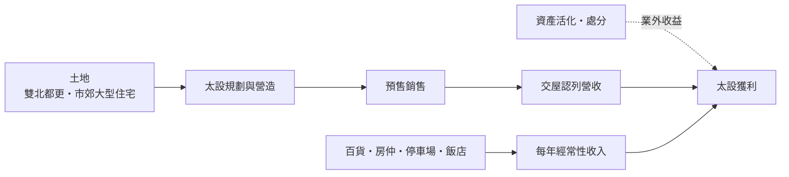
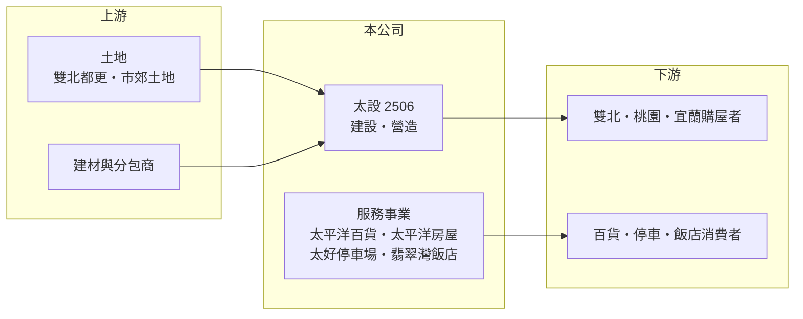

# 2506 太設

> 上市｜[[產業索引-建材營造業|建材營造業]]｜上市（櫃）日期 1980/02/02

# 第一章：企業模式與商業藍圖

> [!info] 撰寫說明
> 本文由 Claude 依公開資料整理，架構比照 [[2330台積電]] 的四章研究，資料截至 2026-10-08。財務數字來源：Goodinfo 年度經營績效頁、富果研究 2026 年 6 月法說會整理；公司歷史與產業描述為整理性內容，尚未逐條比對原始文件。公開資料有限，未查得事業別營收比重與存貨明細。#待校對

在評估單一個股的長期投資價值時，首要步驟是拆解企業的底層獲利邏輯。本章說明太平洋建設（股票代號：2506，以下簡稱太設）這家老字號建商，如何以住宅開發為核心，搭配百貨、房仲、停車場與休閒等事業。

## 一、核心定位：歷史悠久的住宅建商與多角化集團

太設成立於 1967 年、1980 年上市，總部位於台北市信義區，經營理念為「把聲譽建築在建築上」。目前董事長為柳逸義、總經理為陳清暉。太設曾是台灣規模最大的建設集團之一，2000 年代初期經歷財務困境後規模大幅縮小（整理性內容），現在的營收規模約在每年 10 至 30 億元之間。

太設的業務分為六塊：建設（核心，住宅開發）、營造、百貨（太平洋百貨）、房仲（太平洋房屋）、停車場（太好停車場）與休閒（群策翡翠灣溫泉飯店）。其中停車場被公司定位為提供穩定現金流的事業。

## 二、營收結構：建案交屋為主，服務事業為輔

公司未揭露事業別營收比重。從財務數字看，太設 2023 至 2025 年營收約 14.9 億元、14.4 億元與 11.4 億元，2025 年下滑主要是建案完工交屋與餘屋出售數量減少，可見營收仍以[[建案交屋]]為主，服務事業提供基本收入。

## 三、資本轉化邏輯：小規模推案加資產活化

太設的獲利有三個來源：建案交屋、服務事業的經常性收入，以及資產活化或處分。第三項在太設的歷史中影響很大：2022 年與 2024 年的 EPS 分別為 1.59 元與 2.04 元，但當年營業利益率只有 5.69% 與 -8.4%，代表獲利主要來自業外收益，而非本業。

依 2026 年法說會，太設待交屋建案合計 114 戶、銷售金額約 26 億元，包括台北大安區的敦南麗舍、宜蘭的太平洋至臻，以及桃園楊梅的陽光四季臻美與臻藏，預計 2026 年至 2027 年陸續交屋。

## 四、企業長期藍圖：都更、市郊住宅與服務升級

太設的長期策略包括深耕雙北[[都更]]案件、擴大市郊大型住宅開發、積極活化資產；房仲業擴大市占並導入科技系統；百貨、休閒與停車事業則透過設施升級提升服務品質。這些方向顯示太設正試圖在有限的資本下，同時經營開發與服務兩條線。

# 第二章：護城河深度與競爭優勢

「護城河」指企業抵禦競爭、維持超額利潤的保護機制。本章分析太設在競爭激烈的建設業中保有哪些優勢。

## 一、太設護城河的核心組成要素

太設的護城河很淺，主要優勢有三點。第一是歷史品牌：成立近 60 年，「太平洋」品牌在建設、百貨與房仲都有知名度，有助於建案銷售與房仲加盟。

第二是持有型資產與服務事業。停車場、飯店與百貨提供經常性收入，讓公司在建案空窗期仍有基本現金流。

第三是低財務槓桿。依法說會，負債比已降至約 30%，在建商中偏低，代表公司有一定的財務彈性，不必在景氣差時被迫降價出售。

## 二、主要競爭對手格局

| 對手 | 定位 | 對太設的威脅 |
|---|---|---|
| [[2501國建]]、[[2520冠德]] | 大型品牌建商 | 在雙北住宅與都更市場資金與規模優勢明顯 |
| 桃園與宜蘭在地建商 | 深耕市郊 | 在市郊住宅以價格與在地關係競爭 |
| 大型房仲品牌 | 直營與加盟體系 | 房仲事業市占競爭 |

## 三、優勢轉化：守得住／守不住／觀察重點

守得住的是品牌與低負債帶來的經營穩定。守不住的是規模：太設的推案量小，單一年度的獲利容易受業外收益左右，本業的營業利益率長期偏低。長期觀察重點是 26 億元待交屋建案的入帳、都更案的取得，以及服務事業能否提高經常性獲利。

# 第三章：財務體質與盈利規模

資料日期：2026-10-08。數字取自 Goodinfo 年度經營績效與富果研究法說會整理，表格是撰寫當時的快照；最新月營收、毛利率、累計 EPS 由自動排程寫在本筆記的屬性欄位（月營收、毛利率、累計EPS 等）。#待校對

財務報表是檢驗護城河是否真實存在的最終標準。本章用五年的三率、ROE 與資本報酬，檢視太設的本業獲利能力。

## 一、獲利能力的基石：三率

| 年度 | 營收（新台幣） | [[毛利率]] | [[營業利益率]] | EPS（元） | [[ROE]] |
|---|---|---|---|---|---|
| 2021 | 16.7 億 | 35.9% | 6.54% | 0.26 | 1.79% |
| 2022 | 8.57 億 | -47.2%（來源數字，待核對） | 5.69% | 1.59 | 7.99% |
| 2023 | 14.9 億 | 37.5% | 7.66% | 0.12 | 1.35% |
| 2024 | 14.4 億 | 33.6% | -8.4% | 2.04 | 9.38% |
| 2025 | 11.4 億 | 45.3% | 2.93% | 0.02 | 0.95% |

太設的毛利率多數年度在 33% 至 45%，但營業利益率只有個位數甚至為負，代表管銷費用占營收比重高，規模不足以攤提固定成本。2022 年 Goodinfo 的毛利率為 -47.2%、營業利益率卻為正，數字彼此不一致，需以財報核對。2021 至 2025 年平均 ROE 約 4.3%（推算），但其中 2022 與 2024 年的 ROE 主要來自業外收益；若只看本業，ROE 長期約在 1% 至 2%。營收在 2016 至 2025 年間多在 8 至 30 億元之間起伏，沒有明顯的成長趨勢。

## 二、營建業指標：待交屋與負債

待交屋建案 114 戶、銷售金額約 26 億元，約為 2025 年營收的 2.3 倍，未來兩年的營收有一定能見度。法說會指出負債比約 30%，在建商中偏低。

## 三、股利

Goodinfo 統計太設歷年平均現金股利約 0.14 元，金額小且不穩定，與本業獲利偏低一致。

## 四、[[ROIC]] 與 [[WACC]]：價值創造利差

**ROIC 推算：** 2025 年營業利益約 0.33 億元（11.4 億 × 2.93%），稅後約 0.27 億元。股東權益約 83 億元（每股淨值 21.57 元 × 3.87 億股），以負債比 30% 推算總負債約 36 億元，假設六成為有息負債約 21 億元（推估），投入資本約 104 億元，ROIC 約 0.3%（推算）。以 2021 至 2025 年平均營業利益約 0.37 億元計算，ROIC 也只有約 0.3%（推算）。

**WACC 推算：** 台灣 10 年期公債殖利率假設 1.75%、市場風險溢酬 6%、β 取營建同業常見值 0.9，股東權益成本約 7.2%。負債成本假設 3%，稅後 2.4%；權益占投入資本約 80%（推估），WACC 約 6.2%（推算）。

**結論：** 太設本業的 ROIC 長期遠低於 WACC，代表投入的資本在本業上幾乎沒有創造報酬，帳面獲利主要依賴資產處分。對長期投資人而言，太設的價值更接近「資產價值加上待交屋建案」，而不是穩定的本業獲利能力。

# 第四章：總體風險與地緣政治

任何企業都無法脫離宏觀環境獨立存在。本章分析太設長期必須面對的產業、政策與營運風險。

## 一、產業週期與規模限制

建設業景氣循環長，太設推案量小，單一建案的交屋時點就能左右全年營收。規模小也代表管銷費用比重高，即使毛利率不低，營業利益仍容易偏低。

## 二、政策與金融風險

央行[[信用管制]]、房地合一稅與預售屋法規會影響買方需求；市郊大型住宅的買方多為首購與自住客，對貸款條件尤其敏感。

## 三、業外收益依賴

太設部分年度的獲利來自資產處分等[[一次性收益]]，這類收益不會每年重複。若可處分的資產減少，而本業沒有同步提升，帳面獲利可能長期偏低。

## 四、多角化事業的風險

百貨受電商與新型購物中心競爭影響，飯店受觀光景氣影響，房仲則與房市成交量同步。多角化可以提供基本收入，但若各事業規模都不大，管理資源分散，也可能無法在任何一個市場建立明顯優勢。

# 專有名詞解析

## 金融

- **[[一次性收益]]**：處分資產、土地或投資等不會每年重複的收益，會讓單期 EPS 偏離本業實力。
- **[[信用管制]]**：央行限制購屋與建商貸款成數的政策，會影響房市成交與建商資金。
- **[[ROIC]]**：投入資本報酬率，稅後營業利益除以股東權益加有息負債，衡量本業運用資本的效率。
- **[[WACC]]**：加權平均資金成本，股東與債權人要求報酬率的加權平均，是 ROIC 要超越的門檻。

## 產業

- **[[都更]]**：都市更新，由地主與建商合作把老舊建物改建，地主依權利價值分回房地或收益。
- **[[建案交屋]]**：建商在房屋完工並交付買方時才認列營收，因此營建公司的營收常集中在交屋年度。

# 核心供應鏈

## 1. 上游：土地與營造資源
- 雙北都更土地、桃園與宜蘭市郊土地，建材與分包商

## 2. 中游：太設與服務事業
- 太平洋百貨、太平洋房屋、太好停車場、群策翡翠灣溫泉飯店
- 同業：[[2501國建]]、[[2520冠德]]

## 3. 下游：客戶
- 住宅買方、百貨與飯店消費者、停車場用戶

## 最新新聞
<!-- news:start -->
<!-- news:end -->

## 相關連結
- [公開資訊觀測站](https://mopsov.twse.com.tw/mops/web/t05st03?step=1&firstin=1&co_id=2506)
- [Goodinfo](https://goodinfo.tw/tw/StockDetail.asp?STOCK_ID=2506)
- [Yahoo 股市](https://tw.stock.yahoo.com/quote/2506)
- [鉅亨網新聞](https://www.cnyes.com/twstock/2506/news)
