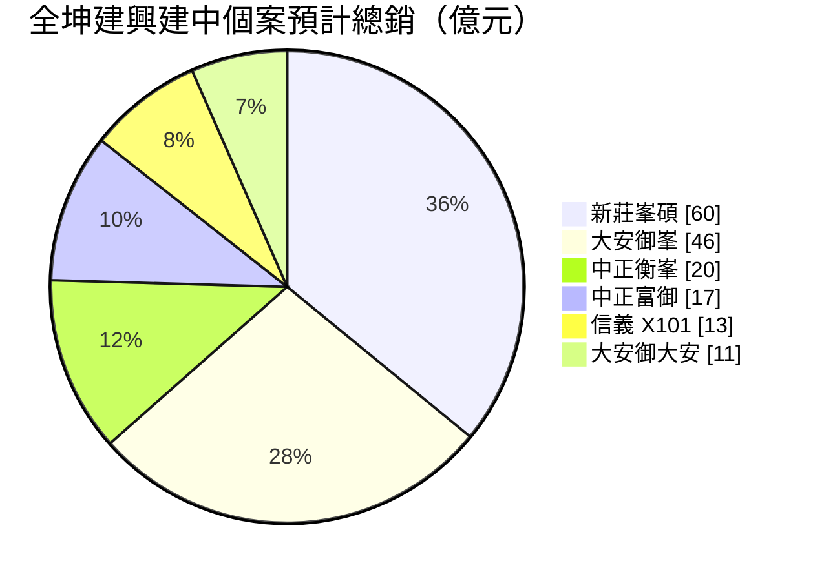
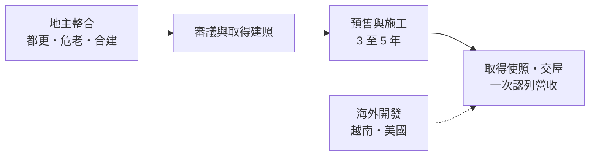
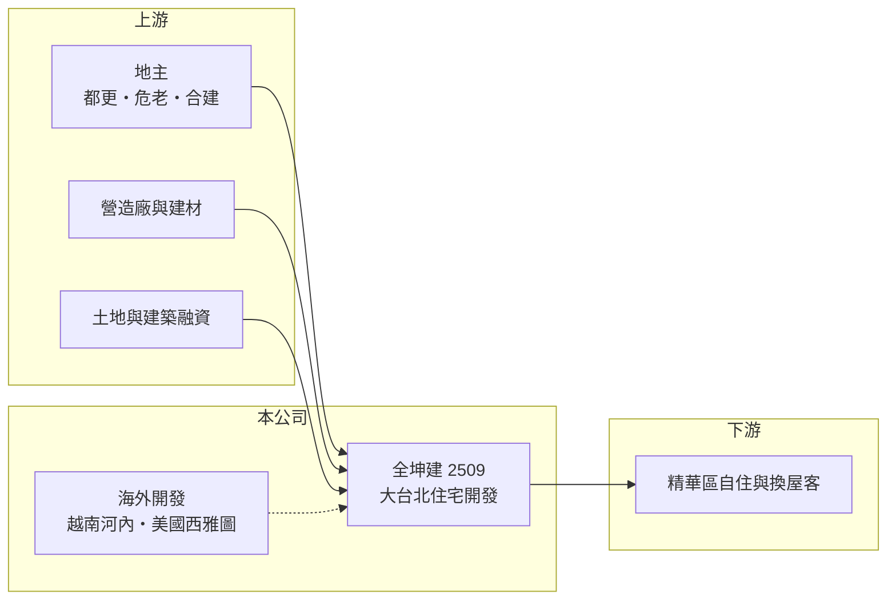

# 2509 全坤建

> 上市｜[[產業索引-建材營造業|建材營造業]]｜上市（櫃）日期 1988/05/20

# 第一章：企業模式與商業藍圖

> [!info] 撰寫說明
> 本文由 Claude 依公開資料整理，架構比照 [[2330台積電]] 的四章研究，資料截至 2026-10-08。財務數字來源：Goodinfo 年度經營績效頁、富果研究 2026 年 6 月法說會整理；產業描述為整理性內容，尚未逐條比對原始文件。公開資料有限，未查得已售未入帳與負債明細。#待校對

在評估單一個股的長期投資價值時，首要步驟是拆解企業的底層獲利邏輯。本章說明全坤建設（股票代號：2509，以下簡稱全坤建）這家專注大台北[[都更]]與[[危老重建]]的中小型建商，以及它為什麼連續多年營收偏低。

## 一、核心定位：大台北都更與危老的專業開發商

全坤建的核心業務是在大台北都會區以買地、[[合建]]分屋、都市更新與危老重建等方式開發住宅。它的案件集中在台北市的信義、大安、中正等精華區，以及新北的新莊、三重，產品偏向中高價位住宅。

都更與危老是大台北取得土地的主要管道，因為市區幾乎沒有大面積空地，建商必須和老舊建物的地主合作改建。全坤建以整合複雜產權的經驗作為主要能力，這也是公司在法說會上自認的優勢。

## 二、案件結構：興建中 6 案、規劃中 8 案

依 2026 年 6 月法說會資料，全坤建興建中的 6 個案件預計總銷合計約 167 億元：信義 X101（公辦都更，約 13 億元）、新莊峯碩（約 60 億元）、大安御大安（危老合建，約 11 億元）、中正富御（都更合建，約 17 億元）、大安御峯（公辦都更，約 46 億元）、中正衡峯（危老合建，約 20 億元）。

另有萬華台北戲院、三重雙星、北投熱海、大同塔城街、內湖文德等 8 個規劃中案件。海外則有越南河內 Golden Lotus 住商旅館複合開發與美國西雅圖 5V Project 住商大樓，定位為輔助業務。

## 三、資本轉化邏輯：長期整合、集中交屋

都更案從整合到交屋常需 5 至 10 年，全坤建的營收因此高度集中在少數交屋年度。2018 年營收達 39.5 億元、EPS 5.7 元，之後幾年交屋量少，2022、2023 與 2025 年都出現營業虧損，因為沒有案件交屋時，管銷與利息仍持續發生。

依公司指引，峯碩預計 2027 年第一季取得使照，御大安 2027 年第二季，富御 2029 年第二季，御峯 2029 年第四季，衡峯 2030 年第二季。公司認為營運高峰將落在 2027 年之後。

## 四、企業長期藍圖：深耕大台北，海外為輔

全坤建的長期策略是聚焦大台北的多元土地開發，海外案件依政經情勢彈性調整投資比重。公司的成長完全取決於興建中案件能否依時程完工交屋，以及規劃中案件能否順利取得建照，這是一家「營收能見度要用五年尺度看」的公司。

# 第二章：護城河深度與競爭優勢

「護城河」指企業抵禦競爭、維持超額利潤的保護機制。本章分析全坤建在大台北都更市場的競爭位置。

## 一、全坤建護城河的核心組成要素

第一是產權整合經驗。都更與危老需要說服多位地主、協調權利價值分配並通過審議，失敗的案件可能拖延多年。全坤建長期在台北市精華區操作這類案件，累積的實績與地主口碑是新進建商難以短期取得的。

第二是精華地段的案源。大安、信義、中正等區的新建住宅供給稀少，都更取得的土地成本通常低於直接向市場購地，這讓全坤建的毛利率多數年度維持在 30% 以上。

第三是產品定位。中高價位的精華區住宅，買方多為自住或換屋客，對景氣的敏感度略低於投資客主導的市場。

## 二、主要競爭對手格局

| 對手 | 定位 | 對全坤建的威脅 |
|---|---|---|
| [[2442新美齊]] | 雙北、台中、高雄都更與危老 | 爭取同類型的都更案源 |
| [[2520冠德]]、[[2501國建]] | 大型品牌建商 | 資金與品牌優勢，參與公辦都更 |
| 台北市地方型都更建商 | 深耕單一行政區 | 與地主關係更緊密 |

## 三、優勢轉化：守得住／守不住／觀察重點

守得住的是已取得建照、進入施工的案件權益，以及精華區產品的去化力。守不住的是案件之間的空窗期，以及都更審議時程的不確定性。長期觀察重點是峯碩與御大安能否如期在 2027 年交屋，以及規劃中案件取得建照的速度。

# 第三章：財務體質與盈利規模

資料日期：2026-10-08。數字取自 Goodinfo 年度經營績效與富果研究法說會整理，表格是撰寫當時的快照；最新月營收、毛利率、累計 EPS 由自動排程寫在本筆記的屬性欄位（月營收、毛利率、累計EPS 等）。#待校對

財務報表是檢驗護城河是否真實存在的最終標準。本章用五年的三率、ROE 與資本報酬，檢視全坤建在案件空窗期的財務表現。

## 一、獲利能力的基石：三率

| 年度 | 營收（新台幣） | [[毛利率]] | [[營業利益率]] | EPS（元） | [[ROE]] |
|---|---|---|---|---|---|
| 2021 | 7.93 億 | 33.2% | 10.8% | 0.20 | 0.89% |
| 2022 | 2.03 億 | 36.5% | -39.0% | -0.67 | -3.27% |
| 2023 | 2.23 億 | 33.6% | -38.3% | -1.09 | -5.34% |
| 2024 | 14.2 億 | 31.0% | 13.6% | 0.21 | 1.24% |
| 2025 | 2.64 億 | 30.6% | -36.9% | -0.80 | -4.02% |

全坤建的毛利率五年都維持在 30% 至 37%，代表單一案件本身是賺錢的；問題在於交屋量太少，營收不足以支應固定費用，營業利益率在空窗年度跌到 -37% 至 -39%。2021 至 2025 年平均 ROE 約 -2.1%（推算），每股淨值由 18.8 元降到 17.42 元。對照 2018 年營收 39.5 億元、ROE 25.8% 的高峰，可以看出這類公司的獲利完全取決於交屋時點。

## 二、營建業指標：推案量與資產結構

興建中 6 案預計總銷約 167 億元，約為公司 2018 年高峰營收的四倍，若依時程在 2027 至 2030 年陸續交屋，將形成連續數年的營收來源。依 Goodinfo 的 ROE 與 ROA 推算，2025 年總資產約為股東權益的 3.3 倍（推算），負債多為土地與建築融資，興建期間的利息與持有成本是空窗期虧損的重要來源。已售未入帳金額與存貨明細未查得。

## 三、股利

Goodinfo 統計全坤建歷年平均現金股利約 0.51 元，但近年多數年度虧損，股利缺乏穩定性。

## 四、[[ROIC]] 與 [[WACC]]：價值創造利差

**ROIC 推算：** 2025 年營業虧損約 1.0 億元（2.64 億 × -36.9%），虧損不計稅。股東權益約 39 億元（每股淨值 17.42 元 × 2.25 億股），依 ROA -1.4% 推算總資產約 129 億元、總負債約 89 億元，假設六成為有息負債約 54 億元（推估），投入資本約 93 億元，ROIC 約 -1%（推算）。以 2021 至 2025 年平均營業利益計算，ROIC 約 0%（推算）。

**WACC 推算：** 台灣 10 年期公債殖利率假設 1.75%、市場風險溢酬 6%、β 取營建同業常見值 0.9，股東權益成本約 7.2%。負債成本假設 3%，稅後 2.4%；權益占投入資本約 42%（推估），WACC 約 4.4%（推算）。實際 β 在高槓桿下可能更高。

**結論：** 近五年全坤建的 ROIC 遠低於 WACC，代表投入的資本尚未產生足夠報酬。這是都更型建商在長期開發期間的常態，價值能否實現，要看 2027 年後興建中案件交屋時能否一次賺回過去幾年的持有成本。

# 第四章：總體風險與地緣政治

任何企業都無法脫離宏觀環境獨立存在。本章分析全坤建長期必須面對的產業、政策與營運風險。

## 一、產業週期與營收集中

全坤建規模小、案件少，單一案件延誤就可能讓整年度虧損。都更案的時程以五到十年計，期間房市可能經歷完整的景氣循環，買地或談定分配比例時的市場條件，與交屋時的市場條件可能差距很大。

## 二、政策與金融風險

央行[[信用管制]]影響購屋貸款與建商的土地、建築融資；都更與危老的容積獎勵、審議制度若調整，會直接改變案件的經濟效益。利率上升則會增加長期開發期間的資金成本。

## 三、營運環境的隱性風險

缺工與營建成本上升會壓縮合建案的利潤，因為分配比例多在開工前談定。都更案常因少數地主反對或訴訟延宕。法說會提到峯碩、富御、御峯、衡峯等案的使照時程分布在 2027 至 2030 年，任何延遲都會拉長虧損期間。

## 四、海外投資風險

越南與美國案件面臨匯率、當地法規與執照審批的不確定性，越南案仍在執照變更、美國案仍在申請建照。海外案件雖是輔助業務，若投入資金過多，也可能分散公司有限的資源。

# 專有名詞解析

## 金融

- **[[信用管制]]**：央行限制購屋與建商貸款成數的政策，會影響房市成交與建商資金。
- **[[ROIC]]**：投入資本報酬率，稅後營業利益除以股東權益加有息負債，衡量本業運用資本的效率。
- **[[WACC]]**：加權平均資金成本，股東與債權人要求報酬率的加權平均，是 ROIC 要超越的門檻。

## 產業

- **[[都更]]**：都市更新，由地主與建商合作把老舊建物改建，地主依權利價值分回房地或收益。
- **[[危老重建]]**：依都市危險及老舊建築物加速重建條例，以容積獎勵與簡化程序推動老舊建物重建。
- **[[合建]]**：地主提供土地、建商負責出資興建，完工後雙方依約定比例分配房屋或銷售收入的開發模式。

# 核心供應鏈

## 1. 上游：土地、營造與資金
- 地主（公辦都更、危老、合建）、營造廠、銀行融資

## 2. 中游：全坤建
- 同業：[[2442新美齊]]、[[2520冠德]]、[[2501國建]]

## 3. 下游：客戶
- 台北市與新北的自住、換屋購屋者

## 最新新聞
<!-- news:start（自動產生，請勿手動編輯此範圍） -->
- 2026-10-08 📰 媒體 17:23｜營收速報 - 全坤建(2509)9月營收2,723萬元年增率高達31.86％｜[鉅亨網](https://news.cnyes.com/news/id/6624999)

完整紀錄：[[2509全坤建 新聞]]
<!-- news:end -->

## 相關連結
- [公開資訊觀測站](https://mopsov.twse.com.tw/mops/web/t05st03?step=1&firstin=1&co_id=2509)
- [Goodinfo](https://goodinfo.tw/tw/StockDetail.asp?STOCK_ID=2509)
- [Yahoo 股市](https://tw.stock.yahoo.com/quote/2509)
- [鉅亨網新聞](https://www.cnyes.com/twstock/2509/news)
