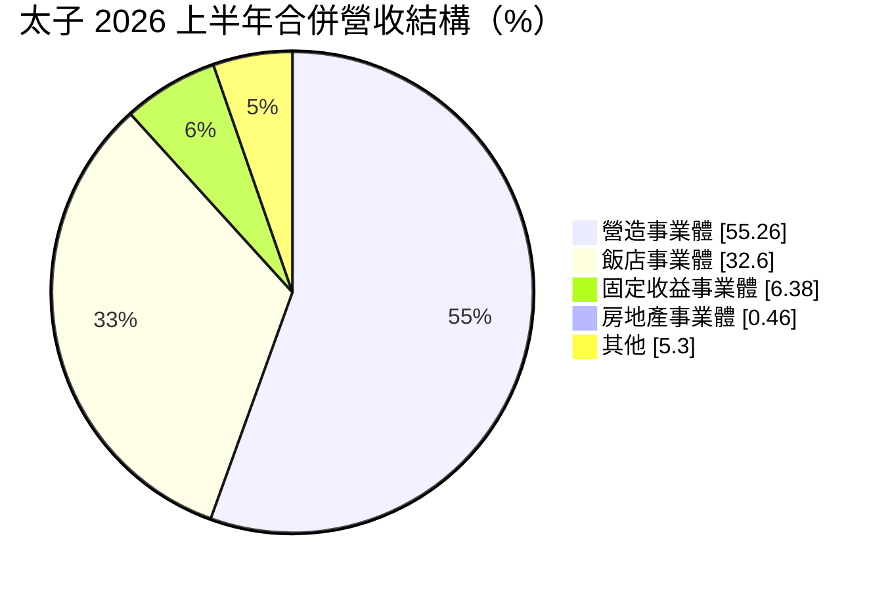
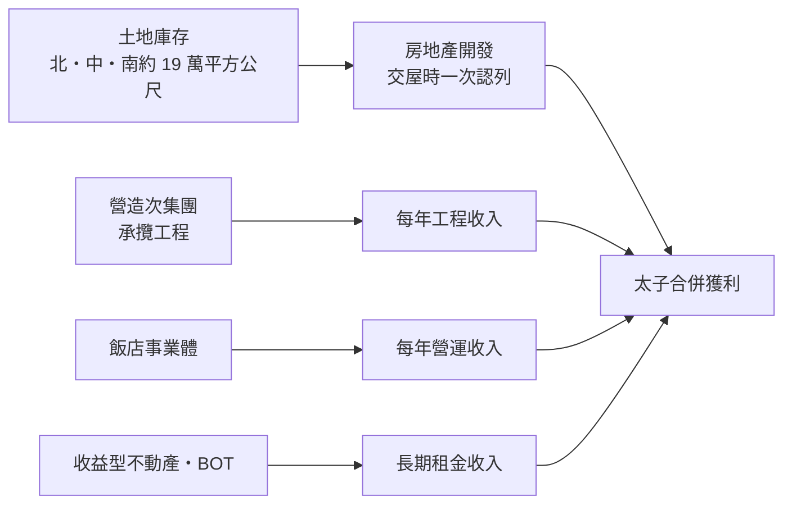
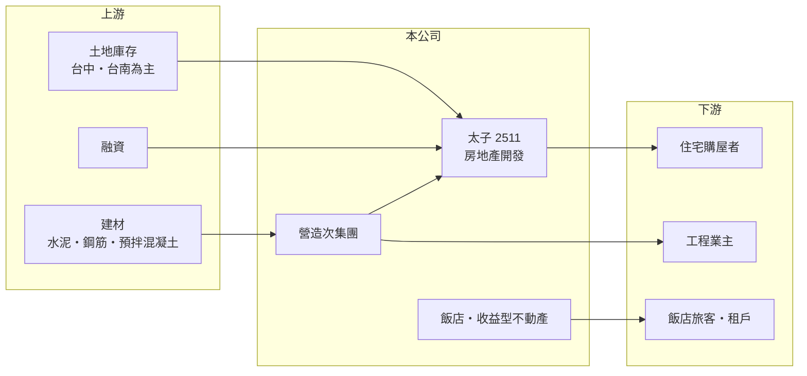

# 2511 太子

> 上市｜[[產業索引-建材營造業|建材營造業]]｜上市（櫃）日期 1991/04/24

# 第一章：企業模式與商業藍圖

> [!info] 撰寫說明
> 本文由 Claude 依公開資料整理，架構比照 [[2330台積電]] 的四章研究，資料截至 2026-10-08。財務數字來源：Goodinfo 年度經營績效頁、散戶鬥嘴鼓（poorstock）法說會頁的 AI 整理、經濟日報報導標題；集團關係與產業描述為整理性內容，尚未逐條比對原始文件。#待校對

在評估單一個股的長期投資價值時，首要步驟是拆解企業的底層獲利邏輯。本章說明太子建設開發（股票代號：2511，以下簡稱太子）如何由住宅建商逐步轉型為「營造、飯店、收益型不動產與房地產開發」四個事業體並行的集團。

## 一、核心定位：營造與飯店撐起營收的建設集團

太子名稱上是建設公司，但從營收結構看，它已經不是單純的推案公司。依 2026 年上半年資料，合併營收約 46.8 億元，其中營造事業體占 55.26%、飯店事業體占 32.60%、固定收益事業體占 6.38%，房地產開發事業體只占 0.46%。

這個結構的意義在於：太子的營收主要來自承攬工程與飯店營運，這兩者每年都有收入，不像住宅銷售只在[[建案交屋]]年度集中認列。房地產開發則是獲利的爆發點，但 2026 年上半年正處於交屋空窗期，部門營收只有約 0.22 億元並出現約 2.06 億元的損失。

## 二、營收結構

營造次集團 2026 年上半年營收約 26.5 億元、年增約 41%，稅前淨利約 0.96 億元；飯店事業體營收約 15.6 億元，稅前淨利約 1.27 億元。可以看出營造的營收大但利潤率低，飯店則是目前穩定的獲利來源。固定收益事業體來自 [[BOT]] 等收益型不動產，提供長期租金。

## 三、資本轉化邏輯：四個事業體的不同節奏

太子的土地庫存約為北台灣 14,343 平方公尺、中台灣 90,280 平方公尺、南台灣 87,375 平方公尺，重心在中南部。依法說會資料，台中北屯榮德段預計 2029 年完工、台南善化「太子雍越」預計 2028 年完工，2027 至 2029 年是完工密集期。2026 年上半年[[合約負債]]（預收房款）約 21.9 億元、年增約 90%，代表預售案收款增加，將在完工交屋後轉為營收。

## 四、企業長期藍圖：六大都會區與交通建設周邊

太子的長期策略是耕耘六大都會區與重大交通建設周邊的土地，並以營造、飯店與收益型不動產提供穩定收入，讓房地產開發可以在較長的時間尺度上選擇推案時點。公司也推動 ESG 與溫室氣體減量。對投資人而言，太子的價值取決於 2027 至 2029 年完工高峰能帶來多少開發利潤，以及經常性事業能否把利潤率提高。

# 第二章：護城河深度與競爭優勢

「護城河」指企業抵禦競爭、維持超額利潤的保護機制。本章分析太子的多事業體結構帶來的優勢與限制。

## 一、太子護城河的核心組成要素

第一是營造垂直整合。擁有自己的營造次集團，讓太子能掌握自家建案的工期與品質，在缺工時期較不受外部營造廠排程影響。

第二是經常性收入。飯店與收益型不動產每年都有收入，讓公司在建案空窗期也能維持基本營運，不必為了現金流壓力降價出售房屋。

第三是大面積的中南部土地庫存。台中與台南的土地約占庫存九成以上，若中南部的產業聚落（如南部科學園區周邊）持續帶動人口移入，這些土地有機會以較好的價格開發。

## 二、主要競爭對手格局

| 對手 | 定位 | 對太子的威脅 |
|---|---|---|
| [[2501國建]] | 全台住宅，兼營營造、飯店與健檢 | 經營模式相近，在台中、台南推案競爭 |
| [[2520冠德]] | 住宅、商辦與商場 | 品牌建商在台中擴大推案 |
| [[2542興富發]] | 全台推案量大 | 在中南部以大量供給競爭 |

## 三、優勢轉化：守得住／守不住／觀察重點

守得住的是多事業體帶來的營運穩定。守不住的是整體獲利能力：營造利潤率低、房地產開發處於空窗期，使 2023 至 2025 年 ROE 只有 1% 至 2%。長期觀察重點是 2027 至 2029 年完工案的交屋利潤，以及飯店與營造能否提高利潤率。

# 第三章：財務體質與盈利規模

資料日期：2026-10-08。數字取自 Goodinfo 年度經營績效與法說會整理頁，表格是撰寫當時的快照；最新月營收、毛利率、累計 EPS 由自動排程寫在本筆記的屬性欄位（月營收、毛利率、累計EPS 等）。#待校對

財務報表是檢驗護城河是否真實存在的最終標準。本章用五年的三率、ROE 與資本報酬，檢視太子的獲利品質。

## 一、獲利能力的基石：三率

| 年度 | 營收（新台幣） | [[毛利率]] | [[營業利益率]] | EPS（元） | [[ROE]] |
|---|---|---|---|---|---|
| 2021 | 125 億 | 23.3% | 8.04% | 0.95 | 5.82% |
| 2022 | 128 億 | 30.9% | 15.4% | 0.91 | 5.57% |
| 2023 | 84.9 億 | 29.5% | 7.40% | 0.37 | 2.25% |
| 2024 | 84.8 億 | 25.3% | 3.23% | 0.19 | 1.09% |
| 2025 | 93.5 億 | 27.7% | 5.65% | 0.33 | 1.92% |

太子的營收在 85 至 130 億元之間，2021 至 2025 年年複合成長率約 -7%（推算），主要因 2023 年後房地產交屋減少。毛利率維持 23% 至 31%，但營業利益率偏低，反映營造與飯店的費用結構。拉長到 2016 至 2025 年，ROE 從未超過 6.5%，2021 至 2025 年平均約 3.3%（推算），股本 162 億元、每股淨值長期約 15 至 16 元，十年間幾乎沒有成長，代表公司長期只維持帳面價值，沒有累積股東權益。

## 二、營建業指標：合約負債與財務結構

2026 年上半年合約負債約 21.9 億元、年增約 90%，代表預售收款增加，是未來交屋營收的領先指標。財務結構方面，負債比約 45.46%、淨負債股權比約 8.7%、流動比率約 264%，現金及其他流動資產約 156 億元，財務相對保守。

## 三、股利

依法說會整理資料，2025 年度配發率約 91%、現金股利 0.30 元，2024 年度配發率超過 100%。太子傾向把大部分盈餘發放，但因獲利偏低，每股股利金額不高。

## 四、[[ROIC]] 與 [[WACC]]：價值創造利差

**ROIC 推算：** 2025 年營業利益約 5.3 億元（93.5 億 × 5.65%），稅後約 4.2 億元。合併總資產約 474 億元，以負債比 45.46% 推算總負債約 216 億元、權益約 258 億元，假設六成為有息負債約 130 億元（推估），投入資本約 388 億元，ROIC 約 1.1%（推算）。以 2021 至 2025 年平均營業利益約 8.8 億元計算，ROIC 約 1.8%（推算）。

**WACC 推算：** 台灣 10 年期公債殖利率假設 1.75%、市場風險溢酬 6%、β 取營建同業常見值 0.9，股東權益成本約 7.2%。負債成本假設 3%，稅後 2.4%；權益占投入資本約 66%（推估），WACC 約 5.5%（推算）。

**結論：** 太子的 ROIC 長期明顯低於 WACC，代表龐大的資產規模並未產生足夠報酬。多事業體帶來穩定，但也稀釋了資本效率；2027 至 2029 年的完工高峰能否讓 ROIC 接近資金成本，是判斷公司長期價值的關鍵。

# 第四章：總體風險與地緣政治

任何企業都無法脫離宏觀環境獨立存在。本章分析太子長期必須面對的產業、政策與營運風險。

## 一、產業週期與市場結構

太子的房地產開發集中在台中與台南，這兩地近年受科學園區與產業聚落帶動，但新案供給也大量增加。若中南部房市供過於求，土地庫存的開發效益會下降。

## 二、政策與金融風險

央行[[信用管制]]會影響預售屋買方與土地融資。營造業務則受公共工程預算與民間建案量影響，房市降溫時，民間營造訂單也會同步減少。

## 三、營運環境的隱性風險

營造業長期面臨缺工與原物料價格波動，固定價格的工程合約可能在成本上漲時虧損。飯店事業受觀光景氣、人力成本與新飯店供給影響。BOT 收益型不動產則有合約期限與營運條件的限制。

## 四、資本效率風險

多事業體結構讓資本分散在營造、飯店、土地與收益型不動產，若各事業的報酬率都偏低，整體 ROIC 就難以提升。這是太子長期最大的結構性課題。

# 專有名詞解析

## 金融

- **[[合約負債]]**：已向客戶收取但尚未交付產品的款項，建商的預售屋訂金即屬此類，可作為未來營收的領先指標。
- **[[信用管制]]**：央行限制購屋與建商貸款成數的政策，會影響房市成交與建商資金。
- **[[ROIC]]**：投入資本報酬率，稅後營業利益除以股東權益加有息負債，衡量本業運用資本的效率。
- **[[WACC]]**：加權平均資金成本，股東與債權人要求報酬率的加權平均，是 ROIC 要超越的門檻。

## 產業

- **[[建案交屋]]**：建商在房屋完工並交付買方時才認列營收，因此營建公司的營收常集中在交屋年度。
- **[[BOT]]**：興建、營運、移轉，由民間出資興建公共設施並在一定期間營運收費，期滿後移轉給政府。

# 核心供應鏈

## 1. 上游：土地、建材與資金
- 中南部土地庫存；建材如 [[2504國產]]、[[1101台泥]]（產業參考）

## 2. 中游：太子各事業體
- 營造次集團、飯店事業體、固定收益事業體（BOT）
- 同業：[[2501國建]]、[[2520冠德]]、[[2542興富發]]

## 3. 下游：客戶
- 台中、台南購屋者，營造工程業主，飯店旅客與租戶

## 最新新聞
<!-- news:start（自動產生，請勿手動編輯此範圍） -->
- 2026-10-05 📰 媒體 16:50｜營收速報 - 太子(2511)9月營收11.29億元年增率高達45.89％｜[鉅亨網](https://news.cnyes.com/news/id/6621781)

完整紀錄：[[2511太子 新聞]]
<!-- news:end -->

## 相關連結
- [公開資訊觀測站](https://mopsov.twse.com.tw/mops/web/t05st03?step=1&firstin=1&co_id=2511)
- [Goodinfo](https://goodinfo.tw/tw/StockDetail.asp?STOCK_ID=2511)
- [Yahoo 股市](https://tw.stock.yahoo.com/quote/2511)
- [鉅亨網新聞](https://www.cnyes.com/twstock/2511/news)
