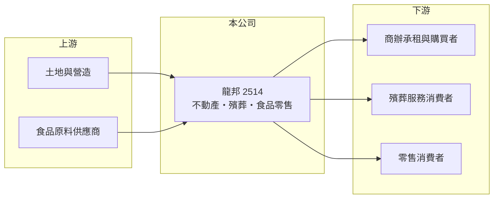

# 2514 龍邦

> 上市｜[[產業索引-其他業|其他業]]｜上市（櫃）日期 1992/09/26

# 第一章：企業模式與商業藍圖

> [!info] 撰寫說明
> 精簡版，由 Claude 依公開資料整理，架構比照 [[2330台積電]]，資料截至 2026-10-07。來源：nStock 龍邦公司簡介、winvest 營收快訊。#待校對

龍邦是[[多角化經營]]的集團，橫跨商業不動產、[[殯葬設施]]、娛樂與食品零售，營收規模大但獲利波動。

- **核心業務：** 營業項目包括商業大樓租售、殯葬設施管理與經營、娛樂設施經營、投資開發、土木建築工程及食品加工零售。
- **營收結構：** 本次未查到各事業營收比重；月營收約 15 億至 16 億元，推估以食品加工零售等通路型業務貢獻最大。
- **營運據點：** 公司 1988 年成立，據點明細本次未查到。
- **長期方向：** 以不動產與殯葬等資產型業務搭配零售現金流，維持多角化布局（推估）。

# 第二章：護城河深度與競爭優勢

龍邦的優勢在於多角化的事業組合，但各事業之間的綜效有限。

- **競爭優勢：** 殯葬設施具有土地取得與法規門檻，屬較難複製的資產（推估）。
- **主要對手：** 各事業分別面對建設、殯葬與食品零售同業，本次未查到具體名單。
- **觀察重點：** 8 月營收 16.23 億元，年減 24.33%，觀察營收下滑的原因與下半年獲利能否轉正。

# 第三章：財務體質與盈利規模

資料日期：2026-10-07，以下數字是撰寫當時的快照；最新月營收、毛利率、累計 EPS 由自動排程寫在本筆記的屬性欄位（月營收、毛利率、累計EPS 等）。#待校對

龍邦營收規模大但毛利率偏低，2026 年上半年轉為虧損。

- **營收規模：** 2026 年 1 至 8 月累計營收 136.98 億元，年減 2.98%；2025 年全年營收 216.13 億元。
- **獲利：** 2026 年第二季 EPS -1.07 元，上半年累計 -0.65 元；第二季[[毛利率]] 12.13%、[[營業利益率]] 4.78%，但淨利率 -16.72%，代表有大額[[業外損失]]。
- **財務特色：** 資本額 39.47 億元、市值約 44.60 億元，2025 年全年 EPS 1.85 元，但近五年沒有配息紀錄。

# 第四章：總體風險與地緣政治

龍邦的風險在於業外損益波動與多角化管理難度。

- **產業週期：** 不動產與娛樂事業受景氣影響，食品零售則較為穩定。
- **營運風險：** 本業有營業利益但淨利轉負，顯示投資或業外項目拖累獲利，需追蹤原因。
- **其他風險：** 殯葬業受法規與地方政府管理，房市政策與利率也會影響不動產業務。

# 專有名詞解析

## 金融

- **[[業外損失]]**：本業以外的損失，例如投資虧損、資產減損或處分損失，會拉低稅後淨利。

## 產業

- **[[殯葬設施]]**：納骨塔、墓園與殯儀館等設施，設置須經政府核准，經營門檻較高。
- **[[多角化經營]]**：同時經營多個不相關事業，以分散單一產業的風險。

# 核心供應鏈

- 上游：土地、營造廠與食品原料供應商（推估）
- 下游／客戶：商業大樓承租與購買者、殯葬服務消費者、零售消費者（推估）
- 同業：多角化經營的資產與零售集團（本次未查到具體名單）

## 最新新聞
<!-- news:start -->
<!-- news:end -->

## 相關連結
- [公開資訊觀測站](https://mopsov.twse.com.tw/mops/web/t05st03?step=1&firstin=1&co_id=2514)
- [Goodinfo](https://goodinfo.tw/tw/StockDetail.asp?STOCK_ID=2514)
- [Yahoo 股市](https://tw.stock.yahoo.com/quote/2514)
- [鉅亨網新聞](https://www.cnyes.com/twstock/2514/news)
