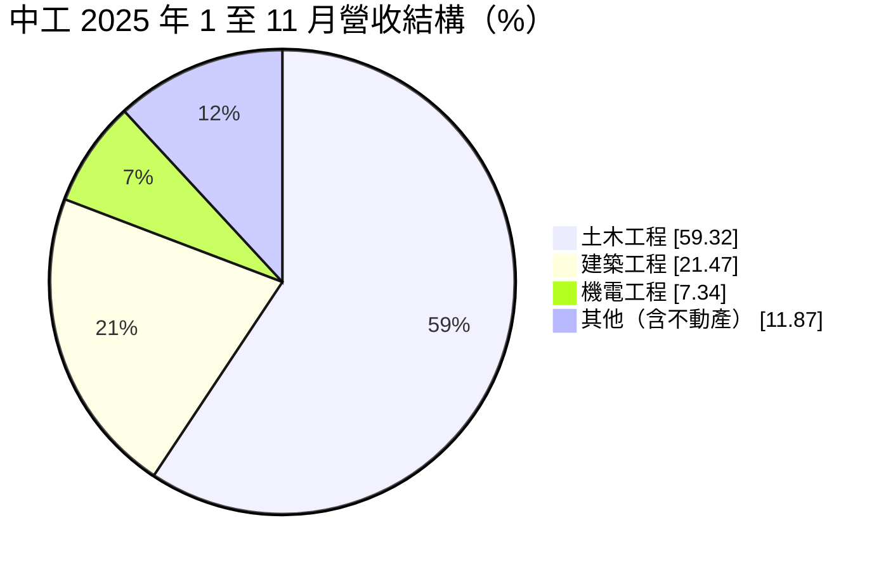
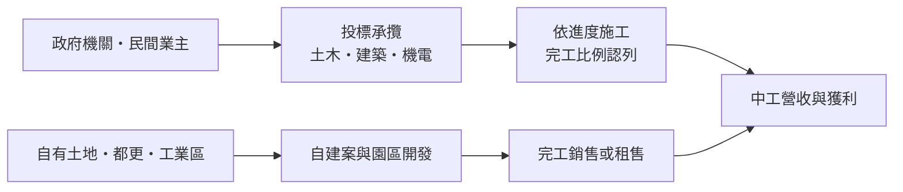
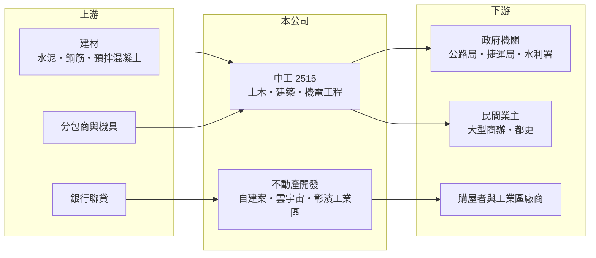

# 2515 中工

> 上市｜[[產業索引-建材營造業|建材營造業]]｜上市（櫃）日期 1993/03/02

# 第一章：企業模式與商業藍圖

> [!info] 撰寫說明
> 本文由 Claude 依公開資料整理，架構比照 [[2330台積電]] 的四章研究，資料截至 2026-10-08。財務數字來源：Goodinfo 年度經營績效頁、富果研究 2025 年 12 月法說會整理；公司沿革、股東關係與產業描述為整理性內容，尚未逐條比對原始文件。#待校對

在評估單一個股的長期投資價值時，首要步驟是拆解企業的底層獲利邏輯。本章說明中華工程（股票代號：2515，以下簡稱中工）這家以[[公共工程]]為核心的營造公司，如何同時經營自建案、工業區開發與大型民間工程。

## 一、核心定位：大型公共工程承攬商兼不動產開發商

中工前身為公營的中華工程公司，民營化後成為上市營造公司（沿革為整理性內容）。它的核心業務是承攬道路、捷運、水利等大型公共工程，也承攬民間大樓工程，並經營自建住宅、工業園區開發等不動產業務。

營造業的商業模式和建商不同：營造廠替業主施工，依工程進度以[[完工比例法]]認列營收，收入較平穩，但利潤率很低，通常只有個位數的毛利率。中工的特色是把營造本業與不動產開發結合，希望用開發案提高整體利潤率。

## 二、營收結構：土木工程為主、北部為重心

依 2025 年截至 11 月的資料，土木工程占營收 59.32%、建築工程占 21.47%、機電工程占 7.34%，其餘為不動產等其他收入；區域上北部占 76.27%、中部約 10.73%、南部約 13%。

代表性工程包括台 61 線新竹段平交路口改善（約 120.55 億元）、桃園捷運綠線、曾文水庫放水渠道與高雄新市鎮；民間工程則有台北雙子星與台塑大樓都更等。

## 三、資本轉化邏輯：工程收入打底，開發案創造利潤

截至 2025 年 11 月底，中工[[在手訂單]]（在手工程合約總額）約 1,768 億元，其中已執行約 736 億元、待執行約 1,032 億元，約為年營收的五倍，營收能見度很高。2025 年新承攬約 162 億元。

不動產開發方面，碧硯閣已於 2025 年取得使照、2026 年起交屋；中工雲宇宙 AI 園區預計 2026 年取得使照，主要客戶為鴻運科；鳴森苑、雋詠等自建案預計 2027 年後完工。彰濱工業區的開發與租售也是中工長期的業務，2025 年公告出售面積約 57.9 公頃，已租售約 37.9 公頃。

## 四、企業長期藍圖：公共工程與不動產開發雙軌

中工的長期策略是持續深耕公共工程，並擴大房地產開發，包括樹林東昇段、板橋福利站、城南水源等[[都更]]與土地案，以及彰濱崙尾西區、線西西三區的工業區招商。這個方向的關鍵在於：公共工程提供穩定的營收規模，不動產開發則決定利潤高低。

# 第二章：護城河深度與競爭優勢

「護城河」指企業抵禦競爭、維持超額利潤的保護機制。本章分析中工在營造業中的競爭位置。

## 一、中工護城河的核心組成要素

營造業的護城河普遍很淺，但大型公共工程有一定門檻。第一是資格與實績：重大工程的投標通常要求營造業等級、過去類似工程的實績與財務能力，中工承攬過捷運、高速公路、水庫等大型工程，具備投標資格。

第二是在手訂單規模。約 1,768 億元的工程合約總額，使中工在人力、機具調度與供應商議價上有規模優勢。

第三是工業區與土地資源。彰濱工業區的長期開發與自有土地，讓中工擁有一般營造廠沒有的開發型收益來源。

## 二、主要競爭對手格局

| 對手 | 定位 | 對中工的威脅 |
|---|---|---|
| [[2516新建]] | 捷運、鐵道與社會住宅公共工程 | 在北部公共工程投標直接競爭 |
| [[2597潤弘]] | 預鑄工法，民間與科技廠 | 在建築工程與科技廠爭取業主 |
| [[2546根基]] | 建築與捷運工程 | 在北部大型建築工程競爭 |
| 日韓與大型國際營造商 | 技術與資本雄厚 | 在高難度工程與國際標競爭 |

## 三、優勢轉化：守得住／守不住／觀察重點

守得住的是大型公共工程的投標資格與在手訂單帶來的營收規模。守不住的是營造利潤率：2021 至 2025 年毛利率只有 2% 至 9%，營建成本上漲或工程變更時，利潤很容易被侵蝕。長期觀察重點是雲宇宙 AI 園區的銷售與移轉、都更案的推進，以及營造毛利率能否穩定在較高水準。

# 第三章：財務體質與盈利規模

資料日期：2026-10-08。數字取自 Goodinfo 年度經營績效與富果研究法說會整理，表格是撰寫當時的快照；最新月營收、毛利率、累計 EPS 由自動排程寫在本筆記的屬性欄位（月營收、毛利率、累計EPS 等）。#待校對

財務報表是檢驗護城河是否真實存在的最終標準。本章用五年的三率、ROE 與資本報酬，檢視中工的獲利品質。

## 一、獲利能力的基石：三率

| 年度 | 營收（新台幣） | [[毛利率]] | [[營業利益率]] | EPS（元） | [[ROE]] |
|---|---|---|---|---|---|
| 2021 | 172 億 | 1.98% | -2.09% | 1.75 | 12.3% |
| 2022 | 151 億 | 9.13% | 5.14% | 0.54 | 3.53% |
| 2023 | 190 億 | 8.03% | 4.91% | 0.41 | 2.72% |
| 2024 | 238 億 | 6.52% | 3.99% | 0.47 | 3.12% |
| 2025 | 207 億 | 7.64% | 4.59% | 0.40 | 2.80% |

中工的營收從 2016 年的 95 億元成長到 2025 年的 207 億元，十年年複合成長率約 9%（推算），反映公共工程承攬量擴大。但毛利率長期只有 2% 至 12%，營業利益率多在 2% 至 5%，是典型的低利潤營造業結構。2021 年營業虧損但 EPS 達 1.75 元，代表當年有大額業外收益（推估為資產處分），2021 至 2025 年平均 ROE 約 4.9%（推算），扣除 2021 年後約 3%。

## 二、營建業指標：在手訂單、負債與資金

在手工程待執行約 1,032 億元，提供未來數年的營收能見度。財務結構方面，2025 年第三季總資產約 658.56 億元、負債比約 66.14%，略高於同業，主因房地產融資借款增加；流動比率約 213%。公司規劃 2026 年雲宇宙建築付款約 80 億元，並計畫籌組 55 億至 100 億元聯貸，2026 年則是碧硯閣與雲宇宙的現金回收高峰。

## 三、股利

2024 年度每股配發約 0.503 元、發放率約 107%，並有盈餘轉增資，股本因此由 153 億元增加到 161 億元。Goodinfo 統計歷年平均現金股利約 0.32 元，常搭配股票股利。

## 四、[[ROIC]] 與 [[WACC]]：價值創造利差

**ROIC 推算：** 2025 年營業利益約 9.5 億元（207 億 × 4.59%），稅後約 7.6 億元。股東權益約 226 億元（每股淨值 14.05 元 × 約 16.1 億股），依 ROA 0.97% 推算總資產約 656 億元、總負債約 429 億元，假設六成為有息負債約 258 億元（推估），投入資本約 484 億元，ROIC 約 1.6%（推算）。以 2021 至 2025 年平均營業利益計算，ROIC 約 1.1%（推算）。

**WACC 推算：** 台灣 10 年期公債殖利率假設 1.75%、市場風險溢酬 6%、β 取營建同業常見值 0.9，股東權益成本約 7.2%。負債成本假設 2.5%，稅後 2.0%；權益占投入資本約 47%（推估），WACC 約 4.4%（推算）。

**結論：** 中工的 ROIC 長期明顯低於 WACC，營造本業的低利潤率不足以支撐龐大的資產與借款。雲宇宙等開發案若能以較高利潤完成移轉，是改善資本報酬的主要機會；否則營收規模再大，也難以為股東創造經濟價值。

# 第四章：總體風險與地緣政治

任何企業都無法脫離宏觀環境獨立存在。本章分析中工長期必須面對的產業、財務與營運風險。

## 一、產業週期與市場結構

公共工程的釋出取決於政府預算與重大建設計畫，政策方向改變時，標案量可能明顯起伏。2025 年營收下滑，就是因為工程承攬量下降，且前一年大型承攬案的執行缺口尚未補足。

## 二、營建成本與合約風險

公共工程多為固定總價合約，簽約後若鋼筋、混凝土、人工成本大漲，營造廠要自行吸收大部分漲幅，物價調整條款通常無法完全補償。缺工也會拖延工期並增加成本，公司法說會已將缺工列為影響進度的風險。

## 三、財務槓桿風險

負債比升至 66% 以上，主要來自房地產開發的融資。雲宇宙等大型開發案需要大量資金，若銷售或移轉延遲，利息與資金壓力會增加，公司也可能需要增資或發行可轉債而稀釋股東權益。

## 四、不動產開發風險

自建案與工業區租售受房市與產業投資景氣影響；雲宇宙 AI 園區的主要客戶集中，若客戶需求變化，會影響移轉進度。

# 專有名詞解析

## 金融

- **[[ROIC]]**：投入資本報酬率，稅後營業利益除以股東權益加有息負債，衡量本業運用資本的效率。
- **[[WACC]]**：加權平均資金成本，股東與債權人要求報酬率的加權平均，是 ROIC 要超越的門檻。

## 產業

- **[[公共工程]]**：由政府出資發包的道路、捷運、水利、學校等建設工程，是營造業最主要的業務來源之一。
- **[[在手訂單]]**：已簽約但尚未完工認列營收的工程金額，可用來預估未來營收。
- **[[完工比例法]]**：依工程完成進度認列營收的方法；國內建案銷售多在交屋時一次認列，與此不同。
- **[[都更]]**：都市更新，由地主與建商合作把老舊建物改建，地主依權利價值分回房地或收益。

# 核心供應鏈

## 1. 上游：建材與分包
- 建材：[[2504國產]]、[[1101台泥]]、鋼筋業者（產業參考）
- 分包商、機具租賃、銀行聯貸

## 2. 中游：中工
- 同業：[[2516新建]]、[[2597潤弘]]、[[2546根基]]

## 3. 下游：業主與客戶
- 交通部公路局、捷運工程機關、水利機關；台北雙子星等民間業主
- 雲宇宙 AI 園區主要客戶：鴻運科（[[2317鴻海]] 相關企業，整理性內容）

## 最新新聞
<!-- news:start -->
<!-- news:end -->

## 相關連結
- [公開資訊觀測站](https://mopsov.twse.com.tw/mops/web/t05st03?step=1&firstin=1&co_id=2515)
- [Goodinfo](https://goodinfo.tw/tw/StockDetail.asp?STOCK_ID=2515)
- [Yahoo 股市](https://tw.stock.yahoo.com/quote/2515)
- [鉅亨網新聞](https://www.cnyes.com/twstock/2515/news)
