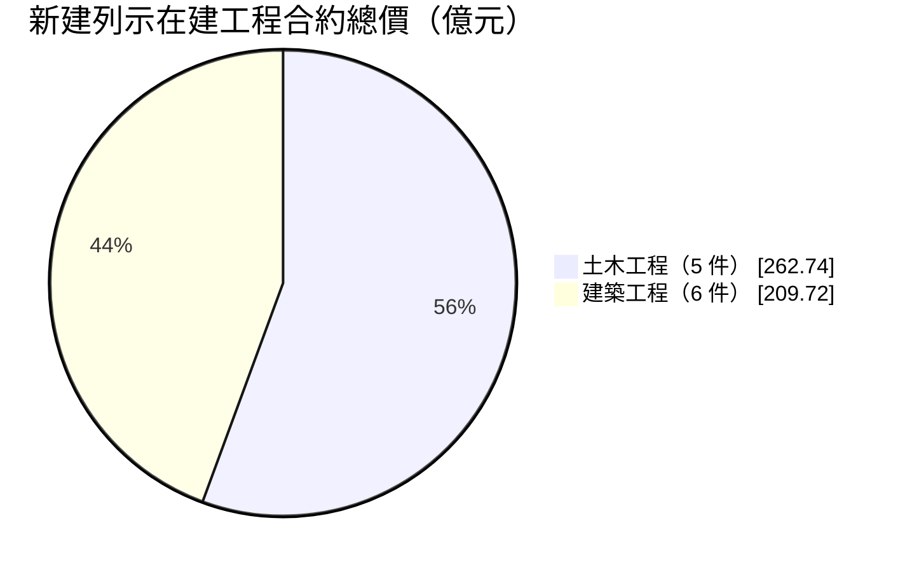
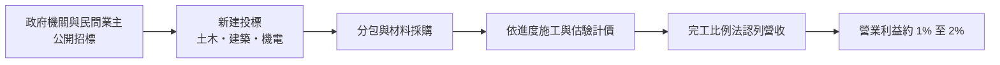
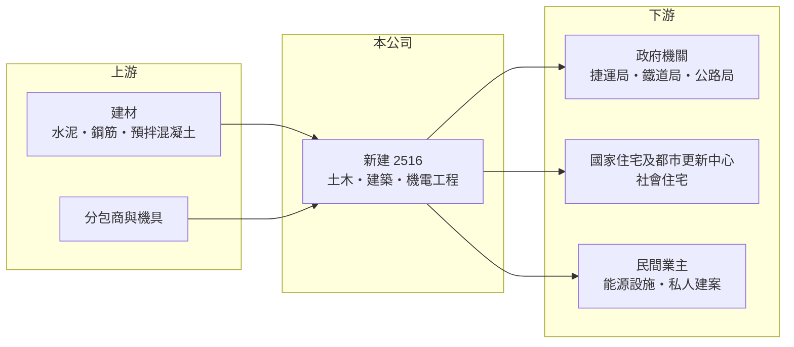

# 2516 新建

> 上市｜[[產業索引-建材營造業|建材營造業]]｜上市（櫃）日期 1993/05/25

# 第一章：企業模式與商業藍圖

> [!info] 撰寫說明
> 本文由 Claude 依公開資料整理，架構比照 [[2330台積電]] 的四章研究，資料截至 2026-10-08。財務數字來源：Goodinfo 年度經營績效頁、散戶鬥嘴鼓（poorstock）公司資料與財報整理、Yahoo 股市與工商時報報導標題；產業描述為整理性內容，尚未逐條比對原始文件。公開資料未揭露業務別營收比重。#待校對

在評估單一個股的長期投資價值時，首要步驟是拆解企業的底層獲利邏輯。本章說明新亞建設開發（股票代號：2516，以下簡稱新建）這家以[[公共工程]]為主的營造公司，以及它為什麼長期在低利潤率中經營。

## 一、核心定位：捷運、鐵道與社會住宅的公共工程營造商

新建成立於 1967 年、1993 年上市，員工約 1,131 人，名稱雖有「建設」，實際上是一家營造公司。它的業務分成三類：土木工程（捷運、機場、橋樑、道路、隧道等基礎建設）、建築工程（社會住宅、學校建築與私人建案）與機電工程。近年以承接大型公共工程與社會住宅統包案為主。

營造業的商業模式是替業主施工、依工程進度收款與認列營收，營收較平穩，但競標激烈、利潤率很低。新建的主要客戶是政府機關，包括台北市捷運工程局、交通部鐵道局、公路局、台北市都市發展局與國家住宅及都市更新中心。

## 二、在建工程結構

公司未揭露業務別營收比重。依公開資料列出的在建工程，土木工程 5 件合約總價約 262.74 億元，建築工程 6 件約 209.72 億元，合計約 472.45 億元，可視為[[在手訂單]]的一部分（此為列出項目的合約總價加總，不等於官方在手訂單）。

民間工程方面，新建承攬英商貝泰在台分公司的中油台中廠 LNG 儲槽土建工程，也有政大頭廷段自地自建案。這顯示新建除了公共工程，也能承接能源設施等高技術門檻的民間案件。

## 三、資本轉化邏輯：以投標換取營收，靠管理賺取微利

營造廠的獲利來自「得標價格」與「實際施工成本」之間的差距。在公共工程最低價或最有利標的競爭下，這個差距通常很小，新建 2023 至 2025 年的毛利率只有約 3.6% 至 4.0%。因此營造廠的核心能力不是定價，而是成本控管、工期管理與避免工程糾紛。

## 四、企業長期藍圖：BOT、統包與營建管理

新建的長期策略是持續承接大型公共工程，並拓展 [[BOT]] 興建與[[統包工程]]，同時規劃把營業重心逐步轉向營建管理。統包與營建管理的意義在於：把設計、施工與管理整合在一起，承擔更多責任，也能爭取較高的利潤空間，脫離單純比價的施工承攬。

# 第二章：護城河深度與競爭優勢

「護城河」指企業抵禦競爭、維持超額利潤的保護機制。本章分析新建在營造業中的競爭位置。

## 一、新建護城河的核心組成要素

營造業的護城河很淺，新建的優勢主要有三點。第一是公共工程實績：捷運、鐵道、公路等工程需要特定的施工技術與過去實績才能投標，新建長期承攬台北捷運與交通部工程，具備投標資格與經驗。

第二是社會住宅經驗。政府大量推動社會住宅，新建承攬多件國家住宅及都市更新中心的統包案，累積了這個市場的實績。

第三是特殊工程能力，例如 LNG 儲槽土建工程，這類工程技術門檻較高，參與者較少。

## 二、主要競爭對手格局

| 對手 | 定位 | 對新建的威脅 |
|---|---|---|
| [[2515中工]] | 大型公共工程與不動產開發 | 規模更大，在北部公共工程直接競爭 |
| [[2546根基]] | 捷運與建築工程 | 在捷運與大型建築工程競爭 |
| [[2597潤弘]] | 預鑄工法，民間與科技廠 | 在建築工程爭取業主 |
| 日韓營造商 | 技術與資本雄厚 | 在捷運與高難度工程競標 |

## 三、優勢轉化：守得住／守不住／觀察重點

守得住的是公共工程與社會住宅的投標資格與實績。守不住的是利潤率：新建十年間多次出現虧損年度，代表一兩件工程的成本失控就能吃掉多年的累積利潤。長期觀察重點是統包與營建管理比重能否提升，以及新承攬工程的毛利率能否穩定在 4% 以上。

# 第三章：財務體質與盈利規模

資料日期：2026-10-08。數字取自 Goodinfo 年度經營績效與公開財報整理，表格是撰寫當時的快照；最新月營收、毛利率、累計 EPS 由自動排程寫在本筆記的屬性欄位（月營收、毛利率、累計EPS 等）。#待校對

財務報表是檢驗護城河是否真實存在的最終標準。本章用五年的三率、ROE 與資本報酬，檢視新建的獲利品質。

## 一、獲利能力的基石：三率

| 年度 | 營收（新台幣） | [[毛利率]] | [[營業利益率]] | EPS（元） | [[ROE]] |
|---|---|---|---|---|---|
| 2021 | 80.4 億 | 2.47% | 0.72% | 0.52 | 6.33% |
| 2022 | 68.6 億 | -8.69% | -11.1% | -3.42 | -46.2% |
| 2023 | 86.3 億 | 3.61% | 1.74% | 0.77 | 12.0% |
| 2024 | 96.3 億 | 3.62% | 1.71% | 0.97 | 13.2% |
| 2025 | 103 億 | 4.01% | 2.17% | 1.23 | 14.5% |

新建的營收從 2021 年的 80.4 億元成長到 2025 年的 103 億元，年複合成長率約 6.4%（推算）。毛利率長期在 -11% 至 4% 之間，2017、2020、2022 年都出現毛損，反映營造業成本失控的風險。2023 年以後 ROE 回到 12% 至 15%，看起來很高，但這是因為股東權益經過多年虧損後變得很小（每股淨值在 2022 年降到 6.02 元），分母小使 ROE 被放大，並不代表獲利能力很強。2021 至 2025 年平均 ROE 約 0%（推算）。

## 二、營建業指標：在手工程與財務結構

列示的在建工程合約總價約 472 億元，約為年營收的 4.6 倍，營收能見度尚可。依 Goodinfo 的 ROE 與 ROA 推算，2025 年總資產約為股東權益的 4 倍（推算），財務槓桿高，股東權益的緩衝薄。每股淨值由 2016 年的 12.79 元降到 2022 年的 6.02 元，2025 年回升到 9.07 元，仍低於面額 10 元。

## 三、股利

2023 年、2024 年及 2025 年前三季均未分派股利。在每股淨值低於面額、需要彌補過去虧損的情況下，新建優先保留盈餘以重建資本。

## 四、[[ROIC]] 與 [[WACC]]：價值創造利差

**ROIC 推算：** 2025 年營業利益約 2.2 億元（103 億 × 2.17%），稅後約 1.8 億元。股東權益約 20 億元（每股淨值 9.07 元 × 約 2.26 億股），依 ROA 3.63% 推算總資產約 76 億元、總負債約 56 億元，假設六成為有息負債約 33 億元（推估），投入資本約 53 億元，ROIC 約 3.3%（推算）。若以 2021 至 2025 年平均營業利益計算，因 2022 年大額虧損，ROIC 約為負值（推算）。

**WACC 推算：** 台灣 10 年期公債殖利率假設 1.75%、市場風險溢酬 6%、β 取營建同業常見值 0.9，股東權益成本約 7.2%。負債成本假設 2.5%，稅後 2.0%；權益占投入資本約 38%（推估），WACC 約 4.0%（推算）。高槓桿下實際 β 與 WACC 可能更高。

**結論：** 新建近年的 ROIC 約與 WACC 相當或略低，長期平均則低於資金成本。營造本業的微利結構加上偶發的大額虧損，使公司很難長期創造經濟價值；轉向統包與營建管理是否能提高利潤率，是長期價值的關鍵。

# 第四章：總體風險與地緣政治

任何企業都無法脫離宏觀環境獨立存在。本章分析新建長期必須面對的產業、成本與財務風險。

## 一、產業週期與市場結構

新建的營收高度依賴政府公共工程預算，政策方向與預算規模直接決定標案量。公共工程投標競爭激烈，得標價格往往壓得很低，營造廠的利潤空間有限。

## 二、營建成本與合約風險

公共工程多為固定總價合約，原物料與人工成本上漲時，營造廠要自行吸收大部分漲幅。2022 年的大額虧損就發生在營建成本快速上漲時期（推估為成本上漲與工程損失所致）。缺工也會拖延工期、增加管理成本與逾期罰款風險。

## 三、財務槓桿風險

股東權益小、負債占比高，一旦再出現工程虧損，每股淨值可能再度大幅下降，影響投標所需的財務資格與銀行授信。這是新建最主要的結構性風險。

## 四、工程履約與法律風險

大型工程常有工程變更、估驗爭議與工期延誤，可能衍生仲裁或訴訟，求償結果的不確定性會影響當期損益。

# 專有名詞解析

## 金融

- **[[ROIC]]**：投入資本報酬率，稅後營業利益除以股東權益加有息負債，衡量本業運用資本的效率。
- **[[WACC]]**：加權平均資金成本，股東與債權人要求報酬率的加權平均，是 ROIC 要超越的門檻。

## 產業

- **[[公共工程]]**：由政府出資發包的道路、捷運、水利、學校等建設工程，是營造業最主要的業務來源之一。
- **[[在手訂單]]**：已簽約但尚未完工認列營收的工程金額，可用來預估未來營收。
- **[[統包工程]]**：由同一家廠商負責設計與施工的承攬方式，責任較大，但利潤空間通常高於單純施工。
- **[[BOT]]**：興建、營運、移轉，由民間出資興建公共設施並在一定期間營運收費，期滿後移轉給政府。

# 核心供應鏈

## 1. 上游：建材與分包
- 建材：[[2504國產]]、[[1101台泥]]、鋼筋業者（產業參考）
- 分包商與機具租賃

## 2. 中游：新建
- 同業：[[2515中工]]、[[2546根基]]、[[2597潤弘]]

## 3. 下游：業主
- 台北市捷運工程局、交通部鐵道局、公路局、國家住宅及都市更新中心
- 民間：英商貝泰（中油台中廠 LNG 儲槽工程）

## 最新新聞
<!-- news:start -->
<!-- news:end -->

## 相關連結
- [公開資訊觀測站](https://mopsov.twse.com.tw/mops/web/t05st03?step=1&firstin=1&co_id=2516)
- [Goodinfo](https://goodinfo.tw/tw/StockDetail.asp?STOCK_ID=2516)
- [Yahoo 股市](https://tw.stock.yahoo.com/quote/2516)
- [鉅亨網新聞](https://www.cnyes.com/twstock/2516/news)
