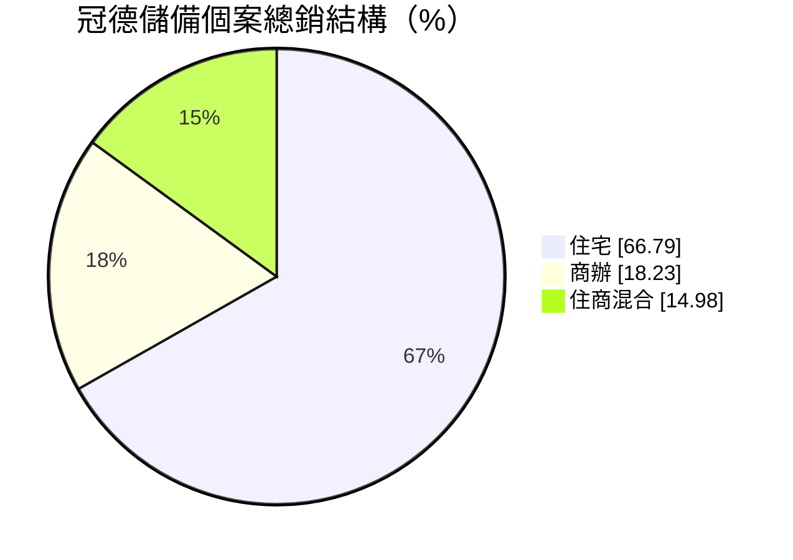
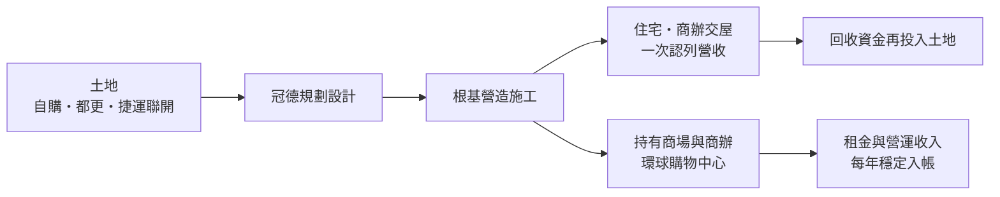
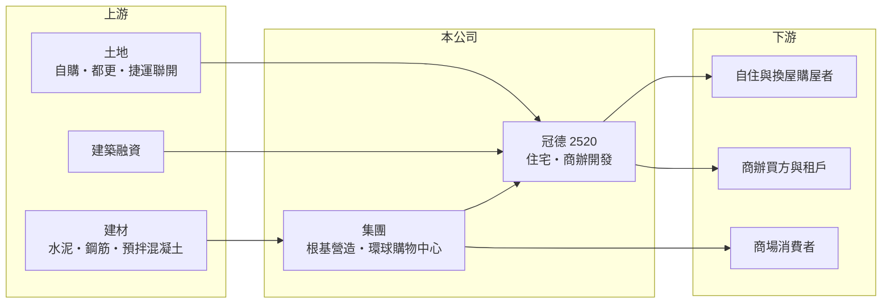

# 2520 冠德

> 上市｜[[產業索引-建材營造業|建材營造業]]｜上市（櫃）日期 1993/10/27

# 第一章：企業模式與商業藍圖

> [!info] 撰寫說明
> 本文由 Claude 依公開資料整理，架構比照 [[2330台積電]] 的四章研究，資料截至 2026-10-08。財務數字來源：Goodinfo 年度經營績效頁、散戶鬥嘴鼓（poorstock）法說會頁整理；集團關係（根基營造、環球購物中心）與產業描述為整理性內容，尚未逐條比對原始文件。#待校對

在評估單一個股的長期投資價值時，首要步驟是拆解企業的底層獲利邏輯。本章說明冠德建設（股票代號：2520，以下簡稱冠德）如何把住宅銷售、集團營造與購物中心經營結合成一個「開發、興建、持有」的不動產集團。

## 一、核心定位：以雙北為核心、兼做大型公共開發的建商

冠德是以台北都會區為核心的住宅開發商，近年也擴展到台中等地區。它的本業和一般建商相同：取得土地、規劃興建、預售後在[[建案交屋]]時認列營收。冠德的特色是長期參與政府主導的大型開發，例如[[捷運聯合開發]]與公辦[[都更]]，這類案件規模大、時程長，需要和政府機關協調，參與門檻高於一般買地推案。

集團內的根基營造（[[2546根基]]）是冠德的營造子公司，負責自家建案與外部工程；環球購物中心則經營商場，讓冠德除了賣房之外還有持有型的租金與營運收入（集團結構為整理性內容）。

## 二、推案結構：住宅為主、商辦與住商混合為輔

依法說會資料，冠德儲備個案的總銷金額中，住宅占 66.79%、商辦占 18.23%、住商混合占 14.98%。

住宅仍是主要獲利來源，但商辦與住商混合案的比重接近三分之一，代表冠德的產品線比只做住宅的建商更廣。商辦需求和企業擴張、產業聚落有關，與住宅的景氣循環不完全同步，能提供一定程度的分散效果。

## 三、資本轉化邏輯：賣房回收資金，持有資產提供穩定現金流

冠德的資本流動分成兩條路。第一條是傳統的開發銷售：買地、興建、交屋，一次回收資金與利潤，再投入下一個土地。第二條是持有營運：把部分商場與商辦留在手上，每年收取租金。前者獲利高但不穩定，後者報酬率較低但可預期，兩者搭配可以降低營收的大起大落。

## 四、企業長期藍圖：大型開發案與區域擴張

冠德手上有多個大型長期開發案，例如南港案（預計 2029 年第一季營運）、行 23 案（預計 2031 年第一季完工）與 G9-1 案（預計 2031 年第三季完工），完工時程都落在 2029 年以後。另一方面，台中裕毛屋案（總銷約 67 億元）、直興案（約 36 億元）與台中 G5 案（約 16 億元）預計於 2026 年下半年公開銷售，顯示冠德正把推案重心從雙北擴展到台中。這些大型案的共同點是規模大、回收期長，決定了冠德 2030 年前後的營運高度。

# 第二章：護城河深度與競爭優勢

「護城河」指企業抵禦競爭、維持超額利潤的保護機制。本章分析冠德在建設業中靠什麼取得超額報酬。

## 一、冠德護城河的核心組成要素

第一是大型公共開發案的執行經驗。捷運聯合開發與公辦都更需要整合地主、通過政府審議並配合公共設施施工，流程複雜、時間長，有經驗的建商較容易得標並如期完成，這形成實質的進入門檻。

第二是營造垂直整合。根基營造讓冠德能掌握施工品質、工期與成本，在缺工與營建成本上升時期，自有營造能力的重要性更高。

第三是持有型資產帶來的穩定現金流。環球購物中心與持有商辦提供每年的租金收入，使冠德在房市低迷時仍有基本的現金來源，不必為了資金壓力而降價求售。

## 二、全國主要競爭對手格局

| 對手 | 定位 | 對冠德的威脅 |
|---|---|---|
| [[2501國建]] | 全台推案，搭配營造與生活服務 | 在雙北與台中住宅市場直接競爭 |
| [[5534長虹]] | 雙北中高價住宅 | 在中高價自住市場競爭 |
| [[2542興富發]] | 推案量大，全台布局 | 以量與價格搶奪首購族 |
| 大型壽險與集團開發商 | 資金充裕，參與大型標案 | 在捷運聯開與公辦都更招標中競爭 |

## 三、優勢轉化：守得住／守不住／觀察重點

守得住的是大型政府開發案與商場營運帶來的長期收益，這些案件一旦取得，往往能貢獻多年的營收與租金。守不住的是住宅市場的景氣循環與政策打壓，2025 年營收與獲利都比 2024 年大幅下滑，就反映交屋時點與市場變化。長期觀察重點是台中新案的去化、南港與行 23 等大型案的工程進度，以及持有型資產的租金成長。

# 第三章：財務體質與盈利規模

資料日期：2026-10-08。數字取自 Goodinfo 年度經營績效與法說會整理頁，表格是撰寫當時的快照；最新月營收、毛利率、累計 EPS 由自動排程寫在本筆記的屬性欄位（月營收、毛利率、累計EPS 等）。#待校對

財務報表是檢驗護城河是否真實存在的最終標準。本章用五年的三率、ROE、營建業指標與資本報酬，檢視冠德的獲利品質。

## 一、獲利能力的基石：三率

| 年度 | 營收（新台幣） | [[毛利率]] | [[營業利益率]] | EPS（元） | [[ROE]] |
|---|---|---|---|---|---|
| 2021 | 252 億 | 27.9% | 20.5% | 6.47 | 21.8% |
| 2022 | 215 億 | 27.5% | 18.7% | 4.31 | 15.1% |
| 2023 | 194 億 | 30.2% | 20.2% | 4.42 | 13.7% |
| 2024 | 287 億 | 33.7% | 26.2% | 10.25 | 24.0% |
| 2025 | 229 億 | 22.5% | 13.6% | 2.61 | 8.11% |

冠德的毛利率多年維持在 22% 至 34%，營業利益率多在 13% 至 26%，在建設業中屬於較高且穩定的水準。2021 至 2025 年平均 ROE 約 16.5%（推算），明顯高於多數同業。拉長到 2016 至 2025 年，營收由 117 億元成長到 229 億元，十年年複合成長率約 7.7%（推算）；2016 至 2018 年 ROE 只有 4% 至 6%，2020 年後才明顯提升，代表大型建案陸續交屋後，冠德的獲利能力進入較高的平台。

## 二、營建業指標：推案、存貨與負債

依 Goodinfo 的 ROE 與 ROA 推算，2025 年總資產約為股東權益的 1.6 倍（推算），負債比在建商中偏低。2026 年下半年規劃推出的台中三案合計總銷約 119 億元，加上成屋冠德心禾匯銷售率約 80%，未來幾年的推案量與交屋量仍有支撐。股本由 2024 年的 55.4 億元增加到 2025 年的 60.9 億元，推估為盈餘轉增資配股，計算每股數字時需注意稀釋。

## 三、股利

Goodinfo 統計冠德歷年平均現金股利約 0.81 元（加權平均約 1.28 元），並常搭配股票股利。股利隨交屋獲利起伏，但長期維持配發。

## 四、[[ROIC]] 與 [[WACC]]：價值創造利差

**ROIC 推算：** 2025 年營業利益約 31.1 億元（229 億 × 13.6%），稅後約 24.9 億元。股東權益約 250 億元（每股淨值 40.99 元 × 約 6.09 億股），依 ROA 3.81% 推算總資產約 409 億元、總負債約 160 億元，假設六成為有息負債約 96 億元（推估），投入資本約 346 億元，ROIC 約 7.2%（推算）。以 2021 至 2025 年平均營業利益計算，ROIC 約 11%（推算）。

**WACC 推算：** 台灣 10 年期公債殖利率假設 1.75%、市場風險溢酬 6%、β 取營建同業常見值 0.9，股東權益成本約 7.2%。負債成本假設 3%，稅後 2.4%；權益占投入資本約 72%（推估），WACC 約 5.8%（推算）。

**結論：** 冠德五年平均 ROIC 約 11%，高於約 5.8% 的 WACC，2025 年景氣較弱時也仍略高於資金成本，屬於建設業中少數能長期創造經濟價值的公司。利差的來源是較高的營業利益率與相對保守的負債結構。

# 第四章：總體風險與地緣政治

任何企業都無法脫離宏觀環境獨立存在。本章分析冠德長期必須面對的產業、政策與營運風險。

## 一、產業週期與市場結構

住宅市場受利率、所得與人口結構影響，景氣循環長達數年。台灣長期面臨少子化與人口老化，住宅總需求的成長空間有限，建商之間的競爭會更集中在地段、品牌與產品力。冠德的推案重心從雙北擴展到台中，也意味著要面對不同區域的供需與在地競爭。

## 二、政策與金融風險

央行[[信用管制]]、房地合一稅與預售屋相關法規，都會影響買方意願與成交量。大型開發案需要長期融資，利率上升會直接增加持有成本。

## 三、營運環境的隱性風險

南港、行 23、G9-1 等大型案時程都在 2029 年以後，期間可能遇到營建成本上漲、缺工與審議延遲，任何一項延誤都會拉長資本回收期。根基營造同時承攬外部工程，工程業的毛利率較低，若承攬量大幅增加，可能拉低合併毛利率。

## 四、商場經營風險

購物中心的營收受消費景氣、電商與周邊新商場競爭影響。持有型資產雖然提供穩定租金，但報酬率通常低於開發銷售，比重提高時會拉低整體資本報酬率。

# 專有名詞解析

## 金融

- **[[信用管制]]**：央行限制購屋與建商貸款成數的政策，會影響房市成交與建商資金。
- **[[ROIC]]**：投入資本報酬率，稅後營業利益除以股東權益加有息負債，衡量本業運用資本的效率。
- **[[WACC]]**：加權平均資金成本，股東與債權人要求報酬率的加權平均，是 ROIC 要超越的門檻。

## 產業

- **[[建案交屋]]**：建商在房屋完工並交付買方時才認列營收，因此營建公司的營收常集中在交屋年度。
- **[[捷運聯合開發]]**：政府與民間合作，在捷運站周邊土地共同開發住宅或商辦，開發商分回部分樓地板出售。
- **[[都更]]**：都市更新，由地主與建商合作把老舊建物改建，地主依權利價值分回房地或收益。

# 核心供應鏈

## 1. 上游：土地、建材與資金
- 土地：自購、公辦都更、捷運聯合開發
- 建材：[[2504國產]]（預拌混凝土）、[[1101台泥]]、鋼筋業者

## 2. 中游：冠德與集團
- 營造：[[2546根基]]
- 商場：環球購物中心
- 同業：[[2501國建]]、[[5534長虹]]、[[2542興富發]]

## 3. 下游：客戶
- 雙北與台中的自住、換屋購屋者，企業商辦買方與商場租戶

## 最新新聞
<!-- news:start -->
<!-- news:end -->

## 相關連結
- [公開資訊觀測站](https://mopsov.twse.com.tw/mops/web/t05st03?step=1&firstin=1&co_id=2520)
- [Goodinfo](https://goodinfo.tw/tw/StockDetail.asp?STOCK_ID=2520)
- [Yahoo 股市](https://tw.stock.yahoo.com/quote/2520)
- [鉅亨網新聞](https://www.cnyes.com/twstock/2520/news)
