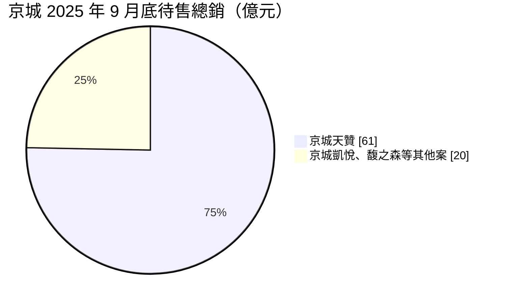
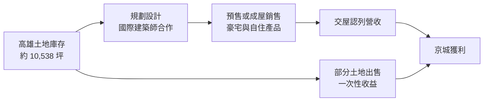
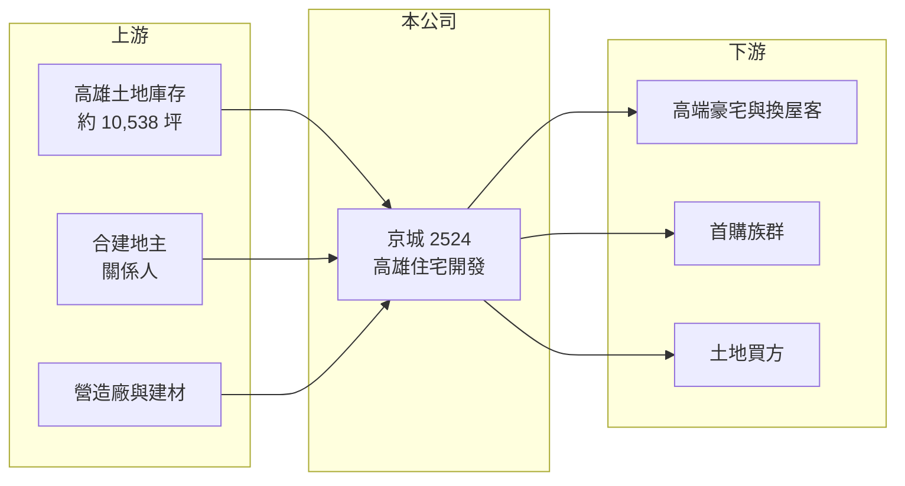

# 2524 京城

> 上市｜[[產業索引-建材營造業|建材營造業]]｜上市（櫃）日期 1994/10/18

# 第一章：企業模式與商業藍圖

> [!info] 撰寫說明
> 本文由 Claude 依公開資料整理，架構比照 [[2330台積電]] 的四章研究，資料截至 2026-10-08。財務數字來源：Goodinfo 年度經營績效頁、富果研究 2025 年 12 月法說會整理、Yahoo 股市報導標題；與京城銀行的關係及產業描述為整理性內容，尚未逐條比對原始文件。#待校對

在評估單一個股的長期投資價值時，首要步驟是拆解企業的底層獲利邏輯。本章說明京城建設（股票代號：2524，以下簡稱京城）這家深耕高雄的建商，如何以高毛利的豪宅產品與大面積土地庫存建立長期價值。

## 一、核心定位：高雄在地的高端住宅開發商

京城的業務是住宅與大樓的開發租售，案件集中在高雄市。公司與京城商業銀行在經營層上有淵源（整理性內容，以年報為準），在高雄的土地取得與在地資源上具有長期累積。

京城的產品以高端住宅為主，近年的銷售中個案包括京城天贊、京城凱悅與馥之森三大豪宅案，並與國際建築師合作塑造品牌。豪宅的單價高、毛利率高，但去化速度慢，這決定了京城「高毛利、低周轉」的獲利特性。

## 二、營收與案件結構

公司未揭露產品別營收比重。截至 2025 年 9 月底，京城待售總銷金額約 81 億元，其中京城天贊占約 61 億元；[[已售未入帳]]金額約 1.98 億元，餘屋庫存不多。

營收來源除了[[建案交屋]]，也包括土地出售。2024 年營收 92.8 億元中有售地收入，使 2025 年營收比較基期偏高；這類土地處分在京城的歷史中多次出現，是大型土地庫存帶來的彈性。

## 三、資本轉化邏輯：大面積土地庫存與長期開發

京城的資本主要壓在土地上。扣除興建中土地後，土地庫存約 10,538 坪；2025 年又購入左營區福民段與鼓山區青海段兩筆土地，合計約 988 坪、總金額約 14.9 億元。早年取得的土地成本低，是京城毛利率長期維持在 40% 以上的重要原因。

## 四、企業長期藍圖：「青海 76」指標案

京城未來五年的營運重點是位於高雄鼓山區青海段的「青海 76」：由安藤忠雄設計，基地 4,836 坪、地上 48 層、836 戶，與關係人[[合建]]分售，公司分得 58%、地主 42%。總銷預估超過 400 億元，公司可分回約 232 億元，約為 2024 年高峰營收的 2.5 倍。依法說會資料，公司預計 2026 年第一季取得建照，公開銷售時機視市場而定。另一方面，公司也表示未來新案將在坪數與總價上更親民，鎖定首購族群，以因應市場轉向自住需求。

# 第二章：護城河深度與競爭優勢

「護城河」指企業抵禦競爭、維持超額利潤的保護機制。本章分析京城在高雄房市的競爭位置。

## 一、京城護城河的核心組成要素

第一是低成本土地庫存。約一萬坪的高雄土地庫存，多數是早年取得，帳面成本遠低於現在的市價，這讓京城在推案時有較厚的毛利空間，2016 至 2025 年毛利率多在 34% 至 58% 之間。

第二是在地品牌與高端定位。京城長期經營高雄豪宅市場，並與國際建築師合作，在高雄高端住宅中具有辨識度。

第三是財務彈性。餘屋不多、已售未入帳金額低，代表公司沒有大量待售成屋的財務壓力，可以依市場狀況決定推案時點。

## 二、主要競爭對手格局

| 對手 | 定位 | 對京城的威脅 |
|---|---|---|
| [[2501國建]] | 全台推案，高雄也有案 | 品牌建商在高雄搶自住與換屋客 |
| [[2542興富發]] | 全台推案量大，高雄布局多 | 以大量供給與價格競爭 |
| 高雄在地建商 | 熟悉在地市場 | 在中價位產品競爭 |

## 三、優勢轉化：守得住／守不住／觀察重點

守得住的是低成本土地帶來的毛利率，以及不急於出售的財務彈性。守不住的是高雄房市的整體量能：2025 年前 10 月高雄建物買賣移轉棟數年減 42.82%，為六都跌幅最大，豪宅產品首當其衝。長期觀察重點是青海 76 的取得建照與推案時機，以及首購型產品能否成為新的去化管道。

# 第三章：財務體質與盈利規模

資料日期：2026-10-08。數字取自 Goodinfo 年度經營績效與富果研究法說會整理，表格是撰寫當時的快照；最新月營收、毛利率、累計 EPS 由自動排程寫在本筆記的屬性欄位（月營收、毛利率、累計EPS 等）。#待校對

財務報表是檢驗護城河是否真實存在的最終標準。本章用五年的三率、ROE 與資本報酬，檢視京城的獲利品質。

## 一、獲利能力的基石：三率

| 年度 | 營收（新台幣） | [[毛利率]] | [[營業利益率]] | EPS（元） | [[ROE]] |
|---|---|---|---|---|---|
| 2021 | 66.6 億 | 40.4% | 31.2% | 4.54 | 10.9% |
| 2022 | 33.8 億 | 57.8% | 40.8% | 2.73 | 6.00% |
| 2023 | 25.5 億 | 50.0% | 31.5% | 1.20 | 2.53% |
| 2024 | 92.8 億 | 45.0% | 37.3% | 7.67 | 14.8% |
| 2025 | 36.8 億 | 45.7% | 31.5% | 1.71 | 3.02% |

京城的毛利率在建設業中屬於很高的水準，五年都在 40% 以上，營業利益率也維持 30% 至 41%，反映低成本土地與豪宅定價的效果。營收則隨交屋與售地時點大幅波動，年複合成長率參考價值有限。2021 至 2025 年平均 ROE 約 7.5%（推算），雖然利潤率高，但大量資本壓在土地上，使 ROE 在交屋量少的年度只有 2% 至 3%。每股淨值由 2016 年的 29.27 元成長到 2025 年的 57.45 元，十年接近翻倍，代表長期仍在累積股東權益。

## 二、營建業指標：已售未入帳、存貨與負債

截至 2025 年 9 月底，已售未入帳約 1.98 億元，待售總銷約 81 億元，土地庫存約 10,538 坪。依 Goodinfo 的 ROE 與 ROA 推算，2025 年總資產約為股東權益的 1.9 倍（推算），負債比在建商中屬中等。已售未入帳金額低，代表短期營收能見度不高，未來營收要看天贊等成屋的去化與青海 76 的推案。

## 三、股利

Goodinfo 統計京城歷年平均現金股利約 0.12 元、股利合計平均約 0.74 元，顯示過去較常以股票股利為主，現金股利的穩定度偏低（統計期間未標示）。

## 四、[[ROIC]] 與 [[WACC]]：價值創造利差

**ROIC 推算：** 2025 年營業利益約 11.6 億元（36.8 億 × 31.5%），稅後約 9.3 億元。股東權益約 210 億元（每股淨值 57.45 元 × 約 3.66 億股），依 ROA 1.55% 推算總資產約 406 億元、總負債約 196 億元，假設六成為有息負債約 117 億元（推估），投入資本約 327 億元，ROIC 約 2.8%（推算）。以 2021 至 2025 年平均營業利益計算，ROIC 約 4.3%（推算）。

**WACC 推算：** 台灣 10 年期公債殖利率假設 1.75%、市場風險溢酬 6%、β 取營建同業常見值 0.9，股東權益成本約 7.2%。負債成本假設 3%，稅後 2.4%；權益占投入資本約 64%（推估），WACC 約 5.4%（推算）。

**結論：** 京城近五年平均 ROIC 略低於 WACC，原因不是利潤率不足，而是資本周轉太慢：大量土地長期持有、豪宅去化慢。若青海 76 能順利推出並維持目前的毛利水準，約 232 億元的分回總銷有機會讓 ROIC 在交屋期間明顯高於資金成本。

# 第四章：總體風險與地緣政治

任何企業都無法脫離宏觀環境獨立存在。本章分析京城長期必須面對的區域、政策與營運風險。

## 一、區域集中與產業週期

京城的案件與土地幾乎都在高雄，高雄房市的供需直接決定公司的去化速度。2025 年高雄預售屋交易量大幅萎縮，經營層判斷市場進入「價穩量縮」格局。單一城市集中的建商，在區域景氣反轉時沒有其他市場可以分散。

## 二、政策與金融風險

央行[[信用管制]]對高總價產品的影響特別明顯，豪宅買方多需要較高的貸款成數或有投資需求，限貸政策會直接壓抑成交。房地合一稅與持有稅制的調整，也會影響高端產品的需求。

## 三、大案集中風險

青海 76 總銷超過 400 億元，是公司規模的數倍。大案若推出時遇到景氣低點、施工成本上升或銷售不如預期，會長期占用大量資本並推高財務槓桿。此案為與關係人合建，交易條件與利益分配也值得持續關注。

## 四、營運環境的隱性風險

缺工與營建成本上升會壓縮新案利潤；高雄近年產業轉型（半導體設廠）帶動的人口與購屋需求能否延續，也會影響長期去化。

# 專有名詞解析

## 金融

- **[[信用管制]]**：央行限制購屋與建商貸款成數的政策，會影響房市成交與建商資金。
- **[[ROIC]]**：投入資本報酬率，稅後營業利益除以股東權益加有息負債，衡量本業運用資本的效率。
- **[[WACC]]**：加權平均資金成本，股東與債權人要求報酬率的加權平均，是 ROIC 要超越的門檻。

## 產業

- **[[建案交屋]]**：建商在房屋完工並交付買方時才認列營收，因此營建公司的營收常集中在交屋年度。
- **[[已售未入帳]]**：已經賣出、但尚未完工交屋而未認列營收的建案金額，是建商未來營收的主要能見度指標。
- **[[合建]]**：地主提供土地、建商負責出資興建，完工後雙方依約定比例分配房屋或銷售收入的開發模式。

# 核心供應鏈

## 1. 上游：土地與營造
- 自有土地庫存、合建地主、營造廠與建材商

## 2. 中游：京城
- 相關企業：2809京城銀（經營層淵源，整理性內容）
- 同業：[[2501國建]]、[[2542興富發]]

## 3. 下游：客戶
- 高雄的豪宅、換屋與首購買方

## 最新新聞
<!-- news:start -->
<!-- news:end -->

## 相關連結
- [公開資訊觀測站](https://mopsov.twse.com.tw/mops/web/t05st03?step=1&firstin=1&co_id=2524)
- [Goodinfo](https://goodinfo.tw/tw/StockDetail.asp?STOCK_ID=2524)
- [Yahoo 股市](https://tw.stock.yahoo.com/quote/2524)
- [鉅亨網新聞](https://www.cnyes.com/twstock/2524/news)
