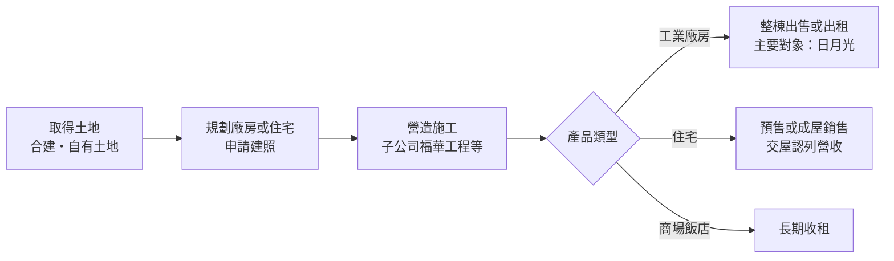
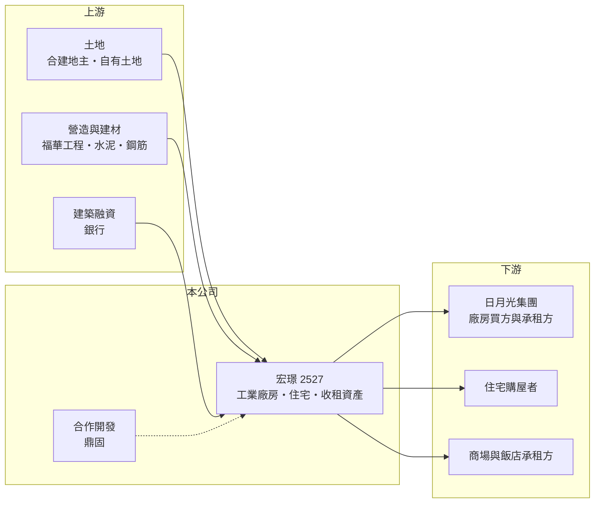

# 2527 宏璟

> 上市｜[[產業索引-建材營造業|建材營造業]]｜上市（櫃）日期 1995/03/06

# 第一章：企業模式與商業藍圖

> [!info] 撰寫說明
> 本文由 Claude 依公開資料整理，架構比照 [[2330台積電]] 的四章研究，資料截至 2026-10-08。財務數字來源：Goodinfo 年度經營績效頁、富果研究 2025 年 12 月法說會整理、證交所 OpenAPI 2026 年第二季財報與股利資料（經本機資料檔）、CMoney 與聯合新聞網報導標題；集團與產業描述為整理性內容，尚未逐條比對原始文件。#待校對

在評估單一個股的長期投資價值時，首要步驟是拆解企業的底層獲利邏輯。本章說明宏璟建設（股票代號：2527，以下簡稱宏璟）如何以日月光集團關係企業的身分，發展出「工業廠房開發為主、住宅與收租資產為輔」的特殊建商模式。

## 一、核心定位：替半導體集團蓋廠房的建商

宏璟是 [[3711日月光投控]] 的關係企業，和一般以賣住宅為主的建商不同，它最重要的業務是開發工業廠房，再出售或出租給日月光使用。這種模式的好處是買方明確、需求與半導體封測產能擴張直接連動，不必像住宅案那樣仰賴散戶購屋者的信心；代價則是營收高度集中在少數大型交易，某一年有廠房出售就大幅成長，沒有就大幅衰退。

依 2025 年 12 月法說會，宏璟採「先建後售」的方式開發廠房：先以[[合建]]或自有土地興建，完工後再整棟出售給集團。2026 年 1 月股東臨時會通過、以 42.31 億元出售中壢第二園區智慧型廠房（宏璟持分 72.15%）給日月光，正是這種模式的典型例子，也讓 2026 年上半年營收衝高到約 47.7 億元。

## 二、營收結構：廠房出售、住宅與租金三種來源

宏璟的收入可分成三類。第一是工業廠房開發，金額最大但最不規律；第二是住宅開發與銷售，公司把它定位為未來的成長來源；第三是投資性不動產的租金，包括土城日月光廣場（自營商場，每月約 1,000 萬元收入）、出租至 2031 年的新竹日月光飯店，以及近年虧損、正尋求轉型的汐止日月光國際家飾館。

租金收入規模不大，但每年都有，能在廠房與住宅沒有交屋的年度支撐基本開銷。由於公開資料未提供各類收入的年度比重，本文不繪製營收結構圓餅圖。

## 三、資本轉化邏輯：從合建土地到整棟出售

建商的資本週期很長。宏璟在高雄的 K28 廠房（分回 77.76%）預計 2026 年第四季完工，高雄第三園區第一期合建分回比例 97%、投入成本預計超過 70 億元，子公司福華工程承攬的高雄 K18B 則以[[完工比例法]]認列到 2028 年。這些數字說明宏璟的資本大量壓在尚未完工的廠房上，而回收時點取決於集團的擴廠節奏。

## 四、企業長期藍圖：廠房為基礎，搭配大型住宅

宏璟的長期策略是「以工業廠房為基礎，搭配大型住宅，聚焦大新竹與大台中」。住宅方面，竹北合建案（富百田社區）規劃約 779 戶、總樓地板面積約 45,000 坪；台中 14 期洲際段與鼎固共同開發 3 棟住宅，2025 年 4 月申報開工。土地方面，公司在新北土城、板橋、桃園草漯、新竹竹北與台中都有庫存，2025 年初也在桃園草漯重劃區購入 700 餘坪土地作為長期投資。不過土城員和段整合困難、板橋埔墘段仍待都市計畫審查，短期內不易開發。

# 第二章：護城河深度與競爭優勢

「護城河」指企業抵禦競爭、維持超額利潤的保護機制。本章分析宏璟的優勢從何而來，以及這些優勢的限制。

## 一、宏璟護城河的核心組成要素

宏璟最大的優勢是與日月光集團的長期合作關係。半導體封測廠需要大面積、符合無塵室與電力規格的廠房，而且時程緊迫；由熟悉集團需求的關係企業規劃興建，可以縮短溝通時間，也讓宏璟擁有一般建商拿不到的穩定大型買家。這種關係並非技術型的護城河，而是「客戶綁定」，只要日月光持續在台灣擴產，宏璟就有案源。

第二個優勢是土地取得以合建為主，不必一次付出全部土地成本，資金壓力較輕。第三是收租資產提供一定的現金流緩衝。

## 二、主要競爭對手格局

| 對手 | 定位 | 對宏璟的威脅 |
|---|---|---|
| [[2501國建]] | 全台住宅與商用開發 | 在住宅與大型開發案競爭 |
| [[2536宏普]] | 台北、桃園住宅與商辦，也參與高雄廠辦案 | 在商辦與廠辦開發有重疊 |
| 竹北與台中在地建商 | 深耕單一城市住宅 | 在宏璟想擴張的住宅市場更熟悉在地需求 |
| 半導體廠自建或委託營造廠 | 由廠商自行取得土地發包 | 集團若改為自行開發，宏璟的角色會被削弱 |

## 三、優勢轉化：守得住／守不住／觀察重點

守得住的是與日月光的廠房合作，只要半導體封測持續擴產，宏璟就能取得規模大、買家確定的開發案。守不住的是營收穩定性：廠房出售年度與空窗年度的營收可相差十倍以上，2024 年營收 72.7 億元、2025 年只有 6.59 億元，就是這個特性的結果。長期觀察重點是住宅事業能否真正建立起來，讓宏璟不再完全依賴集團的擴廠節奏。

# 第三章：財務體質與盈利規模

資料日期：2026-10-08，表格是撰寫當時的快照；最新月營收、毛利率、累計 EPS 由自動排程寫在本筆記的屬性欄位（月營收、毛利率、累計EPS 等）。#待校對

財務報表是檢驗護城河是否真實存在的最終標準。本章用五年的三率、ROE、營建業專屬指標與資本報酬，檢視宏璟的獲利品質。

## 一、獲利能力的基石：三率

| 年度 | 營收（新台幣） | [[毛利率]] | [[營業利益率]] | EPS（元） | [[ROE]] |
|---|---|---|---|---|---|
| 2021 | 69.9 億 | 33.5% | 25.1% | 6.19 | 16.9% |
| 2022 | 13.9 億 | 39.8% | 12.9% | 1.17 | 2.83% |
| 2023 | 23.2 億 | 29.2% | 15.5% | 2.22 | 5.26% |
| 2024 | 72.7 億 | 24.7% | 18.7% | 4.86 | 9.75% |
| 2025 | 6.59 億 | 48.4% | 2.68% | 0.93 | 1.42% |

宏璟的營收在 6 億到 73 億元之間大幅跳動，完全取決於當年是否有廠房出售入帳，因此營收年複合成長率沒有參考意義。毛利率長期落在 25% 至 48%，低營收年度的毛利率偏高，是因為收入主要來自租金與零星餘屋。2021 至 2025 年平均 ROE 約 7.2%（推算），拉長到 2016 至 2025 年，ROE 多數年度在 10% 以下。

## 二、營建業指標：推案量、已售未入帳與存貨

宏璟沒有公布一般建商常用的[[已售未入帳]]總額，最主要的待認列項目是 2026 年認列的中壢廠房出售案（42.31 億元，預估毛利約 8.3 億元），以及 2026 年第四季完工的高雄 K28 與認列至 2028 年的 K18B。2026 年第二季資產總額約 499 億元、負債約 127 億元，負債比約 25.5%，在建商中屬於非常低的槓桿；2025 年第三季負債比仍有 51.57%，下降主要來自權益增加。

需要注意的是，2026 年第二季權益中有約 293 億元列在「其他權益」，每股淨值因此升到 140.70 元，明顯高於 2025 年底的 65.52 元。這類科目通常是持有的金融資產未實現評價（推估），會隨被投資公司的股價變動，不代表本業獲利能力。

## 三、[[ROE]] 與股利

Goodinfo 統計宏璟歷年平均現金股利約 0.65 元，2025 年度配發現金股利 1.5 元（以盈餘分配）。股利隨廠房出售年度起伏，穩定度偏低。

## 四、[[ROIC]] 與 [[WACC]]：價值創造利差

**ROIC 推算：** 2021 至 2025 年平均營業利益約 7.3 億元，稅後（稅率 20%）約 5.9 億元。以 2026 年第二季權益 371.9 億元加上有息負債（假設為負債 127.4 億元的六成，約 76 億元，推估），投入資本約 448 億元，平均 ROIC 只有約 1.3%（推算）。若扣除約 293 億元的其他權益，投入資本約 155 億元，ROIC 約 3.8%（推算）。2025 年單年營業利益僅約 0.18 億元，ROIC 接近零。

**WACC 推算：** 假設台灣 10 年期公債殖利率 1.75%、市場風險溢酬 6%、β 取營建同業常見值 0.9，股東權益成本約 7.2%。負債成本假設 3%，稅後 2.4%；以權益占投入資本約 83% 計算，WACC 約 6.3%（推算）。

**結論：** 不論是否扣除金融資產評價，宏璟的本業 ROIC 長期低於 WACC，代表過去五年的廠房與住宅開發平均起來沒有賺回資金成本。廠房出售年度的報酬率不差，但空窗年度拉低了整體表現；住宅事業若能讓營收變得連續，才有機會改善長期的價值創造。

# 第四章：總體風險與地緣政治

任何企業都無法脫離宏觀環境獨立存在。本章分析宏璟長期必須面對的產業週期、集團依賴與營運風險。

## 一、產業週期與市場結構

宏璟同時受到兩種週期影響。廠房業務跟著半導體封測的資本支出週期走，景氣好時集團擴廠、宏璟有案可做，景氣下行時擴廠延後，廠房出售也會遞延。住宅業務則受房地產週期影響，從買地到交屋需要多年，買地時的判斷若與交屋時的景氣錯開，就可能壓縮毛利。

## 二、集團依賴與關係人交易

廠房的主要買家是關係企業，交易價格與時點都需要經過股東會或董事會通過。對小股東而言，關係人交易的定價是否公允、獲利是否合理分配，是長期需要留意的公司治理議題。若日月光未來改變擴廠地點（例如增加海外產能），宏璟在台灣的廠房開發機會也會減少。

## 三、營運環境的隱性風險

部分土地整合困難，例如土城員和段與板橋埔墘段，資本可能長期被占用。汐止家飾館近年虧損、正尋求轉型，收租資產的報酬率並不一致。營建成本上升、缺工，以及央行的[[信用管制]]，也會影響住宅事業的毛利與去化速度。

## 四、金融資產與會計波動

權益中有大量金融資產評價，會讓每股淨值與股價淨值比隨資本市場大幅波動。投資人評估宏璟時，應把本業開發能力與持有資產的評價分開看待，避免把股市漲跌誤當成本業改善。

# 專有名詞解析

## 金融

- **[[完工比例法]]**：工程依施工進度分期認列營收與利潤的會計方法，常用於營造工程與長期合約。
- **[[信用管制]]**：央行限制購屋與建商貸款成數的政策，會影響房市成交與建商資金。
- **[[ROIC]]**：投入資本報酬率，稅後營業利益除以股東權益加有息負債，衡量本業運用資本的效率。
- **[[WACC]]**：加權平均資金成本，股東與債權人要求報酬率的加權平均，是 ROIC 要超越的門檻。

## 產業

- **[[合建]]**：地主提供土地、建商負責興建，完工後雙方依約定比例分配房屋或銷售收入的開發方式。
- **[[已售未入帳]]**：已經賣出、但尚未完工交屋而未認列營收的建案金額，是建商未來營收的主要能見度指標。

# 核心供應鏈

## 1. 上游：土地、營造與資金
- 土地來源：合建地主、自有土地庫存（土城、板橋、草漯、竹北、台中）
- 營造：子公司福華工程；建材如 [[1101台泥]]
- 資金：銀行建築融資

## 2. 中游：宏璟與合作夥伴
- 合作開發：鼎固（台中 14 期洲際段）
- 同業：[[2501國建]]、[[2536宏普]]

## 3. 下游：客戶
- 工業廠房：[[3711日月光投控]]
- 住宅購屋者、商場與飯店承租方

## 最新新聞
<!-- news:start -->
<!-- news:end -->

## 相關連結
- [公開資訊觀測站](https://mopsov.twse.com.tw/mops/web/t05st03?step=1&firstin=1&co_id=2527)
- [Goodinfo](https://goodinfo.tw/tw/StockDetail.asp?STOCK_ID=2527)
- [Yahoo 股市](https://tw.stock.yahoo.com/quote/2527)
- [鉅亨網新聞](https://www.cnyes.com/twstock/2527/news)
