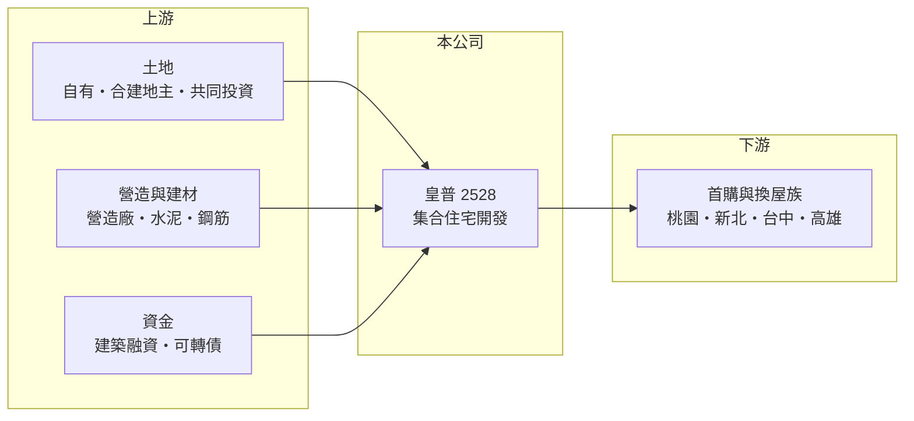

# 2528 皇普

> 上市｜[[產業索引-建材營造業|建材營造業]]｜上市（櫃）日期 1995/03/10

# 第一章：企業模式與商業藍圖

> [!info] 撰寫說明
> 本文由 Claude 依公開資料整理，架構比照 [[2330台積電]] 的四章研究，資料截至 2026-10-08。財務數字來源：Goodinfo 年度經營績效頁、富果研究 2025 年 11 月法說會整理、證交所 OpenAPI 2026 年第二季財報與股利資料（經本機資料檔）、工商時報與 Yahoo 股市報導標題；產業描述為整理性內容，尚未逐條比對原始文件。#待校對

在評估單一個股的長期投資價值時，首要步驟是拆解企業的底層獲利邏輯。本章說明皇普建設（股票代號：2528，以下簡稱皇普）如何從桃園中壢起家，擴展到新北、台中與高雄，成為一家以集合住宅為主的中型建商。

## 一、核心定位：以桃園為根據地的住宅建商

皇普總部位於桃園市中壢區，核心業務是集合住宅的投資興建與銷售，營收在[[建案交屋]]時才一次認列。它的根據地桃園，是過去十多年台灣人口淨移入最明顯的都會區之一，青埔、藝文特區、蘆竹等地吸引了大量首購與換屋族，這是皇普能在 2020 年代擴大規模的背景。

土地取得方式包含自建、[[合建]]與共同投資。自建毛利較高但資金壓力大，合建則以分回房屋的方式降低購地成本，兩者搭配可以在資金與報酬之間取得平衡。

## 二、營收結構：完全依賴建案交屋

皇普的營收幾乎全部來自住宅交屋，沒有大型的收租或服務事業，因此營收高低直接取決於當年有幾個建案完工。近年案場分布在桃園、新北、台中與高雄，例如台中「皇普莊園」、高雄「皇普摩天100」、桃園「皇普園首之道」，以及蘆竹「La Vie」、「MOMA」和新北鶯歌「國家新美院」。公開資料未提供依區域或產品別的營收比重，因此不繪製圓餅圖。

## 三、資本轉化邏輯：預售、施工到交屋

皇普 2025 年第三季資產總額約 235 億元，負債比 67%，部分完工建案交屋後已償還銀行借款。公司也透過發行[[可轉換公司債]]籌資，例如 2024 年 6 億元有擔保可轉債與 2025 年初 5 億元無擔保可轉債。股本則因連年配發股票股利，從 2020 年的 33 億元膨脹到 2025 年的 43.4 億元，這是中小建商保留現金、支應購地的常見做法，但也會稀釋每股盈餘。

## 四、企業長期藍圖：穩定推案與毛利率回升

依 2025 年 11 月法說會，皇普計畫每年穩定推出 2 至 3 個建案，台中、新竹、桃園的庫存土地已排入 2029 至 2030 年的開發計畫。公司預期 2026 年以後入帳案件的毛利率可回升到 30% 以上，因為 2025 年入帳的建案是在營建成本上漲前、以較低售價推出的。2026 年股利政策傾向提高股票股利、降低現金股利，以保留現金應對房市平淡期。

# 第二章：護城河深度與競爭優勢

「護城河」指企業抵禦競爭、維持超額利潤的保護機制。本章分析皇普在競爭激烈的桃園住宅市場中，靠什麼維持市場地位。

## 一、皇普護城河的核心組成要素

建設業進入門檻不高，皇普的優勢主要是區域深耕。長期在桃園推案，讓公司熟悉當地的土地行情、地主關係與購屋者偏好，也累積了一定的品牌辨識度。在房市平淡時，買方更傾向選擇有交屋紀錄的在地建商，這是區域型建商最實際的優勢。

第二個優勢是推案節奏的紀律。公司把土地庫存排到 2029 至 2030 年，代表未來幾年的營收來源已有基本輪廓，不必在高點搶地。不過這些優勢都屬於「窄護城河」，難以阻止大型建商進入同一市場。

## 二、主要競爭對手格局

| 對手 | 定位 | 對皇普的威脅 |
|---|---|---|
| [[2542興富發]] | 全台推案量最大的建商之一 | 以大量推案搶奪桃園與台中首購客 |
| [[2539櫻花建]] | 台中為主，也在桃園有土地 | 在台中與桃園中價位住宅直接競爭 |
| [[2540愛山林]] | 以低於行情的價格大量推案 | 價格策略會壓縮同區域的售價空間 |
| 桃園在地建商 | 深耕單一行政區 | 土地資訊與地主關係同樣靈活 |

## 三、優勢轉化：守得住／守不住／觀察重點

守得住的是桃園在地的去化能力與穩定推案節奏，近年銷售中的蘆竹與鶯歌建案銷售率都接近九成。守不住的是營建成本與房市政策：2025 年毛利率降到 20.1%，就是早期低價推案遇上成本上漲的結果。長期觀察重點是 2026 年以後入帳案件的毛利率能否如公司預期回到 30% 以上，以及股票股利持續發放對每股盈餘的稀釋程度。

# 第三章：財務體質與盈利規模

資料日期：2026-10-08，表格是撰寫當時的快照；最新月營收、毛利率、累計 EPS 由自動排程寫在本筆記的屬性欄位（月營收、毛利率、累計EPS 等）。#待校對

財務報表是檢驗護城河是否真實存在的最終標準。本章用五年的三率、ROE、營建業專屬指標與資本報酬，檢視皇普的獲利品質。

## 一、獲利能力的基石：三率

| 年度 | 營收（新台幣） | [[毛利率]] | [[營業利益率]] | EPS（元） | [[ROE]] |
|---|---|---|---|---|---|
| 2021 | 31.9 億 | 24.6% | 17.8% | 1.49 | 12.3% |
| 2022 | 17.3 億 | 25.7% | 17.9% | 0.64 | 5.07% |
| 2023 | 18.5 億 | 27.0% | 16.9% | 0.64 | 4.62% |
| 2024 | 53.3 億 | 41.4% | 31.2% | 3.26 | 21.0% |
| 2025 | 123 億 | 20.1% | 15.6% | 3.65 | 20.4% |

2021 至 2025 年營收年複合成長率約 40%（推算），2021 至 2025 年平均 ROE 約 12.7%（推算），表現在中小建商中算是突出。但拉長到 2016 至 2020 年，皇普連續五年虧損，營收一度不到 1 億元，說明它的獲利高度依賴建案完工的時間點，長期平均應該連同虧損期一起看。

## 二、營建業指標：推案量、已售未入帳與存貨

皇普沒有公布[[已售未入帳]]總額，但法說會揭露的入帳時程可以作為參考：La Vie 與 MOMA 預計 2026 年完整入帳，國家新美院部分於 2026 年底入帳、其餘可能遞延到 2027 年，青埔「賦隱」則規劃以成屋銷售。2026 年第二季資產總額約 216.7 億元、負債約 141.4 億元，負債比約 65%；資產中流動資產占 97% 以上，主要是土地與在建房屋存貨，屬建商常見的高槓桿結構。

## 三、[[ROE]] 與股利

Goodinfo 統計皇普歷年平均現金股利約 0.23 元，近年才開始較穩定配發，2025 年下半年度配發現金 1.5 元與股票 1.5 元。由於股票股利比例高，現金配息率與穩定度都屬中等偏低。

## 四、[[ROIC]] 與 [[WACC]]：價值創造利差

**ROIC 推算：** 2025 年營業利益約 19.2 億元（123 億 × 15.6%），稅後約 15.4 億元。以 2026 年第二季權益 75.3 億元加上有息負債（假設為負債 141.4 億元的六成，約 85 億元，推估），投入資本約 160 億元，2025 年 ROIC 約 9.6%（推算）。以 2021 至 2025 年平均稅後營業利益約 7.6 億元計算，ROIC 約 4.8%（推算）。

**WACC 推算：** 假設台灣 10 年期公債殖利率 1.75%、市場風險溢酬 6%、β 取營建同業常見值 0.9，股東權益成本約 7.2%。負債成本假設 3%，稅後 2.4%；權益占投入資本約 47%（推估），WACC 約 4.6%（推算）。建商槓桿高，實際 β 可能高於 0.9，WACC 可能被低估。

**結論：** 皇普在 2024 至 2025 年的交屋高峰期 ROIC 明顯高於 WACC，五年平均則大致與資金成本相當。若 2026 年以後的建案能如公司預期維持 30% 以上毛利率，價值創造有機會延續；但 2016 至 2020 年的虧損期提醒投資人，這類區域型建商的報酬率很容易隨推案空窗而大幅下滑。

# 第四章：總體風險與地緣政治

任何企業都無法脫離宏觀環境獨立存在。本章分析皇普長期必須面對的房市週期、政策與財務風險。

## 一、產業週期與市場結構

房地產景氣循環長達 7 至 10 年，受利率、所得、人口與政策共同影響。桃園過去受惠於人口移入與交通建設，但區域供給量也很大，一旦房市轉冷，同區大量新案同時銷售，價格競爭會比雙北更激烈。公司與代銷普遍認為 2026 年房市不會熱絡，但最壞時期可能已過。

## 二、政策與金融風險

央行的[[信用管制]]會限制購屋者與建商的貸款成數，直接影響銷售速度與交屋時的貸款撥款。皇普負債比約 65%，並有可轉債在外流通，若銷售放緩、存貨積壓，利息負擔與還款壓力會上升。

## 三、營運環境的隱性風險

營建成本上漲與缺工會壓縮已預售建案的毛利，因為售價在推案時已經固定。2025 年毛利率降到 20.1% 就是這個風險的實際例子。部分建案時程延後，也會使營收在年度之間大幅移動。

## 四、股本膨脹風險

連年配發股票股利讓股本持續擴大，若獲利成長跟不上股本增加的速度，每股盈餘與 ROE 都會被稀釋。長期投資人應同時觀察淨利總額與每股數字的變化。

# 專有名詞解析

## 金融

- **[[可轉換公司債]]**：債券持有人可依約定價格把債券轉換為公司股票的籌資工具，轉換後會增加股本。
- **[[信用管制]]**：央行限制購屋與建商貸款成數的政策，會影響房市成交與建商資金。
- **[[ROIC]]**：投入資本報酬率，稅後營業利益除以股東權益加有息負債，衡量本業運用資本的效率。

## 產業

- **[[建案交屋]]**：建商在房屋完工並交付買方時才認列營收，因此營建公司的營收常集中在交屋年度。
- **[[合建]]**：地主提供土地、建商負責興建，完工後雙方依約定比例分配房屋或銷售收入的開發方式。
- **[[已售未入帳]]**：已經賣出、但尚未完工交屋而未認列營收的建案金額，是建商未來營收的主要能見度指標。

# 核心供應鏈

## 1. 上游：土地、營造與資金
- 土地來源：自有土地、合建地主、共同投資
- 建材：[[1101台泥]]、[[2002中鋼]]
- 資金：銀行建築融資、可轉換公司債

## 2. 中游：皇普與同業
- 同業：[[2542興富發]]、[[2539櫻花建]]、[[2540愛山林]]

## 3. 下游：客戶
- 桃園、新北、台中、高雄的首購與換屋購屋者

## 最新新聞
<!-- news:start -->
<!-- news:end -->

## 相關連結
- [公開資訊觀測站](https://mopsov.twse.com.tw/mops/web/t05st03?step=1&firstin=1&co_id=2528)
- [Goodinfo](https://goodinfo.tw/tw/StockDetail.asp?STOCK_ID=2528)
- [Yahoo 股市](https://tw.stock.yahoo.com/quote/2528)
- [鉅亨網新聞](https://www.cnyes.com/twstock/2528/news)
