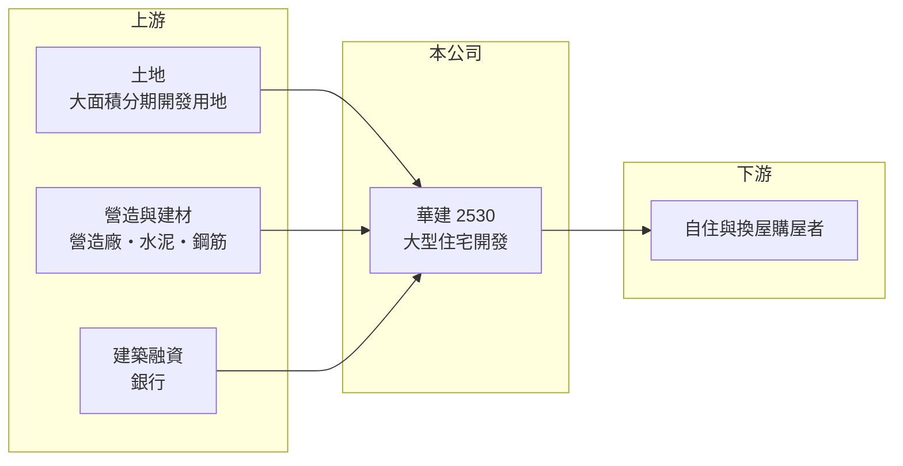

# 2530 華建

> 上市｜[[產業索引-建材營造業|建材營造業]]｜上市（櫃）日期 1995/10/12

# 第一章：企業模式與商業藍圖

> [!info] 撰寫說明
> 本文由 Claude 依公開資料整理，架構比照 [[2330台積電]] 的四章研究，資料截至 2026-10-08。財務數字來源：Goodinfo 年度經營績效頁、聯合新聞網 2025 年 12 月法說會報導、證交所 OpenAPI 2026 年第二季財報與股利資料（經本機資料檔）、工商時報報導標題。公開資料有限，推案區域與集團背景未能逐一查證。#待校對

在評估單一個股的長期投資價值時，首要步驟是拆解企業的底層獲利邏輯。本章說明大華建設（股票代號：2530，證交所簡稱華建）如何以大量、長期排程的住宅開發案，形成一家營收高度集中在完工年份的建商。

## 一、核心定位：長期排程的住宅開發商

華建成立於 1960 年，是台灣歷史最悠久的上市建商之一，總部位於台北市內湖區。核心業務是取得土地、規劃興建住宅後銷售，營收在[[建案交屋]]時才一次認列。它的特色是建案規模大、排程長：依 2025 年 12 月法說會，2025 年至 2030 年以後預計完工的新建案約 20 案、完工量逾 700 億元，以公司 2025 年約 63 億元的營收規模來看，這是相當長的營收能見度。

這種模式的意義在於，華建的經營重點不在每年平均推案，而在於把大型土地分批開發，讓未來五年每年都有案子完工。當排程順利時，營收會連續多年維持高檔；當某一年沒有完工案時，營收就會掉到接近零，例如 2021 年全年營收只有約 900 萬元。

## 二、營收結構：完全依賴住宅交屋

華建的營收幾乎全部來自住宅銷售，2025 年完工的大華首捷、大華畔、大華昇耕三案完工量逾 60 億元，2026 年預計完工的大華菁耕、大華縱橫、大華開朗、謙大華四案完工量約 260 億元，公司預估 2026 年可入帳約 176.7 億元。公開資料未提供依區域或產品別的營收比重，因此不繪製圓餅圖。

## 三、資本轉化邏輯：大面積土地、分期開發

大型住宅開發需要長時間占用資本。2026 年第二季華建資產總額約 310 億元，其中流動資產（主要是土地與在建房屋）約 307 億元，負債約 208 億元，負債比約 67%。這代表公司把大部分資金押在尚未完工的建案上，未來數年的獲利取決於這些建案能否如期完工並順利交屋。

## 四、企業長期藍圖：2026 至 2030 年的連續入帳期

依法說會，2026 年起五年，每年都有百億元以上的案量入帳，其中 2026、2027 年是入帳高峰。這是華建過去十年少見的連續完工期，若能順利執行，營收將從過去「有一年、沒一年」的型態，轉為較穩定的連續入帳。

# 第二章：護城河深度與競爭優勢

「護城河」指企業抵禦競爭、維持超額利潤的保護機制。本章分析華建在高度分散的建設業中，靠什麼維持競爭力。

## 一、華建護城河的核心組成要素

建設業的進入門檻不高，華建的優勢主要來自兩點。第一是歷史與品牌：成立超過六十年，長期累積的交屋紀錄讓購屋者在預售階段較願意付款。第二是土地成本：大型、分期開發的土地若是較早取得，後續各期的土地成本相對低，在房價上漲後能保有較高毛利，2023 至 2025 年毛利率維持在 41% 至 44%，可能與此有關（推估）。

這些優勢屬於「窄護城河」，無法阻止其他建商在同一區域推案，也無法抵銷整體房市景氣下滑。

## 二、主要競爭對手格局

| 對手 | 定位 | 對華建的威脅 |
|---|---|---|
| [[2501國建]] | 全台住宅與商用開發 | 品牌型建商，在北部中高價住宅競爭 |
| [[2542興富發]] | 全台推案量最大的建商之一 | 以大量推案搶奪首購與換屋客 |
| [[2540愛山林]] | 以低於行情的價格大量推案 | 價格策略壓縮同區域售價 |
| 區域型建商 | 深耕單一城市 | 在地人脈與土地資訊更靈活 |

## 三、優勢轉化：守得住／守不住／觀察重點

守得住的是已取得土地的成本優勢與長期排程，讓 2026 至 2030 年有基本的營收來源。守不住的是銷售速度：大量建案集中完工，若房市在信用管制下維持冷淡，未售出的成屋會變成存貨與利息負擔。長期觀察重點是 2026 年約 260 億元完工量的交屋率，以及完工後的餘屋去化速度。

# 第三章：財務體質與盈利規模

資料日期：2026-10-08，表格是撰寫當時的快照；最新月營收、毛利率、累計 EPS 由自動排程寫在本筆記的屬性欄位（月營收、毛利率、累計EPS 等）。#待校對

財務報表是檢驗護城河是否真實存在的最終標準。本章用五年的三率、ROE、營建業專屬指標與資本報酬，檢視華建的獲利品質。

## 一、獲利能力的基石：三率

| 年度 | 營收（新台幣） | [[毛利率]] | [[營業利益率]] | EPS（元） | [[ROE]] |
|---|---|---|---|---|---|
| 2021 | 0.09 億 | 100% | 無意義（營收過低） | -0.20 | -1.60% |
| 2022 | 19.9 億 | 31.8% | 20.0% | 0.56 | 4.65% |
| 2023 | 19.5 億 | 43.7% | 33.1% | 0.61 | 4.75% |
| 2024 | 61.0 億 | 41.2% | 33.5% | 1.94 | 15.2% |
| 2025 | 63.4 億 | 41.0% | 33.9% | 2.03 | 16.1% |

2022 至 2025 年營收年複合成長率約 47%（推算），2021 至 2025 年平均 ROE 約 7.8%（推算）。拉長到 2016 至 2025 年，華建有五年營收低於 2 億元、EPS 為負，代表公司長期處於「完工年大賺、空窗年小虧」的循環。毛利率在有完工的年度多落在 30% 至 44%，在建商中屬於較高水準。

## 二、營建業指標：推案量、已售未入帳與存貨

華建沒有公布[[已售未入帳]]總額，主要的能見度指標是完工量：2026 年約 260 億元、2025 至 2030 年以後合計逾 700 億元。2026 年上半年營收只有約 2.09 億元、EPS 為 -0.11 元，表示四大案的交屋集中在下半年以後。2026 年第二季負債比約 67%，存貨與在建工程占資產絕大多數，屬建商常見的高槓桿結構。

## 三、[[ROE]] 與股利

Goodinfo 統計華建歷年平均現金股利約 0.33 元。2025 年度配發的 0.46 元現金來自資本公積而非當年盈餘，顯示公司在獲利年度仍偏向保留盈餘支應龐大的開發計畫。整體而言，股利穩定度偏低。

## 四、[[ROIC]] 與 [[WACC]]：價值創造利差

**ROIC 推算：** 2025 年營業利益約 21.5 億元（63.4 億 × 33.9%），稅後約 17.2 億元。以 2026 年第二季權益 102.1 億元加上有息負債（假設為負債 208.1 億元的六成，約 125 億元，推估），投入資本約 227 億元，2025 年 ROIC 約 7.6%（推算）。以 2021 至 2025 年平均稅後營業利益約 8.2 億元計算，ROIC 約 3.6%（推算）。

**WACC 推算：** 假設台灣 10 年期公債殖利率 1.75%、市場風險溢酬 6%、β 取營建同業常見值 0.9，股東權益成本約 7.2%。負債成本假設 3%，稅後 2.4%；權益占投入資本約 45%（推估），WACC 約 4.5%（推算）。

**結論：** 華建在 2024 至 2025 年的完工年度 ROIC 高於 WACC，但五年平均低於資金成本，原因是大量資本長期壓在尚未完工的土地上。2026 至 2030 年若能如公司預期每年都有百億元以上入帳，平均 ROIC 有機會穩定高於 WACC，這是判斷華建能否長期創造價值的關鍵時期。

# 第四章：總體風險與地緣政治

任何企業都無法脫離宏觀環境獨立存在。本章分析華建長期必須面對的房市週期、政策與執行風險。

## 一、產業週期與市場結構

房地產是長週期產業，景氣循環往往長達 7 至 10 年。華建的大型分期開發需要橫跨多個景氣階段，前期推案時的售價與後期交屋時的市況可能差距很大。台灣人口老化與少子化也會在長期壓抑住宅總需求，大型案場的後期分期若遇上需求轉弱，去化時間會拉長。

## 二、政策與金融風險

央行的[[信用管制]]、房地合一稅、預售屋禁止轉售等政策，都會影響買方的資金與投資意願。華建負債比約 67%，若完工後交屋或銷售不如預期，建築融資的利息與還款壓力會增加。

## 三、營運環境的隱性風險

多個大案集中在 2026 至 2027 年完工，對營造廠調度、驗收與交屋流程都是考驗。營建成本上漲與缺工若導致工期延誤，營收會遞延到下一年度，使年度獲利大幅波動。

## 四、資訊揭露風險

華建公開揭露的區域與產品資訊相對有限，投資人較難從外部評估各建案的銷售率與毛利。長期追蹤時，應以法說會揭露的完工量與實際交屋營收是否一致作為檢驗標準。

# 專有名詞解析

## 金融

- **[[信用管制]]**：央行限制購屋與建商貸款成數的政策，會影響房市成交與建商資金。
- **[[ROIC]]**：投入資本報酬率，稅後營業利益除以股東權益加有息負債，衡量本業運用資本的效率。
- **[[WACC]]**：加權平均資金成本，股東與債權人要求報酬率的加權平均，是 ROIC 要超越的門檻。

## 產業

- **[[建案交屋]]**：建商在房屋完工並交付買方時才認列營收，因此營建公司的營收常集中在交屋年度。
- **[[已售未入帳]]**：已經賣出、但尚未完工交屋而未認列營收的建案金額，是建商未來營收的主要能見度指標。

# 核心供應鏈

## 1. 上游：土地、營造與資金
- 土地：自有大面積開發用地
- 建材：[[1101台泥]]、[[2002中鋼]]
- 資金：銀行建築融資

## 2. 中游：華建與同業
- 同業：[[2501國建]]、[[2542興富發]]、[[2540愛山林]]

## 3. 下游：客戶
- 自住與換屋購屋者

## 最新新聞
<!-- news:start -->
<!-- news:end -->

## 相關連結
- [公開資訊觀測站](https://mopsov.twse.com.tw/mops/web/t05st03?step=1&firstin=1&co_id=2530)
- [Goodinfo](https://goodinfo.tw/tw/StockDetail.asp?STOCK_ID=2530)
- [Yahoo 股市](https://tw.stock.yahoo.com/quote/2530)
- [鉅亨網新聞](https://www.cnyes.com/twstock/2530/news)
