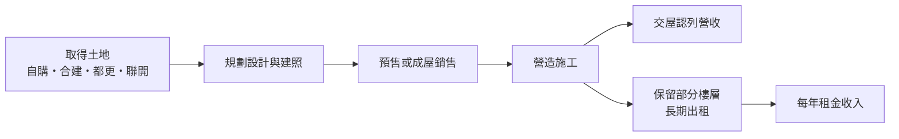
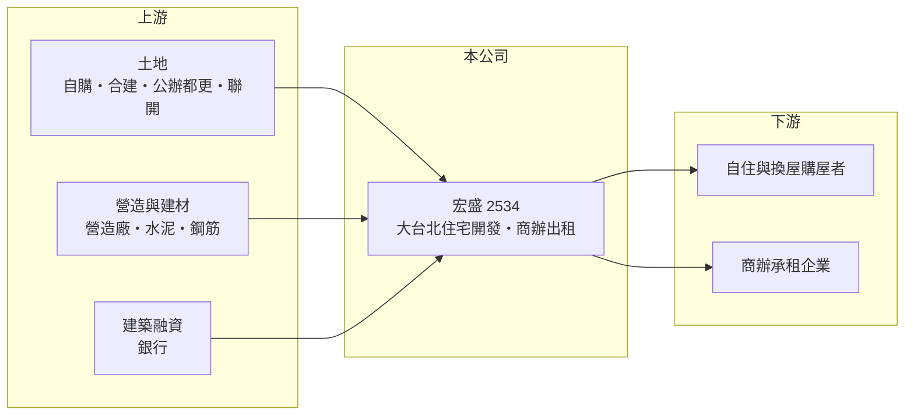

# 2534 宏盛

> 上市｜[[產業索引-建材營造業|建材營造業]]｜上市（櫃）日期 1996/02/12

# 第一章：企業模式與商業藍圖

> [!info] 撰寫說明
> 本文由 Claude 依公開資料整理，架構比照 [[2330台積電]] 的四章研究，資料截至 2026-10-08。財務數字來源：Goodinfo 年度經營績效頁、富果研究 2025 年 9 月法說會整理、證交所 OpenAPI 2026 年第二季財報與股利資料（經本機資料檔）、工商時報、今周刊與好房網報導標題；集團背景為整理性內容，尚未逐條比對原始文件。#待校對

在評估單一個股的長期投資價值時，首要步驟是拆解企業的底層獲利邏輯。本章說明宏盛建設（股票代號：2534，以下簡稱宏盛）如何以大台北的住宅開發為本業，再搭配商辦出租，形成「賣房為主、收租為輔」的商業模式。

## 一、核心定位：深耕大台北的住宅建商

宏盛的主要業務是興建住宅與商業大樓，供出售及出租，業務集中在大台北地區，近年推案區域包括汐止、淡水、中山、內湖、新莊、竹圍、南港與石牌。它最廣為人知的作品是台北仁愛路的豪宅「帝寶」（整理性內容），這個案子奠定了宏盛在高價住宅市場的品牌形象，不過近年產品已轉為以中小坪數為主流，以配合首購與小家庭的需求。

和多數建商一樣，宏盛的營收在[[建案交屋]]時才一次認列，因此年度營收高低取決於當年完工的建案數量。

## 二、營收結構：建案交屋為主，租金為穩定底盤

宏盛的收入分成兩部分。第一是建案交屋，例如 2025 年上半年營收主要來自「宏盛新中央」交屋；第二是租金，宏盛國際金融中心部分樓層出租率 100%，每年租金約 2.8 億至 3 億元。以 2025 年營收 47.4 億元計算，租金約占 6%（推算），比重不高，但它每年都有，能在沒有建案交屋的年度支付基本開銷與部分股利。

## 三、資本轉化邏輯：自建、合建與長期持有

宏盛同時使用自建與[[合建]]。例如石牌合建案總銷約 70 億元，竹圍「水仙案」為合建、公司可分得總銷約 100 億元。合建讓宏盛不必一次付出全部土地成本，但分回比例較低。另外，宏盛有時會把完工的房屋先出租再出售，例如淡水「海洋都心三期」在 2025 年 8 月由出租轉為出售，顯示公司會依市況在收租與銷售之間調整。

## 四、企業長期藍圖：公辦都更、聯開與地上權

依 2025 年 9 月法說會，因央行信用管制使土地取得不易，宏盛將積極參與[[公辦都更]]、捷運聯開案競標，並評估地上權案，目前已規劃到 2032 年的建案藍圖。具體排程包括 2026 年宏盛淬白交屋、2027 年石牌合建案交屋、2028 年宏盛掬白與蒲陽富都心交屋。這種「公共開發案」路線的好處是土地來源穩定、規模大，缺點是競標激烈、報酬率常受契約條件限制。

# 第二章：護城河深度與競爭優勢

「護城河」指企業抵禦競爭、維持超額利潤的保護機制。本章分析宏盛在大台北住宅市場中的競爭優勢與限制。

## 一、宏盛護城河的核心組成要素

宏盛的優勢主要來自三點。第一是品牌，帝寶等指標案讓宏盛在大台北購屋者心中有一定知名度，有助於預售階段的信任。第二是長期深耕大台北，熟悉汐止、淡水、內湖等區域的土地與地主關係。第三是收租資產，每年 2.8 億至 3 億元的租金提供穩定現金流，讓公司在房市冷淡時不必急於降價求售。

不過這些都屬於「窄護城河」：品牌能提高去化速度，卻無法抵銷整體房市景氣與信用管制的影響。

## 二、主要競爭對手格局

| 對手 | 定位 | 對宏盛的威脅 |
|---|---|---|
| [[2520冠德]] | 雙北為主，兼營商場與捷運聯開 | 在聯開與都更案競標上直接競爭 |
| [[2501國建]] | 全台住宅與商用開發 | 品牌型建商，在大台北中高價住宅競爭 |
| [[2545皇翔]] | 台北核心區豪宅與商辦 | 在高價住宅市場競爭 |
| [[5534長虹]] | 雙北與桃園中高價住宅 | 在自住市場競爭 |

## 三、優勢轉化：守得住／守不住／觀察重點

守得住的是大台北品牌與收租現金流，讓宏盛可以用較長時間消化成屋，不必大幅讓利。守不住的是銷售速度：2025 年線上成屋可售總額約 85 億元，每週簽約只有 1 至 2 戶，若房市持續冷淡，成屋存貨會占用大量資金。長期觀察重點是成屋去化速度、公辦都更與聯開案的得標情況，以及合建案能否如期交屋。

# 第三章：財務體質與盈利規模

資料日期：2026-10-08，表格是撰寫當時的快照；最新月營收、毛利率、累計 EPS 由自動排程寫在本筆記的屬性欄位（月營收、毛利率、累計EPS 等）。#待校對

財務報表是檢驗護城河是否真實存在的最終標準。本章用五年的三率、ROE、營建業專屬指標與資本報酬，檢視宏盛的獲利品質。

## 一、獲利能力的基石：三率

| 年度 | 營收（新台幣） | [[毛利率]] | [[營業利益率]] | EPS（元） | [[ROE]] |
|---|---|---|---|---|---|
| 2021 | 38.8 億 | 42.8% | 26.7% | 1.78 | 6.37% |
| 2022 | 69.7 億 | 43.0% | 31.2% | 4.15 | 13.8% |
| 2023 | 25.5 億 | 45.1% | 26.5% | 1.10 | 3.52% |
| 2024 | 21.1 億 | 46.6% | 24.3% | 0.63 | 2.04% |
| 2025 | 47.4 億 | 40.9% | 25.3% | 2.06 | 6.58% |

宏盛的毛利率長期穩定在 40% 至 47%，是建商中相當高的水準，反映大台北土地取得較早、產品售價較高。2021 至 2025 年營收年複合成長率約 5%（推算），平均 ROE 約 6.5%（推算）。拉長到 2016 至 2025 年，ROE 只有 2017、2018 年超過 20%，其餘多在個位數，說明高毛利並未轉化成高資本報酬，原因是資本長時間壓在土地與成屋上。

## 二、營建業指標：推案量、已售未入帳與存貨

宏盛沒有公布[[已售未入帳]]總額。法說會揭露的主要指標是線上成屋可售約 85 億元，以及宏盛掬白（總銷 23 億元，已完銷，預計 2028 年第二季交屋，毛利率約 38%）等已完銷案件。2026 年第二季資產總額約 322.7 億元、負債約 179.4 億元，負債比約 56%，在建商中屬於中等槓桿。2026 年上半年營收約 5.07 億元、毛利率 72%，但因業外與財務成本，EPS 為 -0.18 元，顯示空窗期仍需依賴租金支撐。

## 三、[[ROE]] 與股利

Goodinfo 統計宏盛歷年平均現金股利約 0.98 元；2024 年 EPS 只有 0.63 元，仍配發 1 元現金股利，2025 年度配發 1.5 元。公司在獲利低迷年度也盡量維持配息，股利穩定度在中小建商中屬於較佳。

## 四、[[ROIC]] 與 [[WACC]]：價值創造利差

**ROIC 推算：** 2025 年營業利益約 12.0 億元（47.4 億 × 25.3%），稅後約 9.6 億元。以 2026 年第二季權益 143.2 億元加上有息負債（假設為負債 179.4 億元的六成，約 108 億元，推估），投入資本約 251 億元，2025 年 ROIC 約 3.8%（推算）。2021 至 2025 年平均稅後營業利益約 9.0 億元，平均 ROIC 約 3.6%（推算）。

**WACC 推算：** 假設台灣 10 年期公債殖利率 1.75%、市場風險溢酬 6%、β 取營建同業常見值 0.9，股東權益成本約 7.2%。負債成本假設 3%，稅後 2.4%；權益占投入資本約 57%（推估），WACC 約 5.1%（推算）。

**結論：** 宏盛的 ROIC 長期略低於 WACC，代表高毛利率被冗長的開發週期與成屋存貨稀釋，整體只勉強接近資金成本。提升價值創造的關鍵在於加快成屋去化、縮短資本占用時間，而不是單純追求更高的毛利率。

# 第四章：總體風險與地緣政治

任何企業都無法脫離宏觀環境獨立存在。本章分析宏盛長期必須面對的房市週期、政策與營運風險。

## 一、產業週期與市場結構

房地產景氣循環長達 7 至 10 年，大台北房價高、購屋門檻高，對利率與信用條件特別敏感。宏盛的產品雖然已轉向中小坪數，但所在區域的總價仍高，景氣轉弱時成交量下滑的幅度可能大於中南部市場。

## 二、政策與金融風險

公司在法說會明確指出，央行若持續緊縮不動產信貸，將壓抑銷售速度與購屋意願。[[信用管制]]同時也讓建商取得土地與建築融資更困難，這是宏盛轉向公辦都更與聯開案的主要原因。

## 三、營運環境的隱性風險

合建與都更案需要與地主或政府協商，時程常比預期更長。淡水「海上皇宮」等大坪數案件要等淡江大橋通車後再推案，顯示部分土地的開發時點取決於外部建設進度。營建成本上漲與缺工也會壓縮未來建案的毛利。

## 四、收租資產的集中風險

租金收入主要來自宏盛國際金融中心，若主要租戶退租或辦公室市場供給增加，租金收入可能下降。由於租金是空窗期的主要現金來源，這項集中度值得長期留意。

# 專有名詞解析

## 金融

- **[[信用管制]]**：央行限制購屋與建商貸款成數的政策，會影響房市成交與建商資金。
- **[[ROIC]]**：投入資本報酬率，稅後營業利益除以股東權益加有息負債，衡量本業運用資本的效率。

## 產業

- **[[建案交屋]]**：建商在房屋完工並交付買方時才認列營收，因此營建公司的營收常集中在交屋年度。
- **[[合建]]**：地主提供土地、建商負責興建，完工後雙方依約定比例分配房屋或銷售收入的開發方式。
- **[[公辦都更]]**：由政府或公營機構主導、公開招商的都市更新案，建商以競標方式取得開發權。
- **[[已售未入帳]]**：已經賣出、但尚未完工交屋而未認列營收的建案金額，是建商未來營收的主要能見度指標。

# 核心供應鏈

## 1. 上游：土地、營造與資金
- 土地來源：自購、合建地主、公辦都更、捷運聯開
- 建材：[[1101台泥]]、[[2002中鋼]]
- 資金：銀行建築融資

## 2. 中游：宏盛與同業
- 同業：[[2520冠德]]、[[2501國建]]、[[2545皇翔]]、[[5534長虹]]

## 3. 下游：客戶
- 大台北自住與換屋購屋者
- 宏盛國際金融中心的商辦承租企業

## 最新新聞
<!-- news:start（自動產生，請勿手動編輯此範圍） -->
- 2026-10-08 📰 媒體 19:51｜營收速報 - 宏盛(2534)9月營收1.01億元年增率高達85.86％｜[鉅亨網](https://news.cnyes.com/news/id/6625866)

完整紀錄：[[2534宏盛 新聞]]
<!-- news:end -->

## 相關連結
- [公開資訊觀測站](https://mopsov.twse.com.tw/mops/web/t05st03?step=1&firstin=1&co_id=2534)
- [Goodinfo](https://goodinfo.tw/tw/StockDetail.asp?STOCK_ID=2534)
- [Yahoo 股市](https://tw.stock.yahoo.com/quote/2534)
- [鉅亨網新聞](https://www.cnyes.com/twstock/2534/news)
