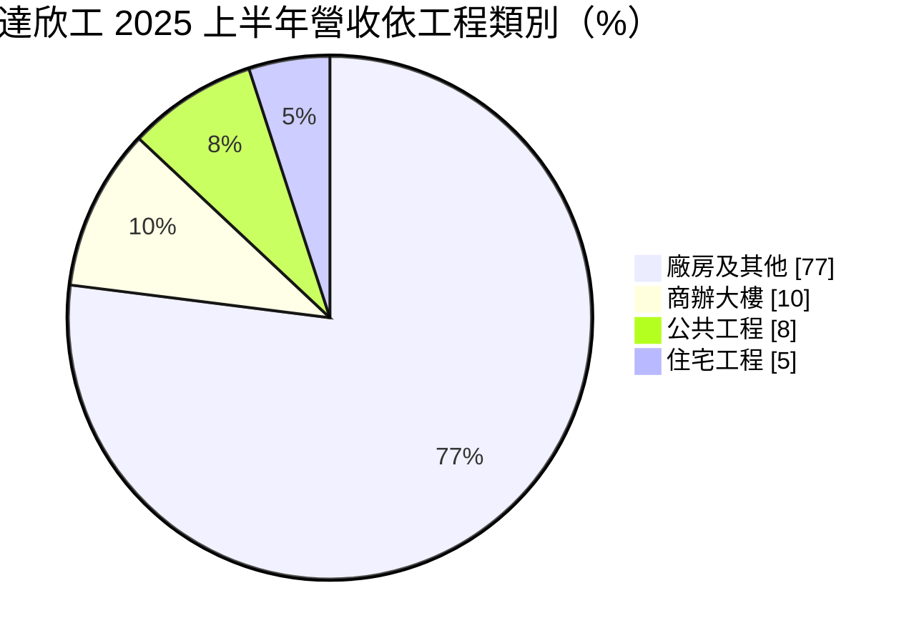
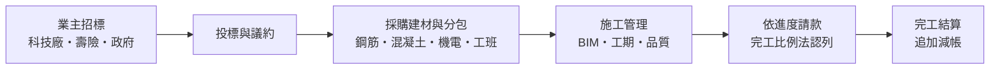
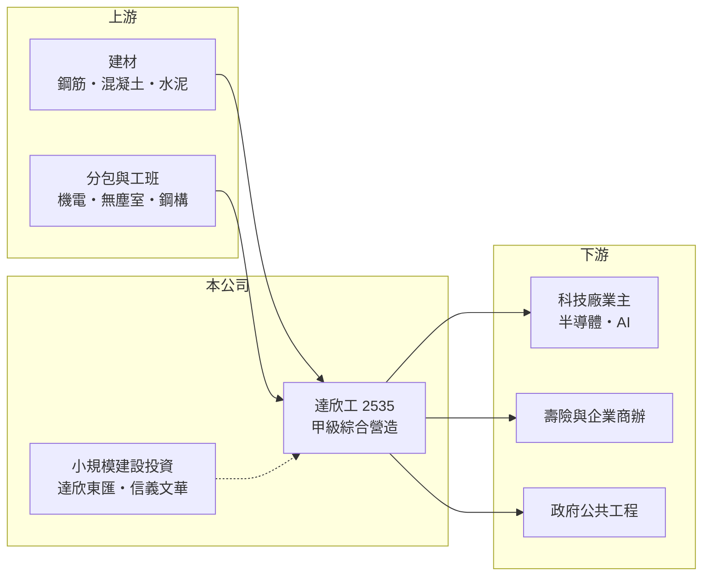

# 2535 達欣工

> 上市｜[[產業索引-建材營造業|建材營造業]]｜上市（櫃）日期 1996/03/11

# 第一章：企業模式與商業藍圖

> [!info] 撰寫說明
> 本文由 Claude 依公開資料整理，架構比照 [[2330台積電]] 的四章研究，資料截至 2026-10-08。財務數字來源：Goodinfo 年度經營績效頁、富果研究 2025 年 8 月法說會整理、證交所 OpenAPI 2026 年第二季財報與股利資料（經本機資料檔）、工商時報與聯合新聞網報導標題；產業描述為整理性內容，尚未逐條比對原始文件。#待校對

在評估單一個股的長期投資價值時，首要步驟是拆解企業的底層獲利邏輯。本章說明達欣工程（股票代號：2535，以下簡稱達欣工）如何從傳統營造廠，轉型為以高科技廠房為主力的甲級綜合營造商。

## 一、核心定位：承攬高科技廠房的甲級營造廠

達欣工是經營近 60 年的甲級綜合營造廠，主要業務是替業主興建建築物，包括高科技廠房、商辦大樓、住宅、公共工程、飯店及商場。和建設公司不同，營造廠不買地、不賣房，而是依工程合約收取工程款，以[[完工比例法]]隨施工進度認列營收。因此營造廠的營收比建商穩定，但毛利率也低得多，通常只有一成上下。

達欣工曾獲 [[2330台積電]] 供應商卓越表現獎，近年營收以廠房為主，與半導體及 AI 產業的擴廠週期高度相關。業務以台灣國內市場為主，公司表示沒有海外擴展計畫。

## 二、營收結構：廠房占近八成

2025 年上半年營收依工程類別如下：

廠房工程比重高，代表達欣工的營收與台灣高科技產業的資本支出緊密連動。商辦方面的代表案件包括南山人壽 A26 大樓與富邦產險總部大樓，公共工程則有台中水湳國際會展中心與捷運萬大線機廠。

## 三、資本轉化邏輯：輕資產的工程承攬

營造廠不需要長期持有土地，資本主要用在周轉金與機具上，因此 ROE 通常比建商穩定。風險則在於合約價格固定，若施工期間建材與工資上漲，利潤會被吃掉；公司表示對追加款項採嚴格管理，原則是「不墊款」。截至 2025 年 6 月底，工程合約總額 916 億元、已認列 56.3%，未完工餘額約 400 億元，是 2025 年營收的近兩倍。

## 四、企業長期藍圖：AI 廠房、公共工程與小規模建設

達欣工的長期方向有三條。第一是持續投入 AI 產業鏈的高科技廠房，這是公司最主要的成長來源。第二是積極爭取政府公共工程，公司指出公共工程多改採[[合理標]]，獲利空間較過去改善。第三是小規模的建設投資，例如「達欣東匯」住宅案總銷約 29 億元、「信義文華」總銷約 20 億元，以及新北軟橋段案，讓營造本業之外多一個利潤來源。

# 第二章：護城河深度與競爭優勢

「護城河」指企業抵禦競爭、維持超額利潤的保護機制。本章分析達欣工在營造業中的競爭優勢。

## 一、達欣工護城河的核心組成要素

營造業整體門檻不高，但高科技廠房是例外。半導體與 AI 廠房要求無塵室、精密機電與極短的工期，業主通常只找有實績的少數營造廠。達欣工獲台積電供應商獎項，代表它已通過這類業主的品質與工期考驗，這是最主要的「實績門檻」。

第二個優勢是規模。缺工是營造業長期問題，公司表示規模大、與工班談判較有優勢，能在工班緊缺時優先取得人力。第三是 [[BIM]] 等數位施工管理，有助於降低複雜工程的錯誤與返工。

## 二、主要競爭對手格局

| 對手 | 定位 | 對達欣工的威脅 |
|---|---|---|
| [[2543皇昌]] | 海事與公共工程為主 | 在公共工程標案直接競爭 |
| [[2597潤弘]] | 預鑄工法，承攬廠房與住宅 | 在科技廠房與商辦工程競爭 |
| 互助營造、中鹿營造等非上市營造廠 | 半導體廠房主要承包商 | 在台積電等大廠標案中競爭 |
| 日系營造廠（如鹿島、大林組） | 外資與日系客戶廠房 | 在高規格廠房與日系業主案件競爭 |

## 三、優勢轉化：守得住／守不住／觀察重點

守得住的是高科技廠房的實績與業主信任，只要台灣半導體與 AI 產業持續擴產，達欣工就有穩定案源。守不住的是毛利率：營造業議價能力有限，毛利率長期只在 11% 至 14%，原物料與工資上漲時很難完全轉嫁。長期觀察重點是在手訂單能否維持在年營收兩倍左右、廠房以外的業務能否分散客戶集中風險，以及建設投資的規模是否控制在合理範圍。

# 第三章：財務體質與盈利規模

資料日期：2026-10-08，表格是撰寫當時的快照；最新月營收、毛利率、累計 EPS 由自動排程寫在本筆記的屬性欄位（月營收、毛利率、累計EPS 等）。#待校對

財務報表是檢驗護城河是否真實存在的最終標準。本章用五年的三率、ROE、營造業專屬指標與資本報酬，檢視達欣工的獲利品質。

## 一、獲利能力的基石：三率

| 年度 | 營收（新台幣） | [[毛利率]] | [[營業利益率]] | EPS（元） | [[ROE]] |
|---|---|---|---|---|---|
| 2021 | 148 億 | 13.9% | 9.89% | 3.78 | 14.1% |
| 2022 | 172 億 | 13.5% | 10.4% | 3.66 | 12.7% |
| 2023 | 145 億 | 11.9% | 8.33% | 3.77 | 12.4% |
| 2024 | 147 億 | 11.1% | 7.02% | 5.21 | 13.7% |
| 2025 | 221 億 | 11.3% | 7.83% | 6.50 | 16.1% |

2021 至 2025 年營收年複合成長率約 10.5%（推算），平均 ROE 約 13.8%（推算），而且五年都在 12% 以上，穩定度遠高於一般建設公司。拉長到 2016 至 2025 年，毛利率從 2016 年的 5% 左右逐步提升到 11% 至 14%，反映產品組合轉向高附加價值的科技廠房。2023 年起股本由 33.8 億元降到 27.1 億元（減資），EPS 因此提升，閱讀每股數字時應留意。

## 二、營造業指標：在手訂單與負債結構

營造廠最重要的領先指標是[[在手訂單]]。截至 2025 年 6 月底，未完工工程餘額約 400 億元，其中廠房及其他約 261 億元、商辦約 83 億元、公共工程約 26 億元、住宅約 30 億元，管理層表示可支撐 2026 年營收。2026 年第二季資產總額約 310.5 億元、負債約 198.9 億元，負債比約 64%；營造廠的負債大多是預收工程款與應付分包款，而非銀行借款，性質與建商的建築融資不同。2024 年底購地後，2025 年第二季負債比一度升到 67.2%。

## 三、[[ROE]] 與股利

Goodinfo 統計達欣工全部年度的平均現金股利約 1.16 元，近年隨獲利提升，2025 年度配發現金股利 4.6 元，約占當年 EPS 6.5 元的七成。在營建類股中，達欣工屬於配息較穩定的公司。

## 四、[[ROIC]] 與 [[WACC]]：價值創造利差

**ROIC 推算：** 2025 年營業利益約 17.3 億元（221 億 × 7.83%），稅後約 13.8 億元。以 2026 年第二季權益 111.6 億元加上有息負債（營造廠負債多為工程款，假設僅一成五為有息負債，約 30 億元，推估），投入資本約 141 億元，2025 年 ROIC 約 9.8%（推算）。2021 至 2025 年平均稅後營業利益約 11.6 億元，平均 ROIC 約 8.2%（推算）。

**WACC 推算：** 假設台灣 10 年期公債殖利率 1.75%、市場風險溢酬 6%、β 取營造同業常見值 0.8，股東權益成本約 6.6%。負債成本假設 3%，稅後 2.4%；權益占投入資本約 79%（推估），WACC 約 5.7%（推算）。

**結論：** 達欣工的 ROIC 五年平均高於 WACC 約 2 至 4 個百分點，代表它是少數能持續創造價值的營建類公司。這個利差主要來自輕資產的承攬模式與穩定的科技廠房訂單；若未來建設投資比重提高，資本占用增加，利差可能縮小。

# 第四章：總體風險與地緣政治

任何企業都無法脫離宏觀環境獨立存在。本章分析達欣工長期必須面對的產業週期、成本與客戶集中風險。

## 一、產業週期與市場結構

達欣工的營收約八成來自廠房，與半導體及 AI 產業的資本支出週期高度相關。科技業擴產時訂單源源不絕，一旦景氣反轉、業主延後建廠，新訂單會迅速減少，而營收會在一至兩年後反映。這是營造股常被忽略的「延遲反應」特性。

## 二、成本與缺工風險

營造合約多為固定總價，建材（鋼筋、混凝土）與工資上漲若無法透過物價調整條款轉嫁，毛利會被壓縮。台灣營造業長期缺工，大型科技廠同時開工時，工班爭奪更激烈。

## 三、客戶與業務集中風險

科技廠房業主集中，單一大客戶的建廠計畫改變就可能影響營收。若客戶把產能移往海外（美國、日本），而達欣工沒有海外擴展計畫，台灣廠房需求成長可能放緩。

## 四、建設投資風險

公司的建設投資規模雖小，但涉及土地持有與房市景氣。信義文華案就曾因疫情與俄烏戰爭推高營造成本，毛利率只有約 14% 至 15%。若未來擴大建設業務，將使原本輕資產的營造模式承擔更多房市風險。

# 專有名詞解析

## 金融

- **[[完工比例法]]**：工程依施工進度分期認列營收與利潤的會計方法，常用於營造工程與長期合約。
- **[[ROIC]]**：投入資本報酬率，稅後營業利益除以股東權益加有息負債，衡量本業運用資本的效率。
- **[[WACC]]**：加權平均資金成本，股東與債權人要求報酬率的加權平均，是 ROIC 要超越的門檻。

## 產業

- **[[在手訂單]]**：已簽約但尚未完工認列的工程金額，是營造廠未來營收的主要領先指標。
- **[[合理標]]**：公共工程以合理價格而非最低價決標的方式，可減少低價搶標造成的虧損。
- **[[BIM]]**：建築資訊模型，以 3D 數位模型整合設計、施工與維護資訊，可減少施工錯誤與返工。

# 核心供應鏈

## 1. 上游：建材與分包
- 建材：[[2002中鋼]]、[[1101台泥]]
- 機電、無塵室與各工種分包商

## 2. 中游：達欣工與同業
- 同業：[[2543皇昌]]、[[2597潤弘]]

## 3. 下游：業主
- 科技廠房：[[2330台積電]] 等半導體與 AI 產業業主
- 商辦：南山人壽、[[2881富邦金]]
- 公共工程：中央與地方政府

## 最新新聞
<!-- news:start -->
<!-- news:end -->

## 相關連結
- [公開資訊觀測站](https://mopsov.twse.com.tw/mops/web/t05st03?step=1&firstin=1&co_id=2535)
- [Goodinfo](https://goodinfo.tw/tw/StockDetail.asp?STOCK_ID=2535)
- [Yahoo 股市](https://tw.stock.yahoo.com/quote/2535)
- [鉅亨網新聞](https://www.cnyes.com/twstock/2535/news)
