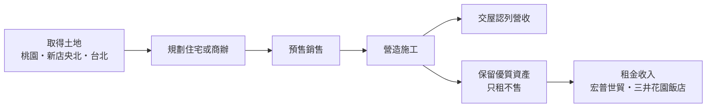
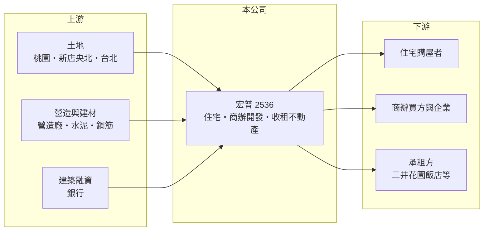

# 2536 宏普

> 上市｜[[產業索引-建材營造業|建材營造業]]｜上市（櫃）日期 1996/03/14

# 第一章：企業模式與商業藍圖

> [!info] 撰寫說明
> 本文由 Claude 依公開資料整理，架構比照 [[2330台積電]] 的四章研究，資料截至 2026-10-08。財務數字來源：Goodinfo 年度經營績效頁、工商時報 2024 年 9 月法說會報導、旺得富 2026 年 8 月報導、證交所 OpenAPI 2026 年第二季財報與股利資料（經本機資料檔）；經營團隊與沿革公開資料有限，產業描述為整理性內容，尚未逐條比對原始文件。#待校對

在評估單一個股的長期投資價值時，首要步驟是拆解企業的底層獲利邏輯。本章說明宏普建設（股票代號：2536，以下簡稱宏普）如何結合「只租不售」的收益性不動產與北部住宅、商辦開發，形成雙軌的經營模式。

## 一、核心定位：開發與收租並行的建商

宏普總部位於台北市大安區，同時經營兩種業務。第一是房地產開發，在桃園、新店央北、內湖、陽明山等地興建住宅與商辦後出售，營收在[[建案交屋]]時一次認列。第二是收益性不動產，例如台北士林德行西路的「宏普世貿大樓」，以及出租給三井花園飯店的忠孝東路大樓，這些資產只租不售，每年提供租金收入。

雙軌模式的意義在於平衡建商營收的大起大落。開發案集中完工的年度，營收可以衝上百億元；沒有完工案的年度，租金至少能支應基本開銷。不過從 2021、2022 年營收只有數億元、EPS 為負來看，租金規模仍不足以撐起整體獲利。

## 二、營收結構：大型開發案主導

宏普的營收主要由大型開發案決定。依 2024 年 9 月法說會，主要案件包括桃園「時代苑」（總銷 25 億元）、「時代序」（31 億元）、新店「宏普中央公園二期」（70 億元，2024 年底起跨年交屋至 2026 年）、內湖舊宗段商辦大樓（40.8 億元，2026 年完工）、陽明段案（45 億元，2027 年）、「時晴苑」（35 億元，2028 年）與「宏普中央公園三期」（60 億元，2029 年）。公開資料未提供開發與租金的年度營收比重，因此不繪製圓餅圖。

## 三、資本轉化邏輯：開發獲利、收租保底

2024 年法說會揭露的「在手完工量」為 306.8 億元，涵蓋 2024 至 2029 年完工的案件，約為 2025 年營收的三倍。這不等於[[已售未入帳]]，但可以看出宏普未來數年的完工排程。2026 年上半年營收 49.91 億元、EPS 2.20 元，下半年還有住宅案與高雄 K28 廠辦案陸續完工。

## 四、企業長期藍圖：商辦比重提高

宏普近年的推案明顯加重商辦比例，例如內湖舊宗段科技商辦與台北大直金泰段商辦，後者被公司視為區域地標。商辦的客群是企業而非個人購屋者，較不受住宅[[信用管制]]影響，但需求取決於企業擴張與辦公室景氣。桃園青芝段（總銷約 70 億元）與台南平道段則延續住宅開發。

# 第二章：護城河深度與競爭優勢

「護城河」指企業抵禦競爭、維持超額利潤的保護機制。本章分析宏普在建設業中的競爭優勢與限制。

## 一、宏普護城河的核心組成要素

宏普的優勢主要來自持有資產與長期排程。第一，收益性不動產位於台北市區，土地取得時間早，能長期產生租金，這是一般純推案建商沒有的現金流來源。第二，新店央北重劃區的「中央公園」系列分期開發，讓宏普在同一區域累積品牌與客群，後期分期的銷售較容易。

這些優勢屬於「窄護城河」。收租規模不足以支撐獲利，開發業務則與其他建商同樣受房市景氣左右。

## 二、主要競爭對手格局

| 對手 | 定位 | 對宏普的威脅 |
|---|---|---|
| [[2501國建]] | 全台住宅與商用開發 | 在大台北中高價住宅與商辦競爭 |
| [[2520冠德]] | 雙北住宅、商場與聯開 | 在商用不動產與大型開發案競爭 |
| [[2534宏盛]] | 大台北住宅與商辦出租 | 同樣是「開發加收租」模式 |
| [[2528皇普]] | 桃園為主的住宅建商 | 在桃園住宅市場競爭 |

## 三、優勢轉化：守得住／守不住／觀察重點

守得住的是收租資產的長期價值與央北分期開發的區域品牌。守不住的是年度獲利穩定性：2021 至 2024 年 ROE 都低於 2%，直到 2025 年中央公園二期交屋才回到 8.17%。長期觀察重點是 306.8 億元在手完工量能否如期入帳，以及商辦比重提高後的去化速度。

# 第三章：財務體質與盈利規模

資料日期：2026-10-08，表格是撰寫當時的快照；最新月營收、毛利率、累計 EPS 由自動排程寫在本筆記的屬性欄位（月營收、毛利率、累計EPS 等）。#待校對

財務報表是檢驗護城河是否真實存在的最終標準。本章用五年的三率、ROE、營建業專屬指標與資本報酬，檢視宏普的獲利品質。

## 一、獲利能力的基石：三率

| 年度 | 營收（新台幣） | [[毛利率]] | [[營業利益率]] | EPS（元） | [[ROE]] |
|---|---|---|---|---|---|
| 2021 | 3.23 億 | 38.0% | 20.2% | -0.10 | -0.29% |
| 2022 | 6.84 億 | 55.7% | 43.6% | -0.16 | -0.52% |
| 2023 | 32.3 億 | 28.1% | 20.8% | 0.69 | 1.79% |
| 2024 | 24.5 億 | 22.7% | 12.6% | 0.61 | 1.54% |
| 2025 | 105 億 | 21.1% | 15.1% | 3.19 | 8.17% |

2021 至 2025 年平均 ROE 只有約 2.1%（推算），拉長到 2016 至 2025 年平均約 4.1%（推算）。營收在 3 億到 105 億元之間跳動，起點年度過低，營收年複合成長率沒有參考意義。2021、2022 年的營收與毛利率數字和其他年度落差很大，建議與原始財報核對。

## 二、營建業指標：推案量、在手完工量與負債

主要能見度指標是 2024 年揭露的在手完工量 306.8 億元。2026 年第二季資產總額約 388.2 億元、負債約 251.7 億元，負債比約 65%；流動負債約 216 億元，多為建築融資與預收房款。股本長期維持 33.3 億元，近十年沒有明顯的股本膨脹，每股數字較能直接比較。

## 三、[[ROE]] 與股利

Goodinfo 統計宏普歷年平均現金股利約 1.1 元，2025 年度配發現金股利 2.0 元。公司在低獲利年度仍有配息紀錄，但金額隨交屋年度起伏，穩定度屬中等。

## 四、[[ROIC]] 與 [[WACC]]：價值創造利差

**ROIC 推算：** 2025 年營業利益約 15.9 億元（105 億 × 15.1%），稅後約 12.7 億元。以 2026 年第二季權益 136.5 億元加上有息負債（假設為負債 251.7 億元的六成，約 151 億元，推估），投入資本約 288 億元，2025 年 ROIC 約 4.4%（推算）。2021 至 2025 年平均稅後營業利益約 4.7 億元，平均 ROIC 約 1.6%（推算）。

**WACC 推算：** 假設台灣 10 年期公債殖利率 1.75%、市場風險溢酬 6%、β 取營建同業常見值 0.9，股東權益成本約 7.2%。負債成本假設 3%，稅後 2.4%；權益占投入資本約 47%（推估），WACC 約 4.7%（推算）。

**結論：** 宏普即使在 2025 年的交屋高峰，ROIC 也只與 WACC 大致持平，五年平均則明顯低於資金成本。主要原因是大量資本長期壓在開發中的土地與收租資產上，而租金報酬率不高。若 2026 至 2029 年的完工案能連續入帳，報酬率有機會改善，但仍需觀察實際交屋情況。

# 第四章：總體風險與地緣政治

任何企業都無法脫離宏觀環境獨立存在。本章分析宏普長期必須面對的房市週期、商辦景氣與營運風險。

## 一、產業週期與市場結構

房地產景氣循環長達 7 至 10 年。宏普的開發案多屬大型、長期排程，跨越多個景氣階段；新店央北、桃園等重劃區供給量大，景氣轉弱時價格競爭會比成熟市區更明顯。

## 二、政策與金融風險

央行的[[信用管制]]會影響住宅買方與建商融資。宏普負債比約 65%，若交屋延遲或銷售放緩，利息負擔會加重。

## 三、商辦市場風險

宏普提高商辦比重後，對企業辦公需求更敏感。台北商辦供給若在同一時期大量完工，或企業因景氣轉弱減少擴點，商辦去化與租金都可能低於預期。

## 四、營運環境的隱性風險

營建成本上漲、缺工與工期延誤，都會讓營收遞延並壓縮毛利。2023 至 2025 年毛利率從 28% 降到 21%，部分可能與成本上升有關（推估）。

# 專有名詞解析

## 金融

- **[[信用管制]]**：央行限制購屋與建商貸款成數的政策，會影響房市成交與建商資金。
- **[[ROIC]]**：投入資本報酬率，稅後營業利益除以股東權益加有息負債，衡量本業運用資本的效率。
- **[[WACC]]**：加權平均資金成本，股東與債權人要求報酬率的加權平均，是 ROIC 要超越的門檻。

## 產業

- **[[建案交屋]]**：建商在房屋完工並交付買方時才認列營收，因此營建公司的營收常集中在交屋年度。
- **[[已售未入帳]]**：已經賣出、但尚未完工交屋而未認列營收的建案金額，是建商未來營收的主要能見度指標。

# 核心供應鏈

## 1. 上游：土地、營造與資金
- 土地：桃園、新店央北重劃區、台北內湖與大直
- 建材：[[1101台泥]]、[[2002中鋼]]
- 資金：銀行建築融資

## 2. 中游：宏普與同業
- 同業：[[2501國建]]、[[2520冠德]]、[[2534宏盛]]、[[2528皇普]]

## 3. 下游：客戶
- 住宅購屋者、商辦買方
- 收益性不動產承租方：三井花園飯店、宏普世貿大樓租戶

## 最新新聞
<!-- news:start -->
<!-- news:end -->

## 相關連結
- [公開資訊觀測站](https://mopsov.twse.com.tw/mops/web/t05st03?step=1&firstin=1&co_id=2536)
- [Goodinfo](https://goodinfo.tw/tw/StockDetail.asp?STOCK_ID=2536)
- [Yahoo 股市](https://tw.stock.yahoo.com/quote/2536)
- [鉅亨網新聞](https://www.cnyes.com/twstock/2536/news)
