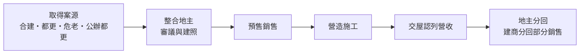
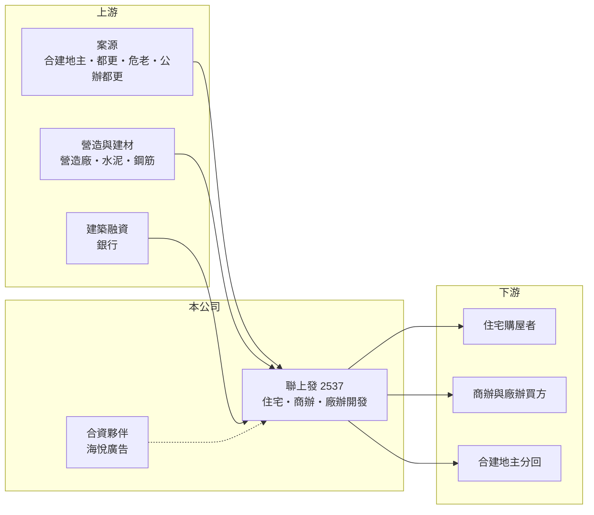

# 2537 聯上發

> 上市｜[[產業索引-建材營造業|建材營造業]]｜上市（櫃）日期 1996/09/06

# 第一章：企業模式與商業藍圖

> [!info] 撰寫說明
> 本文由 Claude 依公開資料整理，架構比照 [[2330台積電]] 的四章研究，資料截至 2026-10-08。財務數字來源：Goodinfo 年度經營績效頁、富果研究 2025 年 10 月法說會整理、證交所 OpenAPI 2026 年第二季財報與股利資料（經本機資料檔）、CMoney 與 Yahoo 股市報導標題；集團背景公開資料有限，產業描述為整理性內容，尚未逐條比對原始文件。#待校對

在評估單一個股的長期投資價值時，首要步驟是拆解企業的底層獲利邏輯。本章說明聯上開發（股票代號：2537，證交所簡稱聯上發）如何以合建、都更與公辦開發取得案源，在雙北、桃園與南台灣推動住宅與商辦開發。

## 一、核心定位：多元取得土地的開發商

聯上發以不動產開發為核心，產品涵蓋住宅、商辦大樓與廠辦，另有店面與住宅的成屋銷售。總部位於台北市信義區，推案區域包括北投士林科技園區（北士科）、新北三重與新店、台北中正、桃園中壢與桃園車站，以及高雄與台南。營收在[[建案交屋]]時才一次認列，因此年度營收取決於完工案量。

聯上發的特色在於土地取得方式多元，包括[[合建]]、[[都更]]、[[危老重建]]與自地自建，也參與公辦都更與以地易地。例如台電仁愛路案是以地易地的合建，桃園車站新民立體停車場案是公辦都更，預計分回總銷約 52 億元。這種做法能減少一次買地的資金壓力，但開發時程較長、需要大量協商。

## 二、營收結構：住宅為主，商辦逐步擴大

聯上發近年的營收以住宅交屋與成屋銷售為主，例如 2025 年上半年營收 4.33 億元，主要來自「聯上拾玉」部分交屋與「聯上天母」成屋銷售。未來商辦比重將提高，北士科「聯上智科」辦公大樓總銷約 90 億元，預計 2028 年完工；五股御史段廠辦案基地 3,176 坪，公司分回一棟銷售。公開資料未提供依產品別的年度營收比重，因此不繪製圓餅圖。

## 三、資本轉化邏輯：長週期的合建與都更

合建與都更的資本占用比自購土地少，但開發週期更長、分回比例也較低。聯上發的主要建案排程如下：「聯上大喜」（三重，總銷 18.5 億元）2025 年底交屋；「聯上光域」（中壢）預計 2027 年完工；「聯上琚川」（三重）、「聯上雲朗」（新店）與高雄林德官案（總銷 40 億元）預計 2029 年完工。公司表示 2025 至 2029 年每年都有建案完工入帳，營收高峰在 2028 至 2029 年。

## 四、企業長期藍圖：科技園區商辦與南部布局

聯上發的長期方向是把握北士科等科技園區的辦公需求，並擴大南台灣布局，例如與海悅廣告合資的台南科工案與高雄鳳山案。台電仁愛路案換回的土地，公司規劃朝都更或危老開發。這些案子規模比過去大，若順利完成，將讓公司的營收量級明顯提升。

# 第二章：護城河深度與競爭優勢

「護城河」指企業抵禦競爭、維持超額利潤的保護機制。本章分析聯上發在建設業中的競爭優勢與限制。

## 一、聯上發護城河的核心組成要素

聯上發的優勢主要是整合地主與爭取公辦案件的能力。都更與危老需要和眾多地主協商權利分配，耗時多年，能持續推動這類案件的建商不多；公辦都更與以地易地則需要符合公部門的資格與審查。這些能力讓聯上發不必在公開市場高價搶地，也能取得市區土地。

不過這屬於「流程能力」而非難以模仿的護城河，大型建商同樣積極投入都更與公辦案，競爭正在加劇。

## 二、主要競爭對手格局

| 對手 | 定位 | 對聯上發的威脅 |
|---|---|---|
| [[2520冠德]] | 雙北住宅、捷運聯開 | 在公辦開發與聯開案競標 |
| [[2534宏盛]] | 大台北住宅，積極投入公辦都更 | 在雙北都更與聯開案競爭 |
| [[2545皇翔]] | 台北核心區豪宅與都更 | 在台北市區都更案競爭 |
| [[2528皇普]] | 桃園為主的住宅建商 | 在桃園住宅市場競爭 |

## 三、優勢轉化：守得住／守不住／觀察重點

守得住的是已經取得的都更、合建與公辦案源，這些案件排到 2029 年，提供長期營收輪廓。守不住的是年度獲利：2025 年 ROE 不到 1%，2023 年虧損，顯示在入帳空窗期，公司幾乎沒有其他收入來源。長期觀察重點是聯上智科等大型商辦案的預售成績，以及 2028 至 2029 年的入帳高峰能否如期出現。

# 第三章：財務體質與盈利規模

資料日期：2026-10-08，表格是撰寫當時的快照；最新月營收、毛利率、累計 EPS 由自動排程寫在本筆記的屬性欄位（月營收、毛利率、累計EPS 等）。#待校對

財務報表是檢驗護城河是否真實存在的最終標準。本章用五年的三率、ROE、營建業專屬指標與資本報酬，檢視聯上發的獲利品質。

## 一、獲利能力的基石：三率

| 年度 | 營收（新台幣） | [[毛利率]] | [[營業利益率]] | EPS（元） | [[ROE]] |
|---|---|---|---|---|---|
| 2021 | 23.3 億 | 30.7% | 22.3% | 1.38 | 9.92% |
| 2022 | 16.8 億 | 24.7% | 14.7% | 0.26 | 1.84% |
| 2023 | 5.46 億 | 26.5% | 6.83% | -0.20 | -1.46% |
| 2024 | 22.1 億 | 30.7% | 21.0% | 1.05 | 7.44% |
| 2025 | 12.6 億 | 26.2% | 12.9% | 0.15 | 0.99% |

2021 至 2025 年平均 ROE 只有約 3.7%（推算），營收年複合成長率約 -14%（推算）。拉長到 2016 至 2025 年，ROE 最高只有約 10%，並有三年虧損。毛利率多在 25% 至 31%，但營業利益在扣除管銷與利息後所剩不多，淨利率偏低。

## 二、營建業指標：推案量、已售未入帳與存貨

聯上發沒有公布[[已售未入帳]]總額。主要建案的銷售率是可參考的指標：聯上大喜 92%、聯上光域 91%、聯上琚川 86%、聯上雲朗 80%。2026 年第二季資產總額約 188.8 億元、負債約 143.2 億元，負債比約 76%，在建商中屬於偏高的槓桿；權益只有約 45.6 億元，每股淨值 15.17 元。高槓桿搭配長期開發案，代表公司對利率與融資條件特別敏感。

## 三、[[ROE]] 與股利

Goodinfo 統計聯上發歷年平均現金股利只有約 0.11 元，2025 年度未配發股利。公司把盈餘保留用於推動大量開發案，股利對長期投資人的吸引力有限。

## 四、[[ROIC]] 與 [[WACC]]：價值創造利差

**ROIC 推算：** 2025 年營業利益約 1.6 億元（12.6 億 × 12.9%），稅後約 1.3 億元。以 2026 年第二季權益 45.6 億元加上有息負債（假設為負債 143.2 億元的六成，約 86 億元，推估），投入資本約 132 億元，2025 年 ROIC 約 1.0%（推算）。2021 至 2025 年平均稅後營業利益約 2.3 億元，平均 ROIC 約 1.7%（推算）。

**WACC 推算：** 假設台灣 10 年期公債殖利率 1.75%、市場風險溢酬 6%、β 取營建同業常見值 0.9，股東權益成本約 7.2%。負債成本假設 3%，稅後 2.4%；權益占投入資本約 35%（推估），WACC 約 4.0%（推算）。實際負債成本與 β 可能因高槓桿而更高。

**結論：** 聯上發過去五年的 ROIC 明顯低於 WACC，代表資本長期投入合建與都更案，但尚未產生足以支付資金成本的報酬。公司的價值創造能力取決於 2027 至 2029 年大量建案能否如期完工並維持毛利，這是投資人判斷其長期價值的關鍵。

# 第四章：總體風險與地緣政治

任何企業都無法脫離宏觀環境獨立存在。本章分析聯上發長期必須面對的房市週期、財務槓桿與執行風險。

## 一、產業週期與市場結構

房地產景氣循環長達 7 至 10 年。聯上發的大量建案集中在 2028 至 2029 年完工，若屆時房市處於下行期，即使銷售率已高，也可能遇到買方貸款困難或交屋延遲。

## 二、政策與金融風險

負債比約 76%，在央行[[信用管制]]下，建築融資成數與利率都可能更嚴格。股東權益規模相對負債較小，若單一大型案出現延遲或虧損，對淨值的衝擊會較明顯。

## 三、都更與合建的執行風險

都更、危老與公辦案需要經過審議、權利變換與地主協商，時程常比原訂延後數年。分回比例與營建成本若在協商過程中變動，也會影響最終毛利。

## 四、商辦與區域風險

北士科商辦總銷約 90 億元，是公司歷來規模最大的案件之一，需求取決於科技業進駐與企業擴張。南台灣布局則面臨當地建商與大型建商的競爭，聯上發在當地的品牌知名度仍需建立。

# 專有名詞解析

## 金融

- **[[ROIC]]**：投入資本報酬率，稅後營業利益除以股東權益加有息負債，衡量本業運用資本的效率。

## 產業

- **[[建案交屋]]**：建商在房屋完工並交付買方時才認列營收，因此營建公司的營收常集中在交屋年度。
- **[[合建]]**：地主提供土地、建商負責興建，完工後雙方依約定比例分配房屋或銷售收入的開發方式。
- **[[都更]]**：都市更新，由地主與建商合作把老舊建物改建，地主依權利價值分回房地或收益。
- **[[危老重建]]**：依危老條例重建老舊或危險建物，程序比都更簡化，基地規模通常較小。
- **[[已售未入帳]]**：已經賣出、但尚未完工交屋而未認列營收的建案金額，是建商未來營收的主要能見度指標。

# 核心供應鏈

## 1. 上游：案源、營造與資金
- 案源：合建地主、都更、危老、公辦都更、台電以地易地
- 建材：[[1101台泥]]、[[2002中鋼]]
- 資金：銀行建築融資

## 2. 中游：聯上發與合作夥伴
- 合資：海悅廣告（台南科工案）
- 同業：[[2520冠德]]、[[2534宏盛]]、[[2545皇翔]]、[[2528皇普]]

## 3. 下游：客戶
- 雙北、桃園與南台灣的住宅購屋者
- 北士科商辦與五股廠辦買方

## 最新新聞
<!-- news:start -->
<!-- news:end -->

## 相關連結
- [公開資訊觀測站](https://mopsov.twse.com.tw/mops/web/t05st03?step=1&firstin=1&co_id=2537)
- [Goodinfo](https://goodinfo.tw/tw/StockDetail.asp?STOCK_ID=2537)
- [Yahoo 股市](https://tw.stock.yahoo.com/quote/2537)
- [鉅亨網新聞](https://www.cnyes.com/twstock/2537/news)
