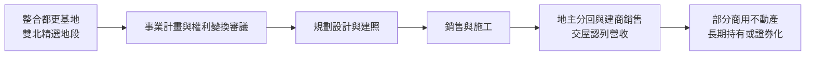
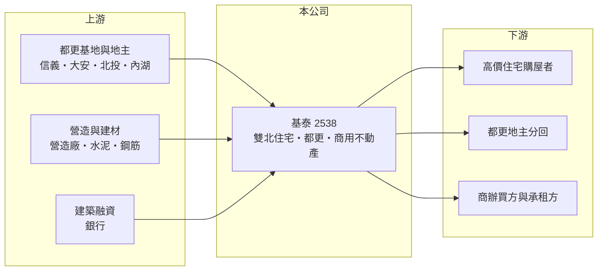

# 2538 基泰

> 上市｜[[產業索引-建材營造業|建材營造業]]｜上市（櫃）日期 1996/11/01

# 第一章：企業模式與商業藍圖

> [!info] 撰寫說明
> 本文由 Claude 依公開資料整理，架構比照 [[2330台積電]] 的四章研究，資料截至 2026-10-08。財務數字來源：Goodinfo 年度經營績效頁、poorstock 法說會資料整理、證交所 OpenAPI 2026 年第二季財報與股利資料（經本機資料檔）、CMoney 與聯合新聞網報導標題；公開資料有限，部分年度數字來源之間不一致，已於第三章註明。#待校對

在評估單一個股的長期投資價值時，首要步驟是拆解企業的底層獲利邏輯。本章說明基泰建設（股票代號：2538，以下簡稱基泰）如何以雙北的精選住宅、都更與商用不動產為主軸，經營一家規模不大但資產集中在台北核心區的建商。

## 一、核心定位：深耕雙北的精品建商

基泰成立於 1979 年、1996 年上市，總部位於台北市中正區。核心業務是在雙北開發住宅與商用不動產，營收在[[建案交屋]]時才一次認列。代表作包括台北市中正區地上 37 層的商辦「基泰忠孝」，以及基泰台大（大安區）、基泰世貿（信義區）、基泰伯爵（汐止）等住宅。2006 年，基泰發行「基泰之星」[[REITs]]（不動產投資信託基金），是營建業較早嘗試把商用不動產證券化的公司。

基泰的推案量不大，近十年年營收多在 2 億至 10 億元之間，屬於「少量、高單價」的開發模式。這讓公司的營收極度不規律，也讓每一個建案的成敗都會明顯影響當年獲利。

## 二、營收結構：住宅交屋為主

基泰的營收主要來自雙北住宅交屋與成屋銷售，2024 年營收約 9.83 億元，是近年較高的一年。興建中的建案包括基泰磺溪（北投）、基泰大安（大安區），原訂 2026 年第二季完工，基泰碧湖（內湖）預計 2026 年第四季完工，象山主人（文山區）預計 2030 年第二季完工。公開資料未拆分建案、租賃等收入比重，因此不繪製圓餅圖。

## 三、資本轉化邏輯：都更案的長期整合

基泰手上有 6 個雙北[[都更]]案，基地面積 956 至 2,550 坪，進度分別在準備權利變換、權利變換審議、事業計畫審議等階段；例如信義區吳興段三小段基地 2,550 坪，正在事業計畫審議中。都更案的好處是能在台北核心區取得土地，代價是從整合到交屋常需十年以上，資本與人力都會被長期占用。

## 四、企業長期藍圖：深耕雙北、加速轉型

基泰的願景是「深耕雙北，加速轉型」，提出四大策略：升級（未來科技住宅）、增加（提高商業地產比重）、發展（強化商業經營能力）與深耕（持續推動精選都更）。這代表公司希望從單純賣房，逐步增加可長期收租的商用不動產，讓營收不再完全依賴交屋年度。

# 第二章：護城河深度與競爭優勢

「護城河」指企業抵禦競爭、維持超額利潤的保護機制。本章分析基泰在雙北市場的優勢與限制。

## 一、基泰護城河的核心組成要素

基泰的優勢主要在地段與都更案源。手上的都更案集中在台北市信義、大安等核心區，這些土地一般建商很難在公開市場取得，一旦完成，售價與毛利都較高，2022、2023 與 2025 年毛利率超過 70% 就是例子。第二個優勢是商用不動產的經驗，從基泰忠孝到 REITs 的發行，顯示公司具備持有與證券化商用資產的能力。

但這些優勢屬於「窄護城河」，都更案能否完成取決於地主與審議進度，不是公司能完全掌握的。

## 二、主要競爭對手格局

| 對手 | 定位 | 對基泰的威脅 |
|---|---|---|
| [[2545皇翔]] | 台北核心區豪宅與都更 | 在信義、大安高價住宅與都更直接競爭 |
| [[2534宏盛]] | 大台北住宅與公辦都更 | 在雙北都更案競爭 |
| [[2501國建]] | 全台住宅與都更 | 品牌與資金規模較大 |
| [[2537聯上發]] | 合建、都更與公辦開發 | 在雙北都更案源競爭 |

## 三、優勢轉化：守得住／守不住／觀察重點

守得住的是核心區都更案的地段價值，完成後的毛利率高。守不住的是營收規模與連續性：年營收長期在 10 億元以下，管銷與利息費用就足以吃掉大部分毛利，2025 年營業利益率只有 9.29%。長期觀察重點是三個 2026 年完工案的交屋情況，以及 6 個都更案的審議進度。

# 第三章：財務體質與盈利規模

資料日期：2026-10-08，表格是撰寫當時的快照；最新月營收、毛利率、累計 EPS 由自動排程寫在本筆記的屬性欄位（月營收、毛利率、累計EPS 等）。#待校對

財務報表是檢驗護城河是否真實存在的最終標準。本章用五年的三率、ROE、營建業專屬指標與資本報酬，檢視基泰的獲利品質。

## 一、獲利能力的基石：三率

| 年度 | 營收（新台幣） | [[毛利率]] | [[營業利益率]] | EPS（元） | [[ROE]] |
|---|---|---|---|---|---|
| 2021 | 2.55 億 | 61.2% | -11.7% | -0.31 | -1.88% |
| 2022 | 3.51 億 | 75.4% | 26.4% | 0.44 | 2.82% |
| 2023 | 3.76 億 | 71.6% | 11.8% | 0.94 | 26.5%（存疑） |
| 2024 | 9.83 億 | 33.5% | 9.84% | 0.57 | 4.23% |
| 2025 | 2.99 億 | 83.5% | 9.29% | 0.35 | 2.64% |

2023 年的資料有矛盾：poorstock 整理的本期淨利約 16.18 億元（主要來自約 16.61 億元的營業外收入），Goodinfo 的 ROE 26.5% 與此相符，但 EPS 只有 0.94 元，以每股淨值 13.72 元計算的 ROE 應約 6.9%（推算）。差異可能來自非控制權益，需以原始財報核對。若排除 2023 年，2021 至 2025 年其餘四年平均 ROE 只有約 2%（推算）。營收規模太小且起伏大，營收年複合成長率沒有參考意義。

## 二、營建業指標：推案量、都更與負債

基泰沒有公布[[已售未入帳]]總額，主要的能見度來自 2026 年預計完工的磺溪、大安、碧湖三案與 6 個都更案。負債比在 2020 至 2025 年間介於 67% 至 75%，2026 年第二季資產總額約 175.1 億元、負債約 120.2 億元，負債比約 69%。以年營收不到 10 億元的規模，承擔約 120 億元負債，代表大部分資產是尚未開發完成的土地與在建工程，利息費用對獲利的壓力很大。

## 三、[[ROE]] 與股利

Goodinfo 統計基泰歷年平均現金股利約 0.58 元，2025 年度配發現金股利 0.5 元，高於當年 EPS 0.35 元。在低獲利年度仍維持配息，資金可能部分來自過去的累積盈餘（推估）。

## 四、[[ROIC]] 與 [[WACC]]：價值創造利差

**ROIC 推算：** 2025 年營業利益約 0.28 億元（2.99 億 × 9.29%），稅後約 0.22 億元。以 2026 年第二季權益 54.9 億元加上有息負債（假設為負債 120.2 億元的六成，約 72 億元，推估），投入資本約 127 億元，ROIC 約 0.2%（推算）；2021 至 2025 年平均也只有約 0.3%（推算）。

**WACC 推算：** 假設台灣 10 年期公債殖利率 1.75%、市場風險溢酬 6%、β 取營建同業常見值 0.9，股東權益成本約 7.2%。負債成本假設 3%，稅後 2.4%；權益占投入資本約 43%（推估），WACC 約 4.5%（推算）。

**結論：** 基泰的本業 ROIC 長期遠低於 WACC，過去五年的本業幾乎沒有賺回資金成本，獲利多仰賴業外收益。核心區土地本身可能有增值，但只有在都更案完成並交屋或轉為穩定收租後，才會反映在本業報酬上。

# 第四章：總體風險與地緣政治

任何企業都無法脫離宏觀環境獨立存在。本章分析基泰長期必須面對的房市、都更與財務風險。

## 一、產業週期與市場結構

台北核心區的高價住宅對景氣與信用條件特別敏感。高總價產品的買方多為換屋或資產配置族群，當央行實施[[信用管制]]或股市下跌時，成交量會明顯萎縮，影響基泰少量、高價產品的去化。

## 二、都更執行風險

6 個都更案仍在審議或權利變換階段，任何一位地主不同意、審議意見修改或法規調整，都可能讓時程延後數年。都更案的時程延遲，代表資本持續被占用而沒有回報。

## 三、財務槓桿風險

負債比長期接近七成，而年營收規模小，利息負擔相對沉重。若建案交屋延後，公司可能需要依賴業外收入或處分資產來維持獲利與配息。

## 四、資訊揭露與業外依賴

近年獲利多來自營業外收入，且不同資料來源的數字存在落差。長期投資人應以本業營業利益為主要評估依據，並留意業外收益的一次性性質。

# 專有名詞解析

## 金融

- **[[REITs]]**：不動產投資信託基金，把商辦、商場等收租不動產證券化，讓投資人分享租金收益。
- **[[信用管制]]**：央行限制購屋與建商貸款成數的政策，會影響房市成交與建商資金。
- **[[ROIC]]**：投入資本報酬率，稅後營業利益除以股東權益加有息負債，衡量本業運用資本的效率。

## 產業

- **[[建案交屋]]**：建商在房屋完工並交付買方時才認列營收，因此營建公司的營收常集中在交屋年度。
- **[[都更]]**：都市更新，由地主與建商合作把老舊建物改建，地主依權利價值分回房地或收益。
- **[[已售未入帳]]**：已經賣出、但尚未完工交屋而未認列營收的建案金額，是建商未來營收的主要能見度指標。

# 核心供應鏈

## 1. 上游：土地、營造與資金
- 都更基地與地主：台北信義、大安等核心區
- 建材：[[1101台泥]]、[[2002中鋼]]
- 資金：銀行建築融資

## 2. 中游：基泰與同業
- 同業：[[2545皇翔]]、[[2534宏盛]]、[[2501國建]]、[[2537聯上發]]

## 3. 下游：客戶
- 雙北高價住宅購屋者、都更地主
- 商辦買方與承租方

## 最新新聞
<!-- news:start -->
<!-- news:end -->

## 相關連結
- [公開資訊觀測站](https://mopsov.twse.com.tw/mops/web/t05st03?step=1&firstin=1&co_id=2538)
- [Goodinfo](https://goodinfo.tw/tw/StockDetail.asp?STOCK_ID=2538)
- [Yahoo 股市](https://tw.stock.yahoo.com/quote/2538)
- [鉅亨網新聞](https://www.cnyes.com/twstock/2538/news)
