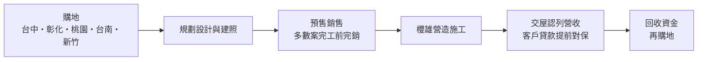
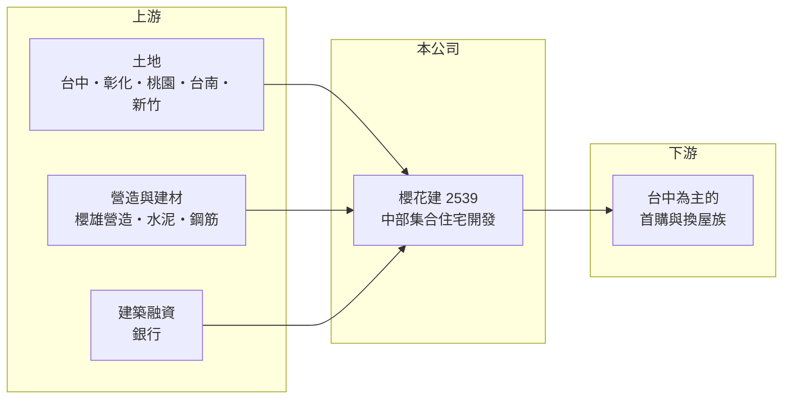

# 2539 櫻花建

> 上市｜[[產業索引-建材營造業|建材營造業]]｜上市（櫃）日期 1997/07/16

# 第一章：企業模式與商業藍圖

> [!info] 撰寫說明
> 本文由 Claude 依公開資料整理，架構比照 [[2330台積電]] 的四章研究，資料截至 2026-10-08。財務數字來源：Goodinfo 年度經營績效頁、富果研究 2025 年 12 月法說會整理、證交所 OpenAPI 2026 年第二季財報與股利資料（經本機資料檔）、工商時報與 Yahoo 股市報導標題；產業描述為整理性內容，尚未逐條比對原始文件。#待校對

在評估單一個股的長期投資價值時，首要步驟是拆解企業的底層獲利邏輯。本章說明櫻花建設（股票代號：2539，以下簡稱櫻花建）如何以台中為根據地，靠高毛利的集合住宅與穩定推案，成為近年獲利表現最突出的中部建商之一。

## 一、核心定位：台中為主的集合住宅建商

櫻花建總部位於台中市西區，主要業務是委託營造廠興建集合式住宅後出售，營收在[[建案交屋]]時才一次認列。土地分布在台中、彰化、桃園與台南，新推案規劃以台中與新竹為主。台中是近十年台灣人口與產業成長最明顯的城市之一，加上中部科學園區與精密機械產業帶動就業，提供了穩定的自住需求，這是櫻花建能持續擴大規模的背景。

2024 年，櫻花建成立 100% 持股的營造子公司「櫻雄營造」，目前只承攬母公司建案。自設營造廠的目的是掌握施工品質與工期，並把原本付給外部營造廠的部分利潤留在集團內。

## 二、營收結構：完全來自住宅交屋

櫻花建的營收幾乎全部來自集合住宅交屋。2025 年完工的櫻花悅綻、櫻花之音、櫻花旭、市鎮之音、櫻花知築五案總銷約 107.9 億元、銷售率皆為 100%，推動 2025 年營收達 140 億元的歷史新高。2026 年預計完工的有昕光之櫻、詠綻、水美、柳川與中山之櫻等案。公開資料未提供依區域或產品別的營收比重，因此不繪製圓餅圖。

## 三、資本轉化邏輯：預售完銷、再交屋入帳

櫻花建的模式重點在「預售階段就把房子賣完」。2025 年完工的五案銷售率都是 100%，代表交屋時幾乎沒有餘屋，資金回收快、存貨壓力低。為了降低信用管制下的交屋風險，公司也提前與銀行取得共識，替客戶完成貸款對保。這種做法讓櫻花建的資本周轉比許多建商更快，是 ROE 能維持在 15% 以上的主要原因之一。

## 四、企業長期藍圖：審慎購地與新竹布局

依 2025 年 12 月法說會，櫻花建持有 8 筆土地、合計約 8,063 坪，預估總銷約 147.7 億元，足以支應未來 2 至 3 年推案；2026 至 2027 年規劃推出 6 個新案、總銷約 157.8 億元。公司預期 2026 年是房市「秩序重整的調整年」，購地會更審慎，著重以合理價格取得優質土地。新竹是新的推案區域，若順利打開市場，可分散對台中單一城市的依賴。

# 第二章：護城河深度與競爭優勢

「護城河」指企業抵禦競爭、維持超額利潤的保護機制。本章分析櫻花建在中部住宅市場中的競爭優勢。

## 一、櫻花建護城河的核心組成要素

櫻花建的優勢主要有三點。第一是台中區域品牌，長期在台中推案、建案多能在完工前完銷，累積了購屋者對「櫻花」系列建案的信任。第二是成本控制，2023 至 2025 年毛利率維持在 41% 至 48%，明顯高於多數建商，反映土地取得時點與產品定位的掌握。第三是垂直整合，自設櫻雄營造後，對施工成本與工期的控制力更強。

這些仍屬於「窄護城河」，大型建商可以進入台中市場，但櫻花建的去化速度與毛利率紀錄，是新進者短期內難以複製的。

## 二、主要競爭對手格局

| 對手 | 定位 | 對櫻花建的威脅 |
|---|---|---|
| [[2542興富發]] | 全台推案量最大的建商之一，在台中推案多 | 以大量推案與價格策略搶奪首購客 |
| [[2528皇普]] | 桃園為主，也在台中推案 | 在台中與桃園住宅市場競爭 |
| [[2501國建]] | 全台布局的品牌建商 | 在台中中高價住宅競爭 |
| 台中在地建商（如豐邑、總太等） | 深耕台中 | 在同區域爭取土地與客群 |

## 三、優勢轉化：守得住／守不住／觀察重點

守得住的是預售完銷能力與高毛利率，這讓櫻花建能在房市平淡時仍維持獲利。守不住的是毛利率高點：公司預估 2026 年完工案毛利率約 30% 至 35%，低於 2024 年的 48%，反映土地與營建成本上升。長期觀察重點是新竹市場的推案成績、毛利率回落的幅度，以及在調整年中能否維持完銷紀錄。

# 第三章：財務體質與盈利規模

資料日期：2026-10-08，表格是撰寫當時的快照；最新月營收、毛利率、累計 EPS 由自動排程寫在本筆記的屬性欄位（月營收、毛利率、累計EPS 等）。#待校對

財務報表是檢驗護城河是否真實存在的最終標準。本章用五年的三率、ROE、營建業專屬指標與資本報酬，檢視櫻花建的獲利品質。

## 一、獲利能力的基石：三率

| 年度 | 營收（新台幣） | [[毛利率]] | [[營業利益率]] | EPS（元） | [[ROE]] |
|---|---|---|---|---|---|
| 2021 | 42.7 億 | 31.8% | 23.0% | 1.18 | 9.28% |
| 2022 | 62.6 億 | 36.2% | 30.8% | 2.05 | 16.3% |
| 2023 | 70.6 億 | 45.8% | 34.9% | 2.24 | 17.6% |
| 2024 | 90.2 億 | 48.3% | 39.6% | 2.85 | 21.7% |
| 2025 | 140 億 | 41.0% | 36.1% | 3.46 | 25.6% |

2021 至 2025 年營收年複合成長率約 35%（推算），平均 ROE 約 18.1%（推算），而且營收、毛利率與 ROE 大致逐年提升，在建商中非常少見。拉長到 2016 至 2025 年，ROE 只有 2018 年低於 9%，十年中有六年超過 15%。

## 二、營建業指標：推案量、已售未入帳與存貨

櫻花建是少數揭露[[已售未入帳]]的中小建商：截至 2025 年 11 月底，已銷售未完工共 10 案、總銷約 343.4 億元，預計 2026 至 2028 年陸續完工，約為 2025 年營收的 2.5 倍。土地庫存 8 筆約 8,063 坪、預估總銷 147.7 億元。財務槓桿方面，2025 年負債比約 49.5%，低於法說會引用的同業平均 61%；2026 年第二季資產約 325.6 億元、負債約 125.5 億元，負債比進一步降到約 39%。

## 三、[[ROE]] 與股利

櫻花建偏好發放股票股利：2024 年度配發現金 0.5 元與股票 2.0 元，配發率約 88%；2025 年度配發現金 0.6 元與股票 2.2 元。股票股利讓股本從 2021 年的 64 億元增加到 2026 年的約 145.6 億元，雖然淨利成長快，但每股盈餘的成長幅度被稀釋。Goodinfo 統計的歷年平均現金股利只有約 0.27 元，對重視現金配息的投資人吸引力較低。

## 四、[[ROIC]] 與 [[WACC]]：價值創造利差

**ROIC 推算：** 2025 年營業利益約 50.5 億元（140 億 × 36.1%），稅後約 40.4 億元。以 2026 年第二季權益 200.1 億元加上有息負債（假設為負債 125.5 億元的六成，約 75 億元，推估），投入資本約 275 億元，2025 年 ROIC 約 14.7%（推算）。2021 至 2025 年平均稅後營業利益約 22.4 億元，平均 ROIC 約 8.1%（推算）。

**WACC 推算：** 假設台灣 10 年期公債殖利率 1.75%、市場風險溢酬 6%、β 取營建同業常見值 0.9，股東權益成本約 7.2%。負債成本假設 3%，稅後 2.4%；權益占投入資本約 73%（推估），WACC 約 5.9%（推算）。

**結論：** 櫻花建的 ROIC 五年平均與近年單年都高於 WACC，2025 年的利差更超過 8 個百分點，是營建股中少數能持續創造價值的公司。利差來源是高毛利與快速完銷帶來的資本周轉；若未來毛利率回落到 30% 至 35%，利差會縮小但仍可能維持正值。

# 第四章：總體風險與地緣政治

任何企業都無法脫離宏觀環境獨立存在。本章分析櫻花建長期必須面對的房市週期、區域集中與股本膨脹風險。

## 一、產業週期與市場結構

房地產景氣循環長達 7 至 10 年，櫻花建 2021 至 2025 年的高成長正好處於台中房市的上升期。公司自己也預期 2026 年是調整年，若房市長期盤整，預售完銷的速度可能放慢，過去高 ROE 的條件將受到考驗。

## 二、區域集中風險

營收高度集中在台中，若台中新案供給過多或產業就業成長放緩，櫻花建受到的衝擊會比全台布局的建商更大。新竹布局是分散風險的方向，但仍在起步階段。

## 三、政策與金融風險

央行的[[信用管制]]會影響客戶貸款成數與撥款時點。公司已提前完成客戶對保以降低交屋風險，但若政策進一步收緊，部分買方可能無法如期交屋。

## 四、股本膨脹與成本風險

持續配發股票股利讓股本快速擴大，若未來獲利成長放緩，EPS 與 ROE 都會被稀釋。營建成本上漲與缺工則會壓縮新案毛利，公司預估的 30% 至 35% 毛利率已明顯低於過去高點。

# 專有名詞解析

## 金融

- **[[信用管制]]**：央行限制購屋與建商貸款成數的政策，會影響房市成交與建商資金。
- **[[股票股利]]**：以新發行股票代替現金分配盈餘，能保留現金，但會增加股本、稀釋每股盈餘。
- **[[ROIC]]**：投入資本報酬率，稅後營業利益除以股東權益加有息負債，衡量本業運用資本的效率。
- **[[WACC]]**：加權平均資金成本，股東與債權人要求報酬率的加權平均，是 ROIC 要超越的門檻。

## 產業

- **[[建案交屋]]**：建商在房屋完工並交付買方時才認列營收，因此營建公司的營收常集中在交屋年度。
- **[[已售未入帳]]**：已經賣出、但尚未完工交屋而未認列營收的建案金額，是建商未來營收的主要能見度指標。

# 核心供應鏈

## 1. 上游：土地、營造與資金
- 土地：台中、彰化、桃園、台南、新竹
- 營造：子公司櫻雄營造；建材如 [[1101台泥]]、[[2002中鋼]]
- 資金：銀行建築融資與客戶房貸合作銀行

## 2. 中游：櫻花建與同業
- 同業：[[2542興富發]]、[[2528皇普]]、[[2501國建]]

## 3. 下游：客戶
- 台中為主的首購與換屋購屋者

## 最新新聞
<!-- news:start -->
<!-- news:end -->

## 相關連結
- [公開資訊觀測站](https://mopsov.twse.com.tw/mops/web/t05st03?step=1&firstin=1&co_id=2539)
- [Goodinfo](https://goodinfo.tw/tw/StockDetail.asp?STOCK_ID=2539)
- [Yahoo 股市](https://tw.stock.yahoo.com/quote/2539)
- [鉅亨網新聞](https://www.cnyes.com/twstock/2539/news)
